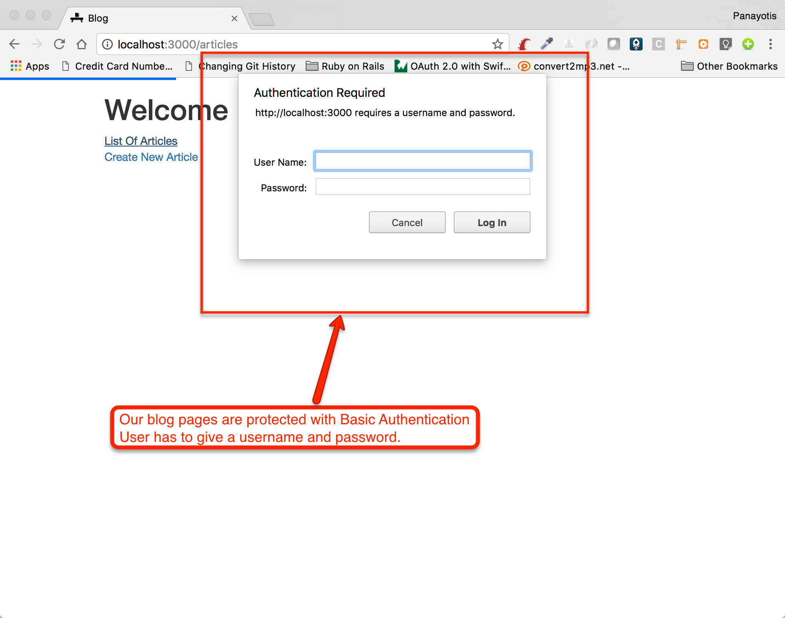
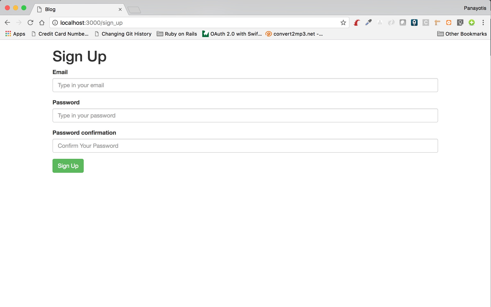
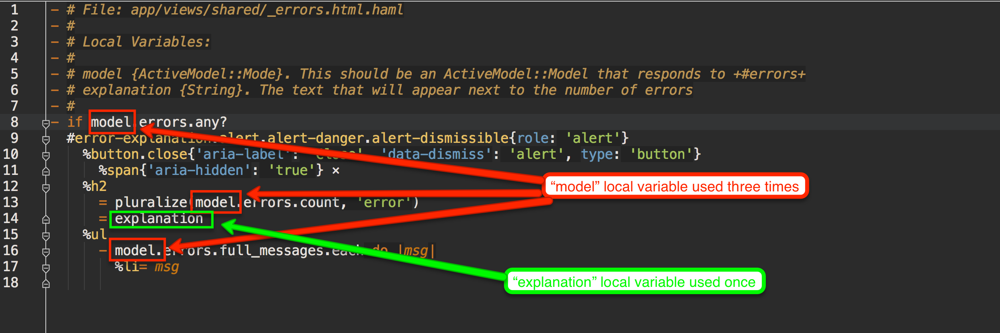
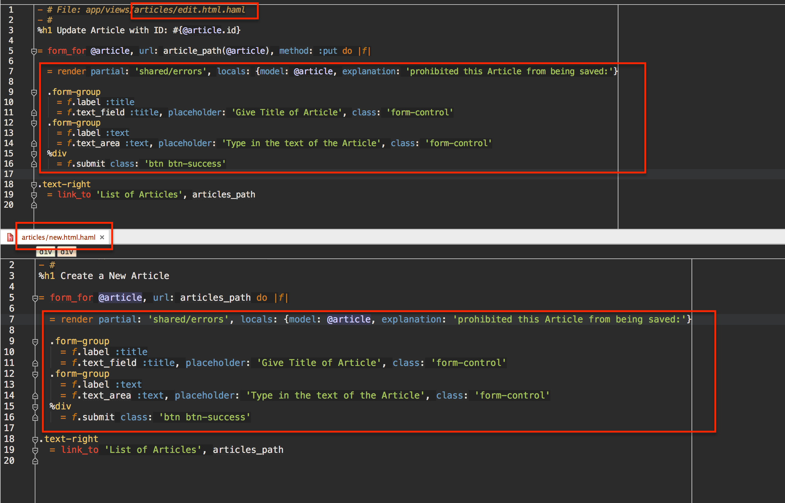
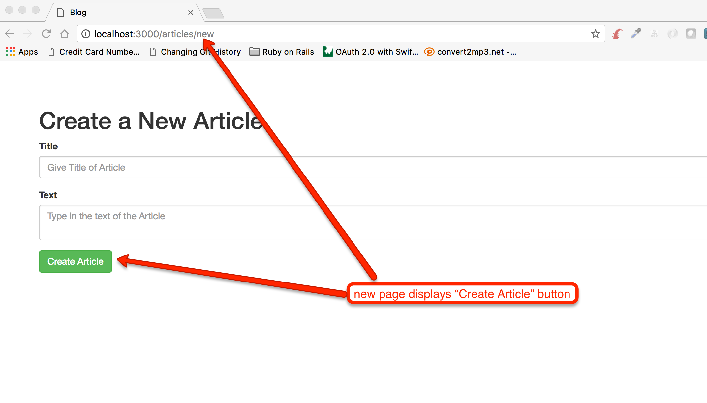
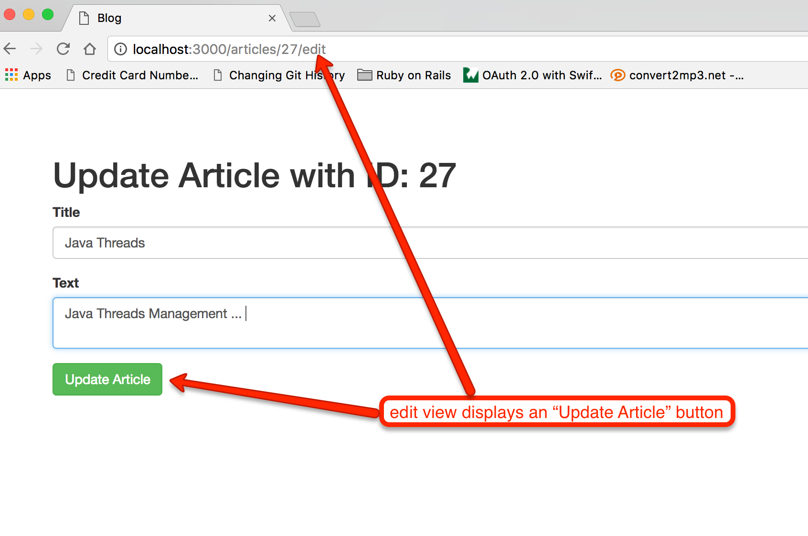

Authentication is the feature used to identify the user that is trying to
carry out an action. Our `blog` application allows anyone to access it, but, this wouldn't have been the case
in a real blog production application. Can we protect the resources of our `blog` according to who is trying to access them.

## Basic Authentication

Let's start with the easiest authentication mechanism that Rails offers. It is the Basic Authentication. If you want to
read about Basic Authentication you can read [this post here](https://en.wikipedia.org/wiki/Basic_access_authentication) or google for it.
In simple words, we guard our server in such a way so that when a browser tries to access our Web application resources, the
browser is obliged to provide a *username* and a *password*, credentials that are usually provided by the real user behind the
browser.

## Our `blog` Basic Authentication

We want to protect our `blog` application with basic authentication. In fact:

1. We want the pages that have to do with creating, updating or deleting content to be authenticated.
1. The pages that list or show blog posts should not be authenticated, but they should be free to everyone.



Let's do that. Open the `app/controllers/articles_controller.rb` and amend the beginning of the class implementation with the
following line:

``` ruby
http_basic_authenticate_with name: ENV['BASIC_AUTHENTICATION_USERNAME'], password: ENV['BASIC_AUTHENTICATION_PASSWORD'], except: [:index, :show]
```

In other words, the `ArticlesController` class starts with code like this:

``` ruby
# File: app/controllers/articles_controller.rb
#
class ArticlesController < ApplicationController
  http_basic_authenticate_with name: ENV['BASIC_AUTHENTICATION_USERNAME'], password: ENV['BASIC_AUTHENTICATION_PASSWORD']

  before_action :find_article, only: [:show, :edit, :update, :destroy]

  def new
    @article = Article.new
...
```

The `http_basic_authentication_with` is the method call that does the trick to enable Basic Authentication. The arguments to this
method are the username and password, as well as a specification about the actions the Basic Authentication will be applied to.

The username is specified with the key `:name` and the password is specified with the key `:password`. The actions specification
is optional. If missing, that would mean all the actions. Otherwise it can be either `:except`, with value being an array with the
actions to exclude from Basic Authentication, or `:only`, with value being an array with the actions to include in the Basic
Authentication.

For our `ArticlesController`, we want Basic Authentication for all the actions except `:index` and `:show`. It's better to 
use a white list approach here, i.e. apply Basic Authentication to all actions by default and specify the list that Basic Authentication
is not listed, with the `:except` key, rather than follow the black list approach to allow all actions being free except the
ones that you would specify with `:only`. With `:except`, we make sure that we don't expose a new action to the public accidentally.
Whereas with `:only` we need to make sure that whenever we add a new action, to consider whether we want it to be Basic Authenticated
or not.

Watch out how we specify the credentials. We do not hard code the values inside the `ArticlesController`. We will use environment
variables. And because of the fact that we are using `dotenv-rails` gem, we are going to specify these values inside the `.env`
file:

> **Important**: the `.env` and `.env.test` files are being git ignored because they have a corresponding entry inside the `.gitignore`
file. This setting has been carried out in the previous chapter. If you have not done it, please go ahead and do it. Add the `.env` and
`.env.test` names inside the `.gitignore` file.

``` bash
BASIC_AUTHENTICATION_USERNAME=admin
BASIC_AUTHENTICATION_PASSWORD=admin
```

Having done this work, now let's try to visit the [http://localhost:3000/articles](http://localhost:3000/articles) and then the page
[http://localhost:3000/articles/new](http://localhost:3000/articles/new). The first page will be visited without any problem and without
the browser asking for username and password. However, the second page will require us to give the username and the password. Try to give
the username and the password that you have specified in the `.env` file and you will get to the page to create the new article. Also,
other pages that have to do with creation, update or delete of an Article are now accessed without username and password, since browser
remembers to keep on sending the same credentials while in the same session.

<div id="media-container-video-./images/Basic Authentication Demo">
  <a href="https://player.vimeo.com/video/220178689"></a>
</div>

> *Hint:* After you have authenticated successfully, if you want to experience the modal dialog asking username and password again,
you will have to restart your browser. Or you can always start a new incognito / private window. In fact, working with incognito windows
will be better. If you close the incognito window and start a new one, it will ask for username and password when you visit the authenticated
pages.

The Basic Authentication is useful and easy to deploy. However, it has some disadvantages. For example, there is no easy way to clear the 
credentials. Browsers, cache the username and password for a proprietary amount of time, that differs from browser to browser. Also, the
modal asking for username and password does not allow the integration with other methods of authentication, for example using social networks.

## Session Based Authentication

We will now proceed with the implementation of another technique for authentication.

1. We will introduce a User model into our application. This will be used to store the users that have signed up to use our
application.
1. Sign Up Page: We will build a special page that will be asking user to sign up. 
2. Sign In Page: We will build a special page that will be allowing user to sign in.

### Create User Model

#### `users` table

Let's start with the `users` table. We will initially generate the migration:

``` bash
blog $ bin/rails generate migration create_users
      invoke  active_record
      create    db/migrate/20170604052426_create_users.rb
```

Let's put the following content inside the migration file:

``` ruby
 1. # File: db/migrate/20170604052426_create_users.rb
 2. #
 3. class CreateUsers < ActiveRecord::Migration[5.1]
 4.   def change
 5.     create_table :users do |t|
 6.       t.string :email, null: false
 7.       t.string :password_digest, null: false
 8. 
 9.       t.timestamps
10.     end
11.   end
12. end
```

As you can read from the above, the table will contain the email and the encrypted password (column `password_digest`) of the User. Note that we will not
be saving the password in clear form. We will be encrypting it. The algorithm will be a one-way encryption algorithm that will
prevent anyone from being able to discover the actual value.

Let's run the migration:

``` bash
blog $ bin/rake db:migrate
== 20170604052426 CreateUsers: migrating ======================================
-- create_table(:users)
   -> 0.0103s
== 20170604052426 CreateUsers: migrated (0.0104s) =============================
```

Now the table exists in our database.

#### Add `bcrypt` Gem

Edit your `Gemfile` and uncomment the line `# gem 'bcrypt', '~> 3.1.7'`. In other words, bring the `bcrypt` gem in. This will be used 
for the encryption of the User password. When you bring the `bcrypt` in, run `bundle` to install the gem.

``` bash
blog $ bundle
...
Installing bcrypt 3.1.11 with native extensions
...
blog $
```

#### The `User` Model

Let's now create the file `app/models/user.rb`. This is going to have the model of the `User` as an `ApplicationRecord` sub-class:

``` ruby
1. # File app/models/user.rb
2. #
3. class User < ApplicationRecord
4.   validates :email, presence: true, uniqueness: { case_sensitive: false }
5.   has_secure_password
6. end
```

The above model does the following:

1. It tells that the `email` attribute of a User needs to be present. Otherwise, the model will not be saved in the database. Note that
Rails ActiveRecord does not save invalid models in the database.
2. Also, the `email` needs to be unique. This means that when a new User tries to be saved into the database but there is already
another one with the same email, then this new User will not be saved and will be considered invalid. Note also the `case_sensitive: false` 
property of the validation. We are asking ActiveRecord to consider two emails the same, even if they differ in their case. In other
words, `Foo@gmail.com` will be considered equal to `foo@GMAIL.com`, for example.
3. We call the class method `has_secure_password`, that does a lot of things for us.
    1. It makes sure that we cannot create a User without a value for `password_digest`.
    2. It populates the `password_digest` attribute, given the `password` value.
    3. It may also validate that a `password confirmation`, given alongside a `password`, has the same value as the `password`.
    4. Also, it makes sure that the `password` does not have length greater than 72 characters long.
    5. Offers an `#authenticate` method that will return `false` if the authentication is carried out against a `password` that
    does not match the user `password`.

### Use the `User` Model
    
With the above model created, let's open the Rails console and experiment with the `User` model. It will be instructive and
let us know how the model works.

``` bash
blog $ bin/rails console
2.3.3 :001 > User.count
   (0.5ms)  SELECT COUNT(*) FROM "users"
 => 0 
2.3.3 :002 > User.create! email: 'foo@gmail.com', password: '12345678'
   (0.2ms)  BEGIN
  User Exists (0.5ms)  SELECT  1 AS one FROM "users" WHERE LOWER("users"."email") = LOWER($1) LIMIT $2  [["email", "foo@gmail.com"], ["LIMIT", 1]]
  SQL (0.4ms)  INSERT INTO "users" ("email", "password_digest", "created_at", "updated_at") VALUES ($1, $2, $3, $4) RETURNING "id"  [["email", "foo@gmail.com"], ["password_digest", "$2a$10$znMwmqMs1pUgorvFon9LQOk0gP4fcWkISEpx5CcJ.4IixuSWH4toK"], ["created_at", "2017-06-04 05:52:46.214002"], ["updated_at", "2017-06-04 05:52:46.214002"]]
   (2.2ms)  COMMIT
 => #<User id: 6, email: "foo@gmail.com", password_digest: "$2a$10$znMwmqMs1pUgorvFon9LQOk0gP4fcWkISEpx5CcJ.4I...", created_at: "2017-06-04 05:52:46", updated_at: "2017-06-04 05:52:46"> 
2.3.3 :003 > User.create! email: 'foo@Gmail.com', password: '12345678'
   (0.2ms)  BEGIN
  User Exists (0.4ms)  SELECT  1 AS one FROM "users" WHERE LOWER("users"."email") = LOWER($1) LIMIT $2  [["email", "foo@Gmail.com"], ["LIMIT", 1]]
   (0.2ms)  ROLLBACK
ActiveRecord::RecordInvalid: Validation failed: Email has already been taken
        from (irb):3
2.3.3 :004 > User.count
   (0.6ms)  SELECT COUNT(*) FROM "users"
 => 1 
2.3.3 :005 > 
``` 

The above interaction confirms the `email` uniqueness with case insensitive comparison. You can see that when we tried to create the second User with email `foo@Gmail.com` 
failed because of the already existing User with `email` `foo@gmail.com`.

Also, see how the `password_digest` is automatically populated with an encrypted version of the password.

With the `rails console` still running, let's see the authentication API that has been attached to the `User` model:

``` ruby
2.3.3 :006 > u = User.find_by_email('foo@gmail.com')
  User Load (0.3ms)  SELECT  "users".* FROM "users" WHERE "users"."email" = $1 LIMIT $2  [["email", "foo@gmail.com"], ["LIMIT", 1]]
 => #<User id: 6, email: "foo@gmail.com", password_digest: "$2a$10$znMwmqMs1pUgorvFon9LQOk0gP4fcWkISEpx5CcJ.4I...", created_at: "2017-06-04 05:52:46", updated_at: "2017-06-04 05:52:46"> 
2.3.3 :007 > u.authenticate('1234567')
 => false 
2.3.3 :008 > u.authenticate('12345678')
 => #<User id: 6, email: "foo@gmail.com", password_digest: "$2a$10$znMwmqMs1pUgorvFon9LQOk0gP4fcWkISEpx5CcJ.4I...", created_at: "2017-06-04 05:52:46", updated_at: "2017-06-04 05:52:46"> 
2.3.3 :009 > 
```

See how the authentication works by studying the above lines. The first command locates the user by email. 

``` ruby
u = User.find_by_email('foo@gmail.com')
```

The second command calls the `#authenticate` method with `1234567`, which is not the password of the user loaded in `u`. Remember that the
password that we used to create this user was `12345678`. For that reason, the `#authenticate` returns `false`, indicating that the password
given was wrong:

``` ruby
2.3.3 :007 > u.authenticate('1234567')
 => false 
```

Then we call the `#authenticate` method again with the correct password. In that case, the return value is not `false`, but it is the actual
User object again. This makes sure that the password given was correct and the authentication was successful.

Note that `User` model can be created also using an extra attribute called `password_confirmation` too. This is not saved in the database,
but it is used to double check the value of the `password` given. Look at the following Ruby statements to create a new `User` using the 
Rails console:

``` ruby
2.3.3 :009 > User.create! email: 'bar@gmail.com', password: '12345678', password_confirmation: '123'
   (0.2ms)  BEGIN
  User Exists (0.4ms)  SELECT  1 AS one FROM "users" WHERE LOWER("users"."email") = LOWER($1) LIMIT $2  [["email", "bar@gmail.com"], ["LIMIT", 1]]
   (0.1ms)  ROLLBACK
ActiveRecord::RecordInvalid: Validation failed: Password confirmation doesn't match Password
        from (irb):9
2.3.3 :010 > User.create! email: 'bar@gmail.com', password: '12345678', password_confirmation: '12345678'
   (0.1ms)  BEGIN
  User Exists (0.3ms)  SELECT  1 AS one FROM "users" WHERE LOWER("users"."email") = LOWER($1) LIMIT $2  [["email", "bar@gmail.com"], ["LIMIT", 1]]
  SQL (0.2ms)  INSERT INTO "users" ("email", "password_digest", "created_at", "updated_at") VALUES ($1, $2, $3, $4) RETURNING "id"  [["email", "bar@gmail.com"], ["password_digest", "$2a$10$dDAw0bl/JMcWdk1DmmX18uM4EyuE2AUt2JcylRj2OVcBWC4z4m5o2"], ["created_at", "2017-06-04 06:34:27.884005"], ["updated_at", "2017-06-04 06:34:27.884005"]]
   (2.1ms)  COMMIT
 => #<User id: 7, email: "bar@gmail.com", password_digest: "$2a$10$dDAw0bl/JMcWdk1DmmX18uM4EyuE2AUt2JcylRj2OVc...", created_at: "2017-06-04 06:34:27", updated_at: "2017-06-04 06:34:27"> 
2.3.3 :011 > 
```

As you can see above, when we gave `User.create! email: 'bar@gmail.com', password: '12345678', password_confirmation: '123'` the `User` was not
created. Whereas when we gave `User.create! email: 'bar@gmail.com', password: '12345678', password_confirmation: '12345678'` the `User` was created.

The `password_confirmation` will have to match the `password` only if the `password_confirmation` is given. In other words, `password_confirmation` 
is optional and users can be created with `email` and `password` values given only.

## ./images/Sign Up Form

Our model is ready. Let's now create the sign up form. 

### Routes and End Points

First we need to create one endpoint for the browser to be able to ask for the sign up form. Then we need to create another endpoint for the
browser to be able to post the sign up form data. Let's do that inside our `config/routes.rb` file:

``` ruby
 1. # File: config/routes.rb
 2. #
 3. Rails.application.routes.draw do
 4.   resources :articles
 5.   
 6.   get '/sign_up', to: 'sign_up#new'
 7.   post '/sign_up', to: 'sign_up#create'
 8. 
 9.   root 'welcome#index'
10. end
```

You can see the new entries on lines 6 and 7. Let's see the routes that these entries generate:

``` bash
blog $ bin/rake routes
...
     sign_up GET    /sign_up(.:format)           sign_up#new
             POST   /sign_up(.:format)           sign_up#create
...
blog $
```

Nice!

### Sign Up - New

Let's implement the `#new` action in a new controller `SignUpController`. Here is the `SignUpController` implementation inside a
new file `app/controllers/sign_up_controller.rb`:

``` ruby
1. # File: app/controllers/sign_up_controller.rb
2. #
3. class SignUpController < ApplicationController
4.   def new
5.     @user = User.new
6.   end
7. end
```

The above is a very simple implementation. Note that we instantiate an empty `User` object. This is the *resource* that this
action is manipulating. 

### ./images/Sign Up Form

Let's now implement that sign up form. It is similar to the form that we use to create a new Article. Create the file `app/views/sign_up/new.html.haml`
and put the following content inside. Watch out that you have to create the folder `app/views/sign_up` first. This is the folder
that will host the views for the `sign_up` controller.

``` haml
 1. %h1 Sign Up
 2. 
 3. = form_for @user, url: sign_up_path, method: :post do |f|
 4.   - if @user.errors.any?
 5.     #error-explanation.alert.alert-danger.alert-dismissible{:role => "alert"}
 6.       %button.close{"aria-label" => "Close", "data-dismiss" => "alert", :type => "button"}
 7.         %span{"aria-hidden" => "true"} ×
 8.       %h2
 9.         = pluralize(@user.errors.count, "error")
10.         prohibited User from signing up:
11.       %ul
12.         - @user.errors.full_messages.each do |msg|
13.           %li= msg
14. 
15.   .form-group
16.     = f.label :email
17.     = f.email_field :email, placeholder: 'Type in your email', class: 'form-control'
18. 
19.   .form-group
20.     = f.label :password
21.     = f.password_field :password, placeholder: 'Type in your password', class: 'form-control'
22. 
23.   .form-group
24.     = f.label :password_confirmation
25.     = f.password_field :password_confirmation, placeholder: 'Confirm Your Password', class: 'form-control'
26. 
27.   = f.submit 'Sign Up', class: 'btn btn-success'
```

Now, you are able to fetch the sign up form. Visit the page [http://localhost:3000/sign_up](http://localhost:3000/sign_up). You will see 
something like this:



### Sign Up - Create

The form is ready to submit its data. We need to implement the `#create` action in our `SignUpController`. Here it is:

``` ruby
 1. # File: app/controllers/sign_up_controller.rb
 2. #
 3. class SignUpController < ApplicationController
 4.   def new
 5.     @user = User.new
 6.   end
 7. 
 8.   def create
 9.     user = User.new(user_params)
10.     if user.save
11.       flash[:success] = 'You have successfully signed up!'
12.       redirect_to root_url
13.     else
14.       @user = user
15.       render :new
16.     end
17.   end
18. 
19.   private
20. 
21.   def user_params
22.     params.require(:user).permit(:email, :password, :password_confirmation)
23.   end
24. end
```

The `#create` method is similar to the implementation of the `#create` method in the `ArticlesController`. There is nothing
new for you here. Note that for the time being, if the sign up succeeds, i.e. if the `User` is successfully created, then
we redirect to the root path of our Web application.

With all the above in place, the sign up process is finished. You can try that and you will see the `User` being created.

Here is a short video that demonstrates how the Sign Up form works. 

<div id="media-container-video-./images/Basic Authentication Demo">
  <a href="https://player.vimeo.com/video/220180503"></a>
</div>

## Some Links To Ease Navigation

Before we move on, let's create a link in the Welcome page that would allow a user to go to the Sign Up page. Also,
from the Sign Up page to return back to the Welcome page.

``` haml
1. %h1 Welcome
2. %div
3.   = link_to 'List Of Articles', articles_path
4. %div
5.   = link_to 'Create New Article', new_article_path
6. %div
7.   = link_to 'Sign Up', sign_up_path
```

The above is the new Welcome page. The lines 6 and 7 add a new link to the Sign Up page.
 
Also, add the following at the bottom of your Sign Up view template (`app/views/sign_up/new.html.haml`):

``` haml
%div
  = link_to 'Home', root_path
```

This will allow a user to go back to `Home` page.

## Sign In

For the Sign In feature, we will need the following end points:

1. The end point that will allow the browser to ask for the Sign In page.
2. The end point that will allow the browser to submit the Sign In data.

### Routes

Here are the amendments that we need to carry out inside our `config/routes.rb` file in order to support the two endpoints needed
for the sign in.

``` ruby
 1. # File: config/routes.rb
 2. #
 3. Rails.application.routes.draw do
 4.   resources :articles
 5. 
 6.   get '/sign_up', to: 'sign_up#new'
 7.   post '/sign_up', to: 'sign_up#create'
 8. 
 9.   get '/sign_in', to: 'sign_in#new'
10.   post '/sign_in', to: 'sign_in#create'
11. 
12.   root 'welcome#index'
13. end
```

The two new lines are line 9 and line 10. What routes do they create?

``` bash
blog $ bin/rake routes
...
     sign_in GET    /sign_in(.:format)           sign_in#new
             POST   /sign_in(.:format)           sign_in#create
...
```

Nice!

### Sign In - New and Create

Let's now create the `SignInController`. Here it is:

``` ruby
 1. # File app/controllers/sign_in_controller.rb
 2. #
 3. class SignInController < ApplicationController
 4.   def new
 5.     @sign_in = SignIn.new
 6.   end
 7. 
 8.   def create
 9.     sign_in = SignIn.new(sign_in_params)
10.     if sign_in.sign_in
11.       flash[:success] = 'You have successfully sign in!'
12.       redirect_to root_url
13.     else
14.       @sign_in = sign_in
15.       render :new
16.     end
17.   end
18. 
19.   private
20. 
21.   def sign_in_params
22.     params.require(:sign_in).permit(:email, :password)
23.   end
24. end
```

The `SignIn` controller follows the same pattern like the controllers that we have already designed so far.
However, on line 10, we call `#sign_in` method and not `#save` method. This is because this model is not bound
to any database table. So, there is no meaning for a `#save` method. The `#sign_in` method is going to be 
a custom method implementation in the class `SignIn` that we are going to see next.

### `SignIn` Model

The `SignIn` class is going to be a `Model` too. However, this is not an `ApplicationRecord`. The `ApplicationRecord` models
are bound to a table in the database. This is only a model without persistent state. The models that they do not have
persistent state but they do have attributes and validation rules, we make them be `ActiveModel::Models`. Here is the 
`SignIn` class implementation:

Let's create the class `SignIn` in the file `app/models/sign_in.rb`:

``` ruby
 1. # File: app/models/sign_in.rb
 2. #
 3. class SignIn
 4.   include ActiveModel::Model
 5. 
 6.   attr_accessor :email, :password
 7. 
 8.   validates :email, presence: true
 9.   validates :password, presence: true
10.   validate :authenticate
11. 
12.   def sign_in
13.     return false unless valid?
14. 
15.     user
16.   end
17. 
18.   private
19. 
20.   attr_reader :user
21. 
22.   def authenticate
23.     return unless email.present? && password.present?
24. 
25.     @user = User.find_by_email(email.downcase).try(:authenticate, password)
26. 
27.     unless @user
28.       error_message = 'Wrong Credentials!'
29.       errors[:email] << error_message
30.       errors[:password] << error_message
31.     end
32.   end
33. end
```

It does worth explaining some parts of this class:

#### Not ActiveRecord Model

This model is not an `ActiveRecord` model, but it is an `ActiveModel` model. This is thanks to the `include ActiveModel::Model` module.

#### Attributes

Since this is not an `ActiveRecord` model, its attributes cannot be derived from the corresponding table, because there is no such
binding to a table. Hence, we have to define the attributes explicitly. This is usually done with the `attr_accessor` method:

``` ruby
attr_accessor :email, :password
```

#### Validations

Although it is not an `ActiveRecord` model, we can still use validations, because it is an `ActiveModel::Model`. That is why we have added
the validations:

``` ruby
validates :email, presence: true
validates :password, presence: true
validate :authenticate
```

The new thing here is the `validate :authenticate` statement. The `validate` hooks a custom validation. The custom validation is 
specified with the name (as symbol) of the private method that implements this validation. Hence, we have the method `authenticate`, later
on, that implements the validation.

#### Action on Model

The action that the controller is calling on the model instantiated is the method `#sign_in`. This will do things as long as the
model is valid. Currently, it does not do anything other than returning an authenticated `User` instance.

#### Custom Validation

The custom validation is implemented with the method 

``` ruby
def authenticate
  return unless email.present? && password.present?
    
  @user = User.find_by_email(email.downcase).try(:authenticate, password)
    
  unless @user
    error_message = 'Wrong Credentials!'
    errors[:email] << error_message
    errors[:password] << error_message
  end
end
```
  
This is very simple. If the `email` and `password` are present we are trying to see whether they correspond to valid user
with matching password. Note that we are using the `try(...)` Ruby method call that will try to call `:authenticate`
with parameter `password` on something that is a `User` or `nil`. If the user is found and stored as `User` instance
in the variable `@user`, then we don't have any errors. Otherwise, if `@user` is `nil`, then we use the `error` method
on the model to set error messages to specific attributes of the model. Here, we chose to add the same error to all the
attributes of the model, since we don't know (and we don't want to reveal) which attribute was really on error (email or password).

### Links To Ease Navigation

Let's add a link onto our welcome page that would allow the user to sign in. This is our `app/views/welcome/index.html.haml` page:

``` haml
1. %h1 Welcome
2. %div
3.   = link_to 'List Of Articles', articles_path
4. %div
5.   = link_to 'Create New Article', new_article_path
6. %div
7.   = link_to 'Sign Up', sign_up_path
8. %div
9.   = link_to 'Sign In', sign_in_path
```

And let's add a link from Sign In page back to Home page. Put this at the end of your `app/views/sign_in/new.html.haml` file:

``` haml
%div
  = link_to 'Home', root_path
```  

### Sign In Demo

Now everything should be working as expected. The Sign Up page signs user up and the Sign In page signs user in. This video
demonstrates the sign in feature for the user that has been previously signed up (email: `foo@gmail.com` and password: `12345678`):

<div id="media-container-video-./images/Basic Authentication Demo">
  <a href="https://player.vimeo.com/video/220198165"></a>
</div>

## Current User &amp; Sign Out

We have implemented the Sign Up and Sign In functionality. But we don't keep track of the currently signed in user. Also, we don't 
allow the user to Sign Out so that another user can Sign In.

In order to keep track of the current user and allow for the signing out functionality there are some things that we need to
do:

### Current User in Session

We will keep track of the current user in the *session*. We will store the current user id in the *session*. Hence, when a
user signs in, we will put its `id` into the session. 

Here is the new version of the `#create` action of the `SignInController`:

``` ruby
def create
  sign_in = SignIn.new(sign_in_params)
  if user = sign_in.sign_in
    session[:user_id] = user.id
    flash[:success] = 'You have successfully sign in!'
    redirect_to root_url
  else
    @sign_in = sign_in
    render :new
  end
end
```

We take advantage of the return value of the `sign_in.sign_in` call. If this is truthy, then it is the actual user that 
has signed in. We save the `user.id` into the `session` `Hash` under the key `user_id`. 

This means that we can now implement a method that would return the current user. This method is called `current_user` and it
is implemented as a `private` method inside the base of all controllers, i.e. inside the `ApplicationController`:

``` ruby
 1. # File: app/controllers/application-controller
 2. #
 3. class ApplicationController < ActionController::Base
 4.   protect_from_forgery with: :exception
 5. 
 6.   helper_method :current_user
 7. 
 8.   private
 9. 
10.   def current_user
11.     User.find_by_id(session[:user_id])
12.   end
13. end
```

You can see that the `current_user` implementation if very simple. It tries to locate the user by `id`. The `id` given as
input argument to the `find_by_id` is the id stored in the `sessions` in the key `user_id`. If the user is not signed in,
then the `session[:user_id]` will be `nil` and no user will be found. 

Note that this method can now be used in any of our controllers, since our controllers derive from `ApplicationController`.
Also, note that we have flagged this method as a `helper_method`. This means that it can be used in view templates.

### Display Current User

With the ability to have access to the current user we can take advantage of it and display their email on the top right
corner. Here is a new version of the `app/views/layouts/application.html.haml`:

``` ruby
 1. !!!
 2. %html
 3.   %head
 4.     %meta{:content => "text/html; charset=UTF-8", "http-equiv" => "Content-Type"}/
 5.     %title Blog
 6.     = csrf_meta_tags
 7.     = stylesheet_link_tag    'application', media: 'all', 'data-turbolinks-track': 'reload'
 8.     = javascript_include_tag 'application', 'data-turbolinks-track': 'reload'
 9.   %body
10.     .container
11.       = render partial: 'layouts/flash'
12.       = render partial: 'layouts/signed_in_user'
13.       = yield
```

There is only one new line, line 12. It renders the partial `signed_in_user`. This partial is the actual file `app/views/layouts/_signed_in_user.html.haml`:

``` haml
1. - # File: app/views/layouts/_signed_in_user.html.haml
2. - # 
3. .signed-in-user-container.text-right
4.  .signed-in-user.text-success
5.    = current_user.email if current_user
```

This partial calls the method `current_user` and displays their email, if `current_user` is present.
 
### Sign Out a User
 
Now that we can display the signed in user, we need to make sure that a user can sign out. We need an endpoint for it. Let's 
edit the `config/routes.rb` file:

``` ruby
 1. # File: config/routes.rb
 2. #
 3. Rails.application.routes.draw do
 4.   resources :articles
 5. 
 6.   get '/sign_up', to: 'sign_up#new'
 7.   post '/sign_up', to: 'sign_up#create'
 8. 
 9.   get '/sign_in', to: 'sign_in#new'
10.   post '/sign_in', to: 'sign_in#create'
11. 
12.   get '/sign_out', to: 'sign_in#destroy'
13.   delete '/sign_out', to: 'sign_in#destroy'
14. 
15.   root 'welcome#index'
16. end
```

You can see the two new routes, on lines 12 and 13. They both point to the `SignInController` and action `#destroy`. Let's see
the actual routes with the `bin/rake routes` command:

``` bash
blog $ bin/rake routes
...
    sign_out GET    /sign_out(.:format)          sign_in#destroy
             DELETE /sign_out(.:format)          sign_in#destroy
...
blog $
```

Nice! We have implemented two verbs, `GET` and `DELETE`. `DELETE` matches better to the semantics of signing out a user. On the other hand
some times it's convenient to sign out a user by just visiting the address `/sign_out` with your browser.

Let's now implement the `#destroy` action inside the `SignInController`. It should be something like this:

``` ruby
def destroy
  session.clear
  redirect_to root_url
end
```

The statement `session.clear` makes sure that whatever is inside the `session` bucket is destroyed. Hence, we don't have any 
information stored in the `session` that would be bound to a particular user. 

Let's put the link to sign out below the signed in user email:

``` haml
1. - # File: app/views/layouts/_signed_in_user.html.haml
2. - #
3. .signed-in-user-container.text-right
4.   .signed-in-user.text-success
5.     = current_user.email if current_user
6.   .sign-out-link
7.     = link_to 'Sign Out', sign_out_path, method: :delete
```

and in the Welcome page:

``` haml
 1. - # File: app/views/welcome/index.html.haml
 2. - # 
 3. %h1 Welcome
 4. %div
 5.   = link_to 'List Of Articles', articles_path
 6. %div
 7.   = link_to 'Create New Article', new_article_path
 8. %div
 9.   = link_to 'Sign Up', sign_up_path
10. %div
11.   = link_to 'Sign In', sign_in_path
12. %div
13.   = link_to 'Sign Out', sign_out_path, method: :delete
```

1. So, `SignInController#create` adds the `user.id` to the session.
2. `SignInController#destroy` removes the `user.id` from the session.
3. `current_user` checks the `session` for a `user_id` and then tries to locate the User from the database.
4. We display the current user email and a Sign Out link.

The following video shows all the functionality in action:

<div id="media-container-video-./images/Basic Authentication Demo">
  <a href="https://player.vimeo.com/video/220262891"></a>
</div>
 
## Feature Consistency
 
Offering `Sign Out` link when no user is signed in, does not make sense. Also, offering `Sign In` link when a user is
already in does not make sense either. Other links don't make sense under specific conditions too.

Let's fix that. First, let's make sure that we have consistency in our controllers:

### Signing In When Already Signed In

The actions `#new` and `#create` in the `SignInController` do not make sense if you are already signed in.

Here is the implementation of these two actions that now take into consideration that the user might be already signed in:

``` ruby
# File: app/controllers/sign_in_controller.rb
#
...
def new
  if current_user
    flash[:warning] = 'Already Signed In!'
    redirect_to root_url
  else
    @sign_in = SignIn.new
  end
end

def create
  if current_user
    flash[:warning] = 'Already Signed In!'
    redirect_to root_url
  else
    sign_in = SignIn.new(sign_in_params)
    if user = sign_in.sign_in
      session[:user_id] = user.id
      flash[:success] = 'You have successfully sign in!'
      redirect_to root_url
    else
      @sign_in = sign_in
      render :new
    end
  end
end
...
```

Both actions, if the user is already signed in, they redirect to the `/` path and they display a warning flash message.

Try that on your browser:

<div id="media-container-video-Signing In When Already Signed In">
  <a href="https://player.vimeo.com/video/220264558"></a>
</div>
 
### Signing Out When Not Signed In
 
Similarly, trying to sign out when you are not signed in, does not make sense either. This is the new version of the `#destroy` action of the `SignInController`:
 
``` ruby
def destroy
  if current_user
    session.clear
  else
    flash[:warning] = 'Not Signed In!'
  end
  redirect_to root_url
end
```
 
In the following video, we are trying to sign out, when we are not signed in:

<div id="media-container-video-Signing Out When Not Signed In">
  <a href="https://player.vimeo.com/video/220264978"></a>
</div>

### Signing Up When Already Signed In

For the same reasons, there is no point to sign up when you are already signed in. Let's amend our `SignUpController` accordingly:
 
``` ruby
 1. # File: app/controllers/sign_up_controller.rb
 2. #
 3. class SignUpController < ApplicationController
 4.   def new
 5.     if current_user
 6.       flash[:warning] = 'Already Signed In!'
 7.       redirect_to root_url
 8.     else
 9.       @user = User.new
10.     end
11.   end
12. 
13.   def create
14.     if current_user
15.       flash[:warning] = 'Already Signed In!'
16.       redirect_to root_url
17.     else
18.       user = User.new(user_params)
19.       if user.save
20.         flash[:success] = 'You have successfully signed up!'
21.         redirect_to root_url
22.       else
23.         @user = user
24.         render :new
25.       end
26.     end
27.   end
28. 
29.   private
30. 
31.   def user_params
32.     params.require(:user).permit(:email, :password, :password_confirmation)
33.   end
34. end
```

You can see that we have amended the `#new` action and the `#create` action to check for current_user.

The following video shows what happens when you try to sign up when you already have signed in:

<div id="media-container-video-Signing Up When Already Signed In">
  <a href="https://player.vimeo.com/video/220265557"></a>
</div>

### Reducing Controller Code Duplication With Filters

If one looks at the code of the `SignUpController`, they will see that there is some code duplication in regards to checking whether the
user is already signed in. We can remove this duplication by moving this check into a *before filter*. The filters, the *before* filters
can run before every action and they can prevent the action from processing if they `render` or if they `redirect`. 

Here is a new version of the `SignUpController` that takes advantage of the `before` filters:

``` ruby
 1. # File: app/controllers/sign_up_controller.rb
 2. #
 3. class SignUpController < ApplicationController
 4.   before_action :redirect_if_signed_in
 5. 
 6.   def new
 7.     @user = User.new
 8.   end
 9. 
10.   def create
11.     user = User.new(user_params)
12.     if user.save
13.       flash[:success] = 'You have successfully signed up!'
14.       redirect_to root_url
15.     else
16.       @user = user
17.       render :new
18.     end
19.   end
20. 
21.   private
22. 
23.   def user_params
24.     params.require(:user).permit(:email, :password, :password_confirmation)
25.   end
26. 
27.   def redirect_if_signed_in
28.     if current_user
29.       flash[:warning] = 'Already Signed In!'
30.       redirect_to root_url
31.     end
32.   end
33. end
```

You can see that on line 4 we have added a `before_action` registration. It registers the method `redirect_if_signed_in`. The private
method `redirect_if_signed_in`, lines 27 to 30, has the logic to check whether the user is already signed in. If there is a user signed in it calls
the `redirect_to root_url` (line 30). When a `before` filter *renders* or *redirects* then the action will not run.

You can now see that the `#new` and `#create` actions do not have the code duplication that we had earlier. 

We can use a similar technique for the `SignInController`. Here is a better version of it:

``` ruby
 1. # File app/controllers/sign_in_controller.rb
 2. #
 3. class SignInController < ApplicationController
 4.   before_action :redirect_if_signed_in, only: [:new, :create]
 5. 
 6.   def new
 7.     @sign_in = SignIn.new
 8.   end
 9. 
10.   def create
11.     sign_in = SignIn.new(sign_in_params)
12.     if user = sign_in.sign_in
13.       session[:user_id] = user.id
14.       flash[:success] = 'You have successfully sign in!'
15.       redirect_to root_url
16.     else
17.       @sign_in = sign_in
18.       render :new
19.     end
20.   end
21. 
22.   def destroy
23.     if current_user
24.       session.clear
25.     else
26.       flash[:warning] = 'Not Signed In!'
27.     end
28.     redirect_to root_url
29.   end
30. 
31.   private
32. 
33.   def sign_in_params
34.     params.require(:sign_in).permit(:email, :password)
35.   end
36. 
37.   def redirect_if_signed_in
38.     if current_user
39.       flash[:warning] = 'Already Signed In!'
40.       redirect_to root_url
41.     end
42.   end
43. end
```

On line 37 to 42 we define again the method `redirect_if_signed_in` and on line 4 we install the `before` filter. Note that 
here, we use the `only` and we specify that this applies only for the `new` and the `create` actions, since we do not want
this to apply to the `destroy` action.

However, now, we do have the `redirect_if_signed_in` method defined twice. Once in the `SignInController` and another one in the `SignUpController`.

Let's remove the duplication by moving the definition in the `ApplicationController` class.

``` ruby
 1. # File: app/controllers/application_controller.rb
 2. #
 3. class ApplicationController < ActionController::Base
 4.   protect_from_forgery with: :exception
 5. 
 6.   helper_method :current_user
 7. 
 8.   private
 9. 
10.   def current_user
11.     User.find_by_id(session[:user_id])
12.   end
13. 
14.   def redirect_if_signed_in
15.     if current_user
16.       flash[:warning] = 'Already Signed In!'
17.       redirect_to root_url
18.     end
19.   end
20. end
```

The lines are 14 to 29. Make sure that you remove the definition of this method from the `SignInController` and from the `SignUpController`.

## Authenticated Pages For Articles

Back to our initial problem, when we start with this chapter. We said that 

1. We want the article view pages to be visible by anyone. So, they wouldn't require a signed in user.
2. We want the article editing pages to be visible only to signed in users.So, they would require a signed in user.

### Black List All Pages

Generally, for security reasons, we initially black list all pages, i.e. we block the access to all pages. Here is how we do that:

Open the `ApplicationController`, which is the superclass of all controllers and make sure you guard all the actions with the
requirement for a signed in user. Here is the new version of the `ApplicationController`:

``` ruby
 1. # File: app/controllers/application_controller.rb
 2. #
 3. class ApplicationController < ActionController::Base
 4.   protect_from_forgery with: :exception
 5.   before_action :authenticate_user
 6. 
 7.   helper_method :current_user
 8. 
 9.   private
10. 
11.   def current_user
12.     User.find_by_id(session[:user_id])
13.   end
14. 
15.   def redirect_if_signed_in
16.     if current_user
17.       flash[:warning] = 'Already Signed In!'
18.       redirect_to root_url
19.     end
20.   end
21. 
22.   def authenticate_user
23.     redirect_to sign_in_url unless current_user
24.   end
25. end
```

We have added line 5 and lines 22 to 24. We tell Rails that all actions, will have to have an authenticated user, i.e. `current_user` should
be returning a truthy value. Otherwise, we will be redirecting user to the Sign In page.

Now, we are sure that whatever action / new page we add in the future, it will not be accessible from the outside world, at least, by default.

### White List Welcome, Sign In and Sign Up Pages

Black listing all pages will not even allow the user to access the Sign In Page. Also, user will not be able to access the Welcome or the Sign Up
pages either. Let's remove the authentication requirement from these pages:

1. Open the `WelcomeController` and give a statement to skip the filter for authentication of user:

    ``` ruby
    1. # File: app/controllers/welcome_controller.rb
    2. #
    3. class WelcomeController < ApplicationController
    4.   skip_before_action :authenticate_user
    5. end
    ```
The `skip_before_action` tells Rails that the `authenticate_user` will not be called for all the actions in `WelcomeController`. 
2. Open the `SignInController` and make sure that `authenticate_user` is not called whenever it is not appropriate:

    ``` ruby
     1. # File app/controllers/sign_in_controller.rb
     2. #
     3. class SignInController < ApplicationController
     4.   skip_before_action :authenticate_user
     5.   before_action :redirect_if_signed_in, only: [:new, :create]
     6. 
     7.   def new
     8.     @sign_in = SignIn.new
     9.   end
    10. 
    11.   def create
    12.     sign_in = SignIn.new(sign_in_params)
    13.     if user = sign_in.sign_in
    14.       session[:user_id] = user.id
    15.       flash[:success] = 'You have successfully sign in!'
    16.       redirect_to root_url
    17.     else
    18.       @sign_in = sign_in
    19.       render :new
    20.     end
    21.   end
    22. 
    23.   def destroy
    24.     if current_user
    25.       session.clear
    26.     else
    27.       flash[:warning] = 'Not Signed In!'
    28.     end
    29.     redirect_to root_url
    30.   end
    31. 
    32.   private
    33. 
    34.   def sign_in_params
    35.     params.require(:sign_in).permit(:email, :password)
    36.   end
    37. end
    ```
Line 4, `skip_before_action :authenticate_user` makes sure that we do not redirect user to sign in page.
3. Open the `SignUpController` and add the `skip_before_action` too:

    ``` ruby
     1. # File: app/controllers/sign_up_controller.rb
     2. #
     3. class SignUpController < ApplicationController
     4.   skip_before_action :authenticate_user
     5.   before_action :redirect_if_signed_in
     6. 
     7.   def new
     8.     @user = User.new
     9.   end
    10. 
    11.   def create
    12.     user = User.new(user_params)
    13.     if user.save
    14.       flash[:success] = 'You have successfully signed up!'
    15.       redirect_to root_url
    16.     else
    17.       @user = user
    18.       render :new
    19.     end
    20.   end
    21. 
    22.   private
    23. 
    24.   def user_params
    25.     params.require(:user).permit(:email, :password, :password_confirmation)
    26.   end
    27. end
    ```

### Authenticate the Articles Pages

Now, let's see what we have to do in the `ArticlesController` so that we have the view pages free but the edit pages only for
authenticated users. This is the new version of the `ArticlesController`:

``` ruby
 1. # File: app/controllers/articles_controller.rb
 2. #
 3. class ArticlesController < ApplicationController
 4.   skip_before_action :authenticate_user, only: [:index, :show]
 5.   before_action :find_article, only: [:show, :edit, :update, :destroy]
 6. 
 7.   def new
 8.     @article = Article.new
 9.   end
10. 
11.   def create
12.     article = Article.new(article_params)
13.     if article.save
14.       flash[:success] = 'Article has been created!'
15.       redirect_to edit_article_url(article)
16.     else
17.       @article = article
18.       render :new
19.     end
20.   end
21. 
22.   def index
23.     @articles = Article.all
24.   end
25. 
26.   def update
27.     if @article.update(article_params)
28.       flash[:success] = 'Article has been updated!'
29.       redirect_to edit_article_path(@article)
30.     else
31.       render :edit
32.     end
33.   end
34. 
35.   def destroy
36.     @article.destroy
37.     flash[:success] = 'Article has been destroyed!'
38.     redirect_to articles_path
39.   end
40. 
41.   private
42. 
43.   def article_params
44.     params.require(:article).permit(:title, :text)
45.   end
46. 
47.   def find_article
48.     @article = Article.find(params[:id])
49.   end
50. end
```

We have added the line 4 (after having removed the Basic Authentication line) that skips the authentication for the `index` and `show` action.
The authentication remains for the other actions of the `ArticlesController`.

The video below demonstrates the authentication feature that we have added. You can now see how the view pages of articles are accessible by anyone,
but the edit pages are only accessible by users that they have signed in.

<div id="media-container-video-Articles Public and Private Pages Authentication">
  <a href="https://player.vimeo.com/video/220271002"></a>
</div>

## Returning Back To Private Page After Sign In

It is very common for the Web application to be redirecting the user to the initially requested protected page after they
have signed in. In other words, when a non-signed in user goes to the page [http://localhost:3000/articles/new](http://localhost:3000/articles/new) for
example, the Web application redirects them to the Sign In page, and then, after user signs in, they are redirected to the
originally requested page, i.e. to the page [http://localhost:3000/articles/new](http://localhost:3000/articles/new).

Let's implement this feature.

1. You need to enhance the sign in functionality. When user signs in, we redirect to either the originally requested page or to the `root_url`. Look
at the new implementation of the `#create` action of the `SignInController`:

    ``` ruby
    def create
      sign_in = SignIn.new(sign_in_params)
      if user = sign_in.sign_in
        session[:user_id] = user.id
        flash[:success] = 'You have successfully sign in!'
        redirect_to params[:return_to] || root_url
      else
        @sign_in = sign_in
        render :new
      end
    end
    ```
The only changes is on line that redirects. It will redirect to whatever the parameter with value `return_to` has or, if this parameter
does not exist, to the `root_url`. This means that if the Sign In form submits the `return_to` and it has a value, this is going to be
used for the redirect.
2. Hence, we need to open the sign in form and create the hidden field with the value being the parameter with key `return_to`: Open the file
`app/views/sign_in/new.html.haml` and make sure it has the following content:

    ``` haml
     1. %h1 Sign In
     2. 
     3. = form_for @sign_in, url: sign_in_path, method: :post do |f|
     4. 
     5.   - if @sign_in.errors.any?
     6.     #error-explanation.alert.alert-danger.alert-dismissible{:role => "alert"}
     7.       %button.close{"aria-label" => "Close", "data-dismiss" => "alert", :type => "button"}
     8.         %span{"aria-hidden" => "true"} ×
     9.       %h2
    10.         = pluralize(@sign_in.errors.count, "error")
    11.         prohibited User from signing in:
    12.       %ul
    13.         - @sign_in.errors.full_messages.each do |msg|
    14.           %li= msg
    15. 
    16.   = hidden_field_tag :return_to, params[:return_to]
    17. 
    18.   .form-group
    19.     = f.label :email
    20.     = f.email_field :email, placeholder: 'Type in your email', class: 'form-control'
    21.     
    22.   .form-group
    23.     = f.label :password
    24.     = f.password_field :password, placeholder: 'Type in your password', class: 'form-control'
    25.     
    26.   = f.submit 'Sign In', class: 'btn btn-success'
    27. 
    28. %div
    29.   = link_to 'Home', root_path
    ```
It is line 16 that has been added.
3. Now that the form Sign In can post the value of the parameter with key `return_to`, all that it remains is to amend the `authenticate_user`
method so that it calls/redirects to the sign in page with `return_to` key value set to the originally requested path. Open the `ApplicationController`
class and make sure that it has the following content:

    ``` ruby
     1. # File: app/controllers/application_controller.rb
     2. #
     3. class ApplicationController < ActionController::Base
     4.   protect_from_forgery with: :exception
     5.   before_action :authenticate_user
     6. 
     7.   helper_method :current_user
     8. 
     9.   private
    10. 
    11.   def current_user
    12.     User.find_by_id(session[:user_id])
    13.   end
    14. 
    15.   def redirect_if_signed_in
    16.     if current_user
    17.       flash[:warning] = 'Already Signed In!'
    18.       redirect_to root_url
    19.     end
    20.   end
    21. 
    22.   def authenticate_user
    23.     redirect_to sign_in_url(return_to: request.path) unless current_user
    24.   end
    25. end
    ```
The only difference is the line 23. Instead of `redirect_to sign_in_url unless current_user`, we do `redirect_to sign_in_url(return_to: request.path) unless current_user`.
Hence, we send as parameter the key `return_to` with value the currently requested path that requires authentication to be accessed.

The following video shows how accessing a protected page will first take you to the sign in page and then to the originally requested page:

<div id="media-container-video-./images/Basic Authentication Demo">
  <a href="https://player.vimeo.com/video/220297049"></a>
</div>

## Hiding Links That Do Not Apply

We have protected our actions from being called under non-valid conditions. For example, the action `#create` on `SignInController` cannot
be invoked if the user is already signed in. 

But, besides that, we can also hide the links that do not make sense, according to whether the user is signed in or not.

### Hide Links on Welcome Page

On the Welcome page we are going to hide the links that should not be displayed according to whether the user is signed in or not. Here is
the new version of it:

``` haml
 1. - # File: app/views/welcome/index.html.haml
 2. - #
 3. %h1 Welcome
 4. %div
 5.   = link_to 'List Of Articles', articles_path
 6. - if current_user
 7.   %div
 8.     = link_to 'Create New Article', new_article_path
 9. - unless current_user
10.   %div
11.     = link_to 'Sign Up', sign_up_path
12.   %div
13.     = link_to 'Sign In', sign_in_path
14. - if current_user
15.   %div
16.     = link_to 'Sign Out', sign_out_path, method: :delete
```

Do you see how we are using the `current_user` helper method? According to the value it returns we decide which links to display and which ones to not display.

### Hide Links On Layout

The application layout displays the `Sign Out` link on the top right. This should not be displayed if user is not signed in. Let's amend the `app/views/layouts/_signed_in_user.html.haml`
file by putting the div for the signed in user and the `Sign Out` link into an `if` block:

``` haml
1. - # File: app/views/layouts/_signed_in_user.html.haml
2. - #
3. - if current_user
4.   .signed-in-user-container.text-right
5.     .signed-in-user.text-success
6.       = current_user.email if current_user
7.     .sign-out-link
8.       = link_to 'Sign Out', sign_out_path, method: :delete
```

### Hide Links on Articles Index Page

On the page that we display the list of Articles, we are going to hide the links that edit or delete an article if the user is not signed in. Here is the new 
version of the file:

``` haml
 1. - # File: app/views/articles/index.html.haml
 2. - # 
 3. %h1 List Of Articles
 4. %table.table.table-striped
 5.   %thead
 6.     %tr
 7.       %th ID
 8.       %th Title
 9.       %th Text
10.       %th
11.   %tbody
12.     - @articles.each do |article|
13.       %tr
14.         %td= article.id
15.         %td= article.title
16.         %td= article.text
17.         %td
18.           = link_to 'Show', article_path(article)
19.           &nbsp;&nbsp;
20.           = link_to 'Edit', edit_article_path(article) if current_user
21.           &nbsp;&nbsp;
22.           = link_to 'Delete', article_path(article), method: :delete, class: 'btn btn-danger', data: {confirm: 'Are you sure that you want to delete this Article?'} if current_user
23. - if current_user
24.   %div
25.     = link_to 'Create Another Article', new_article_path
26. %div
27.   = link_to 'Home', root_path
```

Look at lines 20, 21 and 23. They all have a condition under which the link is displayed or not.

### Hide Links on Article Show Page

Let's hide the links on Article Show page that should only be visible to signed in users.

``` haml
 1. - # File: app/views/articles/show.html.haml
 2. - #
 3. %div
 4.   %strong ID:
 5.   = @article.id
 6. %div
 7.   %strong Title:
 8.   = @article.title
 9. %hr/
10. %div
11.   %strong Text:
12. %div
13.   = @article.text
14. - if current_user
15.   %div
16.     = link_to 'Edit Article', edit_article_path(@article)
17.   %div
18.     = link_to 'Create New Article', new_article_path
19. %div
20.   = link_to 'List of Articles', articles_path
21. %div
22.   = link_to 'Home', root_path
```

Look at line 14. We have added an `if` statement so that we display the edit and create new links only if user is signed in.

## Partial For Errors

Currently, one can identify some repetition in our code that is related to the display of errors in view templates.

Here is the chunk of code that displays the errors on the Article Edit page:

``` haml
- if @article.errors.any?
 #error-explanation.alert.alert-danger.alert-dismissible{:role => "alert"}
   %button.close{"aria-label" => "Close", "data-dismiss" => "alert", :type => "button"}
     %span{"aria-hidden" => "true"} ×
   %h2
     = pluralize(@article.errors.count, "error")
     prohibited this article from being saved:
   %ul
     - @article.errors.full_messages.each do |msg|
       %li= msg
```

The above piece of code is repeated in the Article New page too.

Another page that has similar piece of code is the Sign In Page. Here is its part that deals with errors:

``` haml
- if @sign_in.errors.any?
  #error-explanation.alert.alert-danger.alert-dismissible{:role => "alert"}
    %button.close{"aria-label" => "Close", "data-dismiss" => "alert", :type => "button"}
      %span{"aria-hidden" => "true"} ×
    %h2
      = pluralize(@sign_in.errors.count, "error")
      prohibited User from signing in:
    %ul
      - @sign_in.errors.full_messages.each do |msg|
        %li= msg
```

Lastly, another page that has similar code for errors is the Sign Up Page:

``` haml
- if @user.errors.any?
  #error-explanation.alert.alert-danger.alert-dismissible{:role => "alert"}
    %button.close{"aria-label" => "Close", "data-dismiss" => "alert", :type => "button"}
      %span{"aria-hidden" => "true"} ×
    %h2
      = pluralize(@user.errors.count, "error")
      prohibited User from signing up:
    %ul
      - @user.errors.full_messages.each do |msg|
        %li= msg
```

Can we create a partial file that will be shared among all these view templates? Yes, we can. Let's create the
file `app/views/shared/_errors.html.haml` inside the new folder `app/views/shared`. The file should have the following
content:

``` haml
 1. - # File: app/views/shared/_errors.html.haml
 2. - #
 3. - # Local Variables:
 4. - #
 5. - # model {ActiveModel::Mode}. This should be an ActiveModel::Model that responds to +#errors+
 6. - # explanation {String}. The text that will appear next to the number of errors
 7. - #
 8. - if model.errors.any?
 9.   #error-explanation.alert.alert-danger.alert-dismissible{role: 'alert'}
10.     %button.close{'aria-label': 'Close', 'data-dismiss': 'alert', type: 'button'}
11.       %span{'aria-hidden': 'true'} ×
12.     %h2
13.       = pluralize(model.errors.count, 'error')
14.       = explanation
15.     %ul
16.       - model.errors.full_messages.each do |msg|
17.         %li= msg
```

This is the file that has the partial code to display the errors of any model that has errors. And it is an example of
a partial that relies on local variables that should be populated by the actual views the partial is going to be invoked from.



Now, let's replace the occurrences of the error displaying blocks with invocations to render this particular partial.

The `app/views/articles/edit.html.haml` should be like this:

``` haml
 1. - # File: app/views/articles/edit.html.haml
 2. - #
 3. %h1
 4.   Update Article with ID: #{@article.id}
 5. = form_for @article, url: article_path(@article), method: :put do |f|
 6. 
 7.   = render partial: 'shared/errors', locals: {model: @article, explanation: 'prohibited this Article from being saved:'}
 8. 
 9.   .form-group
10.     = f.label :title
11.     = f.text_field :title, placeholder: 'Give Title of Article', class: 'form-control'
12.   .form-group
13.     = f.label :text
14.     = f.text_area :text, placeholder: 'Type in the text of the Article', class: 'form-control'
15.   %div
16.     = f.submit class: 'btn btn-success'
17. 
18. 
19. .text-right
20.   = link_to 'List of Articles', articles_path
```

Do you see the call to `render` on line 7? This is how we render a partial. And you can see how we pass real arguments to its local
variables.

Similarly, the `app/views/articles/new.html.haml` goes like this:

``` haml
 1. - # File: app/views/articles/new.html.haml
 2. - #
 3. %h1 Create a New Article
 4. 
 5. = form_for @article, url: articles_path do |f|
 6. 
 7.   = render partial: 'shared/errors', locals: {model: @article, explanation: 'prohibited this Article from being saved:'}
 8. 
 9.   .form-group
10.     = f.label :title
11.     = f.text_field :title, placeholder: 'Give Title of Article', class: 'form-control'
12.   .form-group
13.     = f.label :text
14.     = f.text_area :text, placeholder: 'Type in the text of the Article', class: 'form-control'
15.   %div
16.     = f.submit class: 'btn btn-success'
17. 
18. .text-right
19.   = link_to 'List of Articles', articles_path
```

Next, the `app/views/sign_in/new.html.haml` page:

``` haml
 1. - # File: app/views/sign_in/new.html.haml
 2. - #
 3. 
 4. %h1 Sign In
 5. 
 6. = form_for @sign_in, url: sign_in_path, method: :post do |f|
 7. 
 8.   = render partial: 'shared/errors', locals: {model: @sign_in, explanation: 'prohibited User from signing in:'}
 9. 
10.   = hidden_field_tag :return_to, params[:return_to]
11. 
12.   .form-group
13.     = f.label :email
14.     = f.email_field :email, placeholder: 'Type in your email', class: 'form-control'
15.     
16.   .form-group
17.     = f.label :password
18.     = f.password_field :password, placeholder: 'Type in your password', class: 'form-control'
19.     
20.   = f.submit 'Sign In', class: 'btn btn-success'
21. 
22. %div
23.   = link_to 'Home', root_path
```

And finally the `app/views/sign_up/new.html.haml` page:

``` haml
 1. - # File: app/views/sign_up/new.html.haml
 2. - #
 3. %h1 Sign Up
 4. 
 5. = form_for @user, url: sign_up_path, method: :post do |f|
 6. 
 7.   = render partial: 'shared/errors', locals: {model: @user, explanation: 'prohibited User from signing up:'}
 8. 
 9.   .form-group
10.     = f.label :email
11.     = f.email_field :email, placeholder: 'Type in your email', class: 'form-control'
12. 
13.   .form-group
14.     = f.label :password
15.     = f.password_field :password, placeholder: 'Type in your password', class: 'form-control'
16. 
17.   .form-group
18.     = f.label :password_confirmation
19.     = f.password_field :password_confirmation, placeholder: 'Confirm Your Password', class: 'form-control'
20. 
21.   = f.submit 'Sign Up', class: 'btn btn-success'
22. 
23. %div
24.   = link_to 'Home', root_path
```

They all now call `shared/errors` partial with the correct local run-time arguments, for `model` and `explanation`.

## Form Similar Code

Again, there is still some similar code left in between the files `app/views/articles/edit.html.haml` and `app/views/articles/new.html.haml`:



We can definitely extract this into a partial and reduce duplication. Create the file `app/views/articles/_form_fields.html.haml` with the following
content:

``` haml
 1. - # File: app/views/articles/_form_fields.html.haml
 2. - #
 3. - # Locals:
 4. - #
 5. - # f: Needs to be a Form Builder
 6. -
 7. = render partial: 'shared/errors', locals: {model: @article, explanation: 'prohibited this Article from being saved:'}
 8. 
 9. .form-group
10.   = f.label :title
11.   = f.text_field :title, placeholder: 'Give Title of Article', class: 'form-control'
12. 
13. .form-group
14.   = f.label :text
15.   = f.text_area :text, placeholder: 'Type in the text of the Article', class: 'form-control'
16. 
17. %div
18.   = f.submit class: 'btn btn-success'
```

Then, change your `app/views/articles/edit.html.haml` file to render this partial:

``` haml
 1. - # File: app/views/articles/edit.html.haml
 2. - #
 3. %h1 Update Article with ID: #{@article.id}
 4. 
 5. = form_for @article, url: article_path(@article), method: :put do |f|
 6. 
 7.   = render partial: 'articles/form_fields', locals: {f: f}
 8. 
 9. .text-right
10.   = link_to 'List of Articles', articles_path
```

And the `app/views/articles/new.html.haml` file to render the same partial:

``` ruby
 1. - # File: app/views/articles/new.html.haml
 2. - #
 3. %h1 Create a New Article
 4. 
 5. = form_for @article, url: articles_path do |f|
 6. 
 7.   = render partial: 'articles/form_fields', locals: {f: f}
 8. 
 9. .text-right
10.   = link_to 'List of Articles', articles_path
```

Try to play with your application. You will see that your edit and creation of Articles features work as before.

## Form Properties Derive From Model State

We can improve our form code even more but first we need to understand that Rails is clever enough to
derive both the `url` and the correct `method` to instantiate the `form` with, based on the actual value
that the instance variable `@article` has.

1. If the `@article` is a new, non-persistent instance, i.e. it has not been saved yet in the database, then
`form_for` knows that it has to generate a `form` with `action` pointing to `/articles` path and `method` being
`post`. This is the case of the `app/views/articles/new.html.haml` view template.
2. If the `@article` is an instance of a persistent Article, i.e. it represents an Article that it will be updated,
then `form_for` knows that it has to generate a `form` with the `action` pointing to `/articles/:id` (`:id` being
the actual id of the Article being updated) and the `method` being `patch` (which, routing-wise, is handled like
the `put`).

Having said that, the next two statements:

``` haml
= form_for @article, url: article_path(@article), method: :put do |f|
```

and

``` haml
= form_for @article, url: articles_path do |f|
```

can both be written like this:

``` haml
= form_for @article do |f|
```

Please, go ahead and do this change in your files `app/views/articles/edit.html.haml` and `app/views/articles/new.html.haml`. You will
see that your application behaves exactly the same as before and you can create and update articles without any problem.

## Remove Duplication Once More

Now that we have done this improvement above, then the form in file `app/views/articles/edit.html.haml` is exactly the same like the
form in the file `app/views/articles/new.html.haml`:

``` haml
 1. - # File: app/views/articles/edit.html.haml
 2. - #
 3. %h1 Update Article with ID: #{@article.id}
 4. 
 5. = form_for @article do |f|
 6. 
 7.   = render partial: 'articles/form_fields', locals: {f: f}
 8. 
 9. .text-right
10.   = link_to 'List of Articles', articles_path
```

``` haml
 1. - # File: app/views/articles/new.html.haml
 2. - #
 3. %h1 Create a New Article
 4. 
 5. = form_for @article do |f|
 6. 
 7.   = render partial: 'articles/form_fields', locals: {f: f}
 8. 
 9. .text-right
10.   = link_to 'List of Articles', articles_path
```

Let's move the duplication inside the partial `app/views/articles/_form_fields.html.haml` and, actually, rename that file
being `app/views/articles/_form.html.haml` since will now be including the whole form. Doing this, it will not require to
pass the `f` form builder as a local parameter too. 

Here is the new version of the partial which is now called `app/views/articles/_form.html.haml`:

``` haml
 1. - # File: app/views/articles/_form.html.haml
 2. - #
 3. = form_for @article do |f|
 4.   = render partial: 'shared/errors', locals: {model: @article, explanation: 'prohibited this Article from being saved:'}
 5. 
 6.   .form-group
 7.     = f.label :title
 8.     = f.text_field :title, placeholder: 'Give Title of Article', class: 'form-control'
 9. 
10.   .form-group
11.     = f.label :text
12.     = f.text_area :text, placeholder: 'Type in the text of the Article', class: 'form-control'
13. 
14.   %div
15.     = f.submit class: 'btn btn-success'
```

And the new versions of the files `app/views/articles/edit.html.haml` and `app/views/articles/new.html.haml`:

``` haml
1. - # File: app/views/articles/edit.html.haml
2. - #
3. %h1 Update Article with ID: #{@article.id}
4. 
5. = render partial: 'articles/form'
6. 
7. .text-right
8.   = link_to 'List of Articles', articles_path
```

``` haml
1. - # File: app/views/articles/new.html.haml
2. - #
3. %h1 Create a New Article
4. 
5. = render partial: 'articles/form'
6. 
7. .text-right
8.   = link_to 'List of Articles', articles_path
```

Note that the cool think about using the same form code for both new (create) and edit (update) functionality is that the
`= f.submit class: 'btn btn-success'` call that exists to create the Call To Action button, it creates the correct
value / text to display, depending on whether the form is for the creation or the update feature:

Here is the button when we create a new article:



Here is the button when we update an existing article:



Again, `= f.submit ` is clever enough to use the correct value for the button label.

## Closing Note

That was a long journey to Rails development that touched, mainly, Authentication, but also other parts of your Web application
like partials, forms and session.

In the next chapter we are going to talk about sending emails out.
