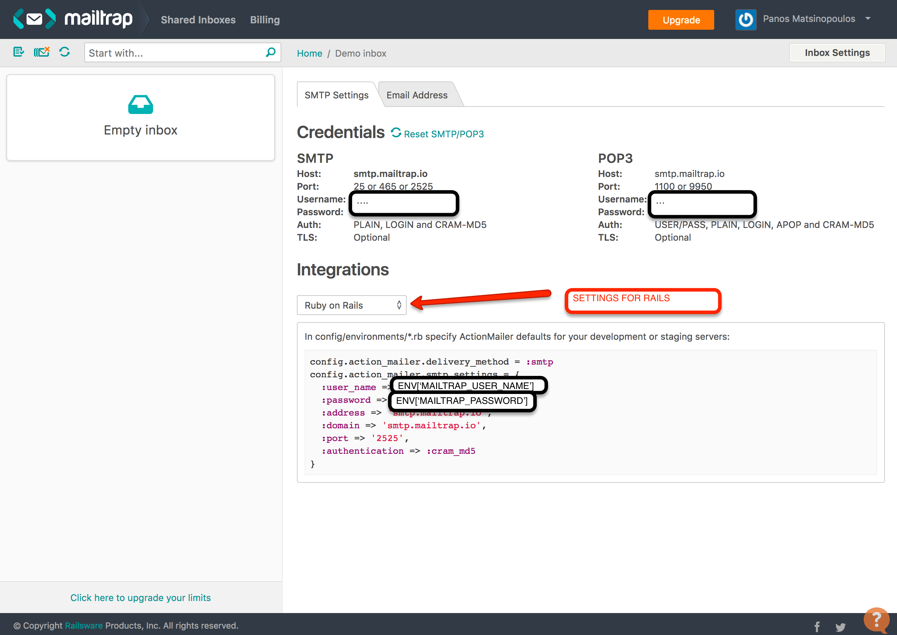
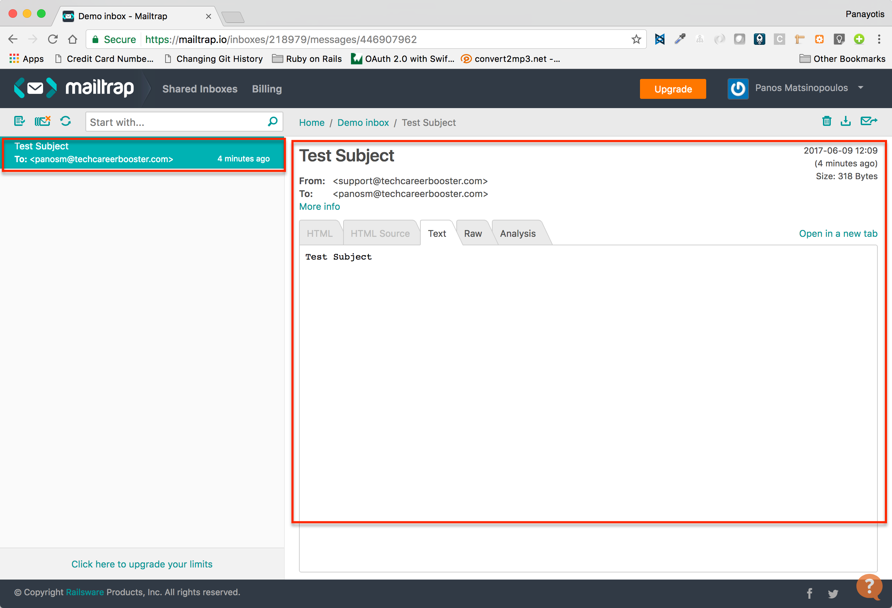
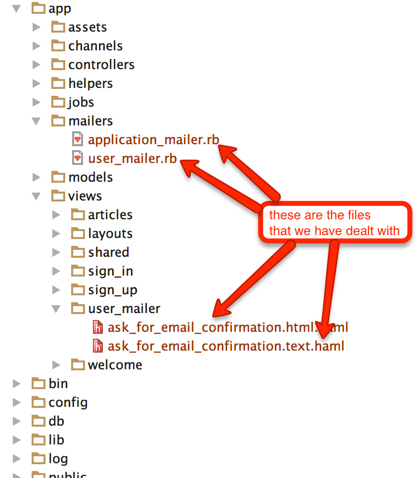
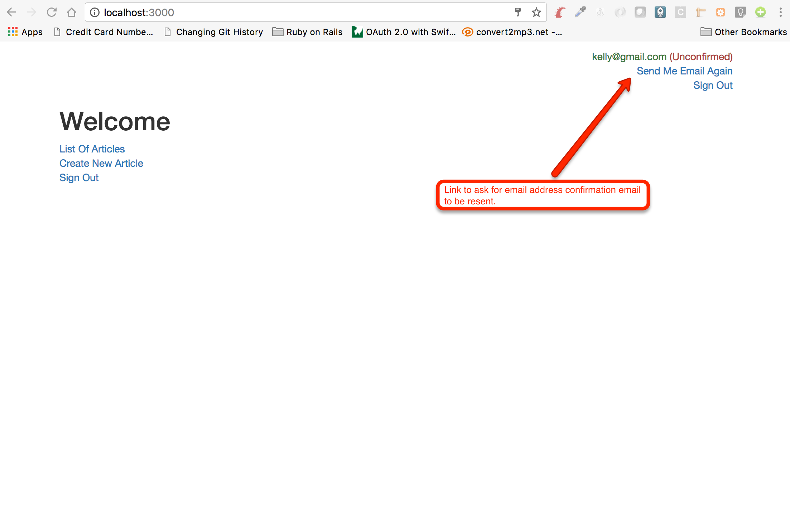

We will enhance our `blog` application to send emails to our users. In fact:

We want the users to confirm their email address when they sign up.
 
1. We will do that by sending an email to the user with a link to confirm their email address.
1. This email will be sent out when the user signs up.
1. Until the user confirms their email, we will not be able to send any other email to the user, and we will be considering their email unconfirmed.
1. Also, user will be able to request for a new email delivery with a new link to confirm their email address.

## Sending Out Emails While In Development

While you will be doing your development, you wouldn't like to have real emails being sent out to real users. There are
various ways you can use to prevent you from doing this, but one easy way is to actually integrate with a dummy SMTP 
(Simple Mail Transfer Protocol) server. Normally, an SMTP server accepts an email out request and makes sure
to forward the email out to the destination email box. A dummy SMTP server, on the other hand, accepts the email out request, 
but stores the email internally and does not send it out. The dummy SMTP server gives you an interface for you to inspect the
email content so that you know what would have been sent out if this were a real SMTP server.

Such a dummy SMTP server is [Mailtrap](https://mailtrap.io). 

### Integrating With Mailtrap

In order to integrate Mailtrap to your development environment, then you need to first create an account with them.
After you do that, you need to set your Mailtrap credentials inside your `config/environments/development.rb` file.

> Take your credentials from the inbox settings on your Mailtrap account. Here is a screenshot of Mailtrap settings from
my inbox:


Here it is how you should set them:

``` ruby
 1. # File: config/environments/development.rb
 2. #
 3. Rails.application.configure do
 4.   # Settings specified here will take precedence over those in config/application.rb.
 5. 
 6.   # In the development environment your application's code is reloaded on
 7.   # every request. This slows down response time but is perfect for development
 8.   # since you don't have to restart the web server when you make code changes.
 9.   config.cache_classes = false
10. 
11.   # Do not eager load code on boot.
12.   config.eager_load = false
13. 
14.   # Show full error reports.
15.   config.consider_all_requests_local = true
16. 
17.   # Enable/disable caching. By default caching is disabled.
18.   if Rails.root.join('tmp/caching-dev.txt').exist?
19.     config.action_controller.perform_caching = true
20. 
21.     config.cache_store = :memory_store
22.     config.public_file_server.headers = {
23.       'Cache-Control' => "public, max-age=#{2.days.seconds.to_i}"
24.     }
25.   else
26.     config.action_controller.perform_caching = false
27. 
28.     config.cache_store = :null_store
29.   end
30. 
31.   # Don't care if the mailer can't send.
32.   config.action_mailer.raise_delivery_errors = true
33.   config.action_mailer.perform_caching = false
34.   config.action_mailer.delivery_method = :smtp
35.   config.action_mailer.smtp_settings = {
36.     user_name: ENV['MAILTRAP_USER_NAME'],
37.     password: ENV['MAILTRAP_PASSWORD'],
38.     address: 'smtp.mailtrap.io',
39.     domain: 'smtp.mailtrap.io',
40.     port: '2525',
41.     authentication: :cram_md5
42.   }
43. 
44.   # Print deprecation notices to the Rails logger.
45.   config.active_support.deprecation = :log
46. 
47.   # Raise an error on page load if there are pending migrations.
48.   config.active_record.migration_error = :page_load
49. 
50.   # Debug mode disables concatenation and preprocessing of assets.
51.   # This option may cause significant delays in view rendering with a large
52.   # number of complex assets.
53.   config.assets.debug = true
54. 
55.   # Suppress logger output for asset requests.
56.   config.assets.quiet = true
57. 
58.   # Raises error for missing translations
59.   # config.action_view.raise_on_missing_translations = true
60. 
61.   # Use an evented file watcher to asynchronously detect changes in source code,
62.   # routes, locales, etc. This feature depends on the listen gem.
63.   config.file_watcher = ActiveSupport::EventedFileUpdateChecker
64. end
```

Look at lines 32 to 42. This is how Mailtrap recommends that we set our `config/environments/development.rb`.
These lines configure the SMTP server that our Web application will be connected to in order to be sending out
emails.

Note that we do not hard code the `:user_name` and `:password` values. They are going to be stored inside the `.env` file
and they are being retrieved here dynamically (since we are using the `dotenv-rails` gem).

> **Important:** Don't write your credentials inside the `config/environments/development.rb` file. You don't want these
to be checked in into your Git repository.

### Test Email

Now your integration with Mailtrap is ready. Let's try to send out a test email. Open your rails console:

``` bash
blog $ bin/rails console
2.3.3 :001> ActionMailer::Base.mail(to: 'panosm@techcareerbooster.com', from: 'support@techcareerbooster.com', subject: 'Test Subject', body: 'Test Subject').deliver
ActionMailer::Base#mail: processed outbound mail in 117.5ms
Sent mail to panosm@techcareerbooster.com (2934.8ms)
Date: Fri, 09 Jun 2017 15:09:24 +0300
From: support@techcareerbooster.com
To: panosm@techcareerbooster.com
Message-ID: <593a8ff45ab31_88f13fd2ed83f9c8223e7@Panayotiss-MacBook-Pro.local.mail>
Subject: Test Subject
Mime-Version: 1.0
Content-Type: text/plain;
 charset=UTF-8
Content-Transfer-Encoding: 7bit

Test Subject
 => #<Mail::Message:70175218012900, Multipart: false, Headers: <Date: Fri, 09 Jun 2017 15:09:24 +0300>, <From: support@techcareerbooster.com>, <To: panosm@techcareerbooster.com>, <Message-ID: <593a8ff45ab31_88f13fd2ed83f9c8223e7@Panayotiss-MacBook-Pro.local.mail>>, <Subject: Test Subject>, <Mime-Version: 1.0>, <Content-Type: text/plain>, <Content-Transfer-Encoding: 7bit>> 
2.3.3 :002 > 
```

As you can see above, we have used the `ActionMailer::Base.mail(...)` to construct a mail object and then call the method `deliver` on that to send out the actual
email. This mail has been finally caught by Mailtrap, our mailcatching proxy. Here is the screenshot from the email appearing in Mailtrap dashboard:



Don't worry about the fact that the email you are looking at is only a *text* version of your email. This is because you actually sent out only a text version of your email.
You will learn how to send out HTML emails in a while.

We have set up our email integration for the development environment. We will have to set up our email integration for the production environment
too, but this is something that we will do at the end of this chapter.

## Email is Pending Confirmation

Let's now implement the feature for email confirmation. Users, when they sign up, they need to confirm their email address. 

1. When a user signs up we will flag their email address as unconfirmed. 
1. We will send them out an email to confirm their email address. The email will have a link that the user should click on.
1. When the user clicks on the email address the link would take the user to the welcome page with a flash message that their
email address has been confirmed.

### Amend `users` Table

Let's amend the `users` table to have a column with name `email_confirmation_token`. This will be a string and will 
randomly take a value when the User signs up. 

The following is a schema migration generation command that will generate the file for us to specify the changes on `users` table:

``` bash
blog $ bin/rails generate migration add_email_confirmation_token_to_users
invoke  active_record
create    db/migrate/20170610052034_add_email_confirmation_token_to_users.rb
blog $
```

We now edit the file `db/migrate/20170610052034_add_token_to_users.rb` and make its content as follows:

``` ruby
 1. # File: db/migrate/20170610052034_add_email_confirmation_token_to_users.rb
 2. #
 3. require 'securerandom'
 4. 
 5. class AddEmailConfirmationTokenToUsers < ActiveRecord::Migration[5.1]
 6.   def change
 7.     add_column :users, :email_confirmation_token, :string
 8. 
 9.     # We need to run a data migration for existing Users
10.     User.reset_column_information
11. 
12.     User.find_each do |user|
13.       user.update_column(:email_confirmation_token, SecureRandom.urlsafe_base64)
14.     end
15.   end
16. end
```

On line 7 we use the `add_column` method call that allows us to add a column to existing table. Then on line 10, we
call `User.reset_column_information`. This is necessary for the Rails process that runs the migration to reload the information
in regards to the columns that correspond to the `User` model, since we have added a new column. If we don't do that, then line 13, 
that uses the new column will fail.

The idea of the above schema migration is to first add the new column and then to do a data migration for the existing users
in our database. For all the users, it will set a random value to their column `email_confirmation_token`.

Let's now run the schema migration:

``` bash
blog $ bin/rake db:migrate
== 20170610052034 AddEmailConfirmationTokenToUsers: migrating =================
-- add_column(:users, :email_confirmation_token, :string)
   -> 0.0026s
== 20170610052034 AddEmailConfirmationTokenToUsers: migrated (0.0391s) ========

blog $
```

The migration has run successfully. The following `psql` interaction can be used to confirm the changes on the database level:

``` bash
blog $ psql
psql (9.4.4)
Type "help" for help.

panayotismatsinopoulos=# \connect blog_development
You are now connected to database "blog_development" as user "panayotismatsinopoulos".
blog_development=# \d+ users
                                                                Table "public.users"
          Column          |            Type             |                     Modifiers                      | Storage  | Stats target | Description 
--------------------------+-----------------------------+----------------------------------------------------+----------+--------------+-------------
 id                       | bigint                      | not null default nextval('users_id_seq'::regclass) | plain    |              | 
 email                    | character varying           | not null                                           | extended |              | 
 password_digest          | character varying           | not null                                           | extended |              | 
 created_at               | timestamp without time zone | not null                                           | plain    |              | 
 updated_at               | timestamp without time zone | not null                                           | plain    |              | 
 email_confirmation_token | character varying           |                                                    | extended |              | 
Indexes:
    "users_pkey" PRIMARY KEY, btree (id)

blog_development=# select * from users;
 id |     email     |                       password_digest                        |         created_at         |         updated_at         | email_confirmation_token 
----+---------------+--------------------------------------------------------------+----------------------------+----------------------------+--------------------------
  8 | foo@gmail.com | $2a$10$WuL5ic/qRTL2.AK9vAIDxuoHZAf7V/dFdlLzFpgXdnwc1GhtrJj8i | 2017-06-04 07:25:59.681835 | 2017-06-04 07:25:59.681835 | 3sRJUZvDS0wNMNY2pfbU_A
  9 | bar@gmail.com | $2a$10$g/4AILw8UXB1s8G01M8P1efgzs0iZfNfw.BxdHW2HNIxMhgkgqrr2 | 2017-06-04 13:51:46.423347 | 2017-06-04 13:51:46.423347 | dX84eWeLcTyF9-2f6ZM01Q
(2 rows)

blog_development=# \q
blog $
```

You can see that the table `users` now has a new column named `email_confirmation_token` and all the users have a value that has been randomly generated
when we ran the schema migration.

## `User` Model Changes

We will enhance our `User` model to tell us whether the user has confirmed email address or not. Here is how we will do that:

``` ruby
 1. # File app/models/user.rb
 2. #
 3. class User < ApplicationRecord
 4.   validates :email, presence: true, uniqueness: { case_sensitive: false }
 5.   has_secure_password
 6.   
 7.   def email_confirmed?
 8.     !email_confirmation_token.present?
 9.   end
10. end
```

We have added the method `email_confirmed?` This returns `true` when the `email_confirmation_token` is not present, i.e. when it does not exist,
and returns `false` when the `email_confirmation_token` is present, i.e. when it exists.

<table>
  <tr><th>email_confirmation_token.present?</th><th>Email Confirmed?</th></tr>
  <tr><td><code>false</code></td><td><code>true</code></td></tr>
  <tr><td><code>true</code></td><td><code>false</code></td></tr>
</table>

In other words:

1. We want the `User` to be created, signed-up, with a random `email_confirmation_token`. Hence, `email_confirmed?` will be returning `false`.
1. When the `User` will confirm their email address, this token will be deleted. Hence, `email_confirmed?` will be returning `true`.

But, how can we make sure that whenever we create a `User`, this `User` has a random `email_confirmation_token` attached to it?

Shall we amend the `#create` action in the `SignUpController` to make it attach a token after the user is created? That would have been
a solution, but Rails offers a better one that makes our life much easier. It is called ActiveRecord Callbacks. We will talk more about those
in a later chapter, but until then, let's use one in our `User` model:

``` ruby
 1. # File app/models/user.rb
 2. #
 3. class User < ApplicationRecord
 4.   validates :email, presence: true, uniqueness: { case_sensitive: false }
 5.   has_secure_password
 6.   
 7.   before_create :generate_email_confirmation_token
 8. 
 9.   def email_confirmed?
10.     !email_confirmation_token.present?
11.   end
12.   
13.   private
14.   
15.   def generate_email_confirmation_token
16.     self.email_confirmation_token = SecureRandom.urlsafe_base64
17.   end
18. end
```

Line 7, `before_create :generate_email_confirmation_token` attaches the method code from the method `generate_email_confirmation_token`
at the hook that is invoked exactly before the `User` is created in the database. If you see the implementation of this method,
you will see that it creates a random string as an `email_confirmation_token`. 

This is a very useful tool for the following reasons:

1. There is no way you can create a `User` without an `email_confirmation_token`. If we put this logic in the `SignUpController`, then
that leaves a door open for creation of `Users` without `email_confirmation_token`, e.g. using the `rails console`.
1. Creation of the `User` and the assignment of the `email_confirmation_token` is done in one transaction. So, you don't risk to have
created a `User` without them having an `email_confirmation_token`.

## Display Unconfirmed Flag

Let's enhance our layout to display an unconfirmed email flag next to the email of the signed in user:

``` haml
 1. - # File: app/views/layouts/_signed_in_user.html.haml
 2. - #
 3. - if current_user
 4.   .signed-in-user-container.text-right
 5.     .signed-in-user.text-success
 6.       = current_user.email
 7.       - unless current_user.email_confirmed?
 8.         %span.text-danger
 9.           = ' (Unconfirmed) '
10.     .sign-out-link
11.       = link_to 'Sign Out', sign_out_path, method: :delete
```

The above is the `app/views/layouts/_signed_in_user.html.haml` that has been amended (lines 7 to 9) to display the word <span style="color: red;">(Unconfirmed)</span>
if the currently signed in user has an email that has not been confirmed.

Watch the following video displaying this flag for the existing users, but also for a new sign up. Also, it demonstrates how the 
new User is really signed up with a new email confirmation token.

<div id="media-container-video-Unconfirmed Email and Email Confirmation Token">
  <a href="https://player.vimeo.com/video/221058515"></a>
</div>

## Sending Email Out

We have dealt with creating the email confirmation token for each User. This happens when the sign up takes place, in fact, when the User
is created. But how can we hook the delivery of an email to the User with the link to click on in order to confirm their email?

In order to do that, we may want to enhance the `SignUpController` to send out an email to the user that has just signed up.

> *Information:* Why don't we just create another ActiveRecord Callback that would send the email out? For example, ActiveRecord
has a callback called `after_create` which could be used for that reason. However, the question here is: _Do we really want
to send an email out every time a User is created?_ We may want to run a bulk import script to import many Users from another database.
If that was the case, would we want to send them an email out? This _send an email out to ask for a confirmation_ seems to be more
like an application flow responsibility, rather than a domain model responsibility. Having done these thoughts, we believe that it is
better if this was handled at the controller layer, which is the layer that deals with application flow and logic.

Here is the new version of our `SignUpController`:

``` ruby
 1. # File: app/controllers/sign_up_controller.rb
 2. #
 3. class SignUpController < ApplicationController
 4.   skip_before_action :authenticate_user
 5.   before_action :redirect_if_signed_in
 6. 
 7.   def new
 8.     @user = User.new
 9.   end
10. 
11.   def create
12.     user = User.new(user_params)
13.     if user.save
14.       send_email_to_confirm_their_email_address(user)
15.       flash[:success] = 'You have successfully signed up! Please, confirm your email address. We just sent you out an email with a link to do so!'
16.       redirect_to root_url
17.     else
18.       @user = user
19.       render :new
20.     end
21.   end
22. 
23.   private
24. 
25.   def user_params
26.     params.require(:user).permit(:email, :password, :password_confirmation)
27.   end
28. 
29.   def send_email_to_confirm_their_email_address(user)
30.     ActionMailer::Base.mail(
31.       to: user.email,
32.       from: 'support@techcareerbooste.com',
33.       subject: 'TCB Blog: Please, Confirm Your Email Address',
34.       body: "Please, click <a href='http://localhost:3000/confirm_email_address?email=#{CGI.escape(user.email)}&email_confirmation_token=#{user.email_confirmation_token}'>here to confirm your email address</a>",
35.       content_type: 'text/html'
36.     ).deliver
37.   end
38. end
```

Look at lines 14, 15 and then on lines 29 to 37. I guess that everything is easily explained. After we sign up a user, we send an email
out and we then redirect to the `root_url`. The `flash` message has been adapted in order to prompt the user to check their email out.

The method `send_email_to_confirm_their_email_address` is very simple to understand. It uses the `ActionMailer::Base.mail(...).deliver` method
to send out an email. Note that the `body` now has content that includes the link that the recipient would have to click on. Because it includes
HTML content, we had to tell `ActionMailer::Base` that `content_type:` has the value `text/html`. Otherwise, it would have been treated as 
plain text.

The link that it is included in the email body is of the format: `http://localhost:3000/confirm_email_address?email=<email>&email_confirmation_token=<email_confirmation_token>`.
Note also that the `email` is being URL encoded with the help of the `CGI.escape(...)` method. The `email_confirmation_token` does not have
to be sent to `CGI.escape(...)` because it is already URL safe, since it is generated with the call to `SecureRandom.urlsafe_base64`. 

> **Important:** It is not recommended to use `ActionMailer::Base` to send your emails out. Later on in this chapter you will
see what is the proper way to use Rails tools to send out emails.

> **Important:** Usually, we do not ask the Web application to deliver the email within the HTTP request processing cycle, i.e. synchronously.
In other words, we do not call `#deliver`. We use a technique to do it asynchronously using background tasks. We will see this technique in a later chapter.

Obviously, if the user clicks on this link we will have a failure because, currently, we have not defined any endpoint to
accept such requests. We will do that after we first demonstrate what we have done so far with the following video. In the following video, 
we sign up a User and then we get a look into our Mailtrap inbox to see that the email for confirmation
has been delivered as expected. 

<div id="media-container-video-Unconfirmed Email and Email Confirmation Token">
  <a href="https://player.vimeo.com/video/221061781"></a>
</div>

## EndPoint To Accept Confirmation

Ok. Cool! If the user clicks on the link inside the email that they receive, they will get an error.

Let's now amend our `config/routes.rb` file in order to add a new endpoint to accept `GET` requests for email confirmation.

``` ruby
 1. # File: config/routes.rb
 2. #
 3. Rails.application.routes.draw do
 4.   resources :articles
 5. 
 6.   get '/sign_up', to: 'sign_up#new'
 7.   post '/sign_up', to: 'sign_up#create'
 8.   get '/confirm_email_address', to: 'sign_up#confirm_email_address' # ?email=<email>&email_confirmation_token=<email_confirmation_token>
 9. 
10.   get '/sign_in', to: 'sign_in#new'
11.   post '/sign_in', to: 'sign_in#create'
12. 
13.   get '/sign_out', to: 'sign_in#destroy'
14.   delete '/sign_out', to: 'sign_in#destroy'
15. 
16.   root 'welcome#index'
17. end
```

Do you see line 8? This is the new line that we have added. Note that the path specification does not include the `email` and the `email_confirmation_token`.
These values are going to be sent over using query params and hence they are not specified in the path entry in routes. However, I have
added a comment at the end of the line explaining which are the expected query params this route is going to deal with.

Let's confirm the actual routes that the above file builds:

``` bash
blog $ bin/rake routes
...
confirm_email_address GET    /confirm_email_address(.:format) sign_up#confirm_email_address
...
blog $
```

## Amend `SignUp` Controller

With the above routes in place, we need to add a new action inside `SignUpController`. The action needs to be `confirm_email_address`.
Here is the implementation of it:

``` ruby
 1. # File: app/controllers/sign_up_controller.rb
 2. #
 3. class SignUpController < ApplicationController
 4.   skip_before_action :authenticate_user
 5.   before_action :redirect_if_signed_in, except: [:confirm_email_address]
 6. 
 7.   def new
 8.     @user = User.new
 9.   end
10. 
11.   def create
12.     user = User.new(user_params)
13.     if user.save
14.       send_email_to_confirm_their_email_address(user)
15.       flash[:success] = 'You have successfully signed up! Please, confirm your email address. We just sent you out an email with a link to do so!'
16.       redirect_to root_url
17.     else
18.       @user = user
19.       render :new
20.     end
21.   end
22. 
23.   def confirm_email_address
24.     user = User.find_by_email_and_email_confirmation_token!(params[:email], params[:email_confirmation_token])
25.     if user.confirm_email_address
26.       flash[:success] = 'You have successfully confirmed your email address!'
27.     else
28.       flash[:error] = 'Something went wrong and we cannot confirm your email address!'
29.     end
30.     redirect_to root_url
31.   end
32. 
33.   private
34. 
35.   def user_params
36.     params.require(:user).permit(:email, :password, :password_confirmation)
37.   end
38. 
39.   def send_email_to_confirm_their_email_address(user)
40.     ActionMailer::Base.mail(
41.       to: user.email,
42.       from: 'support@techcareerbooste.com',
43.       subject: 'TCB Blog: Please, Confirm Your Email Address',
44.       body: "Please, click <a href='http://localhost:3000/confirm_email_address?email=#{CGI.escape(user.email)}&email_confirmation_token=#{user.email_confirmation_token}'>here to confirm your email address</a>",
45.       content_type: 'text/html'
46.     ).deliver
47.   end
48. end
```

Watch for the line 5. We have excluded the new method `confirm_email_address` from being redirected if the user is 
already signed in. We don't want that. We want the action to take place even if the user is already signed in.

See the lines 23 to 31 which are the implementation of the email confirmation. First, on line 24, we are trying to locate the User
using the two parameters, i.e. the `email` and the `email_confirmation_token`. The `#find_by_x_y` is a method that is
dynamically available to us by `ActiveRecord`. `x` and `y` being any of the model attributes. The `!` at the end makes sure that
if the `User` is not located an exception is raised. The exception is `ActiveRecord::RecordNotFound` which causes the Rails server
to return back a response with status code `404 Not Found`. We will elaborate on that later on.

Next, on line 25, we call `User#confirm_email_address` to ask the domain model to render the email address confirmed. We have not implemented
this method in the model yet. We are going to do that next. Other than that, the `SignUpController#confirm_email_address` is pretty 
straight forward.

## `User#confirm_email_address`

Here is the implementation of the `User#confirm_email_address`:

``` ruby
 1. # File app/models/user.rb
 2. #
 3. class User < ApplicationRecord
 4.   validates :email, presence: true, uniqueness: { case_sensitive: false }
 5.   has_secure_password
 6. 
 7.   before_create :generate_email_confirmation_token
 8. 
 9.   def email_confirmed?
10.     !email_confirmation_token.present?
11.   end
12.   
13.   def confirm_email_address
14.     self.email_confirmation_token = nil
15.     save
16.   end
17. 
18.   private
19. 
20.   def generate_email_confirmation_token
21.     self.email_confirmation_token = SecureRandom.urlsafe_base64
22.   end
23. end
```

Look at lines 13 to 16. The implementation of the `User#confirm_email_address` is very simple. We just set the `email_confirmation_token` to `nil` and we save.

Now the flow of confirming the email address has been finished. You can try that on your browser. Here is a full demo of that on our own browser:

<div id="media-container-video-Full Sign Up Demo With Email Confirmation">
  <a href="https://player.vimeo.com/video/221129451"></a>
</div>

## Sending Emails Out - The Recommended Way

We have used the `ActionMailer::Base.mail(...).deliver` method to send the email out to the User that has just signed up. However,
this is not the recommended way to be sending emails out. We should be using custom Mailers and Mailer Views.

Mailers work more or less like Controllers do. They are custom classes that derive from `ActionMailer::Base` and they have public
methods which are called actions. The actions then are matched to view templates, usually in two versions, an HTML version and a TEXT version
in order to support email clients that only deal with TEXT-content emails.

Let's see how we should implement our feature in order to use this recommended technique:

### Change `SignUpController`

First, we will change the `SignUpController` to be using the Mailer. Here is the new implementation of the method `#send_email_to_confirm_their_email_address`:
 
``` ruby
...
def send_email_to_confirm_their_email_address(user)
  UserMailer.ask_for_email_confirmation(user.id).deliver
end
...
```

The implementation is now using the `UserMailer` class and calls its action `ask_for_email_confirmation` passing as argument the `id` of the `user` instance. Then it
calls the `#deliver` method as before.

### `UserMailer`

The mailers live inside the `app/mailers` folder. Let's create the class `UserMailer` in the file `app/mailers/user_mailer.rb` as follows:

``` ruby
 1. # File: app/mailers/user_mailer.rb
 2. #
 3. class UserMailer < ApplicationMailer
 4.   def ask_for_email_confirmation(user_id)
 5.     @user = User.find(user_id)
 6.     mail(
 7.       to: @user.email,
 8.       subject: 'TCB Blog: Please, Confirm Your Email Address'
 9.     )
10.   end
11. end
```

You can see that the action implementation is very simple. 

It first finds the user and assigns the instance to `@user`. Then it calls the method `mail` which will return a Mail object. The
`mail` command, in this particular case, specifies the recipient and the subject. The `from` is specified in the `ApplicationMailer` 
class, which is the superclass of the custom `UserMailer`:

``` ruby
1. # File: app/mailers/application_mailer.rb
2. #
3. class ApplicationMailer < ActionMailer::Base
4.   default from: 'support@techcareerbooster.com'
5.   layout 'mailer'
6. end
```

Do you see the `default` call on line 4. This is used to define default settings for the Mailers. Currently, this sets the
`from` to be `support@techcareerbooster.com`. Set this to any value that you see fit.

Note also that `ApplicationMailer` specifies the default layout to be used for the emails. Just like rendering page views
the views might be using a layout, views for emails are using a layout out. The default layout is the file `app/views/layouts/mailer.html.haml`,
thanks to this call above `layout 'mailer'`. If you remove this line, then the default layout is the file with the
same name as the Mailer name. Hence, it would have been `app/views/layouts/user_mailer.html.haml` for the `UserMailer`.

### Mailer View

We have seen the implementation of the `UserMailer` (who is the equivalent to a controller). Now, let's see how we specify the
view template to be used for the email content. 

By default all the mailer views reside in the folder `app/views/<name_of_mailer>`. That is, we should have one view folder per custom Mailer.

Let's create the folder `app/views/user_mailer`. This will host the views of the `UserMailer` custom Mailer.


Having done that, we need to create the view for the action `ask_for_email_confirmation`. Usually, there are two files for each Mailer action. 
One HTML version and one TEXT version. They are both used by the mail view rendering engine to send out a multipart email, that has body 
both in HTML and in TEXT versions. This is recommended, because not all email clients support HTML.

Let's do that. First create the file `app/views/user_mailer/ask_for_email_confirmation.html.haml`. This is going to be the 
view for the action `ask_for_email_confirmation` that will be used to setup the content for the HTML part of the email. Here is the
view template content:

``` haml
 1. - # File: app/views/user_mailer/ask_for_email_confirmation.html.haml
 2. -
 3. %h1
 4.   Welcome!
 5. %p
 6.   = "Dear #{@user.email}"
 7. %p
 8.   Please, confirm your email address by clicking on this link here:
 9. %p
10.   = link_to 'Click Here To Confirm Your Email Address', confirm_email_address_url(protocol: 'http', host: 'localhost:3000', email: @user.email, email_confirmation_token: @user.email_confirmation_token)
11. %p
12.   TCB Customer Success
```

Watch out for the following:

1. You do have access to the instance variables that you have instantiated inside the `UserMailer` action implementation. 
In other words, you do have access to `@user`. This is similar to the controllers instance variables that are made available
to the corresponding views.
1. You have access to the named routes, like `confirm_email_address_url`. But, you will need to make sure that you use the
`*_url` version and not the `*_path` version. This is because the `ActionMailer::Base` does not run in the content of HTTP request
processing and does not know how to derive the whole URL. For the same reason, you have to specify the `protocol` and the `host`
options.

Now, you need to create a TEXT version of your email. The TEXT version will be sent out alongside the HTML version in a multipart
email body. 

Let's create the file `app/views/user_mailer/ask_for_email_confirmation.text.haml`:

``` haml
 1. - # File: app/views/user_mailer/ask_for_email_confirmation.text.haml
 2. -
 3. Welcome!
 4. 
 5. = "Dear #{@user.email}"
 6. 
 7. Please, confirm your email address by clicking on this link here:
 8. 
 9. = confirm_email_address_url(protocol: 'http', host: 'localhost:3000', email: @user.email, email_confirmation_token: @user.email_confirmation_token)
10. 
11. 
12. TCB Customer Success
```

As you can see above, the TEXT version is with content similar to the HTML version but without the HTML tags.



Now, try the sign up process again. Everything should be working as expected.

<div id="media-container-video-Unconfirmed Email and Email Confirmation Token">
  <a href="https://player.vimeo.com/video/221133326"></a>
</div>

### Default URL Options

Remembering to add the `protocol` and `host` options on every link included in your emails is a tedious task. Also, it may be different
depending on the environment. So, for example, in production, you wouldn't want these values to `http` and `localhost:3000` respectively.
Rails provides a way for you to specify this per environment.

Open the file `config/environments/development.rb` and add the following line, after the other `action_mailer` related configuration:

``` ruby
...
config.action_mailer.default_url_options = {protocol: 'http', host: 'localhost:3000'}
...
```

The `config.action_mailer.default_url_options` will be used when building the URL inside the emails and when the corresponding options
are not explicitly specified. And you can have different options per environment, as long as you specify this configuration differently
in the corresponding environment configuration files (`config/environment/production.rb`, `config/environments/staging.rb` e.t.c.).

With the above setting in place, you can now replace the part of your User Mailer view templates that is:

``` ruby
confirm_email_address_url(protocol: 'http', host: 'localhost:3000', email: @user.email, email_confirmation_token: @user.email_confirmation_token)
```

with this:

``` ruby
confirm_email_address_url(email: @user.email, email_confirmation_token: @user.email_confirmation_token)
```

Make sure that you restart your Rails server before testing this feature.

If you try this feature again, you will see that the URL inside the email is built without problem. Protocol and host will be present.

## Ask For Email Address Confirmation Email To Be Resent

Now we want the user to be able to ask for the email to confirm their email address to be sent out again. Maybe, the user cannot find
the original email and they want another one to be delivered to their email box.

How would we go about implementing this feature?

### Action To Request Email To Be Resent

Let's add a link below the currently logged in user email, which appears at the top right. This link will be used by the user to
ask for the email address confirmation email to be redelivered. Something like this:



### Endpoint in Routes

First, let's make sure that we have the correct endpoint defined inside the `config/routes.rb` file. Here is the version of
`config/routes.rb` that includes the endpoint for this new feature:

``` ruby
 1. # File: config/routes.rb
 2. #
 3. Rails.application.routes.draw do
 4.   resources :articles
 5. 
 6.   get '/sign_up', to: 'sign_up#new'
 7.   post '/sign_up', to: 'sign_up#create'
 8.   get '/confirm_email_address', to: 'sign_up#confirm_email_address' # ?email=<email>&email_confirmation_token=<email_confirmation_token>
 9.   post '/confirm_email_address_resend', to: 'sign_up#confirm_email_address_resend'
10. 
11.   get '/sign_in', to: 'sign_in#new'
12.   post '/sign_in', to: 'sign_in#create'
13. 
14.   get '/sign_out', to: 'sign_in#destroy'
15.   delete '/sign_out', to: 'sign_in#destroy'
16. 
17.   root 'welcome#index'
18. end
```

Do you see line 9? This is the new entry. You can see that we prefer here to make it a `post` request in order to make sure 
that we are changing things in the server state. Here is the list of routes generated:

``` bash
blog $ bin/rake routes
...
confirm_email_address_resend POST   /confirm_email_address_resend(.:format) sign_up#confirm_email_address_resend
...
blog $
```

### Link On Layout

Let's now create the link that would send this request. We are going to put it in the layout, inside `app/views/layouts/_signed_in_user.html.haml`:

``` haml
 1. - # File: app/views/layouts/_signed_in_user.html.haml
 2. - #
 3. - if current_user
 4.   .signed-in-user-container.text-right
 5.     
 6.     .signed-in-user.text-success
 7.       = current_user.email
 8.       - unless current_user.email_confirmed?
 9.         %span.text-danger
10.           = ' (Unconfirmed) '
11.           
12.     - unless current_user.email_confirmed?
13.       .link-to-resend-email
14.         = link_to 'Send Me Email Again', confirm_email_address_resend_path, method: :post
15.     
16.     .sign-out-link
17.       = link_to 'Sign Out', sign_out_path, method: :delete
```

Look at lines 12 to 14. These have to do with the link `Send Me Email Again`. If you save this partial and visit a page after having signed in
with a user that has unconfirmed email, then you will see the link present.

### Action on `SignUpController`

Let's go now and implement the action `#confirm_email_address_resend` in `SignUpController`. This is how we can do that:

``` ruby
 1. # File: app/controllers/sign_up_controller.rb
 2. #
 3. class SignUpController < ApplicationController
 4.   skip_before_action :authenticate_user, except: [:confirm_email_address_resend]
 5.   before_action :redirect_if_signed_in, except: [:confirm_email_address, :confirm_email_address_resend]
 6. 
 7.   def new
 8.     @user = User.new
 9.   end
10. 
11.   def create
12.     user = User.new(user_params)
13.     if user.save
14.       send_email_to_confirm_their_email_address(user)
15.       flash[:success] = 'You have successfully signed up! Please, confirm your email address. We just sent you out an email with a link to do so!'
16.       redirect_to root_url
17.     else
18.       @user = user
19.       render :new
20.     end
21.   end
22. 
23.   def confirm_email_address
24.     user = User.find_by_email_and_email_confirmation_token!(params[:email], params[:email_confirmation_token])
25.     if user.confirm_email_address
26.       flash[:success] = 'You have successfully confirmed your email address!'
27.     else
28.       flash[:error] = 'Something went wrong and we cannot confirm your email address!'
29.     end
30.     redirect_to root_url
31.   end
32. 
33.   def confirm_email_address_resend
34.     if current_user.email_confirmed?
35.       flash[:warning] = 'Your email is already confirmed!'
36.     else
37.       send_email_to_confirm_their_email_address(user)
38.       flash[:success] = 'Please, confirm your email address. We just sent you out an email with a link to do so!'
39.     end
40.     redirect_to root_url
41.   end
42. 
43.   private
44. 
45.   def user_params
46.     params.require(:user).permit(:email, :password, :password_confirmation)
47.   end
48. 
49.   def send_email_to_confirm_their_email_address(user)
50.     UserMailer.ask_for_email_confirmation(user.id).deliver
51.   end
52. end
```

We did changes on line 4, 5 that have to do with the before action filters. And then we introduced the
implementation of the action `confirm_email_address_resend`.

1. On line 4 we had to tell that the `confirm_email_address_resend` needs the user to be authenticated.
2. On line 5 we had to tell that the same.

The implementation of the method is very simple. It relies on the `send_email_to_confirm_their_email_address()` private
method. If the currently logged in user has confirmed their email, we do nothing but displaying a warning message.
Otherwise, we call `send_email_to_confirm_their_email_address()`.

And we are done!

Here is a video that demonstrates this new feature:

<div id="media-container-video-Unconfirmed Email and Email Confirmation Token">
  <a href="https://player.vimeo.com/video/221157137"></a>
</div>

## Indexes In Database

We have learnt in the RDBMS section of this course that indexes are very important, because they make sure that 
we can search for a specific record very quickly. Also, if the index is a unique index, then it protects us from
entering duplicate records in our table.

Let's see what is the status of our indexes in the current status of our blog application.

### Table `articles`

If we log in to our database using `psql` we will be able to get information about the setup of the `articles` table:

``` sql
blog $ psql
psql (9.4.4)
Type "help" for help.

panayotismatsinopoulos=# \connect blog_development
You are now connected to database "blog_development" as user "panayotismatsinopoulos".
blog_development=# \d+ articles
                                                         Table "public.articles"
   Column   |            Type             |                       Modifiers                       | Storage  | Stats target | Description 
------------+-----------------------------+-------------------------------------------------------+----------+--------------+-------------
 id         | bigint                      | not null default nextval('articles_id_seq'::regclass) | plain    |              | 
 title      | character varying           | not null                                              | extended |              | 
 text       | character varying           | not null                                              | extended |              | 
 created_at | timestamp without time zone | not null                                              | plain    |              | 
 updated_at | timestamp without time zone | not null                                              | plain    |              | 
Indexes:
    "articles_pkey" PRIMARY KEY, btree (id)

blog_development=# 
```

With the `\connect blog_development` we connect to the blog database and with the `\d+ articles` we ask information about the
`articles` table.

As you can see there is a section that lists the `Indexes` that are defined on the `articles` table.
 
There is one index, named `articles_pkey` which is an index on the `id` column of the `articles` table. This index is a `PRIMARY KEY` 
index and makes sure that `id` holds unique values, i.e. is a unique index too.

Note that when we defined the migration for the `articles` table, we didn't actually specify anything about the `id` column. This was
the code that we used:

``` ruby
# File: db/migrate/20170519062431_create_articles.rb
#
class CreateArticles < ActiveRecord::Migration[5.1]
  def change
    create_table :articles do |t|
      t.string :title
      t.text   :text

      t.timestamps
    end
  end
end
```

The `id` and the fact that this is a primary key was specified automatically by the `ActiveRecord::Migration` functionality.

### Table `users`

Being inside the `psql` prompt, let's now see the structure of the `users` table:

``` sql
blog_development=#\d+ users 
                                                                Table "public.users"
          Column          |            Type             |                     Modifiers                      | Storage  | Stats target | Description 
--------------------------+-----------------------------+----------------------------------------------------+----------+--------------+-------------
 id                       | bigint                      | not null default nextval('users_id_seq'::regclass) | plain    |              | 
 email                    | character varying           | not null                                           | extended |              | 
 password_digest          | character varying           | not null                                           | extended |              | 
 created_at               | timestamp without time zone | not null                                           | plain    |              | 
 updated_at               | timestamp without time zone | not null                                           | plain    |              | 
 email_confirmation_token | character varying           |                                                    | extended |              | 
Indexes:
    "users_pkey" PRIMARY KEY, btree (id)

blog_development=# 
```

Similarly to `articles`, there is a `PRIMARY KEY` index on the `id` column of the table `users`. It was automatically specified by the `ActiveRecord::Migration`.
 
The point here is that table `users` is queried on the `email` column too. In other words, we have Ruby statements that try to locate a
user by its `email`. For example, the `user.save` statement inside the `#create` action of the `SignUpController`. Because of the fact
that we have a uniqueness validation rule on the `User` model (`validates :email, presence: true, uniqueness: { case_sensitive: false }`),
before the `user.save` commits the new `user` to the database, it checks whether the
user with the given `email` already exists. This check is done by querying the database on the `email` column.

Searching the table `users` by `email` will be becoming slower and slower as the number of rows in the table becomes larger. This is because
of the fact that we don't have an index on this particular column.

Not only that, we better go on with creating a unique index on this column in order to make sure that we never have a table with duplicate
entries.

How do we create a unique index on the `email` column of the `users` table? We have to create a new schema migration:

``` bash
blog $ bin/rails generate migration add_index_to_users_email
      invoke  active_record
      create    db/migrate/20170617084556_add_index_to_users_email.rb
blog $
```

Edit the generated file and make it have the following content:

``` ruby
1. # File: db/migrate/20170617084556_add_index_to_users_email.rb
2. #
3. class AddIndexToUsersEmail < ActiveRecord::Migration[5.1]
4.   def change
5.     add_index :users, [:email], unique: true, name: 'users_email_uidx'
6.   end
7. end
```

As you can read above, we use the `ActiveRecord::Migration` command `add_index`. This command takes as input the name of the 
table we want to add index on, the columns the index is going to index and whether it will be unique or not. Then we also give the
name of the index.

Let's run the migration:

``` bash
blog $ bin/rake db:migrate
== 20170617084556 AddIndexToUsersEmail: migrating =============================
-- add_index(:users, [:email], {:unique=>true, :name=>"users_email_uidx"})
   -> 0.0165s
== 20170617084556 AddIndexToUsersEmail: migrated (0.0166s) ====================

blog $
```

Now, the index has been created and we can confirm that with the `\d+ users` command in the `psql` console:

``` sql
blog_development=# \d+ users
                                                                Table "public.users"
          Column          |            Type             |                     Modifiers                      | Storage  | Stats target | Description 
--------------------------+-----------------------------+----------------------------------------------------+----------+--------------+-------------
 id                       | bigint                      | not null default nextval('users_id_seq'::regclass) | plain    |              | 
 email                    | character varying           | not null                                           | extended |              | 
 password_digest          | character varying           | not null                                           | extended |              | 
 created_at               | timestamp without time zone | not null                                           | plain    |              | 
 updated_at               | timestamp without time zone | not null                                           | plain    |              | 
 email_confirmation_token | character varying           |                                                    | extended |              | 
Indexes:
    "users_pkey" PRIMARY KEY, btree (id)
    "users_email_uidx" UNIQUE, btree (email)

blog_development=#
```

Do you see the new line that has been added in the indexes section? The `"users_email_uidx" UNIQUE, btree (email)` confirms that we have
added the index on the `email` column of the table. And this index is a unique index.

### Experimenting with Uniqueness

Before we leave this section, and while being in the `psql` section, let's try to create a new user with same email as an existing
one but with different case.

Currently, the users that I have in my database are the following:

``` sql
blog_development=# select id, email from users order by email;
 id |       email       
----+-------------------
 18 | angela@gmail.com
  9 | bar@gmail.com
  8 | foo@gmail.com
 20 | john2@gmail.com
 12 | john@gmail.com
 21 | kelly@gmail.com
 17 | kristin@gmail.com
 10 | mary@gmail.com
 16 | paul@gmail.com
 19 | peter2@gmail.com
 13 | peter@gmail.com
(11 rows)

blog_development=# 
```

Using standard sql, I will try to create the user "PETER@gmail.com":

``` sql
blog_development=# insert into users (email, password_digest, created_at, updated_at) values ('PETER@gmail.com', 'password-hash', current_timestamp, current_timestamp);
INSERT 0 1
blog_development=# select id, email from users order by id;
 id |       email       
----+-------------------
  8 | foo@gmail.com
  9 | bar@gmail.com
 10 | mary@gmail.com
 12 | john@gmail.com
 13 | peter@gmail.com
 16 | paul@gmail.com
 17 | kristin@gmail.com
 18 | angela@gmail.com
 19 | peter2@gmail.com
 20 | john2@gmail.com
 21 | kelly@gmail.com
 22 | PETER@gmail.com
(12 rows)

blog_development=# 
```

Oooops! What happened? `PETER@gmail.com` user was created even if `peter@gmail.com` was already in. This is standard behaviour in PostgreSQL.
The sorting and comparison of strings is case sensitive. This might be a problem, if you don't want strings to be compared in
a case sensitive way. But only if you do db-level operations using standard SQL.

Let's delete this newly created user:

``` sql
blog_development=# delete from users where email = 'PETER@gmail.com';
DELETE 1
blog_development=# 
```

And let's try to add another one with email `peter@gmail.com`:

``` sql
blog_development=# insert into users (email, password_digest, created_at, updated_at) values ('peter@gmail.com', 'password-hash', current_timestamp, current_timestamp);
ERROR:  duplicate key value violates unique constraint "users_email_uidx"
DETAIL:  Key (email)=(peter@gmail.com) already exists.
blog_development=# 
```

In this case, the unique index protected us from adding the same email twice.

Now exit the `psql` console and start a rails console. Then try to create a user with email `"PETER@gmail.com"`.

``` bash
blog_development=# \q
blog $ bin/rails console
Loading development environment (Rails 5.1.1)
2.3.3 :001 > User.create!(email: 'PETER@gmail.com', password: '12345678')
   (0.2ms)  BEGIN
  User Exists (0.8ms)  SELECT  1 AS one FROM "users" WHERE LOWER("users"."email") = LOWER($1) LIMIT $2  [["email", "PETER@gmail.com"], ["LIMIT", 1]]
   (0.2ms)  ROLLBACK
ActiveRecord::RecordInvalid: Validation failed: Email has already been taken
        from (irb):1
2.3.3 :002 > 
``` 

As you can see, the problem that we encountered with inserting the user `PETER@gmail.com` via standard SQL didn't occur when
we tried to create the same user using Ruby `ActiveRecord` statement. This is because of the protection that we have with the
uniqueness validation on the model.

Having done the above experiment, then it is obvious that you should try to avoid creating data into your database using standard SQL,
but instead try to use the Ruby statements. Ruby statements take advantage of the validation rules that we have designed at the
Ruby application layer, whereas standard SQL statements do not.

> **Important:** The behaviour that we have encountered with PostgreSQL is not the same for all other database management systems.
For example, MySQL has case insensitive string comparison and sorting, by default.

## SMTP Server For Production Environment

Now that we have finished with the email confirmation feature, we need to commit our code and push to our remote Github account.
Also, we need to push it to our Heroku remote so that the application is deployed to production..

The point is that in order for us to have this new feature in production, we first need to integrate a real SMTP server.

Since your application is deployed in Heroku, one good solution is to use the add-on for integration with [SendGrid](https://sendgrid.com/).
 
Visit your Heroku dashboard and your blog application `Resources` tab. There, make sure that you add the free version of the
SendGrid add-on.

After you do that, then you will have to edit the file `config/environments/production.rb` to have the following entries that
are related to `ActionMailer`:

``` ruby
  config.action_mailer.default_url_options   = {protocol: 'https', host: 'panosm-blog.herokuapp.com'}
  config.action_mailer.raise_delivery_errors = false
  config.action_mailer.delivery_method = :smtp
  config.action_mailer.smtp_settings = {
      address:              'smtp.sendgrid.com',
      port:                 587,
      domain:               'heroku.com',
      user_name:            ENV['SENDGRID_USERNAME'],
      password:             ENV['SENDGRID_PASSWORD'],
      authentication:       'plain',
      openssl_verify_mode:  'none',
      enable_starttls_auto: true  }
```

Note the first line needs to have the `host` for **your** application. What you see above is the `host` value for my
application.

Commit your code to git and then push to `origin master`. Also push to `heroku master` in order to deploy your changes
to your production application too.

The following commands are necessary in order to push your code to production (assuming that you have commit your changes
to your git repository):

``` bash
blog $ git push heroku master
....
blog $ heroku run rake db:migrate --app panos-blog
...
blog $ heroku ps:restart --app panos-blog
...
blog $
```

Then try to sign up and confirm your email address. You will see that you will receive an email to be asking for email confirmation.

## Closing Note

We have seen what are the tools that Rails offers to us in order to be able to send emails out.
