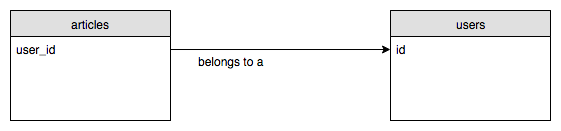
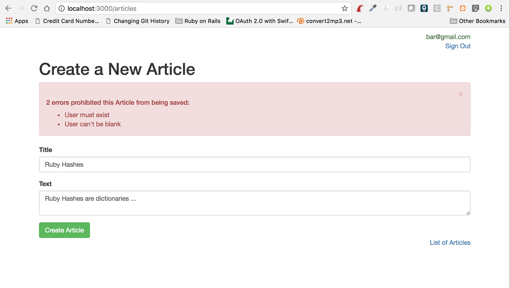
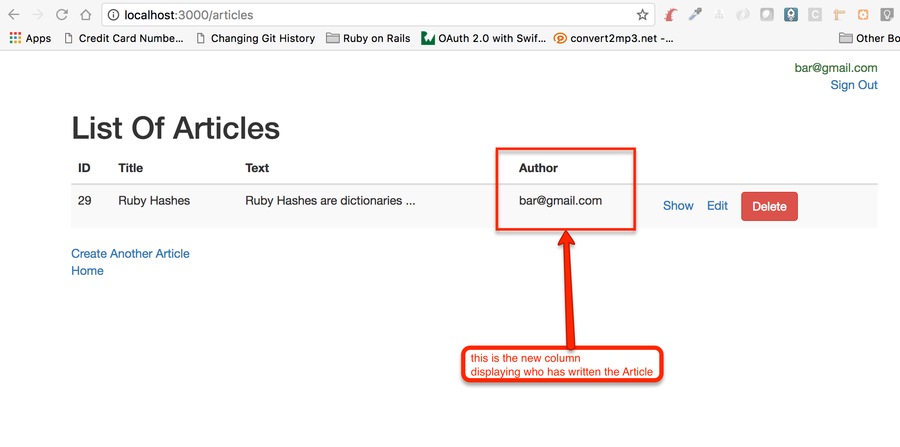
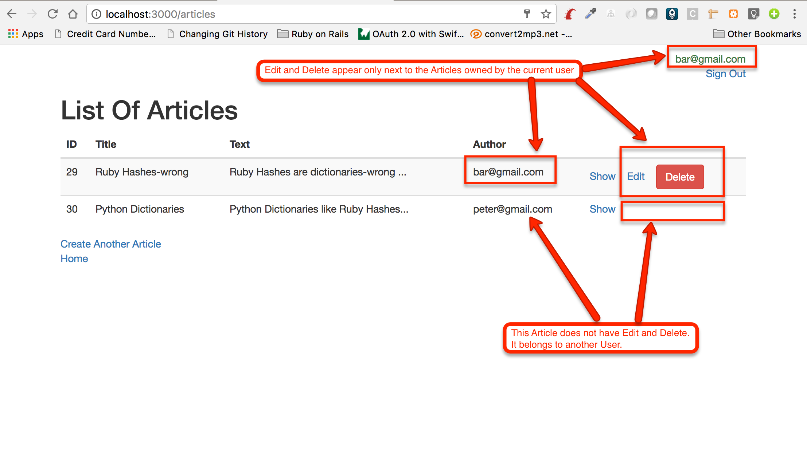

Currently, our users can sign up and sign in. Sign in means that the Web application knows who is the *current user*.

All of our users have the same privileges, which might be a problem. For example, currently, the user that has created the
Article "Ruby Hashes", for example, can see their Article being deleted by another user that might sign in. In other
words, a user has CUD (Create, Update, Delete) access to other user's Articles.

What we really need here is to make sure that an Article can only be CUDed only by the user that has created the Article.
In other words, what we want is what is generally called *Authorization*. You may have access to a Web application, but
you may not have the right to do anything. Only specific actions on specific resources.

## ./images/Binding Articles To Users

In order to protect an Article from being edited by a User that has not created the particular Article, we will need to
make sure that we know who is the actual User that has created the particular Article.

We need something like this:



In other words, we need a column in `articles` table that is going to be pointing to the owning `users` table row. It's
going to be a foreign key and we will call it `user_id`.

> **Important:** The existing articles in our database is a _problem_ because we don't know who they belong to. So,
we will not be able to map them to a User. For that reason, we will delete them. This is not an issue for us, since
our blog application is still under development.

### Schema Migration

In order to change the table `articles` we will need to write a new schema migration:

``` bash
blog $ bin/rails generate migration add_user_id_to_articles
      invoke  active_record
      create    db/migrate/20170618060653_add_user_id_to_articles.rb
blog $
```

Then let's edit the schema migration file to be as follows:

``` ruby
 1. # File: db/migrate/20170618060653_add_user_id_to_articles.rb
 2. #
 3. class AddUserIdToArticles < ActiveRecord::Migration[5.1]
 4.   def change
 5.     # delete all Articles first
 6.     say_with_time('Deleting all articles') do
 7.       Article.destroy_all
 8.     end
 9. 
10.     add_column :articles, :user_id, :bigint, null: false
11.     add_foreign_key(:articles, :users)
12.   end
13. end
```

Lines 6 to 8, they are there to delete the existing Articles. The `say_with_time` statement allows us to execute an
`ActiveRecord::Migration`, the one given inside the block to this call, and displaying a descriptive informative message
at the same time. Also, it calculates and prints the time that it is needed to execute the block of code.

The main migration statements are the ones in lines 10 and 11. The `add_column` adds the `user_id` column and the `add_foreign_key` turns the `user_id` to a foreign key.

Let's run the migration:

``` bash
blog $ bin/rake db:migrate
== 20170618060653 AddUserIdToArticles: migrating ==============================
-- Deleting all articles
   -> 0.0157s
-- add_column(:articles, :user_id, :bigint, {:null=>false})
   -> 0.0021s
-- add_foreign_key(:articles, :users)
   -> 0.0031s
== 20170618060653 AddUserIdToArticles: migrated (0.0210s) =====================

blog $
```

Migration ran successfully! If you start a `psql` session and inspect the structure of the `articles` table, you will see this:

``` sql
blog $ psql
psql (9.4.4)
Type "help" for help.

panayotismatsinopoulos=# \connect blog_development
You are now connected to database "blog_development" as user "panayotismatsinopoulos".
blog_development=# \d+ articles
                                                         Table "public.articles"
   Column   |            Type             |                       Modifiers                       | Storage  | Stats target | Description 
------------+-----------------------------+-------------------------------------------------------+----------+--------------+-------------
 id         | bigint                      | not null default nextval('articles_id_seq'::regclass) | plain    |              | 
 title      | character varying           | not null                                              | extended |              | 
 text       | character varying           | not null                                              | extended |              | 
 created_at | timestamp without time zone | not null                                              | plain    |              | 
 updated_at | timestamp without time zone | not null                                              | plain    |              | 
 user_id    | bigint                      | not null                                              | plain    |              | 
Indexes:
    "articles_pkey" PRIMARY KEY, btree (id)
Foreign-key constraints:
    "fk_rails_3d31dad1cc" FOREIGN KEY (user_id) REFERENCES users(id)

blog_development=# 
```

As you can see, the column `user_id` has been added and a new `Foreign-key constraint` has been created. 

However, I can see two problems here. One minor and one major. 

Minor problem: The name of the foreign key constraint is `fk_rails_3d31dad1cc` which is not very descriptive. If this constraint fails
and we see an error raised by this, we will not be able to quickly identify which columns are involved in this constraint. We would
have liked something more like the following: `articles_user_id_to_users_id_fk`.
 
Major problem: There isn't index on the `user_id` column. Hence, when we will be looking for articles of a particular user,
then query will be slow doing full scan on the table `articles` to locate the correct rows. 

> **Important:** Some RDBMSes create an index for each foreign key that you create. This is what MySQL does for example.

How can we fix these two issues? We have two options:

1. Create a new schema migration that would rename the foreign key and also add the index OR
2. To *rollback* this schema migration, correct the content of the migration to include the correct name for foreign key
and the index creation and then run the migration again.

### Rolling Back Latest Schema Migration

We will go with the 2nd option for tutorial reasons. We want to show you how you can rollback the latest schema migration.

For a schema migration to be rolled back, we need to let `ActiveRecord::Migration` know what are the actions that need
to take place in order for the things that migration has done to be undone.

Usually, `ActiveRecord::Migration` can tell it automatically from what is inside the `change` method. So, if inside the
`change` method we have an `add_column` statement to create a column, `ActiveRecord::Migration` knows that rolling back can
be achieved with a call to `remove_column`. Or the `add_foreign_key` can be rolled back with a corresponding `remove_foreign_key` 
command.

Our `change` implementation for the addition of `user_id` to `Articles`, includes 

1. the deletion of the existing articles.
2. the `add_column` statement to add the new column.
3. the `add_foreign_key` statement to add the foreign key constraint.

`ActiveRecord::Migration` can automatically derive the roll back actions for all these things except for the first one. It cannot
know how to undo the deletion of the articles.

Let's put this statement of the `change` command into comments for the time being:

``` ruby
 1. # File: db/migrate/20170618060653_add_user_id_to_articles.rb
 2. #
 3. class AddUserIdToArticles < ActiveRecord::Migration[5.1]
 4.   def change
 5.     # delete all Articles first
 6.     # say_with_time('Deleting all articles') do
 7.     #   Article.destroy_all
 8.     # end
 9. 
10.     add_column :articles, :user_id, :bigint, null: false
11.     add_foreign_key(:articles, :users)
12.   end
13. end
```

Now the `change` method contains actions that `ActiveRecord::Migration` knows how to roll back. Having said that, we
can ask a roll back:

``` bash
blog $ bin/rake db:rollback
== 20170618060653 AddUserIdToArticles: reverting ==============================
-- remove_foreign_key(:articles, :users)
   -> 0.0126s
-- remove_column(:articles, :user_id, :bigint, {:null=>false})
   -> 0.0011s
== 20170618060653 AddUserIdToArticles: reverted (0.0198s) =====================

blog $
```

The rollback takes place by `ActiveRecord::Migration`, by applying the reverse action of the actions included in the `change` method.
Also, note that these reverse actions are executed in the opposite order that they were defined inside the `change` method. 
First the removal of the foreign key, and then the removal of the column.

If you don't want to rely on `ActiveRecord::Migration` to derive the roll back actions from the `change` statements, you can,
instead, explicitly tell `ActiveRecord::Migration` which statements should be used for `migrate` and which statements should be
used for `rollback`. 

Here it is how:

``` ruby
 1. # File: db/migrate/20170618060653_add_user_id_to_articles.rb
 2. #
 3. class AddUserIdToArticles < ActiveRecord::Migration[5.1]
 4.   def up
 5.     # delete all Articles first
 6.     say_with_time('Deleting all articles') do
 7.       Article.destroy_all
 8.     end
 9. 
10.     add_column :articles, :user_id, :bigint, null: false
11.     add_foreign_key(:articles, :users)
12.   end
13.   
14.   def down
15.     remove_foreign_key(:articles, :users)
16.     remove_column :articles, :user_id
17.   end
18. end
```

Instead of having a `change` method, we have an `up` method that corresponds to the `migrate` actions and a `down` method
which corresponds to the `rollback` actions. 

Having done that, we can now tell `ActiveRecord::Migration` that, when we `rollback`, we don't care about reintroducing the Articles deleted on the `migrate` 
direction.

With the above version of our `AddUserIdToArticles` migration, let's run the migration again:

``` bash
blog $ bin/rake db:migrate
== 20170618060653 AddUserIdToArticles: migrating ==============================
-- Deleting all articles
   -> 0.0066s
-- add_column(:articles, :user_id, :bigint, {:null=>false})
   -> 0.0023s
-- add_foreign_key(:articles, :users)
   -> 0.0037s
== 20170618060653 AddUserIdToArticles: migrated (0.0128s) =====================

blog $
```

And then let's roll it back:

``` bash
blog $ bin/rake db:rollback
== 20170618060653 AddUserIdToArticles: reverting ==============================
-- remove_foreign_key(:articles, :users)
   -> 0.0060s
-- remove_column(:articles, :user_id)
   -> 0.0003s
== 20170618060653 AddUserIdToArticles: reverted (0.0065s) =====================

blog $
```

You can clearly see which actions are being executed in the forward/up direction and which actions are being executed in the backward/down direction.

### Foreign Key Name and Index

Let's now change the content of the file with the schema migration so that it creates the foreign key with the name that we want and 
that it also creates an index on the `user_id` on the `articles` table:

``` ruby
 1. # File: db/migrate/20170618060653_add_user_id_to_articles.rb
 2. #
 3. class AddUserIdToArticles < ActiveRecord::Migration[5.1]
 4.   def up
 5.     # delete all Articles first
 6.     say_with_time('Deleting all articles') do
 7.       Article.destroy_all
 8.     end
 9. 
10.     add_column :articles, :user_id, :bigint, null: false
11.     add_foreign_key(:articles, :users, name: 'articles_user_id_users_id_fk')
12.     add_index :articles, [:user_id], name: 'articles_user_id_idx'
13.   end
14. 
15.   def down
16.     remove_index :articles, name: 'articles_user_id_idx'
17.     remove_foreign_key(:articles, name: 'articles_user_id_users_id_fk')
18.     remove_column :articles, :user_id
19.   end
20. end
```

You can see lines 11 and 12. We specify the name of the foreign key constraint and we have a statement to add the index. See also how we have 
adapted the rollback/down statements accordingly.

Let's run the migration:

``` bash
blog $ bin/rake db:migrate
== 20170618060653 AddUserIdToArticles: migrating ==============================
-- Deleting all articles
   -> 0.0088s
-- add_column(:articles, :user_id, :bigint, {:null=>false})
   -> 0.0026s
-- add_foreign_key(:articles, :users, {:name=>"articles_user_id_users_id_fk"})
   -> 0.0042s
-- add_index(:articles, [:user_id], {:name=>"articles_user_id_idx"})
   -> 0.0036s
== 20170618060653 AddUserIdToArticles: migrated (0.0194s) =====================

blog $
```

The migrations ran successfully. Let's inspect the structure of the table `articles` using `psql`:

``` sql
blog $ psql
psql (9.4.4)
Type "help" for help.

panayotismatsinopoulos=# \connect blog_development
You are now connected to database "blog_development" as user "panayotismatsinopoulos".
blog_development=# \d+ articles
                                                         Table "public.articles"
   Column   |            Type             |                       Modifiers                       | Storage  | Stats target | Description 
------------+-----------------------------+-------------------------------------------------------+----------+--------------+-------------
 id         | bigint                      | not null default nextval('articles_id_seq'::regclass) | plain    |              | 
 title      | character varying           | not null                                              | extended |              | 
 text       | character varying           | not null                                              | extended |              | 
 created_at | timestamp without time zone | not null                                              | plain    |              | 
 updated_at | timestamp without time zone | not null                                              | plain    |              | 
 user_id    | bigint                      | not null                                              | plain    |              | 
Indexes:
    "articles_pkey" PRIMARY KEY, btree (id)
    "articles_user_id_idx" btree (user_id)
Foreign-key constraints:
    "articles_user_id_users_id_fk" FOREIGN KEY (user_id) REFERENCES users(id)

blog_development=# 
```

You can see now the name of the foreign key constraint, as well as the index that has been created on the column `user_id`.

### Add Reference Does It All

Let's now rollback again:

``` bash
blog $ bin/rake db:rollback
== 20170618060653 AddUserIdToArticles: reverting ==============================
-- remove_index(:articles, {:name=>"articles_user_id_idx"})
   -> 0.0012s
-- remove_foreign_key(:articles, {:name=>"articles_user_id_users_id_fk"})
   -> 0.0068s
-- remove_column(:articles, :user_id)
   -> 0.0005s
== 20170618060653 AddUserIdToArticles: reverted (0.0086s) =====================

blog $
```

Now that we have understood what it takes to create a proper reference from `articles` table to `users` table, with the
three schema migration commands, we will tell you that Rails `ActiveRecord::Migration` allows you to do that
with one command, i.e. one command to carry out all the three commands at once.

Change your schema migration file as follows:

``` ruby
 1. # File: db/migrate/20170618060653_add_user_id_to_articles.rb
 2. #
 3. class AddUserIdToArticles < ActiveRecord::Migration[5.1]
 4.   def up
 5.     # delete all Articles first
 6.     say_with_time('Deleting all articles') do
 7.       Article.destroy_all
 8.     end
 9. 
10.     add_reference :articles, :user, foreign_key: {name: 'articles_user_id_users_id_fk'}, index: {name: 'articles_user_id_idx'}
11.   end
12. 
13.   def down
14.     remove_reference :articles, :user, foreign_key: {name: 'articles_user_id_users_id_fk'}, index: {name: 'articles_user_id_idx'}
15.   end
16. end
```

We now use the `add_reference` command that allows you to specify the foreign key name and the index to be created. And on the `down` version
we just call `remove_reference` instead.

Run the schema migration:

``` bash
blog $ bin/rake db:migrate
== 20170618060653 AddUserIdToArticles: migrating ==============================
-- Deleting all articles
   -> 0.0130s
-- add_reference(:articles, :user, {:foreign_key=>{:name=>"articles_user_id_users_id_fk"}, :index=>{:name=>"articles_user_id_idx"}})
   -> 0.0183s
== 20170618060653 AddUserIdToArticles: migrated (0.0315s) =====================

blog $
```

And then inspect the structure of the table `articles` using `psql`:

``` sql
                                                         Table "public.articles"
   Column   |            Type             |                       Modifiers                       | Storage  | Stats target | Description 
------------+-----------------------------+-------------------------------------------------------+----------+--------------+-------------
 id         | bigint                      | not null default nextval('articles_id_seq'::regclass) | plain    |              | 
 title      | character varying           | not null                                              | extended |              | 
 text       | character varying           | not null                                              | extended |              | 
 created_at | timestamp without time zone | not null                                              | plain    |              | 
 updated_at | timestamp without time zone | not null                                              | plain    |              | 
 user_id    | bigint                      |                                                       | plain    |              | 
Indexes:
    "articles_pkey" PRIMARY KEY, btree (id)
    "articles_user_id_idx" btree (user_id)
Foreign-key constraints:
    "articles_user_id_users_id_fk" FOREIGN KEY (user_id) REFERENCES users(id)

```

You can see that the `user_id` has been created. Also, the `articles_user_id_idx` index on column `user_id` and the foreign key constraint
with the name that we like.

Pretty cool! Isn't it?

### Avoid Repetition in Migration

Finally, we can see that line 10 is similar to line 14, except from the fact that we call different `ActiveRecord::Migration` statement.
This statement, the `add_reference` is reversible and `ActiveRecord::Migration` knows how to roll it back. Let's take advantage of it.

First, roll back again.

``` bash
blog $ bin/rake db:rollback
== 20170618060653 AddUserIdToArticles: reverting ==============================
-- remove_reference(:articles, :user, {:foreign_key=>{:name=>"articles_user_id_users_id_fk"}, :index=>{:name=>"articles_user_id_idx"}})
   -> 0.0189s
== 20170618060653 AddUserIdToArticles: reverted (0.0409s) =====================

blog $
```

Also, inspect with `psql`. You will see that everything has been rolled back as expected:

``` sql
blog_development=# \d+ articles
                                                         Table "public.articles"
   Column   |            Type             |                       Modifiers                       | Storage  | Stats target | Description 
------------+-----------------------------+-------------------------------------------------------+----------+--------------+-------------
 id         | bigint                      | not null default nextval('articles_id_seq'::regclass) | plain    |              | 
 title      | character varying           | not null                                              | extended |              | 
 text       | character varying           | not null                                              | extended |              | 
 created_at | timestamp without time zone | not null                                              | plain    |              | 
 updated_at | timestamp without time zone | not null                                              | plain    |              | 
Indexes:
    "articles_pkey" PRIMARY KEY, btree (id)

```

Now, update the content of the migration file as follows:

``` ruby
 1. # File: db/migrate/20170618060653_add_user_id_to_articles.rb
 2. #
 3. class AddUserIdToArticles < ActiveRecord::Migration[5.1]
 4.   def change
 5.     reversible do |dir|
 6.       dir.up do
 7.         # delete all Articles first
 8.         say_with_time('Deleting all articles') do
 9.           Article.destroy_all
10.         end
11.       end
12.     end
13. 
14.     add_reference :articles, :user, foreign_key: {name: 'articles_user_id_users_id_fk'}, index: {name: 'articles_user_id_idx'}
15.   end
16. end
```

Now we only use `change` instead of both `up` and `down`. And we put the deletion of Articles inside a `dir.up` block which is also
inside a `reversible do` block. The idea here is that whatever is not possible for `ActiveRecord::Migration` to derive a roll back
statement for, we put it in `reversible do` and we tell explicitly which statements will be executed in the `up` direction and
which will be executed in the `down` direction. In our example, we said that the deletion of the Articles will take place only
in the `up` direction. We didn't give anything for the `down` direction (there is no `dir.down` block). On the other hand,
we leave outside the `reversible` block whatever `ActiveRecord::Migration` can derive a roll back statement for.

Now do the migration:

``` bash
blog $ bin/rake db:migrate
== 20170618060653 AddUserIdToArticles: migrating ==============================
-- Deleting all articles
   -> 0.0063s
-- add_reference(:articles, :user, {:foreign_key=>{:name=>"articles_user_id_users_id_fk"}, :index=>{:name=>"articles_user_id_idx"}})
   -> 0.0089s
== 20170618060653 AddUserIdToArticles: migrated (0.0153s) =====================

blog $
```

And then do the rollback:

``` bash
blog $ bin/rake db:rollback
== 20170618060653 AddUserIdToArticles: reverting ==============================
-- remove_reference(:articles, :user, {:foreign_key=>{:name=>"articles_user_id_users_id_fk"}, :index=>{:name=>"articles_user_id_idx"}})
   -> 0.0067s
== 20170618060653 AddUserIdToArticles: reverted (0.0108s) =====================

blog $
``` 

This confirms that we have written our migration correctly.

Before we leave this paragraph, let's run the migration again so that we have the `user_id` in `articles` table:

``` bash
blog $ bin/rake db:migrate
== 20170618060653 AddUserIdToArticles: migrating ==============================
-- Deleting all articles
   -> 0.0171s
-- add_reference(:articles, :user, {:foreign_key=>{:name=>"articles_user_id_users_id_fk"}, :index=>{:name=>"articles_user_id_idx"}})
   -> 0.0238s
== 20170618060653 AddUserIdToArticles: migrated (0.0413s) =====================

blog $
```

### Updating `Article` and `User` Models

We have prepared our database to store, inside `articles` table, the reference to the `users` row that creates an `Article`. But this
is not enough. We need to enhance our `Article` and `User` models to have some application-level rules.

#### `Article`

Let's start from the `Article` model. This is the new version of it:

``` ruby
1. # File: app/models/article.rb
2. #
3. class Article < ApplicationRecord
4.   belongs_to :user
5. 
6.   validates :user, presence: true
7.   validates :title, presence: true
8.   validates :text, presence: true
9. end
```

We have added line 4. This is to tell Rails that an `Article` belongs to a `User`. We use the `belongs_to` on the model that owns
the foreign key. Now that we have added this declaration here, we can write code like this:

``` ruby
article = Article.first
puts "Article #{article.id} has been created by user #{article.user.email}"
```

The `article.user` is a method that is defined behind the scenes thanks to the `belongs_to :user` declaration. It retrieves the User
instance that corresponds to the `user_id` stored in the particular `Article`.

On line 6, we have added the validation that makes sure that an Article belongs to a user. In other words, we will not be
able to create a valid `Article` unless we specify the `User` instance the article belongs to.

#### `User`

But, we may also want to easily find the Articles of a User. Wouldn't be useful if we were able to do something like this?

``` ruby
user = User.first
user.articles
```

The `user.article` would bring the Articles that belong to the particular User that we have in the variable `user`.

Let's enhance our `User` model in order to support this:

``` ruby
 1. # File app/models/user.rb
 2. #
 3. class User < ApplicationRecord
 4.   has_many :articles
 5. 
 6.   has_secure_password
 7. 
 8.   validates :email, presence: true, uniqueness: { case_sensitive: false }
 9. 
10.   before_create :generate_email_confirmation_token
11. 
12.   def email_confirmed?
13.     !email_confirmation_token.present?
14.   end
15. 
16.   def confirm_email_address
17.     self.email_confirmation_token = nil
18.     save
19.   end
20. 
21.   def can_write_article?(article)
22.     article.user.id == id
23.   end
24. 
25.   private
26. 
27.   def generate_email_confirmation_token
28.     self.email_confirmation_token = SecureRandom.urlsafe_base64
29.   end
30. end
```

The amendment here is only the line 4, `has_many :articles`. This gives you the ability to fetch the Articles of a User
when you have the User reference. Like in the following Rails console session:

``` ruby
2.3.3 :001 > user = User.find_by_email('bar@gmail.com')
  User Load (0.5ms)  SELECT  "users".* FROM "users" WHERE "users"."email" = $1 LIMIT $2  [["email", "bar@gmail.com"], ["LIMIT", 1]]
 => #<User id: 9, email: "bar@gmail.com", password_digest: "$2a$10$g/4AILw8UXB1s8G01M8P1efgzs0iZfNfw.BxdHW2HNI...", created_at: "2017-06-04 13:51:46", updated_at: "2017-06-11 14:49:49", email_confirmation_token: nil> 
2.3.3 :002 > user.articles.each do |article|
2.3.3 :003 >     puts article.title
2.3.3 :004?>   end
  Article Load (0.4ms)  SELECT "articles".* FROM "articles" WHERE "articles"."user_id" = $1  [["user_id", 9]]
Ruby Hashes-wrong
 => [#<Article id: 29, title: "Ruby Hashes-wrong", text: "Ruby Hashes are dictionaries-wrong ...", created_at: "2017-06-18 10:01:27", updated_at: "2017-06-18 10:16:07", user_id: 9>] 
2.3.3 :005 > 
```

As you can see, in the command `002`, we start an iteration of the Articles of the User stored in `user`. We do that with 
the help of the `articles` method, which is created, behind the scenes, thanks to the `has_many :articles` statement in the `User` model.

## Updating the Controller

With the current status of our code, make sure you restart your Rails server and try to create a new `Article`. You will get
an error like this:



These errors are expected because the form that creates an Article does not provide for the User to bind the Article to. Actually,
the problem is not on the form. We will not allow the person that creates the Article to select the User of the Article. The User of the Article being created
should be put automatically to be the currently longed in User. Hence, the change needs to take place at the `ArticlesController` side. The action 
`ArticlesController#create` should create an `Article` bound to the currently signed in user. This is the new version of the
`ArticlesController#create` action:

``` ruby
...
  def create
    article = Article.new(article_params.merge({user: current_user}))
    if article.save
      flash[:success] = 'Article has been created!'
      redirect_to edit_article_url(article)
    else
      @article = article
      render :new
    end
  end
...
```

The only difference is on line that instantiates the `Article`. We merge the `article_params` `Hash` with the `Hash` `{user: current_user}`. Hence,
the currently signed in user is set as the user for the newly created `Article`.

If you try to create an article now, it will be created without problem and the `Article` will be bound to the currently signed in user.

## Displaying Owner Next To Each Article Entry

Before we continue with further authorization cases, we will first amend the `app/views/articles/index.html.haml`
file so that it displays the owner of the Articles listed.

Here is the new version of the `app/views/articles/index.html.haml` file:

``` haml
 1. - # File: app/views/articles/index.html.haml
 2. - #
 3. %h1 List Of Articles
 4. %table.table.table-striped
 5.   %thead
 6.     %tr
 7.       %th ID
 8.       %th Title
 9.       %th Text
10.       %th Author
11.       %th
12.   %tbody
13.     - @articles.each do |article|
14.       %tr
15.         %td= article.id
16.         %td= article.title
17.         %td= article.text
18.         %td= article.user.email
19.         %td
20.           = link_to 'Show', article_path(article)
21.           &nbsp;&nbsp;
22.           = link_to 'Edit', edit_article_path(article) if current_user
23.           &nbsp;&nbsp;
24.           = link_to 'Delete', article_path(article), method: :delete, class: 'btn btn-danger', data: {confirm: 'Are you sure that you want to delete this Article?'} if current_user
25. - if current_user
26.   %div
27.     = link_to 'Create Another Article', new_article_path
28. %div
29.   = link_to 'Home', root_path
```

On line 10 we have added the header of the new column, this being `Author`. And on line 18, we have added the value of the email of the author of the article.

Here is an example output of the page List of Articles:



## Editing/Updating an Article

Currently, the update method allows a User X to update the `Article` created by the `User` Y. This is because the `update` action on `ArticlesController`
does not take into account who is the currently signed in User vs the owner of the `Article` being updated.

The following video demonstrates the problem.

<div id="media-container-video-User Peter Updates Article of User Bar">
  <a href="https://player.vimeo.com/video/222071047"></a>
</div>

The problem that you see above applies to all three actions of `ArticlesController` that have to do with CUD on `Article` resource:

1. `edit`
1. `update`
1. `destroy`

For these actions we will hook a before action filter that would ask the User to be authorized. Here is the new version of our `ArticlesController`:

``` ruby
 1. # File: app/controllers/articles_controller.rb
 2. #
 3. class ArticlesController < ApplicationController
 4.   skip_before_action :authenticate_user, only: [:index, :show]
 5.   before_action :find_article, only: [:show, :edit, :update, :destroy]
 6.   before_action :authorize_user, except: [:new, :create, :index, :show]
 7. 
 8.   def new
 9.     @article = Article.new
10.   end
11. 
12.   def create
13.     article = Article.new(article_params.merge({user: current_user}))
14.     if article.save
15.       flash[:success] = 'Article has been created!'
16.       redirect_to edit_article_url(article)
17.     else
18.       @article = article
19.       render :new
20.     end
21.   end
22. 
23.   def index
24.     @articles = Article.all
25.   end
26. 
27.   def update
28.     if @article.update(article_params)
29.       flash[:success] = 'Article has been updated!'
30.       redirect_to edit_article_path(@article)
31.     else
32.       render :edit
33.     end
34.   end
35. 
36.   def destroy
37.     @article.destroy
38.     flash[:success] = 'Article has been destroyed!'
39.     redirect_to articles_path
40.   end
41. 
42.   private
43. 
44.   def article_params
45.     params.require(:article).permit(:title, :text)
46.   end
47. 
48.   def find_article
49.     @article = Article.find(params[:id])
50.   end
51. 
52.   def authorize_user
53.     unless @article.user_id == current_user.id
54.       flash[:warning] = 'Your are not allowed to act on this Article!'
55.       redirect_to root_url
56.     end
57.   end
58. end
```

We have added the private method `authorize_user` and we have also added the `before_action` filter that calls this
authorization method for all actions except the `:new`, `:create`, `:index` and `:show`. The `authorize_user` implementation
is very simple. As long as the `@article` being updated or deleted has owner/author being equal to the currently logged
in user, everything proceeds as before. Otherwise, we break the request processing loop by redirecting back to root page
of the application with the appropriate message flashing as warning.

With the above implementation at hand, when user `Peter` tries to edit the article of the user `Bar`, he will get the warning
and will not be able to access the edit page.

<div id="media-container-video-User Peter Updates Article of User Bar">
  <a href="https://player.vimeo.com/video/222072207"></a>
</div>

## Hide Edit Link For Other User's Articles

We have managed to protect the actions from being called by unauthorized users. Then, what we can do on top of that is to
hide the links that are not applicable based on the authorizations the current user has.

### Hide Links In List Of Articles

In the list of Articles, we have the `Edit` link and the `Delete` button that need to be hidden if the currently signed in user
does not own the corresponding Article. Let's change the `app/views/articles/index.html.haml` accordingly:

``` haml
 1. - # File: app/views/articles/index.html.haml
 2. - #
 3. %h1 List Of Articles
 4. %table.table.table-striped
 5.   %thead
 6.     %tr
 7.       %th ID
 8.       %th Title
 9.       %th Text
10.       %th Author
11.       %th
12.   %tbody
13.     - @articles.each do |article|
14.       %tr
15.         %td= article.id
16.         %td= article.title
17.         %td= article.text
18.         %td= article.user.email
19.         %td
20.           = link_to 'Show', article_path(article)
21.           &nbsp;&nbsp;
22.           = link_to 'Edit', edit_article_path(article) if current_user && current_user.can_edit_article?(article)
23.           &nbsp;&nbsp;
24.           = link_to 'Delete', article_path(article), method: :delete, class: 'btn btn-danger', data: {confirm: 'Are you sure that you want to delete this Article?'} if current_user && current_user.can_delete_article?(article)
25. - if current_user
26.   %div
27.     = link_to 'Create Another Article', new_article_path
28. %div
29.   = link_to 'Home', root_path
```

You can see lines 22 and 24. These are the lines that we did a change on. We have added the `current_user.can_edit_article?(article)` 
and the `current_user.can_delete_article?(article)` respectively.

According to this, the `User` model needs to respond to these two `can_....` questions. Let's see how we could implement this. Here is
the `User` model updated.


``` ruby
 1. # File app/models/user.rb
 2. #
 3. class User < ApplicationRecord
 4.   validates :email, presence: true, uniqueness: { case_sensitive: false }
 5.   has_secure_password
 6. 
 7.   before_create :generate_email_confirmation_token
 8. 
 9.   def email_confirmed?
10.     !email_confirmation_token.present?
11.   end
12. 
13.   def confirm_email_address
14.     self.email_confirmation_token = nil
15.     save
16.   end
17.   
18.   def can_edit_article?(article)
19.     article.user.id == id
20.   end
21.   
22.   def can_delete_article?(article)
23.     article.user.id == id
24.   end
25. 
26.   private
27. 
28.   def generate_email_confirmation_token
29.     self.email_confirmation_token = SecureRandom.urlsafe_base64
30.   end
31. end
```

Cool! Now, try to load the List of Articles page. You will see something like this:



We can hide the links on the Article show view too (`app/views/articles/show.html.haml`):

This is the new version of this file that hides the links that are not applicable:

``` haml
 1. - # File: app/views/articles/show.html.haml
 2. - #
 3. %div
 4.   %strong ID:
 5.   = @article.id
 6. %div
 7.   %strong Title:
 8.   = @article.title
 9. %hr/
10. %div
11.   %strong Text:
12. %div
13.   = @article.text
14. - if current_user && current_user.can_edit_article?(@article)
15.   %div
16.     = link_to 'Edit Article', edit_article_path(@article)
17. - if current_user
18.   %div
19.     = link_to 'Create New Article', new_article_path
20. %div
21.   = link_to 'List of Articles', articles_path
22. %div
23.   = link_to 'Home', root_path
```

Look at line 14. You can see that we have added an extra condition for the `Edit` link to appear. The `current_user` needs to be able to
edit the Article at hand.

## Drying Out Code

We have implemented authorization for the Articles management, but we have, unfortunately, spread the logic of whether a user can
update an Article or not. See the `user.rb` model and the `authorize_user` method inside the `ArticlesController`. We encounter,  many times, the
condition that the Article `user.id` needs to be the same like the `id` of the current user.

First, we need to understand that we want to know who can edit/update/delete an Article and who can only view it. Hence, we can
have two privileges:

1. write
2. read-only

In (1), write, privilege, the user can edit/update/delete an Article. In (2), read-only, a user can only view an Article.

Having said that, then `User` model can, now, rely only on the  method `can_write_article?`. This is the new version of it:

``` ruby
 1. # File app/models/user.rb
 2. #
 3. class User < ApplicationRecord
 4.   validates :email, presence: true, uniqueness: { case_sensitive: false }
 5.   has_secure_password
 6. 
 7.   before_create :generate_email_confirmation_token
 8. 
 9.   def email_confirmed?
10.     !email_confirmation_token.present?
11.   end
12. 
13.   def confirm_email_address
14.     self.email_confirmation_token = nil
15.     save
16.   end
17. 
18.   def can_write_article?(article)
19.     article.user.id == id
20.   end
21. 
22.   private
23. 
24.   def generate_email_confirmation_token
25.     self.email_confirmation_token = SecureRandom.urlsafe_base64
26.   end
27. end
```

The methods `can_edit_article?` and `can_delete_article?` are no longer needed.

We will use this `can_write_article?()` method both in the `ArticlesController` and in the views.

Here is the `def authorize_user` method of the `ArticlesController`:

``` ruby
  def authorize_user
    unless current_user.can_write_article?(@article)
      flash[:warning] = 'Your are not allowed to act on this Article!'
      redirect_to root_url
    end
  end
```

You can see how we now use the `current_user.can_write_article?(@article)`. 

Let's change also the way we hide the Edit and Delete actions in `app/views/articles/index.html.haml` file:

``` haml
 1. - # File: app/views/articles/index.html.haml
 2. - #
 3. %h1 List Of Articles
 4. %table.table.table-striped
 5.   %thead
 6.     %tr
 7.       %th ID
 8.       %th Title
 9.       %th Text
10.       %th Author
11.       %th
12.   %tbody
13.     - @articles.each do |article|
14.       %tr
15.         %td= article.id
16.         %td= article.title
17.         %td= article.text
18.         %td= article.user.email
19.         %td
20.           = link_to 'Show', article_path(article)
21.           - if current_user && current_user.can_write_article?(article)
22.             &nbsp;&nbsp;
23.             = link_to 'Edit', edit_article_path(article)
24.             &nbsp;&nbsp;
25.             = link_to 'Delete', article_path(article), method: :delete, class: 'btn btn-danger', data: {confirm: 'Are you sure that you want to delete this Article?'}
26. - if current_user
27.   %div
28.     = link_to 'Create Another Article', new_article_path
29. %div
30.   = link_to 'Home', root_path
```

Look on lines 21 till 25. We now put the links inside the block that makes sure that we have a signed in user and that the particular
user can write the article at hand.

Finally, do the appropriate change in the file `app/views/articles/show.html.haml`:

``` haml
 1. - # File: app/views/articles/show.html.haml
 2. - #
 3. %div
 4.   %strong ID:
 5.   = @article.id
 6. %div
 7.   %strong Title:
 8.   = @article.title
 9. %hr/
10. %div
11.   %strong Text:
12. %div
13.   = @article.text
14. - if current_user && current_user.can_write_article?(@article)
15.   %div
16.     = link_to 'Edit Article', edit_article_path(@article)
17. - if current_user
18.   %div
19.     = link_to 'Create New Article', new_article_path
20. %div
21.   = link_to 'List of Articles', articles_path
22. %div
23.   = link_to 'Home', root_path
```

## Other Authorization Gems

We have implemented authorization with our own Ruby code. However, you may want to rely on a publicly available gem
that is especially designed for that purpose. Such a gem is [cancancan](https://github.com/CanCanCommunity/cancancan), for example.
It is very popular and resource-based. Now that you have become familiar with what authorization is, you may want to
work with one of these libraries, that offer a lot of features and have many capabilities.

## Closing Note

We saw the authorization which is the code that checks whether a user is allowed to do specific things. Authentication and
authorization go hand-in-hand and as soon as you master these ideas you will be able to work with more advanced authentication
and authorization libraries like [devise](https://github.com/plataformatec/devise) and [cancancan](https://github.com/CanCanCommunity/cancancan).

