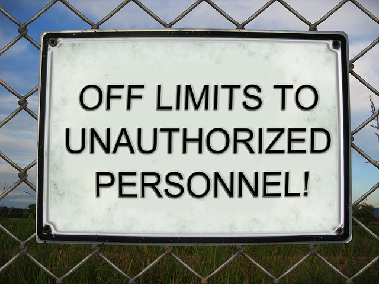

In this chapter, we proceed with the other aspect of security, the one that is called *Authorization*. Authorized users are
users that have access to the Web application but they are restricted to specific actions and areas of it, based on their
privileges. You will learn how to implement authorization in a Rails application protecting specific actions and pages
from unauthorized users.
