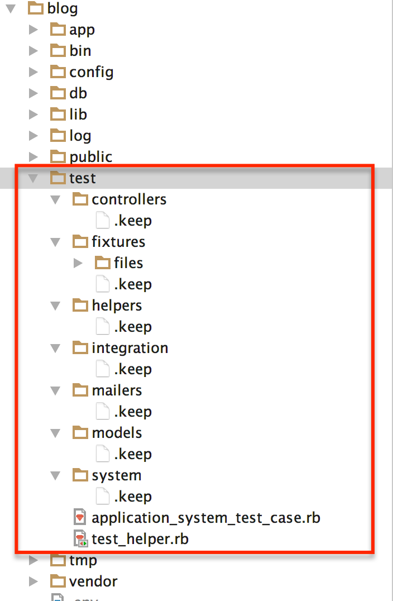
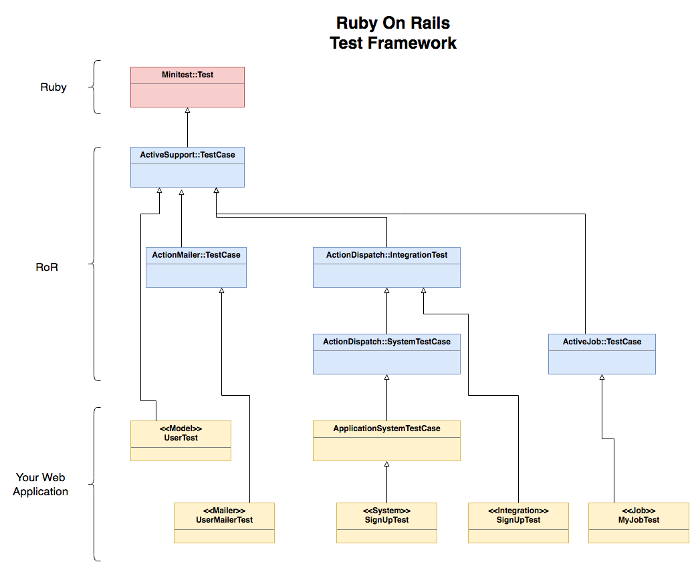
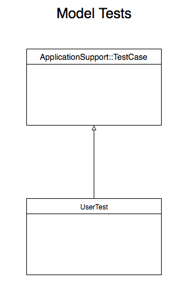
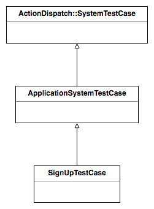
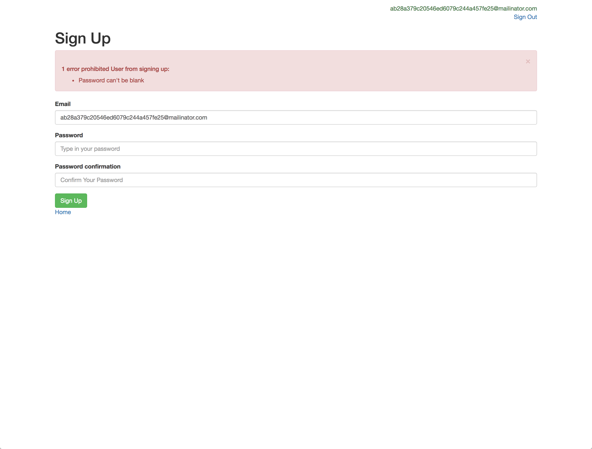
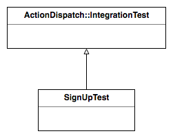
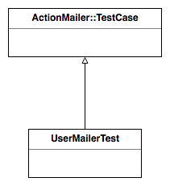

Rails comes with automated testing tools already in and it is its philosophy to cover your application features
with automated tests so that you can make sure you don't break your application every time you introduce a new feature.

## ./images/Test Folder Tree

When you create a new Rails application, one of the folders that it is created is the `test` folder. Here is a picture
of its tree:



Rails suggests folders for you to put / write your automated tests in. For example, for the Model tests, it suggests you to write them
inside the folder `models`.

We will write tests for each one of these folders in this chapter and you will understand better how they are supposed to be used.

## Test Environment

Before we proceed with the writing of some tests for our `blog` application, I would like to make sure that you understand the
idea of the *environment*. 

Every new Rails application comes with support for three different environments, by default.

1. `development`
2. `test`
3. `production`

The different environments have common configuration option values, which are specified inside the file `config/environment.rb`.
But, they also have environment-specific configuration option values, which are specified inside the file which is specific
per environment:

1. For `development` environment, the file is the `config/environments/development.rb`.
2. For `test` environment, the file is the `config/environments/test.rb`.
3. For `production` environment, the file is `config/environments/production.rb`.

For example, a notable difference between `development` and `test` environment is that in the `test` environment the emails
are not actually delivered/sent out to an SMTP server. The `delivery_method` is set to `:test`. Look for the `config.action_mailer.delivery_method = :test`
line inside your `config/environments/test.rb` file.

However, this is the point at which you need to specify the `default_url_options` for the `test` environment too. Otherwise, your
tests, that exercise mailing delivery too, might fail. So, go to your `config/environments/test.rb` and add the following:

```
config.action_mailer.default_url_options = {protocol: 'http', host: 'localhost:3000'}
```

### Starting Rails Console In Different Environments

When you start `rails console`, by default, it starts in `development` environment. This can be confirmed in the following ways
as depicted below (try that on your machine):

``` bash
blog $ bin/rails console
Loading development environment (Rails 5.1.1)
2.3.3 :001 > ENV['RAILS_ENV']
 => "development" 
2.3.3 :002 > Rails.env
 => "development" 
2.3.3 :003 > Rails.env.development?
 => true 
2.3.3 :004 > Rails.env.test?
 => false 
2.3.3 :005 > Rails.env.production?
 => false 
2.3.3 :006 > 
```

1. You can see that the `Loading .... ` statement at start mentions that the environment being loaded is the `development` one.
1. The environment variable `RAILS_ENV` is set to `development`.
1. The method `Rails.env` returns `development`.
1. The method `Rails.env.development?` returns `true`.
1. The method `Rails.env.test?` returns `false`.
1. The method `Rails.env.production?` returns `false`.

How can we start Rails console in another environment? One way you can do that is by setting the `RAILS_ENV` environment variable to have
the value of the environment you want Rails console to start in.

Exit the previous console and then start it again as follows:

``` bash
blog $ RAILS_ENV=test rails console
Loading test environment (Rails 5.1.1)
2.3.3 :001 > ENV['RAILS_ENV']
 => "test" 
2.3.3 :002 > Rails.env
 => "test" 
2.3.3 :003 > Rails.env.development?
 => false 
2.3.3 :004 > Rails.env.test?
 => true 
2.3.3 :005 > Rails.env.production?
 => false 
2.3.3 :006 > 
```

Another way you can start Rails console in another environment is to specify it as command line argument. Exit the rails console
that you are in and then start it again with:

``` bash
blog $ bin/rails console test
Loading test environment (Rails 5.1.1)
2.3.3 :001 > 
```

The `bin/rails console test` starts Rails console in `test` environment.

### Starting Rails Server In Different Environments

We know that Rails server can be started with `bin/rails server`. This, again, starts Rails server in `development` environment.
We can start the Rails server in another environment by first setting the `RAILS_ENV` environment variable:

``` bash
blog $ RAILS_ENV=test bin/rails server
=> Booting Puma
=> Rails 5.1.1 application starting in test on http://0.0.0.0:3000
=> Run `rails server -h` for more startup options
Puma starting in single mode...
* Version 3.8.2 (ruby 2.3.3-p222), codename: Sassy Salamander
* Min threads: 5, max threads: 5
* Environment: test
* Listening on tcp://0.0.0.0:3000
Use Ctrl-C to stop
```

Do you see the `Environment: test` being printed? This confirms that the Rails server has started in the environment specified
by the `RAILS_ENV` environment variable.

Stop your Rails server and then try to start it with the following command:

``` bash
blog $ bin/rails server --environment=test
=> Booting Puma
=> Rails 5.1.1 application starting in test on http://0.0.0.0:3000
=> Run `rails server -h` for more startup options
Puma starting in single mode...
* Version 3.8.2 (ruby 2.3.3-p222), codename: Sassy Salamander
* Min threads: 5, max threads: 5
* Environment: test
* Listening on tcp://0.0.0.0:3000
Use Ctrl-C to stop
```

The `bin/rails server --environment=test` is another way to start your Rails server in `test` environment.

### Production on Heroku

I guess that, by now, environments are pretty much clear to you. Final note here is that when you deploy your application to Heroku,
Heroku has `RAILS_ENV` set to `production` by default. Hence, your Web application will be initialized using this
environment, i.e. the `production` environment.

You can confirm that by running `heroku config --app panosm-blog | grep 'RAILS_ENV'` on your command line (replacing `panosm-blog` with the
name of your blog application):

``` bash
blog $ heroku config --app panosm-blog | grep 'RAILS_ENV'
RAILS_ENV:                production
blog $
```

### `rake` Tasks

Note that all the `rake` tasks run in `development` environment by default. If you want to run a rake task against another environment,
the suggested way is that you set the `RAILS_ENV` environment variable accordingly.

E.g. `RAILS_ENV=production rake db:migrate` would run migrations against the `production` environment.

### Test Database

Each environment has its own database. The access details for the `test` database are found inside the `config/database.yml` file, in the
`test` section. Having a different test database to run our tests against is very useful. We can do anything that we like without worrying
about destroying development or production data.

Note that when your tests start to run, the `test/test_helper.rb` file includes logic to load the file `db/schema.rb` and prepare your 
test database. More about this when we will talk about schema migrations.

## Ruby on Rails Test Framework Class Hierarchy

In the following paragraphs we will write tests for:

1. Models
1. Integration Tests
1. System Tests
1. Mailer Tests

All the tests should be written as classes that derive from specific superclasses depending on the above cases. The following diagram
will help you.



<table>
  <tr><th>Object of Test</th><th>Your Test Class Derives From</th></tr>
  <tr><td>Models</td><td><code>ActiveSupport::TestCase</code></td></tr>
  <tr><td>Integration Tests</td><td><code>ActionDispatch::IntegrationTest</code></td></tr>
  <tr><td>System Tests</td><td><code>ActionDispatch::SystemTestCase</code>or<br/>Even better <code>ApplicationSystemTestCase</code></td></tr>
  <tr><td>Mailer Tests</td><td><code>ActionMailer::TestCase</code></td></tr>
</table>

Note that in this chapter we will not talk about Jobs and how we test them. It is a subject of an upcoming chapter.

Also, note that there are a couple of other test-related classes that Rails comes with, but their usage is deprecated.

## Testing Models

Let's start by covering with tests one of our most important models, the `User`. 

You need to create a file named `user_test.rb` inside `test/models` folder. Start with something like this:

``` ruby
1. # File: test/models/user_test.rb
2. #
3. require 'test_helper'
4. 
5. class UserTest < ActiveSupport::TestCase
6.   test 'it should be true' do
7.     assert(true)
8.   end
9. end
```

All of our test files are going to require `test_helper`. Hence in `test_helper.rb` we will be defining things
that are necessary to be available to all of our test files.

The line 5 defines the class `UserTest` that derives from the `ActiveSupport::TestCase`. It will have at its
disposal all the methods that the `ActiveSupport::TestCase` class offers.



But `ActiveSupport::TestCase` derives from `Minitest::Test`. Which means all the functionality offered by `Minitest` is already in.

> **Important:** [This is the list of all the assertions that `ActiveSupport::TestCase` offers](http://api.rubyonrails.org/v5.1.1/classes/ActiveSupport/Testing/Assertions.html) 
and that you can use on top of the [`Minitest` assertions](http://ruby-doc.org/stdlib-2.1.0/libdoc/minitest/rdoc/MiniTest/Assertions.html)

Inside the `UserTest` class we call the class-level method `test` to define a test scenario. We give the name of
the test, e.g. `'it should be true'`, and inside the block `do...end` sent to this call we give the code 
that constitutes the test code.

Lines 6 to 8 above have a dummy test, that we will use to make sure that we can run our tests. 

Note that Rails test commands, like `assert`, are coming from `Minitest`, the testing framework that we have talked 
about in the chapter "Section: Test Automation, TDD and BDD, Chapter: Minitest". However, the set of available
assertions has been enriched to cover for the Web development and Rails components. We will learn about these
later on.

### Running the Test Suite

The easiest way for you to run your test suite is by calling Rails test runner: `bin/rails test`:

``` bash
blog $ bin/rails test
Running via Spring preloader in process 69402
Run options: --seed 4434

# Running:

.

Finished in 0.046741s, 21.3945 runs/s, 64.1836 assertions/s.
1 runs, 3 assertions, 0 failures, 0 errors, 0 skips
```

This proves that we can run our tests successfully. The default `rake` task is the task that invokes the running of your test suite.

### Tests for `User` Model

The first test that we can write for the `User` model is the following:

``` ruby
 1. # File: test/models/user_test.rb
 2. #
 3. require 'test_helper'
 4. 
 5. class UserTest < ActiveSupport::TestCase
 6.   test 'should not save user without email' do
 7.     user = User.new(password: '12345678')
 8.     assert_not user.save
 9.   end
10. end
```

The above makes sure that we cannot save a User without email.

Run the suite:

``` bash
blog $ bin/rails test
Running via Spring preloader in process 69714
Run options: --seed 8338

# Running:

.

Finished in 0.035187s, 28.4192 runs/s, 28.4192 assertions/s.
1 runs, 1 assertions, 0 failures, 0 errors, 0 skips
```

Let's see when this test fails. Change the `User` model and remove the presence validation for email:

``` ruby
...
  # validates :email, presence: true, uniqueness: { case_sensitive: false }
  validates :email, uniqueness: { case_sensitive: false }
...
```

We have put the proper `validates` statement in comments and we have added a temporary one that does not include the
presence validation. 

Let's run the suite again:

``` blog
Run options: --seed 49868

# Running:

E

Error:
UserTest#test_should_not_save_user_without_email:
ActiveRecord::NotNullViolation: PG::NotNullViolation: ERROR:  null value in column "email" violates not-null constraint
DETAIL:  Failing row contains (1, null, $2a$04$rOJlK19v9.a3yef8rI7rR.ao1DWD5jXNnPMSJQlYgJB8x3m8I5LKO, 2017-06-20 08:20:39.527772, 2017-06-20 08:20:39.527772, V_ilBP3Z3H5JVZCLBifZPw).
: INSERT INTO "users" ("password_digest", "created_at", "updated_at", "email_confirmation_token") VALUES ($1, $2, $3, $4) RETURNING "id"
    test/models/user_test.rb:8:in `block in <class:UserTest>'


bin/rails test test/models/user_test.rb:6


Finished in 0.032598s, 30.6769 runs/s, 0.0000 assertions/s.
1 runs, 0 assertions, 0 failures, 1 errors, 0 skips
```

We can see that the test now fails. 

Let's put the presence validation back in again. Then run the suite again. It should succeed.

Now, we will try to make the test more specific to what it is trying to test.

``` ruby
 1. # File: test/models/user_test.rb
 2. #
 3. require 'test_helper'
 4. 
 5. class UserTest < ActiveSupport::TestCase
 6.   test 'should not save user without email' do
 7.     user = User.new(password: '12345678')
 8. 
 9.     assert_not user.save
10.     assert user.errors[:email].include?("can't be blank")
11.   end
12. end
```

On line 10, we also make sure that the save failure is due to the fact that the email was blank. We do that by checking the
errors that are now attached to the `:email` attribute of the `user` instance. When the presence validation fails, 
then Rails attaches the error `"can't be blank"` to the attribute that is not present, when it had to.

Now, run the test suite again. You will see that it runs without any problems.

Note that the assertion `assert user.errors[:email].include?("can't be blank")` can actually be written with the
help of the assertion `assert_includes`:

``` ruby
 1. # File: test/models/user_test.rb
 2. #
 3. require 'test_helper'
 4. 
 5. class UserTest < ActiveSupport::TestCase
 6.   test 'should not save user without email' do
 7.     user = User.new(password: '12345678')
 8. 
 9.     assert_not user.save
10.     assert_includes user.errors[:email], "can't be blank"
11.   end
12. end
```

Let's add one more test to the `User` model:

``` ruby
 1. # File: test/models/user_test.rb
 2. #
 3. require 'test_helper'
 4. 
 5. class UserTest < ActiveSupport::TestCase
 6.   test 'should not save user without email' do
 7.     user = User.new(password: '12345678')
 8. 
 9.     assert_not user.save
10.     assert_includes user.errors[:email], "can't be blank"
11.   end
12. 
13.   test 'generates email confirmation token' do
14.     # setup
15.     user = User.new(email: 'foo@bar.com', password: '12345678')
16. 
17.     assert user.email_confirmation_token.blank?
18. 
19.     # fire
20.     user.save!
21. 
22.     # check results
23.     assert_not user.email_confirmation_token.blank?
24.   end
25. end
```

We have added line 13 to 24 that make sure that when a new User is created, it is assigned an email confirmation token.
You can see that I have clearly separated the test into three phases. The setup phase, the fire phase and the check results
phase. This is sometimes quite useful to do because it improves readability of your test code.

Run the test suite again. You will see two dots representing the tests above:

``` bash
blog $ bin/rails test

Run options: --seed 25910

# Running:

..

Finished in 0.042646s, 46.8976 runs/s, 117.2439 assertions/s.
2 runs, 5 assertions, 0 failures, 0 errors, 0 skips
```

There are many other tests that we can write at the `User` model level. But we will leave those for the task of this chapter.

## Fixtures

Rails allows you to define some sample data using what it is called *fixtures*. The fixtures are being loaded
before the tests run. 

The definition of fixtures is done using YAML files. Usually, there is one YAML file per model.

Let's create the file `users.yml` inside the `test/fixtures` folder:

``` ruby
1. # File: test/fixtures/users.yml
2. #
3. peter:
4.   email: peter@gmail.com
5.   password_digest: <%= SecureRandom.urlsafe_base64 %>
6. 
7. mary:
8.   email: mary@gmail.com
9.   password_digest: <%= SecureRandom.urlsafe_base64 %>
```

The above `users.yml` fixtures file defines two users. One with identifier `peter` and another one with identifier `mary`.

You can use statements like `users(:peter)` to get access to the `Peter` object. Or `users(:mary)` to get access to the `Mary`
object. These users are created before your tests start to run.

Note also how we use ERB to run Ruby code and help us set the values for `password_digest`. The parser that parses fixtures
YAML files first sends the file to the ERB parser. This is very useful. For example, you will need ERB inside the fixtures
YAML file if you were to create 1000 users in your database.

## System Testing

We now move to the systems tests. The system tests are testing your application as the User perceives it. In other words, they
test the User experience. System tests are using, internally, the [capybara](https://github.com/teamcapybara/capybara) gem.
Capybara offers an API that allows you to browse the Web interface of your application using Ruby.

### Testing Sign Up

As an example of system test that uses Capybara, we are going to write the tests for the sign up feature.

``` ruby
 1. # File: test/system/sign_up_test.rb
 2. #
 3. require 'application_system_test_case'
 4. 
 5. class SignUpTest < ApplicationSystemTestCase
 6.   test 'sign up happy path' do
 7.     visit root_url
 8. 
 9.     #.... more things to be written here ....
10.   end
11. end
```

The above is the file `test/system/sign_up_test.rb` and requires `test/application_system_test_case.rb` with the proper defaults
defined there. If you see the file `test/application_system_test_case.rb` you will see that it uses, by default, the 
`selenium` driver, which launches a real `chrome` window with size `1400 x 1400`:

``` ruby
1. # File: test/application_system_test_case.rb
2. #
3. require "test_helper"
4. 
5. class ApplicationSystemTestCase < ActionDispatch::SystemTestCase
6.   driven_by :selenium, using: :chrome, screen_size: [1400, 1400]
7. end
```

Note that all the system test cases, like the `SignUpTest`, need to have as superclass the `ApplicationSystemTestCase`, which derives
from `ActionDispatch::SystemTestCase`.



> **Important:** Actually, `ActionDispatch::SystemTestCase` derives from `ActionDispatch::IntegrationTest` which derives from `ActiveSupport::TestCase`.
We will see the `ActionDispatch::IntegrationTest` later on, when we will discuss the Integration Tests. But, you need to know that an `ActionDispatch::SystemTestCase`
derives the functionality that the `ActionDispatch::IntegrationTest` has too.

Try to run the Rails test runner as follows. Note that you have to specify the `test:system` and not just test because the simple
test runner doesn't execute the systems tests:

``` bash
blog $ bin/rails test:system
Run options: --seed 6717

# Running:

E

Error:
SignUpTest#test_sign_up_happy_path:
Selenium::WebDriver::Error::WebDriverError:  Unable to find chromedriver. Please download the server from http://chromedriver.storage.googleapis.com/index.html and place it somewhere on your PATH. More info at https://github.com/SeleniumHQ/selenium/wiki/ChromeDriver.

    test/system/sign_up_test.rb:7:in `block in <class:SignUpTest>'

Error:
SignUpTest#test_sign_up_happy_path:
Selenium::WebDriver::Error::WebDriverError:  Unable to find chromedriver. Please download the server from http://chromedriver.storage.googleapis.com/index.html and place it somewhere on your PATH. More info at https://github.com/SeleniumHQ/selenium/wiki/ChromeDriver.

    


bin/rails test test/system/sign_up_test.rb:6


Finished in 0.164582s, 6.0760 runs/s, 0.0000 assertions/s.
1 runs, 0 assertions, 0 failures, 1 errors, 0 skips
```

You might see an error like the above, which tells you that `chromedriver` was not found. Also, it gives you instructions how to download and install it.

Personally, on my Mac OS X, I have done `brew install chromedriver` and the latest version was installed.

Then I tried to run the test again:

``` bash
blog $ bin/rails test:system
Run options: --seed 15111

# Running:

Puma starting in single mode...
* Version 3.8.2 (ruby 2.3.3-p222), codename: Sassy Salamander
* Min threads: 0, max threads: 1
* Environment: test
* Listening on tcp://0.0.0.0:57644
Use Ctrl-C to stop
.

Finished in 2.536624s, 0.3942 runs/s, 0.0000 assertions/s.
1 runs, 0 assertions, 0 failures, 0 errors, 0 skips
blog $
```

And the test ran successfully.

Let's now proceed to amend the Sign Up test to have the form of Sign Up filled in and test that we see what it has to be seen. This is the
new version of the Sign Up system test:

``` ruby
 1. # File: test/system/sign_up_test.rb
 2. #
 3. require 'application_system_test_case'
 4. 
 5. class SignUpTest < ApplicationSystemTestCase
 6.   test 'sign up happy path' do
 7.     email = "#{SecureRandom.hex}@mailinator.com"
 8.     test_password = '12345678'
 9. 
10.     visit root_url
11. 
12.     click_link 'Sign Up'
13. 
14.     fill_in 'Email', with: email
15.     fill_in 'Password', with: test_password
16.     fill_in 'Password confirmation', with: test_password
17. 
18.     click_button 'Sign Up'
19. 
20.     assert_selector '.alert.alert-success', text: 'You have successfully signed up! Please, confirm your email address. We just sent you out an email with a link to do so!'
21.   end
22. end
```

First, we visit the root page of our Web application (line 10). Then we click the `Sign Up` link and we visit the Sign Up page (line 12).

Then we fill in the Sign Up form (lines 14 to 16) and we submit it (line 18).

Finally, we make sure that we see the success alert with the correct content.

The Ruby statements that we use in this test are basically Capybara methods more of which you can find [here](https://github.com/teamcapybara/capybara#interacting-with-forms).
 
See also the very generic assertion command `assert_selector`. This makes sure that the HTML page rendered includes the
HTML tags specified.

Run the above test with `bin/rails test:system`:

``` bash
blog $ bin/rails test:system
Run options: --seed 7577

# Running:

Puma starting in single mode...
* Version 3.8.2 (ruby 2.3.3-p222), codename: Sassy Salamander
* Min threads: 0, max threads: 1
* Environment: test
* Listening on tcp://0.0.0.0:64575
Use Ctrl-C to stop
.

Finished in 3.598572s, 0.2779 runs/s, 0.2779 assertions/s.
1 runs, 1 assertions, 0 failures, 0 errors, 0 skips
blog $
```

Cool! As you can see the test has run successfully. 

Do you want to make this test go red? Just to see it failing and then going green again?

Let's change our `SignUpController`. We will introduce a bug. Go to the method `def user_params` and
change it to be:

``` ruby
  def user_params
    params.require(:user).permit(:email)
  end
```

We have removed the `:password` and `:password_confirmation` from the list of permitted attributes.

Now, run the test again:

``` bash
blog $ bin/rails test:system
Run options: --seed 6165

# Running:

Puma starting in single mode...
* Version 3.8.2 (ruby 2.3.3-p222), codename: Sassy Salamander
* Min threads: 0, max threads: 1
* Environment: test
* Listening on tcp://0.0.0.0:51135
Use Ctrl-C to stop
[Screenshot]: tmp/screenshots/failures_test_sign_up_happy_path.png

F

Failure:
SignUpTest#test_sign_up_happy_path [/Users/panayotismatsinopoulos/Documents/techcareerbooster_course_content/courses/01-full-stack-web-developer/sections/15-ruby-on-rails/chapters/06-testing-rails-applications/exercises-and-code/blog/test/system/sign_up_test.rb:20]:
expected to find css ".alert.alert-success" with text "You have successfully signed up! Please, confirm your email address. We just sent you out an email with a link to do so!" but there were no matches


bin/rails test test/system/sign_up_test.rb:6


Finished in 6.020758s, 0.1661 runs/s, 0.1661 assertions/s.
1 runs, 1 assertions, 1 failures, 0 errors, 0 skips
```

You can see that the test fails. When a test fails, you can also find a screenshot of your application at the point it failed, stored inside the
folder `tmp/screenshots`. This is what I've got when the test failed on my machine:



Let's revert the change to bring the code back to its correct state. And run the test again. You will see it succeed.

### Headless Driver

`:selenium` is a driver that starts a full browser to run your tests. This might slow down your tests. For that reason, you may want
to try a headless driver. One such famous driver is `:webkit` which requires the `capybara-webkit` gem to be installed.

Please, go ahead and amend your `Gemfile`, in the `:test` group, to include the `gem 'capybara-webkit'` statement. Then do
`bundle` to install `capybara-webkit`.

Then, go to your `test/application_system_test_case.rb` file and change it so that it works with `:webkit` driver:

``` ruby
1. # File: test/application_system_test_case.rb
2. #
3. require "test_helper"
4. 
5. class ApplicationSystemTestCase < ActionDispatch::SystemTestCase
6.   driven_by :webkit
7. end
```

Now, run the test again. This is what I've got on my end:

``` bash
blog $ bin/rails test:system
Run options: --seed 33751

# Running:

Puma starting in single mode...
* Version 3.8.2 (ruby 2.3.3-p222), codename: Sassy Salamander
* Min threads: 0, max threads: 1
* Environment: test
* Listening on tcp://0.0.0.0:64503
Use Ctrl-C to stop
.

Finished in 2.038362s, 0.4906 runs/s, 0.4906 assertions/s.
1 runs, 1 assertions, 0 failures, 0 errors, 0 skips
```

If you read the time spent to finish the test, you will see that it is much less than when we used the `:selenium` driver.

## Integration Testing

Although the system tests use Capybara and simulate the interaction of the user with the Web UI, integration tests do not assume
a browser, but they assume a REST client sending REST requests to a REST server, i.e. your Web applications.

Also, integration tests can simulate multiple sessions running in parallel, or in sequence, during the same test case, which is
an important difference to system testing. 

However, you need to know that system testing is much more close to testing the actual user interaction with our Web application.
Integration testing does not do that.

Although system test cases need to derive from `ApplicationSystemTestCase`, which derives from `ActionDispatch::SystemTestCase`,
integration tests need to derive from `ActionDispatch::IntegrationTest`.



### Sign Up Integration Test

Let's now write the sign up feature test in its integration form. 

We need to create the file `sign_up_test.rb` inside the `test/integration` folder as follows:

``` ruby
 1. # File: test/integration/sign_up_test.rb
 2. #
 3. require 'test_helper'
 4. 
 5. class SignUpTest < ActionDispatch::IntegrationTest
 6.   test 'sign up happy path' do
 7.     email = "#{SecureRandom.hex}@mailinator.com"
 8.     test_password = '12345678'
 9. 
10.     # 1. send a GET request to the sign up path
11.     get sign_up_path
12.     assert_response :success
13. 
14.     assert_select 'input[name="user[email]"]'
15.     assert_select 'input[name="user[password]"]'
16.     assert_select 'input[name="user[password_confirmation]"]'
17. 
18.     # 2. send a POST request to the sign up path, and follow the redirect
19.     post sign_up_path, params: {user: {email: email, password: test_password, password_confirmation: test_password}}
20.     assert_response :redirect
21. 
22.     follow_redirect!
23.     assert_response :success
24. 
25.     # 3. check now what is inside the HTML content
26.     assert_select '.alert.alert-success', /You have successfully signed up! Please, confirm your email address\. We just sent you out an email with a link to do so!/
27.   end
28. end
```

Here it is what is going on the code above:

1. On line 5, we create the class `SignUpTest` and make it derive from `ActionDispatch::IntegrationTest`.
1. Then on line 6, we define the test.
1. We use the method `get` to access the URL for the sign up. This is on line 11.
1. On line 12 we make sure that we have a response that is `:success`, which corresponds to `200 OK`.
1. Then we use `assert_select` to make sure that the response includes expected HTML markup. Lines 14 - 16.
1. Then we send a `post` to the sign up path with the parameters that are supposed to be submitted with the sign up form.
Line 19. 
1. On line 20, we make sure that the response is redirect. 
1. On line 22, we follow the redirect and we then land on the final response that it needs to be success (line 23).
1. Finally on line 26, we use `assert_select` again in order to make sure that the content is as expected. 

### Integration Test Interaction Methods

When you write integration tests, the full list of interaction helper methods that you can use is (including `get`, `post` and `follow_redirect!`
that we have already seen):

1. `get`
1. `post`
1. `patch`
1. `put`
1. `delete`
1. `follow_redirect!`
1. `head`

## Controller Tests

Controller tests used to be written inside `test/controllers` directory. Currently, this is deprecated. Rails does not favour
controller tests. It favours integration tests instead. So, we will not expand on controller tests any further.

Note that controller tests used to be called functional tests too.

## Testing Mailers

Let's see now how we can test our `UserMailer`. Note that in `test` environment the emails are not actually delivered, but
they are kept inside a queue.

The tests for the `UserMailer` are going to be stored inside the folder `test/mailers` in the file named `user_mailer_test.rb`. Note
that the `user_mailer_test.rb` should define a class that derives from `ActionMailer::TestCase`:



Here is the code that we can use to test our `UserMailer`:

``` ruby
 1. # File: test/mailers/user_mailer_test.rb
 2. #
 3. class UserMailerTest < ActionMailer::TestCase
 4.   test 'ask for email confirmation' do
 5.     user = users(:peter)
 6.     email = UserMailer.ask_for_email_confirmation(user.id)
 7. 
 8.     assert_emails 1 do
 9.       email.deliver
10.     end
11. 
12.     assert_equal ['support@techcareerbooster.com'], email.from
13.     assert_equal [user.email], email.to
14.     assert_equal 'TCB Blog: Please, Confirm Your Email Address', email.subject
15.     assert email.html_part.body.to_s.include?('Please, confirm your email address by clicking on this link here')
16.   end
17. end
```

It is very straightforward:

1. On line 5, we use the fixture `:peter` to load a user.
1. On line 6, we send the `ask_for_email_confirmation` email to this user.
1. One lines 8 to 10 we send the email out and we make sure that the queue of emails has 1 element in.
1. Then we assert the parts of the email itself.
    1. On line 12, we check the `from` field.
    1. On line 13, we check the `to` field.
    1. On line 14, we check the `subject`.
    1. On line 15, we check the body of the email. Of course, for the body of the email you can include many more checks.
    
Note that Rails, while in `test` environment, it stores the emails generated during a test, inside the queue `ActionMailer::Base.deliveries`.
This is an array and you can access it and ask questions about its content, if you want to assert that emails are being
queued as expected.

So, the previous test could have been written as follows too:

``` ruby
 1. # File: test/mailers/user_mailer_test.rb
 2. #
 3. class UserMailerTest < ActionMailer::TestCase
 4.   test 'ask for email confirmation' do
 5.     user = users(:peter)
 6.     email = UserMailer.ask_for_email_confirmation(user.id)
 7. 
 8.     assert_difference "ActionMailer::Base.deliveries.size", 1 do
 9.       email.deliver
10.     end
11. 
12.     assert_equal ['support@techcareerbooster.com'], email.from
13.     assert_equal [user.email], email.to
14.     assert_equal 'TCB Blog: Please, Confirm Your Email Address', email.subject
15.     assert email.html_part.body.to_s.include?('Please, confirm your email address by clicking on this link here')
16.   end
17. end
```

The different line being line 8. Instead of `assert_emails 1 do`, we accessed the queue and we used the `assert_difference`
assertion command.

### An Integration Test That Email Is Sent Out

Besides the unit tests that we can write for an email action, we can also write an integration test that would make sure
we send out the email at the correct point in the business flow.

Let's write an integration test to make sure that an email is sent out when a user signs up.

Open the file `test/integration/sign_up_test.rb` and add the new test `test 'email to confirm email address is sent out on sign up' do`:

``` ruby
  test 'email to confirm email address is sent out on sign up' do
    email = "#{SecureRandom.hex}@mailinator.com"
    test_password = '12345678'

    assert_difference 'ActionMailer::Base.deliveries.size', 1 do
      post sign_up_path, params: {user: {email: email, password: test_password, password_confirmation: test_password}}
    end

    email_sent = ActionMailer::Base.deliveries.last
    assert_equal [email], email_sent.to
  end
```

This is pretty straightforward. We wrap the `post sign_up_path` call into an `assert_difference` assertion. We also check that
the last email in the queue has the correct properties.

## Using `RSpec`

We have seen how we can use the test tools that come with Ruby on Rails. However, you may want to use, `RSpec` instead.
How can you introduce `RSpec` into an existing Rails application?

Let's do it for our `blog` application.

This is the link to the gem that we should use to incorporate `RSpec` into our Rails project:

[rspec-rails](https://github.com/rspec/rspec-rails)

### Install Gem

Let's install the gem, by referencing it inside our `Gemfile`. In the `development` and `test` groups add the `gem 'rspec-rails'` statement,
and then run `bundle`.

If, after `bundle` finishes, you do `bundle show | grep 'rspec'` you will see all the `RSpec` related gems that were installed in your blog bundle:

``` bash
blog $ bundle show | grep 'rspec'
  * rspec-core (3.6.0)
  * rspec-expectations (3.6.0)
  * rspec-mocks (3.6.0)
  * rspec-rails (3.6.0)
  * rspec-support (3.6.0)
blog $
```

### Initialize the `spec` Folder

Let's initialize the `RSpec` for our project. In order to do that, we will use a Rails generator that has been added to the list of Rails generators
after having installed the `rspec` gems:

``` bash
blog $ bin/rails generate rspec:install
      create  .rspec
      create  spec
      create  spec/spec_helper.rb
      create  spec/rails_helper.rb
blog $
```

As you can see, the `rspec:install` created the file `.rspec`, the folder `spec` and the files `spec/spec_helper.rb` and `spec/rails_helper.rb`.

### Write Model Specs

Now that we have `RSpec` installed, we can write model specs using `RSpec`.

> **Important:** in order to be able to follow this section on `RSpec` you need to have studied the chapter *Introduction To RSpec* and *Useful RSpec Tools*, 
from the section *Test Automation, TDD and BDD*

Let's write the specs for the `User` model like we did earlier. Inside folder `spec/model` we create the file `user_spec.rb`:

``` ruby
 1. # File spec/models/user_spec.rb
 2. #
 3. require 'rails_helper'
 4. 
 5. describe User do
 6.   it 'should not save user without email' do
 7.     user = User.new(password: '12345678')
 8. 
 9.     expect(user.save).to eq(false)
10.     expect(user.errors[:email]).to include("can't be blank")
11.   end
12. 
13.   it 'generates email confirmation token' do
14.     # setup
15.     user = User.new(email: 'foo@bar.com', password: '12345678')
16. 
17.     expect(user.email_confirmation_token).to be_blank
18. 
19.     # fire
20.     user.save!
21. 
22.     # check results
23.     expect(user.email_confirmation_token).not_to be_blank
24.   end
25. end
```

The above is the exact equivalent to the `test/models/user_test.rb`, but it is an `RSpec` specification file. 
Since you already know `RSpec`, working out this code is trivial.

### Write Integration Specs

We can use `RSpec` to write integration tests (or *request* specs as `RSpec` might call them).

Let's write the `test/integration/sign_up_test.rb` but in its `RSpec` version. 

Go to `spec` and create the folder `integration`. Then create the file `sign_up_spec.rb` as follows:

``` ruby
 1. # File: spec/integration/sign_up_spec.rb
 2. #
 3. require 'rails_helper'
 4. 
 5. describe 'Sign Up Test' do
 6.   it 'sign up happy path' do
 7.     email = "#{SecureRandom.hex}@mailinator.com"
 8.     test_password = '12345678'
 9. 
10.     # 1. send a GET request to the sign up path
11.     get sign_up_path
12.     expect(response).to be_success
13. 
14.     assert_select 'input[name="user[email]"]'
15.     assert_select 'input[name="user[password]"]'
16.     assert_select 'input[name="user[password_confirmation]"]'
17. 
18.     # 2. send a POST request to the sign up path, and follow the redirect
19.     post sign_up_path, params: {user: {email: email, password: test_password, password_confirmation: test_password}}
20.     expect(response).to be_redirect
21. 
22.     follow_redirect!
23.     expect(response).to be_success
24. 
25.     # 3. check now what is inside the HTML content
26.     assert_select '.alert.alert-success', /You have successfully signed up! Please, confirm your email address\. We just sent you out an email with a link to do so!/
27.   end
28. 
29.   it 'email to confirm email address is sent out on sign up' do
30.     email = "#{SecureRandom.hex}@mailinator.com"
31.     test_password = '12345678'
32. 
33.     expect do
34.       post sign_up_path, params: {user: {email: email, password: test_password, password_confirmation: test_password}}
35.     end.to change {ActionMailer::Base.deliveries.size}.by(1)
36. 
37.     email_sent = ActionMailer::Base.deliveries.last
38.     expect(email_sent.to).to eq([email])
39.   end
40. end
```

The above is the content of the file `spec/integration/sign_up_spec.rb` and it is completely equivalent to the test functionality
offered by `test/integration/sign_up_spec.rb`. Again, it is easy to understand if you know how `RSpec` works.

Note also that the `assert_select` methods that are used here are methods that are coming from `ActionDispatch::Assertions` which are
mixed in to `RSpec` integration example groups.

### Write Feature Specs

The `RSpec` Feature Specs are the equivalent of the system tests that we saw earlier. The default is that they are written
inside the `spec/features` folder and not inside the `spec/system` folder. Although, you can write them in `spec/system` folder
and tag them with the `type: :feature` so that `RSpec` knows that they are feature specs.

Let's create the equivalent of the `test/system/sign_up_test.rb`. Create the folder `spec/system` and then create the
file `sign_up_spec.rb` with the following content:

``` ruby
 1. # File: spec/system/sign_up_spec.rb
 2. #
 3. require 'rails_helper'
 4. 
 5. describe 'Sign Up Test', type: :feature do
 6.   it 'sign up happy path' do
 7.     email = "#{SecureRandom.hex}@mailinator.com"
 8.     test_password = '12345678'
 9. 
10.     visit root_url
11. 
12.     click_link 'Sign Up'
13. 
14.     fill_in 'Email', with: email
15.     fill_in 'Password', with: test_password
16.     fill_in 'Password confirmation', with: test_password
17. 
18.     click_button 'Sign Up'
19. 
20.     assert_selector '.alert.alert-success', text: 'You have successfully signed up! Please, confirm your email address. We just sent you out an email with a link to do so!'
21.   end
22. end
```

This is the same like the equivalent `test/system/sign_up_test.rb` file. 

### `RSpec` and Fixtures

RSpec can read the fixtures that you have set up, if you want. But you need to make sure of the following:

1. The fixtures path is correctly configured for `RSpec`. Look in the file `rails_helper.rb`. There, you will see a line `config.fixture_path = "#{::Rails.root}/spec/fixtures"`
which points to the folder `spec/fixtures` for the fixtures. So, you have to have your fixtures in this folder or, otherwise, you will have to
update this value accordingly.
1. You will need to call `fixtures <fixtures collection>` as the first command of the describe block in which you will be using the fixture commands.E.g.

 ``` ruby
 describe User do
   fixtures :users
   ...
   # then you are allowed to call methods like `peter = users(:peter)` inside your `it` blocks.
   ...
 end
 ```

## Using Cucumber

Let's now see how we can introduce [Cucumber](https://cucumber.io/) into our Rails test suite. We have learnt about Cucumber in Section
"Test Automation, TDD and BDD", Chapters "Introduction to Cucumber" and "Advanced Cucumber". So, we will not delve into too many details
here.

The easiest way for you to integrate Cucumber to your Rails project is to use [cucumber-rails](https://github.com/cucumber/cucumber-rails) gem.

### Installing Gem

Open your `Gemfile` and inside the `:test` group add the following lines:

``` ruby
gem 'cucumber-rails', :require => false
# database_cleaner is not required, but highly recommended
gem 'database_cleaner'
```
  
> *Note:* we also bring in the gem `database_cleaner` which is highly recommended when you work with Rails applications that use a database.

Then, run `bundle` to install the required gems.

After the end of this command, if you run `bundle show | grep 'cucumber'`, you will see something like the following:
 
``` bash
blog $ bundle show | grep 'cucumber'
  * cucumber (2.4.0)
  * cucumber-core (1.5.0)
  * cucumber-rails (1.5.0)
  * cucumber-wire (0.0.1)
blog $
```

These are the `cucumber` related gems that have just been installed.

### Initializing Cucumber

Then you need to initialize Cucumber. In order to do that, you need to invoke the corresponding Rails generator.

``` bash
blog $ bin/rails generate cucumber:install
      create  config/cucumber.yml
      create  script/cucumber
       chmod  script/cucumber
      create  features/step_definitions
      create  features/step_definitions/.gitkeep
      create  features/support
      create  features/support/env.rb
       exist  lib/tasks
      create  lib/tasks/cucumber.rake
        gsub  config/database.yml
        gsub  config/database.yml
       force  config/database.yml
blog $
```

which does many things. But the most important for you at the moment is the `features` folder in which you are going to
write your Feature files and the `features/step_definitions` folder in which you are going to write the implementation of the steps.

### Model Features

With Cucumber we can specify the requirements of our Web application, but also, we can specify the requirements of the domain model.
This means that we can use Cucumber/Gherkin to write the requirements of the Models of our Rails application.

Let's do that. We will create the folder `models` inside `features` folder. Then we will create the folder `users`, inside the
`models` folder. This `user` folder will be holding Feature files that would describe the requirements of the `User` entity.

Let's create the file `user_validation_rules.feature` that will include the requirements that have to do with validation of a `User` entity:

``` gherkin
1. # File: features/models/user/user_validation_rules.feature
2. #
3. Feature: User validation rules
4. 
5.   Scenario: User that does not have an email
6.     Given a user without email
7.     Then user is not valid
8.     And has errors on email
```

Let's run this one, but just calling `cucumber` on the command line:

``` bash
blog $ cucumber
Using the default profile...
# File: features/models/user/user_validation_rules.feature
#
Feature: User validation rules

  Scenario: User that does not have an email, is not valid and cannot be saved # features/models/user/user_validation_rules.feature:5
    Given a user without email                                                 # features/models/user/user_validation_rules.feature:6
      Undefined step: "a user without email" (Cucumber::Undefined)
      features/models/user/user_validation_rules.feature:6:in `Given a user without email'
    Then user is not valid                                                     # features/models/user/user_validation_rules.feature:7
      Undefined step: "user is not valid" (Cucumber::Undefined)
      features/models/user/user_validation_rules.feature:7:in `Then user is not valid'
    And has errors on email                                                    # features/models/user/user_validation_rules.feature:8
      Undefined step: "has errors on email" (Cucumber::Undefined)
      features/models/user/user_validation_rules.feature:8:in `And has errors on email'

1 scenario (1 undefined)
3 steps (3 undefined)
0m0.187s

You can implement step definitions for undefined steps with these snippets:

Given(/^a user without email$/) do
  pending # Write code here that turns the phrase above into concrete actions
end

Then(/^user is not valid$/) do
  pending # Write code here that turns the phrase above into concrete actions
end

Then(/^has errors on email$/) do
  pending # Write code here that turns the phrase above into concrete actions
end

blog $
```

You can see that `cucumber` tells you that the steps are not defined.

Let's do the step definitions. Create the file `features/step_definitions/user_steps.rb` as follows:

``` ruby
 1. # File: features/step_definitions/user_steps.rb
 2. #
 3. Given(/^a user without email$/) do
 4.   test_password = '12345678'
 5.   @user = User.new(password: test_password, password_confirmation: test_password)
 6. end
 7. 
 8. Then(/^user is not valid$/) do
 9.   expect(@user).to be_invalid
10. end
11. 
12. Then(/^has errors on email$/) do
13.   expect(@user.errors[:email]).to include("can't be blank")
14. end
```

This is pretty much straightforward. Note that for the expectations we use RSpec commands here. 

## Integration Tests

We don't use `Cucumber` to write integration tests. However, we use `Cucumber` to write System requirements/tests/specs.

## System Requirements

Let's now proceed with writing an end-to-end scenario with `Cucumber`. It is going to be the Sign Up feature.

Inside the `features/system` create the file `sign_up.feature` and put the following content inside:

``` gherkin
 1. # File: features/system/sign_up.feature
 2. #
 3. Feature: Sign Up
 4. 
 5.   Scenario: Sign Up Happy Path
 6.     Given I visit the Web application
 7.     And I decide to sign up
 8.     When I fill in my email and password
 9.     And I submit my details
10.     Then I can see a confirmation message that I have signed up successfully
```

This is the happy path for Sign Up feature. If you run `cucumber`, you will get the steps undefined, of course. Let's
copy paste the suggested step definitions inside the file `features/step_definitions/sign_up_steps.rb`:

``` ruby
 1. # File: features/step_definitions/sign_up_steps.rb
 2. #
 3. Given(/^I visit the Web application$/) do
 4.   visit root_url
 5. end
 6. 
 7. Given(/^I decide to sign up$/) do
 8.   click_link 'Sign Up'
 9. end
10. 
11. When(/^I fill in my email and password$/) do
12.   fill_in 'Email', with: "#{SecureRandom.hex}@gmail.com"
13.   fill_in 'Password', with: '12345678'
14.   fill_in 'Password confirmation', with: '12345678'
15. end
16. 
17. When(/^I submit my details$/) do
18.   click_button 'Sign Up'
19. end
20. 
21. Then(/^I can see a confirmation message that I have signed up successfully$/) do
22.   assert_selector '.alert.alert-success', text: 'You have successfully signed up! Please, confirm your email address. We just sent you out an email with a link to do so!'
23. end
```

Compare the above implementation with the one that we did in file `test/system/sign_up_test.rb`. You will see that they are the
same. Only that we now use Gherkin, which, for some people, is considered much more easy for non-tech people to understand.

Before we close, let me tell you that Capybara API includes RSpec Matchers that you can use for Querying whether page contains specific content. So,
instead of 

``` ruby
assert_selector '.alert.alert-success', text: 'You have successfully signed up! Please, confirm your email address. We just sent you out an email with a link to do so!'
```

which uses the `assert_selector` from `Capybara::Node::Matchers`, you can use the following:

``` ruby
expect(page).to have_selector('.alert.alert-success', text: 'You have successfully signed up! Please, confirm your email address. We just sent you out an email with a link to do so!')
```

which uses the corresponding RSpec Matcher from `Capybara::RSpecMatchers`.

> *Information:* `Capybara::Node::Matchers` and `Capybara::RSpecMatchers` are being included in Rails system and integrations tests.

## Factory Girl
 
Before we finish this introduction to Rails testing, I would like to tell you about Factories and in particular about the [Factory Girl](https://github.com/thoughtbot/factory_girl).
Factory Girl offers an API/DSL to allow to quickly construct instance of objects at the beginning of each of your tests. 

Note that many confuse Fixtures to Factories provided by Factory Girl, but these are different concepts. Fixtures are not
supposed to be there to serve a particular test, where as factory instances are. In other words, we use fixtures to set up
the database with all the necessary data to run all the tests and not any specific test in particular. They are data that
need to be there for all tests. On the other hand, we use factory instances to prepare the data for a specific test.

Also, some use Factories to set up global database data in a before suite hook. In that case, they basically do what the fixtures
do with the `yml` files.

Let's see how we can use `factory_girl` to eliminate some code duplication from our tests.

### Install `factory_girl_rails`

In a Rails application, if we want to use `factory_girl`, we do it via the gem [factory_girl_rails](https://github.com/thoughtbot/factory_girl_rails).

Let's add the following line inside our `Gemfile` file, inside the `:development, :test` groups:

``` ruby
gem 'factory_girl_rails'
```

Then run `bundle`. This will install all the necessary gems for you to use `factory_girl`:

``` bash
blog $ bundle show | grep 'factory'
  * factory_girl (4.8.0)
  * factory_girl_rails (4.8.0)
blog $
```

### Use a Factory in `User` Model Test

Let's open the file: `test/models/user_test.rb`. You can see that we have invocation to create `User` instances at the beginning
of both files. What if we just had this:

``` ruby
 1. # File: test/models/user_test.rb
 2. #
 3. require 'test_helper'
 4. 
 5. class UserTest < ActiveSupport::TestCase
 6.   test 'should not save user without email' do
 7.     user = FactoryGirl.build(:user, email: nil)
 8. 
 9.     assert_not user.save
10.     assert_includes user.errors[:email], "can't be blank"
11.   end
12. 
13.   test 'generates email confirmation token' do
14.     # setup
15.     user = FactoryGirl.build(:user)
16. 
17.     assert user.email_confirmation_token.blank?
18. 
19.     # fire
20.     user.save!
21. 
22.     # check results
23.     assert_not user.email_confirmation_token.blank?
24.   end
25. end
```

Please, have a look on lines 7 and 15. They both use the `FactoryGirl.build` API from Factory Girl to create a user. The method `FactoryGirl.build`
takes as first input argument the name of the factory to be used. Then it may take attributes of the instance to
override. For example, the `FactoryGirl.build(:user, email: nil)` will create a instance of a `User` without an email. Whereas the
`FactoryGirl.build(:user)` will create an instance of `User` with all attributes as defined in the factory.

The factories are defined inside the `test/factories` folder. So, let's create the file `test/factories/users.rb` and 
put the following content inside:

``` ruby
1. # File: test/factories/users.rb
2. #
3. FactoryGirl.define do
4.   factory :user do
5.     email { "#{SecureRandom.hex}@mailinator.com" }
6.     password '12345678'
7.   end
8. end
```

The above defines the factory with name `:user` between lines 4 to 7. The definition comes inside a `FactoryGirl.define do...end` block.
Inside this block you could have defined many other factories.

Now, let's run our test suite again:

``` bash
blog $ bin/rails test
Running via Spring preloader in process 51457
Run options: --seed 32286

# Running:

.....

Finished in 2.900929s, 1.7236 runs/s, 6.5496 assertions/s.
5 runs, 19 assertions, 0 failures, 0 errors, 0 skips
```

You will see all the tests succeeed.

Because typing `FactoryGirl.` before each method call to `FactoryGirl` is a lot of repetition, you can mix in the
module `FactoryGirl::Syntax::Methods` inside your `ActiveSupport::TestCase`. Then, all the `FactoryGirl` methods will be 
available without you having to prefix their calls with `FactoryGirl.`.

``` ruby
 1. require File.expand_path('../../config/environment', __FILE__)
 2. require 'rails/test_help'
 3. 
 4. class ActiveSupport::TestCase
 5.   # Setup all fixtures in test/fixtures/*.yml for all tests in alphabetical order.
 6.   fixtures :all
 7. 
 8.   # Add more helper methods to be used by all tests here...
 9.   include FactoryGirl::Syntax::Methods
10. end
```

Do you see line 9? This is how we mix in the `FactoryGirl` methods. Then, you can turn `FactoryGirl.build` method calls
to just `build` method calls:

``` ruby
 1. # File: test/models/user_test.rb
 2. #
 3. require 'test_helper'
 4. 
 5. class UserTest < ActiveSupport::TestCase
 6.   test 'should not save user without email' do
 7.     user = build(:user, email: nil)
 8. 
 9.     assert_not user.save
10.     assert_includes user.errors[:email], "can't be blank"
11.   end
12. 
13.   test 'generates email confirmation token' do
14.     # setup
15.     user = build(:user)
16. 
17.     assert user.email_confirmation_token.blank?
18. 
19.     # fire
20.     user.save!
21. 
22.     # check results
23.     assert_not user.email_confirmation_token.blank?
24.   end
25. end
```

You can now see that lines 7 and 15 use `build` instead of `FactoryGirl.build`. If you now run your tests again, they will
succeed as before.

Note that `build` create an instance in memory, whereas `create` creates an instance both in memory and persistently in the
database. The [document here](http://www.rubydoc.info/gems/factory_girl/file/GETTING_STARTED.md) is an excellent resource on Factory Girl. 

### Factory Girl And RSpec

If you want to use Factory Girl in your RSpec specifications, you will need to add `config.include FactoryGirl::Syntax::Methods` inside the `RSpec` configuration in your `spec/rails_helper.rb` file.

### Factory Girl And Cucumber

If you want to use Factory Girl API in your Cucumber step definitions without prefixing with `FactoryGirl.`, you need to add
at the bottom of your `features/support/env.rb` file the statement `World(FactoryGirl::Syntax::Methods)`.

> Note that `World` is a method even if its name starts with an uppercase letter

## Closing Note

We have seen the main tools used in Rails to test our Web application. The domain model using model tests, the integration tests
to see how the HTTP requests hit and are being served by our REST server. The system tests that may be used to test how the
user interacts with our WEB application. As we proceed and learn more about Rails we will learn more things about testing too.

**Important** Note that depending on the strategy of the development and/or testing team that you work in, you will most probably
not required to write all the categories of the tests that you learned in this chapter, neither, necessarily, with all the
tools like `RSpec`, `Cucumber`, `Capybara`, `FactoryGirl` and fixtures. Also, the more tests you write the better you become
and you decide what kind of tests you want to write. There is no right or wrong. 
