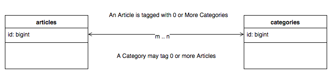
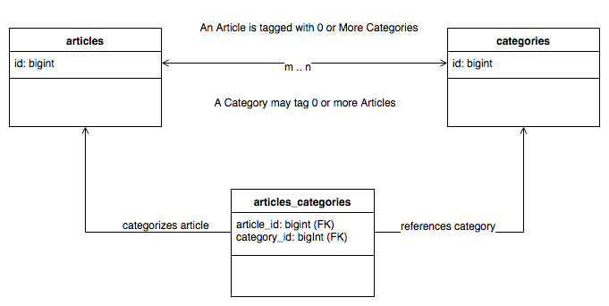
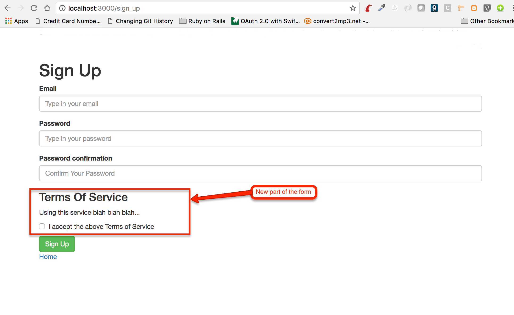
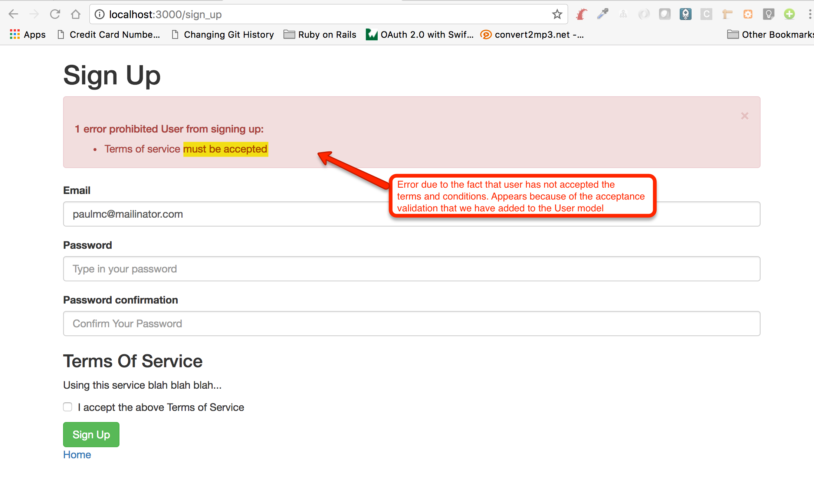
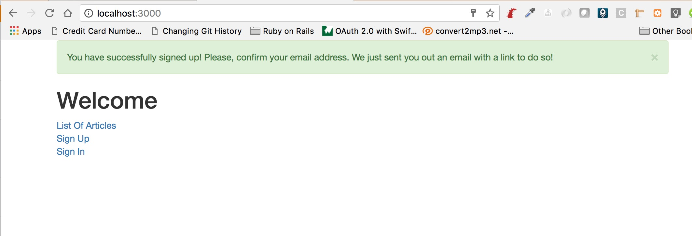
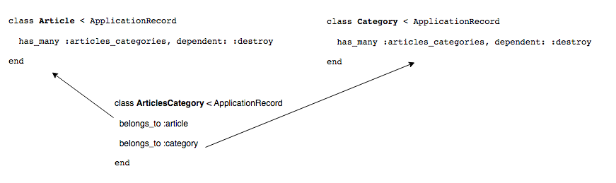
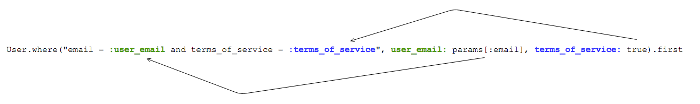

We start our study of Models in Ruby on Rails projects with the Models that are Active Records, i.e. they derive from `ActiveRecord::Base`.
*ActiveRecord::Base* is the implementation of the *Active Record* pattern, as described by [Martin Fowler here](http://www.martinfowler.com/eaaCatalog/activeRecord.html).
It basically says that an instance of an Active Record:

1. Has state that needs to be persisted into a database.
1. It has methods that can persist the state into the database.
1. It has business/domain logic that operates on the state.

Active Record is a tool that allows us to map objects to tables into a relational database. These tools are called 
ORM tools, i.e. Object-Relation Mapping tools. With Active Record we write Ruby and not complex SQL to retrieve and update
data into our database.

## Active Record Quick Overview

Let's start with a quick overview. After the overview, we will elaborate the areas that need better study.

### Active Record Conventions

Active Record, like the rest of Ruby on Rails, uses a lot of conventions (over configuration) in order to make you write less code
and less configuration files. 

For example, when you write:

``` ruby
class Article < ApplicationRecord
end
```

i.e. when you make the class `Article` derive from `ActiveRecord::Base` (note that `ApplicationRecord` derives from `ActiveRecord::Base`), then
Rails knows that this is going to be a class that would map to the table that has the same name but in plural form and lower case letters. In other words,
`Article` class would map to `articles` table. 

Also, if you have the model:

``` ruby
class OrderItem < ApplicationRecord
end
```

then, Rails, knows that this class should map to the table `order_items`. 

The model class names follow the *Camel Case* format, whereas the corresponding table name follows the *snake* format. In *Camel Case* format,
the names start with an uppercase letter for each new word, whereas in *snake* format the words are separated using underscores.

In the following table, you can see some examples of proper model class names and their corresponding table name:

<table>
  <tr><th>Model/Class Name</th><th>Table Name</th></tr>
  <tr><td><code>Customer</code></td><td><code>customers</code></td></tr>
  <tr><td><code>OrderItem</code></td><td><code>order_item</code></td></tr>
  <tr><td><code>Person</code></td><td><code>people</code></td></tr>
</table>

See how Rails is clever enough to convert `Person` to `people` when looking for the table name. You can see how Rails 
pluralizes words, by exercising the method `#pluralize` on strings. Try that with a Rails console on your `blog` project:

``` bash
blog $ bin/rails console
Loading development environment (Rails 5.1.1)
2.3.3 :001 > 'person'.pluralize
 => "people" 
2.3.3 :002 > 'basis'.pluralize
 => "bases" 
2.3.3 :003 > 'hand'.pluralize
 => "hands" 
2.3.3 :004 > 'appendix'.pluralize
 => "appendixes" 
2.3.3 :006 > 'child'.pluralize
 => "children" 
2.3.3 :007 > 
```

Another method that you can try on strings and that it is related to our discussion is the method `#underscore`. This converts a `CamelCase`
to its snake equivalent:

``` bash
2.3.3 :007 > "CamelCase".underscore
 => "camel_case" 
2.3.3 :008 > 
```

Besides the table name conventions, Active Record uses some conventions for the column names too. For example, all the
primary keys will be stored in a column named `id`. Also, the foreign keys, they will have the name that denotes the
destination table in singular form suffixed by an `_id`. Look for example the `Article` model with table `articles`. It
has the column `user_id` as a foreign key column pointing to `users` table `id` primary key of that table. Having done that,
when we write `belongs_to :user`, `ActiveRecord::Base` knows that the underlying persisting information is stored in the
column `user_id`. 

### Creating Active Record Models

We have seen how we can create Active Record models. It was very easy. Wasn't it? We have created the `User` and the `Article` models.

### Overriding The Naming Conventions

But how can you create a model for a legacy application that does not follow the conventions that Rails/Active Record relies on? 

For example, let's assume that you have a table named `bkorder` in which you would like to save `Order` data. In other words, your
model in your object world is `Order`, but your table, has been named `bkorder`. You need to tell Rails that the corresponding
table is not `orders`, but it is `bkorder`. You can do that like in the following code:

``` ruby
class Order < ApplicationRecord
  self.table_name = 'bkorder'
end
```

Or, you may want to use a different primary key name for the primary key column. Let's suppose that the table `bkorder` has 
primary key column named `bkorder_identifier`. You can speficy the primary key as follows:

``` ruby
class Order < ApplicationRecord
  self.table_name = 'bkorder'
  self.primary_key = 'bkorder_identifier'
end
```

### Creating, Retrieving, Updating and Deleting (CRUD) Records.

#### Creating

There are many ways you can use to create a new record into the database. Let's take for example, the `User` model from our `blog` 
application.

##### Method 1

``` ruby
user = User.create(email: 'foo@mailinator.com', password: '12345678')
```

The `User.create` will take as input a `Hash` with the attributes and their values. It will create the record in the database and
will return an instance of `User` class. 

If the record cannot be created for any reason, this method will return `false`. There is also the method `User.create!` that you 
can use when you want an exception to be raised in case of a failure. I usually use this when writing tests so that I can quickly
see the failing point in my test.

##### Method 2

``` ruby
user = User.new
user.email = 'foo@mailinator.com'
user.password = '12345678'
user.save
```

Here, we use the method `save` instead of `create`. When using `save` on the instance of a `User`, if the instance corresponds to
a new record, then the `save` will actually do a `create`. 

The `user.save` will return `false` if something goes wrong. And again, if you want, you can use the method `#save!` instead. In that
case, it will raise an exception if the save fails. Useful when writing tests.

#### Retrieving / Reading a Record From Database

Active Record is very powerful in terms of retrieving data from the database, executing SQL queries behind the scenes, while we write
Ruby object code. Here are some examples:

##### Retrieve All Records

``` ruby
articles = Article.all
```

Calling `.all` on the model class returns an `ActiveRecord::Relation` instance that will allow you to go through all the records of this model
in the database.

##### Count Records

``` ruby
Article.count
```

Returns the number of records in the database.

##### First Record

``` ruby
Article.first
```

This returns the first record in the database after ordering the records on the primary key. In other words, the above Active Record statement
executes a `select * from articles order by id limit 1` in order to bring the first record as a result.

##### Last Record

``` ruby
Article.last
```

Returns the last record when ordering by the primary key.

##### Finding By An Attribute

``` ruby
Article.find_by(title: 'History')
```

It will return any Article that has title with value `History`. Note that even if two or more Articles have the value `History` in their title,
only one will be returned. If you want to get all the Articles that have the value `History` in their title, you should use the `where` method
that we explain below.

Be aware that depending on the RDBMS vendor that you use and how it has been set up, `.find_by` may not find the records that you would expect,
because it does exact search. But if your RDBMS translates the exact search to a case insensitive search your search is going to be more relaxed.

In other words, if your database has two Articles, one with title `History` and another one with title `history` the `Article.find_by(title: 'History')`
will only bring the first one, if your database is PostgreSQL, but it might bring any of the two with the default MySQL set up. Of course, the issue
is more obvious when you try the `.where` method that returns an array of Articles.

##### Retrieving With Conditions / Where Clause

``` ruby
Article.where(title: 'History')
```

It will retrieve the Articles that have title `History`. The result is an `ActiveRecord::Relation` which you can use to iterate over the matching
Articles:

``` ruby
history_articles = Article.where(title: 'History')
history_articles.each do |article|
  puts article.text
end
```

In the above example, we iterate, using `each`, over all the Articles that have title `History`.

Later on, we will elaborate on more complex retrieving/query examples.

#### Updating a Record

Updating a record using Active Record is super easy.

``` ruby
article.title = 'About Geography'
article.save
````

You just set the new values on the attributes of the instance and then you call `#save`. You can also call `#save!` if you want to get an exception
if something goes wrong.

Also, you can update many attributes with one Ruby call. In order to do that, you need to use method `#update`.

``` ruby
article.update(title: 'About Geography', text: 'We will talk about Geography...')
```

#### Deleting A Record
 
Deleting a record is equally simple:

``` ruby
article = Article.find_by(title: 'History')
article.destroy
```

The call to `#destroy` will execute a `DELETE` statement in the database.

You can also call `.destroy_all` to delete all records from the database. But, be very careful with that. 
It will really delete all records and you will not be able to recover unless you have a recent backup of your database.

``` ruby
Article.destroy_all
````

### CallBacks

Another very important aspect of models are the model lifecycle callbacks. We have seen such a callback in the `User` model of the `blog` application:

``` ruby
before_create :generate_email_confirmation_token
```

Callbacks allow us to hook code at specific points in the lifecycle of a Model instance. I will give you more details about them
a little bit later on.

### End of Overview

That was a quick overview of the most important things for Active Record models. We continue with more details explanation on some of them below.

## Schema Migrations

We have already seen what schema migrations are, while working with our `blog` application. We have learned:

1. How to create a table with the `create_table` command
1. How to define the columns of the table.
1. How to defined timestamps columns, `created_at` and `updated_at`.
1. How to write a schema migration to add a column to a table.
1. How to create an index on a table.
1. How to add foreign keys.
1. How we can write the rollback part of a forward schema migration.

Let's now see some more details about schema migrations.

### Timestamp

When we create a schema migration with the corresponding rails generator the file created has a unique timestamp.

Let's do an example in our `blog` application:

``` bash
blog $ bin/rails generate migration create_reviews
      invoke  active_record
      create    db/migrate/20170701174349_create_reviews.rb
blog $
```

The timestamp is the prefix to the file generated. On my end, it was `20170701174349`. `CCYYMMDDHHMMSS` is the format of the
timestamp and it is a UTC time.

### Rails Keeps Track of Migrations Executed

This makes each migration unique. And Rails keeps track of which migrations have been executed and which not
using a table called `schema_migrations` inside our database. 

Let's confirm this with a `psql` session for our `blog_development` database:

``` bash
blog $ psql
psql (9.4.4)
Type "help" for help.

panayotismatsinopoulos=# \connect blog_development                                                                                                                                                                                                                   You are now connected to database "blog_development" as user "panayotismatsinopoulos".
blog_development=# select * from schema_migrations;                                                                                                                                                                                                                      version     
----------------
 20170519062431
 20170604052426
 20170610052034
 20170617084556
 20170618060653
(5 rows)

blog_development=# 
```

As you can see, the table has the timestamps of the previous 5 migrations that we have already executed. But, it does not have
the timestamp for the latest migration that we have just generated. This means that Rails knows which migrations to run,
if we execute `bin/rake db:migrate`. It will only run the migration `20170701174349`, i.e. the migration that we have 
just generated.

Before we migrate, let's see the content of the file of the pending schema migration:

``` ruby
class CreateReviews < ActiveRecord::Migration[5.1]
  def change
    create_table :reviews do |t|
    end
  end
end
```

Rails, having analyzed the `create_reviews` name of the migration has guessed the content and generated a migration that
creates a table, named `reviews`. In order to continue this exercise, we are happy to keep this migration as is.

Let's now run the migration from the operating system shell prompt at the root folder of our `blog` application.

``` bash
blog $ bin/rake db:migrate
== 20170701174349 CreateReviews: migrating ====================================
-- create_table(:reviews)
   -> 0.0441s
== 20170701174349 CreateReviews: migrated (0.0443s) ===========================

blog $
```

The migration has been executed successfully. Can we confirm the content of the `schema_migrations` table? Let's do that
with the help of `psql`.

``` psql
blog $ psql
psql (9.4.4)
Type "help" for help.

panayotismatsinopoulos=# \connect blog_development
You are now connected to database "blog_development" as user "panayotismatsinopoulos".
blog_development=# select * from schema_migrations;
    version     
----------------
 20170519062431
 20170604052426
 20170610052034
 20170617084556
 20170618060653
 20170701174349
(6 rows)

blog_development=# 
```

Nice! A sixth row has been added, that of the latest migration that we have executed.

Now, let's go back to our operating system shell prompt and execute a rollback, so that we take back the latest migration that
we have just executed.

``` bash
blog $ bin/rake db:rollback
== 20170701174349 CreateReviews: reverting ====================================
-- drop_table(:reviews)
   -> 0.0061s
== 20170701174349 CreateReviews: reverted (0.0098s) ===========================

blog $
```

You can see the `drop_table(:reviews)` command has been executed. 

What do we expect to have happened in the `schema_migrations` table? We expect it to have 1 row less now:

``` bash
blog $ psql -d blog_development -c "select * from schema_migrations"
    version     
----------------
 20170519062431
 20170604052426
 20170610052034
 20170617084556
 20170618060653
(5 rows)

blog $
```

> *Hint*: The `psql -d blog_development -c "select * from schema_migrations"` is a way to execute a SQL statement without 
actually starting an interactive session with `psql`.

And the output confirms our assumption. The migration `20170701174349` has been removed.

Cool! So, we have now learned how Rails keeps track of the migrations. Bare in mind that what you do in your development database
has nothing to do with what happens in your production database or you test database. In other words, running a schema migration
while in development environment will not affect your production database. You will have to run the migration again in your production
environment in order for the migration to affect your production database.

### A File With Current Schema Status

Note that every time you successfully run a migration, or a rollback, the file `db/schema.rb` is generated. Let's have a look at the
`db/schema.rb` file of our `blog` application as it is supposed to be after having executed 5 of the 6 migrations:
 
``` ruby
 1. # This file is auto-generated from the current state of the database. Instead
 2. # of editing this file, please use the migrations feature of Active Record to
 3. # incrementally modify your database, and then regenerate this schema definition.
 4. #
 5. # Note that this schema.rb definition is the authoritative source for your
 6. # database schema. If you need to create the application database on another
 7. # system, you should be using db:schema:load, not running all the migrations
 8. # from scratch. The latter is a flawed and unsustainable approach (the more migrations
 9. # you'll amass, the slower it'll run and the greater likelihood for issues).
10. #
11. # It's strongly recommended that you check this file into your version control system.
12. 
13. ActiveRecord::Schema.define(version: 20170618060653) do
14. 
15.   # These are extensions that must be enabled in order to support this database
16.   enable_extension "plpgsql"
17. 
18.   create_table "articles", force: :cascade do |t|
19.     t.string "title", null: false
20.     t.string "text", null: false
21.     t.datetime "created_at", null: false
22.     t.datetime "updated_at", null: false
23.     t.bigint "user_id"
24.     t.index ["user_id"], name: "articles_user_id_idx"
25.   end
26. 
27.   create_table "users", force: :cascade do |t|
28.     t.string "email", null: false
29.     t.string "password_digest", null: false
30.     t.datetime "created_at", null: false
31.     t.datetime "updated_at", null: false
32.     t.string "email_confirmation_token"
33.     t.index ["email"], name: "users_email_uidx", unique: true
34.   end
35. 
36.   add_foreign_key "articles", "users", name: "articles_user_id_users_id_fk"
37. end
```

The main things that you need to know about this file are the following:

1. The latest migration timestamp can be found on line 13.
1. Then you can see all the `ActiveRecord::Migration` commands that would bring your database to the latest state.

As you can read from the comments in the file, this file is the source of truth with regards to your
database schema. So, they say that if you want to recreate the database in another instance, you should
use the `bin/rake db:schema:load` command, rather than just running `bin/rake db:migrate`.

Note that `bin/rake db:schema:load` is executed whenever you run your tests in order for the test runner
to prepare the database for the tests to run.

### Destroy Generated Migration

The `bin/rails generate migration` is used to generate a migration file. There is an opposite command too. The `bin/rails destroy migration`
which is used to take back the result of the `generate` action.

Let's use it to take back the `CCYYMMDDHHMMSS_create_reviews.rb` generated file:

``` bash
blog $ bin/rails destroy migration create_reviews
      invoke  active_record
      remove    db/migrate/20170701174349_create_reviews.rb
blog $
```

According to the output, the file `db/migrate/20170701174349_create_reviews.rb` has been removed.

### List of the Most Important Schema Migration Commands

1. `create_table` (also `create_join_table`)
1. `add_column`
1. `remove_column`
1. `rename_column`
1. `change_table`
1. `change_column` (also `change_column_null`, `change_column_default`)
1. `add_index`
1. `remove_index`
1. `add_foreign_key`
1. `remove_foreign_key`

We have already worked with most of them. Let's work with the `create_join_table` command and see how
we might want to use the `create_table` command instead.

#### `create_join_table`

This is used to create a table that implements a many-to-many association between two tables. Although this could have been
done with `create_table` as well, the `create_join_table` is a little bit more convenient and makes sure that it follows
the Rails conventions.

Let's suppose that we want to enhance our database design with categories for articles. Like this:



This is a many-to-many association between Articles and Categories. In order to implement this association at the database level,
we will have to introduce an intermediate table:



In order to implement this new schema, we first need to create the table `categories`. Let's do that:

``` bash
blog $ bin/rails generate migration create_categories
      invoke  active_record
      create    db/migrate/20170701194907_create_categories.rb
blog $
```

Let's edit the file `db/migrate/20170701194907_create_categories.rb` so that it has the following content:
 
``` ruby
 1. # File: db/migrate/20170701194907_create_categories.rb
 2. #
 3. class CreateCategories < ActiveRecord::Migration[5.1]
 4.   def change
 5.     create_table :categories do |t|
 6.       t.string :name, null: false
 7.       
 8.       t.timestamps
 9.     end
10.     add_index :categories, [:name], unique: true, name: 'categories_name_uidx'
11.   end
12. end
```

The above, will create a table named `categories` and the following collumns:

1. an `id` which is going to be the primary key
1. a `name` which is going to be mandatory
1. a `created_at` which will be set to the time the record is created
1. an `updated_at` which will be automatically updated when the record is updated

Let's run this migration:

``` bash
blog $ bin/rake db:migrate
== 20170701194907 CreateCategories: migrating =================================
-- create_table(:categories)
   -> 0.0086s
-- add_index(:categories, [:name], {:unique=>true, :name=>"categories_name_uidx"})
   -> 0.0032s
== 20170701194907 CreateCategories: migrated (0.0119s) ========================

blog $
```

Great! Table `categories` has been created, and, you can confirm that, by executing the following `psql` command:

``` bash
blog $ psql -d blog_development -c "\d+ categories"
                                                         Table "public.categories"
   Column   |            Type             |                        Modifiers                        | Storage  | Stats target | Description 
------------+-----------------------------+---------------------------------------------------------+----------+--------------+-------------
 id         | bigint                      | not null default nextval('categories_id_seq'::regclass) | plain    |              | 
 name       | character varying           | not null                                                | extended |              | 
 created_at | timestamp without time zone | not null                                                | plain    |              | 
 updated_at | timestamp without time zone | not null                                                | plain    |              | 
Indexes:
    "categories_pkey" PRIMARY KEY, btree (id)
    "categories_name_uidx" UNIQUE, btree (name)

blog $
```

Now that we have both `articles` and `categories` table, we can use the `create_join_table` command to create the intermediate table.
Let's generate the schema migration first:

``` bash
blog $ bin/rails generate migration create_articles_categories
      invoke  active_record
      create    db/migrate/20170702035400_create_articles_categories.rb
blog $
```

Now, let's edit the file generated and put the following content inside:

``` ruby
1. # File db/migrate/20170702035400_create_articles_categories
2. #
3. class CreateArticlesCategories < ActiveRecord::Migration[5.1]
4.   def change
5.     create_join_table :articles, :categories
6.   end
7. end
8. 
```

Here, we use the `create_join_table` command that will create a table `articles_categories` and will add two columns inside it:

1. `article_id`
1. `category_id`

Let's run the migration:

``` bash
blog $ bin/rake db:migrate
== 20170702035400 CreateArticlesCategories: migrating =========================
-- create_join_table(:articles, :categories)
   -> 0.0035s
== 20170702035400 CreateArticlesCategories: migrated (0.0036s) ================

blog $
```

Right! Migration has been executed. What has happened into our database? Let's run the following command:

``` bash
blog $ psql -d blog_development -c "\d+ articles_categories"
                   Table "public.articles_categories"
   Column    |  Type  | Modifiers | Storage | Stats target | Description 
-------------+--------+-----------+---------+--------------+-------------
 article_id  | bigint | not null  | plain   |              | 
 category_id | bigint | not null  | plain   |              | 

blog $
```

Two columns, one `article_id` and another one `category_id`. 

However, to me, this design does not seem ready.

1. It is missing primary key
1. It is missing a unique index that would combine `article_id` and `category_id`. We wouldn't like to have the 
same category assigned to the same article more than once.
1. It is missing timestamps, so we don't have any idea when the rows are created or updated.

Let's roll it back.

```
blog $ bin/rake db:rollback
== 20170702035400 CreateArticlesCategories: reverting =========================
-- drop_join_table(:articles, :categories)
   -> 0.0012s
== 20170702035400 CreateArticlesCategories: reverted (0.0042s) ================

blog $
```

Personally, I prefer to create the intermediate table with proper `create_table` command and introduce all the necessary
columns and indexes. Here is my version of `db/migrate/20170702035400_create_articles_categories.rb` file:

``` ruby
 1. # File db/migrate/20170702035400_create_articles_categories
 2. #
 3. class CreateArticlesCategories < ActiveRecord::Migration[5.1]
 4.   def change
 5.     create_table :articles_categories do |t|
 6.       t.references :article, foreign_key: {name: 'articles_categories_article_fk'}, index: false
 7.       t.references :category, foreign_key: {name: 'articles_categories_category_fk'}, index: false
 8. 
 9.       t.timestamps
10.     end
11. 
12.     add_index :articles_categories, [:article_id, :category_id], unique: true, name: 'articles_categories_article_category_uidx'
13.   end
14. end
```

If you have followed the previous chapters, the above migration is not something new to you. Pay attention how I disable the
creation of index for the foreign keys with the `index: false` option. I am doing that because I don't find these indexes
necessary in the presence of the index `articles_categories_article_category_uidx` that I introduce on line 12.

### When You Want More than The Schema Migration Helpers Can Give You

Sometimes, the schema migration helpers are not enough. In that case, we might want to execute SQL (DDL & DML) commands. We
can do that with the method `execute`. You give your custom SQL command as string to the `execute` method.

### Migrations and Seed Data

The schema migrations are usually used to define changes in your database schema and are executed once. You can use this feature
to carry out data migrations too. This is the recommended practice for production environments, or, in other words, for environments
that migrations run only once.

Otherwise, for development or test environments, you might want to use the `bin/rake db:seed` command. This rake task will actually
run your `db/seeds.rb` file. If you have database population Ruby commands inside this file, they will be executed.

### Closing Schema Migrations

That was a short introduction to Schema Migrations. If you want to read more about Rails Active Record Migrations, have look at the 
[Rails Guides here](http://guides.rubyonrails.org/active_record_migrations.html).

## Validations

The validations are very important ingredient of your Models. They make sure that no Model persists in the database
with invalid data. The `#save` and `.create` commands trigger the validations and they will not allow anything in the
database if the model is not valid. The validations are triggered before the actual database commands take place.
They both return `false` if the model is not valid and their bang (!) equivalent raises an `ActiveRecord::RecordInvalid`
exception.

See again, for example, the validations for Article:

``` ruby
validates :user, presence: true
validates :title, presence: true
validates :text, presence: true
```

You can see a *presence* validation for `user` attribute of the `Article`. Let's try to create an Article without a user using the `.create!` method.
Do this exercise in the rails console for your `blog` project:

```
2.3.3 :043 > Article.create!(title: 'History', text: 'About German History')
   (0.3ms)  BEGIN
   (0.2ms)  ROLLBACK
ActiveRecord::RecordInvalid: Validation failed: User must exist, User can't be blank
        from (irb):43
2.3.3 :044 > 
```

As you can see nothing has taken place in the database. Do you see the `ROLLBACK`? Also, we see the `ActiveRecord::RecordInvalid` exception that was raised.

Let's see some more details about Model validations.

### Active Record Commands that Trigger Validations

Validations are not always triggered. For that reason, you need to be careful when you call methods that persist the state of the object in the
database, without calling validations first.

The methods that **do call** validations before executing SQL commands in the database are:

1. `create`
1. `create!`
1. `save`
1. `save!`
1. `update`
1. `update!`

### Commands that Skip Validations

On the other hand, the following commands skip validations and should be used with caution:

1. decrement!
1. decrement_counter
1. increment!
1. increment_counter
1. toggle!
1. touch
1. update_all
1. update_attribute
1. update_column
1. update_columns
1. update_counters

Also, the `save` can skip validations if it is given the option `validate: false`.

### `valid?` and `invalid?`

Every object instance responds to `valid?` which returns `true` if all the validations are ok. Otherwise, it returns `false`. Note that
all validations will be checked.

Let's see an example using the rails console in our blog application:

``` ruby
2.3.3 :001 > user = User.new
 => #<User id: nil, email: nil, password_digest: nil, created_at: nil, updated_at: nil, email_confirmation_token: nil> 
2.3.3 :002 > user.valid?
  User Exists (0.8ms)  SELECT  1 AS one FROM "users" WHERE "users"."email" IS NULL LIMIT $1  [["LIMIT", 1]]
 => false 
2.3.3 :003 > 
```

The `user` instance, above, returns `false`, when we call `#valid?`. We can equally call `#invalid?` instead.

``` ruby
2.3.3 :003 > user.invalid?
  User Exists (0.4ms)  SELECT  1 AS one FROM "users" WHERE "users"."email" IS NULL LIMIT $1  [["LIMIT", 1]]
 => true 
2.3.3 :004 > 
```

but this will return `true`, i.e. the negation of the `#valid?`.

### `#errors`

How can we know why an instance is invalid? We can call the `#errors` message. This will return information about the errors
that the validation processed has reported.

``` ruby
2.3.3 :004 > user.errors
 => #<ActiveModel::Errors:0x007ff73b584168 @base=#<User id: nil, email: nil, password_digest: nil, created_at: nil, updated_at: nil, email_confirmation_token: nil>, @messages={:password=>["can't be blank"], :email=>["can't be blank"]}, @details={:password=>[{:error=>:blank}], :email=>[{:error=>:blank}]}> 
2.3.3 :005 > 
```

Do you see the `messages` `Hash`. For each one of the attributes that was invalid, it contains a corresponding error message.

Note that the `errors` is populated with `messages` only after we trigger validations on the instance, i.e. after we trigger `#valid?` or `#invalid?`.
Look at the following rails console interaction that demonstrates that:

``` ruby
2.3.3 :005 > user = User.new
 => #<User id: nil, email: nil, password_digest: nil, created_at: nil, updated_at: nil, email_confirmation_token: nil> 
2.3.3 :006 > user.errors
 => #<ActiveModel::Errors:0x007ff74094fd38 @base=#<User id: nil, email: nil, password_digest: nil, created_at: nil, updated_at: nil, email_confirmation_token: nil>, @messages={}, @details={}> 
2.3.3 :007 > user.valid?
  User Exists (0.6ms)  SELECT  1 AS one FROM "users" WHERE "users"."email" IS NULL LIMIT $1  [["LIMIT", 1]]
 => false 
2.3.3 :008 > user.errors
 => #<ActiveModel::Errors:0x007ff74094fd38 @base=#<User id: nil, email: nil, password_digest: nil, created_at: nil, updated_at: nil, email_confirmation_token: nil>, @messages={:password=>["can't be blank"], :email=>["can't be blank"]}, @details={:password=>[{:error=>:blank}], :email=>[{:error=>:blank}]}> 
```

As you can see above, the `errors.messages` is populated only after we trigger the validation process, here done with `#valid?` call.

### `:on` Option

Note that validations are triggered when one tries to save an instance in the database. I.e. both when creating a new record
and when updating an existing one.

However, if this is not what you want, you can use the `:on` option to tell when the validation should take place. `:on` takes
two options: `:create` or `:update`.

So, `validates :name, presence: true, on: :update` runs this presence validation only if the record is updated and not when it is
created.

### Validation Helpers

In our `blog` application we have worked with a couple of validation helpers:

1. Validation for presence. E.g. in `Article` model `validates :user, presence: true`
1. Validation for uniqueness. E.g. in `User` model `validates :email, uniqueness: { case_sensitive: false }`


However, there are plenty more validations at your disposal.

For example:

#### Acceptance Validation

This validator can be attached to an attribute such as `:terms_of_service`, and makes sure that the Model is only saved if the
value of the attribute is true.

Let's work out an example for this validator. We will add attribute `terms_of_service` to the `User` model and we will make it
have the `acceptance` validator switched on.

First things first. Let's add the `terms_of_service` column in the `users` table in the database:

``` bash
blog $ bin/rails generate migration add_terms_of_service_to_users
      invoke  active_record
      create    db/migrate/20170702093324_add_terms_of_service_to_users.rb
blog $
```

Now, fill in the file `db/migrate/20170702093324_add_terms_of_service_to_users.rb` with the following content:

``` ruby
 1. # File: db/migrate/20170702093324_add_terms_of_service_to_users.rb
 2. #
 3. class AddTermsOfServiceToUsers < ActiveRecord::Migration[5.1]
 4.   def change
 5.     add_column :users, :terms_of_service, :boolean, default: false, null: false
 6. 
 7.     reversible do |direction|
 8.       direction.up do
 9.         say_with_time('Setting terms of service to true for all users') do
10.           User.reset_column_information
11.           User.find_each do |user|
12.             user.terms_of_service = true
13.             user.save!
14.           end
15.         end
16.       end
17.     end
18.   end
19. end
```

We are using the `add_column` Active Record Migration method. This will add the column named `terms_of_service` to the `users` table.
Also, it will assume the default value being `false` and will not allow any null values. Also, we make sure that existing users
have accepted the terms of service by setting their `terms_of_service` value to `true`. Note that I am using the `#save!` version of `#save`
to make sure that I still have a valid `User` instance. If this is not the case, all the migration will be rolled back.

> *Hint:* Actually, the migration is rolled back, in case of a failure, if the database management system supports *transactions* 
at the data definition level, which is the case with PostgreSQL, but not with MySQL.
 
> *Information:* See also how we use the `reversible` to tell Rails that if this migration is rolled back then there is no code
that corresponds to the setting of the column `true` for all the users. You can try both migration and rollback, if you want to see how
this code behaves.

Let's run the migration now:

``` bash
blog $ bin/rake db:migrate
== 20170702093324 AddTermsOfServiceToUsers: migrating =========================
-- add_column(:users, :terms_of_service, :boolean, {:default=>false, :null=>false})
   -> 0.0092s
-- Setting terms of service to true for all users
   -> 0.0574s
== 20170702093324 AddTermsOfServiceToUsers: migrated (0.0668s) ================

blog $
```

Nice! The migration has been executed successfully. Let's confirm what we have done with the help of `psql`.

``` bash
blog $ psql -d blog_development -c "select * from users;"
 id |           email            |                       password_digest                        |         created_at         |         updated_at         | email_confirmation_token | terms_of_service 
----+----------------------------+--------------------------------------------------------------+----------------------------+----------------------------+--------------------------+------------------
  8 | foo@gmail.com              | $2a$10$WuL5ic/qRTL2.AK9vAIDxuoHZAf7V/dFdlLzFpgXdnwc1GhtrJj8i | 2017-06-04 07:25:59.681835 | 2017-07-02 09:52:46.964696 | 3sRJUZvDS0wNMNY2pfbU_A   | t
  9 | bar@gmail.com              | $2a$10$g/4AILw8UXB1s8G01M8P1efgzs0iZfNfw.BxdHW2HNIxMhgkgqrr2 | 2017-06-04 13:51:46.423347 | 2017-07-02 09:52:46.96815  |                          | t
 10 | mary@gmail.com             | $2a$10$YLIJQ0AEVCTFnDgYs013j.J32Hk9df2YPuvouECx.TjrttueV9wVq | 2017-06-10 06:46:05.276602 | 2017-07-02 09:52:46.970002 | yStnErkVCFC9mYNHKFNYdA   | t
 12 | john@gmail.com             | $2a$10$.JIoJKajyd2abxCkYFE0O.xaSyPLQ95ylXbOlyMDvdlKUPKv/l5Mi | 2017-06-10 08:02:26.555474 | 2017-07-02 09:52:46.971858 |                          | t
 13 | peter@gmail.com            | $2a$10$MGPCmf92M0kOC78Xm4zmxOAOQ0jEFWlbjCRGXpNFv6s3jNIdNKFeu | 2017-06-11 05:10:39.504549 | 2017-07-02 09:52:46.973647 |                          | t
 16 | paul@gmail.com             | $2a$10$Ba9KZ9pGgiFuc5o8U8TDX.vv6SbLACUVrS89k7Yo8/dCtJm4TOIwS | 2017-06-11 06:36:41.545059 | 2017-07-02 09:52:46.975448 | 0IRMYX9gcpVOtmn28kGLYw   | t
 17 | kristin@gmail.com          | $2a$10$COrxjcEMPOh/t3u.Hf5uhuW.NaQ4C79EzGB.s0rGHFTbIn6kQTaLe | 2017-06-11 06:55:22.171308 | 2017-07-02 09:52:46.977246 | nVBfAifMQBaRh86B9dzWMg   | t
 18 | angela@gmail.com           | $2a$10$HXoMZTFWqPqxobuUFI7yRuNd83Q.xoyvm1MXSHT6PBwJGwZbYCJ/C | 2017-06-11 06:58:18.846746 | 2017-07-02 09:52:46.979059 |                          | t
 19 | peter2@gmail.com           | $2a$10$JFvKqKhWBIq/2bXMNlAwa.ENtE653CCoMEPPNgNkgVK7G.OIy2JVK | 2017-06-11 07:11:28.007321 | 2017-07-02 09:52:46.98084  | oEiLZ_g3t79GvpUb9XfZAg   | t
 20 | john2@gmail.com            | $2a$10$qVeJe/d3MX7tcdtC/aZsUOt1cK.TNeAKJyilU87HeP0mQHZFnIbOe | 2017-06-11 07:11:56.728099 | 2017-07-02 09:52:46.982927 | 5bW4t707RefeArX5jRBLlQ   | t
 21 | kelly@gmail.com            | $2a$10$7ajlqQuSh/ZkMuVulje9B.deuNVX0EGZsDSm0kWFx8Du0cFnQ4dgS | 2017-06-11 09:45:22.402168 | 2017-07-02 09:52:46.984812 |                          | t
 24 | foo-bar@gmail.com          | $2a$10$aCjEQ6n8IbaBuO27oy47I.JPN4GGSxvmW33yicMDz2z1CX5bqROYG | 2017-06-20 12:02:35.390415 | 2017-07-02 09:52:46.986605 | w-0oSEHckGCyLXRUQB5cHg   | t
 25 | foo-201706221324@gmail.com | $2a$10$uiZZPzx2l.mtN6iRBtzfT.q4LnxZu4Xq8yOaVzmNpYAuXhCTH6LPe | 2017-06-22 10:24:38.300964 | 2017-07-02 09:52:46.988666 | iGrDo81mfyzE_tHWGslrMQ   | t
(13 rows)

blog $
```

Do you see the `terms_of_service` column at the far right? Perfect! All existing users have value `t` for this column.

Let's now enhance our `User` model to have the *acceptance* validator attached to the `terms_of_service`.
 
``` ruby
 1. # File app/models/user.rb
 2. #
 3. class User < ApplicationRecord
 4.   has_many :articles
 5. 
 6.   has_secure_password
 7. 
 8.   validates :email, presence: true, uniqueness: { case_sensitive: false }
 9.   validates :terms_of_service, acceptance: true
10. 
...
31. end
```

It is the line 9 that we have added. We now tell that a `User` is only valid if the terms of service have been accepted.

If we run the tests that we have developed for our `blog` application, we will now see a lot of failures:

``` bash
blog $ bin/rails test
Run options: --seed 11689

# Running:

E

Error:
ArticleTest#test_should_be_invalid_without_a_text:
ActiveRecord::RecordInvalid: Validation failed: Terms of service must be accepted
    test/models/article_test.rb:19:in `block in <class:ArticleTest>'


bin/rails test test/models/article_test.rb:18
...

Finished in 0.793411s, 22.6869 runs/s, 44.1133 assertions/s.
18 runs, 35 assertions, 2 failures, 6 errors, 0 skips
blog $
```

These tests fail, probably, because of this new feature that we have added. And this is because the 
sign up form, does not have a way for the user to accept the terms of service.


Let's enhance our form to allow for the user to accept the terms of service. Here is the new version of the file `app/views/sign_up/new.html.haml`:

``` haml
 1. - # File: app/views/sign_up/new.html.haml
 2. - #
 3. %h1 Sign Up
 4. 
 5. = form_for @user, url: sign_up_path, method: :post do |f|
 6. 
 7.   = render partial: 'shared/errors', locals: {model: @user, explanation: 'prohibited User from signing up:'}
 8. 
 9.   .form-group
10.     = f.label :email
11.     = f.email_field :email, placeholder: 'Type in your email', class: 'form-control'
12. 
13.   .form-group
14.     = f.label :password
15.     = f.password_field :password, placeholder: 'Type in your password', class: 'form-control'
16. 
17.   .form-group
18.     = f.label :password_confirmation
19.     = f.password_field :password_confirmation, placeholder: 'Confirm Your Password', class: 'form-control'
20. 
21.   .terms-of-service
22.     %h3 Terms Of Service
23.     %p
24.       Using this service blah blah blah...
25. 
26.   .checkbox
27.     = f.label :terms_of_service do
28.       = f.check_box :terms_of_service
29.       I accept the above Terms of Service
30. 
31.   = f.submit 'Sign Up', class: 'btn btn-success'
32. 
33. %div
34.   = link_to 'Home', root_path
```

The new lines are the lines 21 to 29. We display a message that is supposed to be the actual terms of service and then
we display a checkbox that needs to be checked by the user. This checkbox is bound to the `terms_of_service` property.

If you visit the new form here: [http://localhost:3000/sign_up](http://localhost:3000/sign_up), you will see this:
 

 
If you try to submit the Sign Up without checking the box for terms of service acceptance, you will see this:



The validation of `acceptance` takes place and the error message is `must be accepted`. 

Let's see what happens when the user accepts the terms and conditions. Fill in the password fields again, check the box for terms of service and resubmit.

Hmmmm! You will see the same error appearing again. What are we missing here?

If we look at the server-side logs, we will see something like this:

``` bash
 1. Started POST "/sign_up" for 127.0.0.1 at 2017-07-02 14:39:33 +0300
 2. Processing by SignUpController#create as HTML
 3.   Parameters: {"utf8"=>"✓", "authenticity_token"=>"Z4PzO0YIvhnK3GfykjGMuQzrMbiNcHGzTwAb9HJis9AOUkZah8/ce0kg0BYrxaP8PKZST+e47tKSRMB9IXzAeQ==", "user"=>{"email"=>"paulmc@mailinator.com", "password"=>"[FILTERED]", "password_confirmation"=>"[FILTERED]", "terms_of_service"=>"1"}, "commit"=>"Sign Up"}
 4.   User Load (0.3ms)  SELECT  "users".* FROM "users" WHERE "users"."id" IS NULL LIMIT $1  [["LIMIT", 1]]
 5. Unpermitted parameter: :terms_of_service
 6.    (0.1ms)  BEGIN
 7.   User Exists (0.3ms)  SELECT  1 AS one FROM "users" WHERE LOWER("users"."email") = LOWER($1) LIMIT $2  [["email", "paulmc@mailinator.com"], ["LIMIT", 1]]
 8.    (0.1ms)  ROLLBACK
 9.   Rendering sign_up/new.html.haml within layouts/application
10.   Rendered shared/_errors.html.haml (3.9ms) [cache miss]
11.   Rendered sign_up/new.html.haml within layouts/application (11.0ms)
12.   Rendered layouts/_flash.html.haml (3.8ms) [cache miss]
13.   User Load (0.4ms)  SELECT  "users".* FROM "users" WHERE "users"."id" IS NULL LIMIT $1  [["LIMIT", 1]]
14.   Rendered layouts/_signed_in_user.html.haml (4.4ms) [cache miss]
15. Completed 200 OK in 153ms (Views: 85.9ms | ActiveRecord: 1.3ms)
```

Do you see the line 5? `Unpermitted parameter: :terms_of_service`. This error is raised when `SignUpController#create` action is trying to parse the parameters
submitted by the form. The actual piece of code that parses the parameters is this:

``` ruby
def user_params
  params.require(:user).permit(:email, :password, :password_confirmation)
end
```

As you can read in this piece of code, the `:terms_of_service` is not included in the list of permitted parameters. Let's amend this line:

``` ruby
params.require(:user).permit(:email, :password, :password_confirmation, :terms_of_service)
```

And now, let's refill the Sign Up form, checking the terms of service box again, and resubmit.




This fixes the problem with the sign up form.

However, we still get errors in our tests. This is because the factories that we use for users do not build valid users any more.

This is what we have:

``` ruby
1. # File: test/factories/users.rb
2. #
3. FactoryGirl.define do
4.   factory :user do
5.     email { "#{SecureRandom.hex}@mailinator.com" }
6.     password '12345678'
7.   end
8. end
```

We are missing the `terms_of_service`. Let's amend the above file to cater for `terms_of_service` too:

``` ruby
1. # File: test/factories/users.rb
2. #
3. FactoryGirl.define do
4.   factory :user do
5.     email { "#{SecureRandom.hex}@mailinator.com" }
6.     password '12345678'
7.     terms_of_service true
8.   end
9. end
```

If you run your tests now, you only get 2 failures. They are the integration tests inside the file `test/integration/sign_up_test.rb`. If you read the
code, you will see that the test does not send the `terms_of_service` as part of the `params`:

``` ruby
post sign_up_path, params: {user: {email: email, password: test_password, password_confirmation: test_password}}
```

We need to amend the above line as follows:

``` ruby
post sign_up_path, params: {user: {email: email, password: test_password, password_confirmation: test_password, terms_of_service: true}}
```

This needs to be done for both tests because they both use the same `post` method call.

Now, if you run your tests, they will be green:

``` bash
blog $ bin/rails test
Running via Spring preloader in process 23119
Run options: --seed 61821

# Running:

..................

Finished in 0.709230s, 25.3796 runs/s, 74.7289 assertions/s.
18 runs, 53 assertions, 0 failures, 0 errors, 0 skips
blog $
```

But don't forget to run your system tests too, because they do not run by default:

If you do that, you will see that the system test fails:

``` bash
blog $ bin/rails test:system
Run options: --seed 23060

# Running:

Puma starting in single mode...
* Version 3.8.2 (ruby 2.3.3-p222), codename: Sassy Salamander
* Min threads: 0, max threads: 1
* Environment: test
* Listening on tcp://0.0.0.0:51536
Use Ctrl-C to stop
[Screenshot]: tmp/screenshots/failures_test_sign_up_happy_path.png

F

Failure:
SignUpTest#test_sign_up_happy_path [test/system/sign_up_test.rb:20]:
expected to find css ".alert.alert-success" with text "You have successfully signed up! Please, confirm your email address. We just sent you out an email with a link to do so!" but there were no matches


bin/rails test test/system/sign_up_test.rb:6


Finished in 3.576432s, 0.2796 runs/s, 0.2796 assertions/s.
1 runs, 1 assertions, 1 failures, 0 errors, 0 skips
blog $
```

Obviously, this is because of the reason that the test does not simulate the acceptance of the terms of service. This is the 
new version of the test that makes sure we check the terms of service box:

``` ruby
 1. # File: test/system/sign_up_test.rb
 2. #
 3. require 'application_system_test_case'
 4. 
 5. class SignUpTest < ApplicationSystemTestCase
 6.   test 'sign up happy path' do
 7.     email = "#{SecureRandom.hex}@mailinator.com"
 8.     test_password = '12345678'
 9. 
10.     visit root_url
11. 
12.     click_link 'Sign Up'
13. 
14.     fill_in 'Email', with: email
15.     fill_in 'Password', with: test_password
16.     fill_in 'Password confirmation', with: test_password
17.     check 'I accept the above Terms of Service'
18. 
19.     click_button 'Sign Up'
20. 
21.     assert_selector '.alert.alert-success', text: 'You have successfully signed up! Please, confirm your email address. We just sent you out an email with a link to do so!'
22.   end
23. end
```

Line 17 is the only new line that we have added. It is using the Capybara API to check a checkbox. 

If you now run your system tests, they will succeed:

``` bash
blog $ bin/rails test:system
Run options: --seed 27312

# Running:

Puma starting in single mode...
* Version 3.8.2 (ruby 2.3.3-p222), codename: Sassy Salamander
* Min threads: 0, max threads: 1
* Environment: test
* Listening on tcp://0.0.0.0:51671
Use Ctrl-C to stop
.

Finished in 1.954052s, 0.5118 runs/s, 0.5118 assertions/s.
1 runs, 1 assertions, 0 failures, 0 errors, 0 skips
blog $
```

Bingo!

Testing with `RSpec`, will require you to do the similar changes. Please, go ahead and do them.

Testing with `Cucumber`. Your `sign_up.feature` that tests the Sign Up feature needs to be adjusted. Please, go ahead and do it.

That was a long exercise on the acceptance validation. 

Let's continue with the rest of the validations.

#### Confirmation

We have already used this validation when we used `has_secure_password` for the `User` model. It is used to tell Rails that
we want Model to have an attribute confirming the value of another one. For example:

``` ruby
validates :email, confirmation: true
```

will define a virtual attribute named `:email_confirmation` that, if given, should have the same value like the `:email` attribute.

This is what `has_secure_password` does behind the scenes:

``` ruby
validates :password, confirmation: true
```

and this is the reason we used the `:password_confirmation` as an attribute for Signing Up.

#### Exclusion

It is used to tell which values an attribute is not allowed to take.

#### Format

This validation makes sure that the value of the attributes matches a regular expression. 

Let's see that with the following example. We will add this validation for the `:email` attribute for the `User`
model:

``` ruby
validates :email, format: {with: /\A\S+@\S+\.\S+\z/, message: 'is not valid email'}
```

Add the above line to your `User` model. The `with: /\A\S+@\S+\.\S+\z/` specifies the regular expression against which
the email value given is going to be matched. If the email given does not match this regular expression, then
the error message `is not valid email` will be attached to the `:email` attribute of the `User` instance.

> *Hint:* The above regular expression makes sure that value for `:email` contains some non-white space characters before
the symbol `@`, then some more non-white space characters, followed by a `.` and then some more non-white space characters.

With the above format validation in place, you will encounter things like these when you will try to give an invalid email:


> *Hint:* Because of the fact that the field is declared of type `email`, your browser already does some validation.
So you may not be able to submit some possibly invalid values.

The example for the format validator that we saw above also takes advantage of the fact that we can specify the `message`
that can be attached to a validation error. This is applicable to all validators.

#### Inclusion

The inclusion validation is used when we want the values of an attribute to be limited to a specific set of values. For example:

``` ruby
validates :size, inclusion: {in: %w(small medium large extra_large)}
```

#### Length

This checks a string value for its length. For example, we can specify that the password should be at least 8 characters long:

``` ruby
validates :password, length: { minimum: 8 }
```

Or we can also specify a maximum limit with the `maximum` key.

Sometimes we may want to specify an exact length value. In that case we use the key `is`, like in the following example:

``` ruby
validates :account_number, length: { is: 10 }
```

#### Numericality

This validator makes sure that we save values that are numbers. For example:

``` ruby
validates :salary, numericality: true
```

If you want to make sure that values are integers, you can set `only_integer: true`. For example:

``` ruby
validates :age, numericality: { only_integer: true }
```

And if you want to be more specific, you can use the following keys:

1. `greater_than`
1. `greater_than_or_equal_to`
1. `equal_to`
1. `less_than`
1. `less_than_or_equal_to`
1. `other_than`
1. `odd`
1. `even`

#### Presence

We have already seen many examples of the presence validator, which makes sure that an attribute has a non-nil value.
Also, if the value is a string, blank strings are not allowed either.

#### Absence

This makes sure that the value is either `nil` or a blank string. This is the reverse of the presence validator and internally
uses the `!present?` to find out whether something is absent or not. In other words, absence means *not-presence* here.

> *Note for both `presence` and `absence`:* Since both rely on `present?`, you need to be careful with the boolean values. The boolean
value `false` is not considered present, i.e. it is considered absent. Use `inclusion` or `exclusion` validators against the
set `%w(true false)` to deal with the presence or absence of attributes that take boolean values.

#### Uniqueness

We have already worked with the uniqueness validator in the `User` model, for the attribute `:email`.

#### `validates_with` and `validates_each`

These are tools for custom validations. You can read more about them in the Rails Guides in [Active Record Validations Chapter](http://guides.rubyonrails.org/active_record_validations.html#validates-with).

### Validation Common Options

There are some common options for all the validators:

1. `allow_nil`. This can be used when we want to allow `nil` value for an attribute that otherwise takes values from a restricted set. 
1. `allow_blank`. This allows both `nil` and blank strings.
1. `message`. It is used to customize the error message attached to an attribute when validation fails.
1. `on`, which takes one of the values `:create` or `:update`, in order to limit validations on creation or on update, respectively.

### Conditional Validations

We can tell that a validation is conditional with the help of the keys `:if` or `:unless`. For example:

``` ruby
class Order < ApplicationRecord
  validates :card_number, presence: true, if: :paid_with_card?
 
  def paid_with_card?
    payment_type == "card"
  end
end
```

You can see that the presence validator above has a condition attached: `if: :paid_with_card?`. The good thing with that is
that the condition is evaluated every time the validation takes place. Here, the value to the key `:if` is the symbol of a method
that should return a truethy value, when called.

Read more about the Conditional Validations in the [Rails Guides here](http://guides.rubyonrails.org/active_record_validations.html#conditional-validation).

### Custom Validations

We have already created a custom validation. See the line `validate :authenticate` in the `SignIn` model and the method implementation:

``` ruby
  def authenticate
    return unless email.present? && password.present?

    @user = User.find_by_email(email.downcase).try(:authenticate, password)

    unless @user
      error_message = 'Wrong Credentials!'
      errors[:email] << error_message
      errors[:password] << error_message
    end
  end
```

You can read about other ways one can create [custom validations here.](http://guides.rubyonrails.org/active_record_validations.html#performing-custom-validations).
And you can read more about the [errors handling here.](http://guides.rubyonrails.org/active_record_validations.html#working-with-validation-errors) 

## Active Record Callbacks

We have already seen an example of an Active Record Callback. Look at the code in `User` model in our `blog` application. You can see the line
of code `before_create :generate_email_confirmation_token`. This is a callback for the _before create_ event.

### List of Available Callbacks

Callbacks are being called when you _create_, _update_ or _delete_ an object and on some other cases.

#### Callbacks On Create

1. `before_validation`
1. `after_validation`
1. `before_save`
1. `around_save`
1. `before_create`
1. `around_create`
1. `after_create`
1. `after_save`
1. `after_commit/after_rollback`

#### Callbacks on Update

1. `before_validation`
1. `after_validation`
1. `before_save`
1. `around_save`
1. `before_update`
1. `around_update`
1. `after_update`
1. `after_save`
1. `after_commit/after_rollback`

#### Callbacks On Deletion

1. `before_destroy`
1. `around_destroy`
1. `after_destroy`
1. `after_commit/after_rollback`

Callbacks are being called in the sequence that they are given above. For example, when you create a new object, the first callback
called is the `before_validation` and the second one is the `after_validation`, whereas the last one is the `after_commit` (if everything
goes ok) or the `after_rollback` (if things cannot be committed, but should be rolled back instead).

#### `after_initialize`

The `after_initialize` is called whenever an Active Record is initialized either by just calling `.new` or when the instance is created
as a result of fetching an existing record from the database.

Let's carry out an example here. Amend the `User` model so that it has the following code:

``` ruby
 1. # File app/models/user.rb
 2. #
 3. class User < ApplicationRecord
 4.   has_many :articles
 5. 
...
13. 
14.   after_initialize :user_initialized
15. 
...
28. 
29.   private
30. 
...
34. 
35.   def user_initialized
36.     puts "User #{email} is initialized"
37.   end
38. end
```

We have added line 14 and lines 35 to 37. The method `user_initialized` will be called whenever we initialize an instance of this class. 
Start your rails console and issue two commands. First: `User.new` and then `User.first` (assuming that you have some users in your database).
You will see something like this:

``` ruby
2.3.3 :001 > User.new
User  is initialized
 => #<User id: nil, email: nil, password_digest: nil, created_at: nil, updated_at: nil, email_confirmation_token: nil, terms_of_service: false> 
2.3.3 :002 > User.first
  User Load (0.6ms)  SELECT  "users".* FROM "users" ORDER BY "users"."id" ASC LIMIT $1  [["LIMIT", 1]]
User foo@gmail.com is initialized
 => #<User id: 8, email: "foo@gmail.com", password_digest: "$2a$10$WuL5ic/qRTL2.AK9vAIDxuoHZAf7V/dFdlLzFpgXdnw...", created_at: "2017-06-04 07:25:59", updated_at: "2017-07-02 09:52:46", email_confirmation_token: "3sRJUZvDS0wNMNY2pfbU_A", terms_of_service: true> 
2.3.3 :003 > 
```

Do you see the two lines `User .... is initialized`. They have been printed because of the `after_initialize` hook.

Note that `after_initialize` is a good tool for you to do things on top of Active Record initializer without having to override
the Active Record initializer.

#### `after_find`

The `after_find` callback is called whenever a record is fetched from the database. It is called before `after_initialized`, if both have been defined.

Let's add an `after_find` hook in our `User` model:

``` ruby
 1. # File app/models/user.rb
 2. #
 3. class User < ApplicationRecord
 4.   has_many :articles
...
14.   after_initialize :user_initialized
15.   after_find :user_found
16. 
...
29. 
30.   private
31. 
...
35. 
36.   def user_initialized
37.     puts "User #{email} is initialized"
38.   end
39.   
40.   def user_found
41.     puts "User #{email} found"
42.   end
43. end
```

We have added line 15 and lines 40 to 42. Now, let's do the same test with the rails console, to initialize and fetch a record (make sure that
you restart your rails console session so that it takes into account your changes)

``` ruby
2.3.3 :006 >   User.new
User  is initialized
 => #<User id: nil, email: nil, password_digest: nil, created_at: nil, updated_at: nil, email_confirmation_token: nil, terms_of_service: false> 
2.3.3 :007 > User.first
  User Load (0.5ms)  SELECT  "users".* FROM "users" ORDER BY "users"."id" ASC LIMIT $1  [["LIMIT", 1]]
User foo@gmail.com found
User foo@gmail.com is initialized
 => #<User id: 8, email: "foo@gmail.com", password_digest: "$2a$10$WuL5ic/qRTL2.AK9vAIDxuoHZAf7V/dFdlLzFpgXdnw...", created_at: "2017-06-04 07:25:59", updated_at: "2017-07-02 09:52:46", email_confirmation_token: "3sRJUZvDS0wNMNY2pfbU_A", terms_of_service: true> 
```

You can see that, first, the `after_find` hook was called, and then the `after_initialize` hook.

Cool!

#### `after_touch`

The `after_touch` is called when an Active Record is touched. Whenever you call `#touch` on an Active Record its `updated_at` attribute
gets updated. Also, the hook `after_touch` is called.

Let's see that with the `User` model:

``` ruby
 1. # File app/models/user.rb
 2. #
 3. class User < ApplicationRecord
...
15.   after_find :user_found
16.   after_touch :user_touched
...
30. 
31.   private
32. 
...
41.   def user_found
42.     puts "User #{email} found"
43.   end
44. 
45.   def user_touched
46.     puts "User #{email} touched"
47.   end
48. end
```

We have added lines 16 and 45 to 47. Restart your rails console and try the following:

``` ruby
2.3.3 :001 > u = User.first
  User Load (1.2ms)  SELECT  "users".* FROM "users" ORDER BY "users"."id" ASC LIMIT $1  [["LIMIT", 1]]
User foo@gmail.com found
User foo@gmail.com is initialized
 => #<User id: 8, email: "foo@gmail.com", password_digest: "$2a$10$WuL5ic/qRTL2.AK9vAIDxuoHZAf7V/dFdlLzFpgXdnw...", created_at: "2017-06-04 07:25:59", updated_at: "2017-07-02 09:52:46", email_confirmation_token: "3sRJUZvDS0wNMNY2pfbU_A", terms_of_service: true> 
2.3.3 :002 > puts "Updated: #{u.updated_at}"
Updated: 2017-07-02 09:52:46 UTC
 => nil 
2.3.3 :003 > u.touch
   (0.2ms)  BEGIN
  SQL (3.0ms)  UPDATE "users" SET "updated_at" = '2017-07-03 16:22:37.504166' WHERE "users"."id" = $1  [["id", 8]]
User foo@gmail.com touched
   (0.7ms)  COMMIT
 => true 
2.3.3 :004 > puts "Updated: #{u.updated_at}"
Updated: 2017-07-03 16:22:37 UTC
 => nil 
2.3.3 :005 > 
```

- On command 001, we fetch the first user. You can see the `after_find` and `after_initialize` hooks being fired.
- On command 002, we print the `updated_at` value of the User at hand.
- On command 003, we touch the User at hand and we see the `after_touch` hook being fired.
- On command 004, we print the `updated_at` value again. You can see how it now contains a new value.

### Skipping Callbacks

You may want to write some code for the state of an Active Record but you wouldn't like to execute the callbacks
attached to the model. The following methods do not execute the callbacks:

1. `decrement`
1. `decrement_counter`
1. `delete`
1. `delete_all`
1. `increment`
1. `increment_counter`
1. `toggle`
1. `touch`
1. `update_column`
1. `update_columns`
1. `update_all`
1. `update_counters`

You should be using these methods without caution and making sure that by-passing the callbacks is really what you want to do.
Sometimes, for example, we want to carry out an update in the database without calling any of the callbacks. In that case, 
these methods here are very useful.

### Halting Execution

The callbacks are executed one by one in predefined order and according to the order they have been registered. Everything is 
executed inside a big transaction. If any of the callbacks raises an exception, the execution chain gets halted and a ROLLBACK
is issued, and nothing is committed to the database.

Note that if you want to intentionally stop a chain, from within inside of your callback implementations, you can call `throw :abort`.

### Relational Callback

There is an option for the `has_many` (or `has_one`) association that allows you to register a callback that has to do with the
relation of objects.

For example, look at `User` model:

``` ruby
has_many :articles
```

We can turn this to this:

``` ruby
has_many :articles, dependent: :destroy
```

With the `dependent: :destroy` option we create an `after_destroy` callback for the `User` model that deletes the Articles that
belong to the `User` that's being deleted.

Go ahead and do this change to your `User` model. Then start your rails console again:

``` ruby
2.3.3 :001 > u = Article.first.user
  Article Load (0.4ms)  SELECT  "articles".* FROM "articles" ORDER BY "articles"."id" ASC LIMIT $1  [["LIMIT", 1]]
  User Load (0.5ms)  SELECT  "users".* FROM "users" WHERE "users"."id" = $1 LIMIT $2  [["id", 8], ["LIMIT", 1]]
User foo@gmail.com found
User foo@gmail.com is initialized
 => #<User id: 8, email: "foo@gmail.com", password_digest: "$2a$10$WuL5ic/qRTL2.AK9vAIDxuoHZAf7V/dFdlLzFpgXdnw...", created_at: "2017-06-04 07:25:59", updated_at: "2017-07-03 16:22:37", email_confirmation_token: "3sRJUZvDS0wNMNY2pfbU_A", terms_of_service: true> 
2.3.3 :002 > u.articles.count
   (0.6ms)  SELECT COUNT(*) FROM "articles" WHERE "articles"."user_id" = $1  [["user_id", 8]]
 => 7 
2.3.3 :003 > u.destroy
   (0.2ms)  BEGIN
  Article Load (0.3ms)  SELECT "articles".* FROM "articles" WHERE "articles"."user_id" = $1  [["user_id", 8]]
  SQL (1.0ms)  DELETE FROM "articles" WHERE "articles"."id" = $1  [["id", 31]]
  SQL (0.3ms)  DELETE FROM "articles" WHERE "articles"."id" = $1  [["id", 32]]
  SQL (0.3ms)  DELETE FROM "articles" WHERE "articles"."id" = $1  [["id", 33]]
  SQL (0.3ms)  DELETE FROM "articles" WHERE "articles"."id" = $1  [["id", 34]]
  SQL (0.3ms)  DELETE FROM "articles" WHERE "articles"."id" = $1  [["id", 35]]
  SQL (0.3ms)  DELETE FROM "articles" WHERE "articles"."id" = $1  [["id", 36]]
  SQL (0.2ms)  DELETE FROM "articles" WHERE "articles"."id" = $1  [["id", 37]]
  SQL (0.4ms)  DELETE FROM "users" WHERE "users"."id" = $1  [["id", 8]]
   (2.0ms)  COMMIT
 => #<User id: 8, email: "foo@gmail.com", password_digest: "$2a$10$WuL5ic/qRTL2.AK9vAIDxuoHZAf7V/dFdlLzFpgXdnw...", created_at: "2017-06-04 07:25:59", updated_at: "2017-07-03 16:22:37", email_confirmation_token: "3sRJUZvDS0wNMNY2pfbU_A", terms_of_service: true> 
2.3.3 :004 >
```

With the `has_many :articles, dependent: :destroy` we have managed to delete all the articles of the user at hand:
 
- On command 001, we fetch a User that has Articles.
- On command 002, we count the number of Articles this User has.
- On command 003, we delete the User. As you can see from the SQL commands, Active Record first deletes the Articles of the User before deleting the User itself.

### Conditional Callbacks

Like with validations, you can specify conditions under which a callback will be called or conditions under which the callback will not be called.
These are the `:if` and `:unless` options at the callback registration point.

[Read about this here](http://guides.rubyonrails.org/active_record_callbacks.html#conditional-callbacks)

### Transactional Callbacks

The `after_commit` and `after_rollback` hooks are called after everything commits to the database or after a rollback takes place,
respectively. Note that some times we want to write hooks for these events but only for a specific case among _create_, _update_ or _delete_.
In that case, we can use the option `:on`. For example:

``` ruby
after_commit :send_email, on: :create
```

will call the `send_email` method only after create commit takes place, but not after update or destroy.

### Closing On Callbacks

If you want to read more about Active Record Callbacks, you can read the [Rails Guides here](http://guides.rubyonrails.org/active_record_callbacks.html).

> *Task:* Remove the `after_initialize`, `after_find` and `after_touch` callbacks from your `User` model.

## Active Record Associations

We have already seen how to associate one object to another. For example, we have used the method `has_many` to associate a User to
many Articles. And the `belongs_to`, in order to associate the Article back to the User that the Article belongs to. That was one way
to implement a one-to-many association. 

You could have also used the method `has_one` instead, if the association was one-to-one.

Note that the `belongs_to` method should be placed in the Model that has the foreign key, whereas the `has_many` or `has_one`
should be placed in the other Model. That's why we have put the `belongs_to` inside the Article model. It is the `articles` table
that has the `user_id` as foreign key to `users` table.

### Declaring Associations Introduces a lot of Methods

Declaring an association from one model to another, defines a set of methods in your class.

For example, declaring the `belongs_to :user` in the `Article` model, you get for free the following:

1. `user(force_reload = false)`. Returns the associated user. `nil` is returned if none is found.
1. `user = another_user`. Allows you to assign another user to the article at hand.
1. `build_user(attributes = {})`. Returns a new `User` object that has been instantiated with `attributes` and linked to 
the `Article` at hand, through a foreign key, but has not yet been saved.
1. `create_user(attributes = {})`. Returns a new `User` object that has been instantiated with `attributes`, linked to 
the `Article` at hand, through a foreign key, and that has already been saved (if it passed the validation).
1. `create_user!(attributes = {})`. Does the same as `#create_association`, but raises `ActiveRecord::RecordInvalid`, if the record is invalid.

Equivalent things take place when you declare a `has_many` association.

It is good to start getting yourself acquainted with the documentation comments inside the file [here](https://github.com/rails/rails/blob/master/activerecord/lib/active_record/associations.rb)
and maybe [here](http://api.rubyonrails.org/classes/ActiveRecord/Associations/ClassMethods.html) 

Remember: Ruby on Rails is an open source project and its source code can be found [here](https://github.com/rails/rails).

### `:has_many` `:through` Association

Let's see another view on `has_many` association. Do you remember that we created the `articles_categories` table to support
the many-to-many relationship between Articles and Categories?

Let's now enhance our models with the correct association methods.

#### Model for Categories

We will need the model for the Categories. This is a first simple version.

``` ruby
1. # File: app/models/category.rb
2. #
3. class Category < ApplicationRecord
4.   validates :name, presence: true, uniqueness: {case_sensitive: false}
5. end
```

#### Model for Articles Categories Association Table

We also need a model for the `articles_categories` table:

``` ruby
1. # File: app/models/articles_category.rb
2. #
3. class ArticlesCategory < ApplicationRecord
4.   belongs_to :article
5.   belongs_to :category
6. end
```

The `ArticlesCategory` model needs to have the `belongs_to` parts because the table `articles_categories` has the foreign keys to the
other tables. 

#### `has_many` in Article

The `Article` needs to be enhanced with a `has_many` association, corresponding to the `belongs_to :article` inside the `ArticleCategory`:

``` ruby
 1. # File: app/models/article.rb
 2. #
 3. class Article < ApplicationRecord
 4.   belongs_to :user
 5.   has_many :articles_categories, dependent: :destroy
 6. 
 7.   validates :user, presence: true
 8.   validates :title, presence: true
 9.   validates :text, presence: true
10. end
```

See line 5. It is the line that we have added. Note the `dependent: :destroy` option. When we destroy an `Article`, we want its corresponding
entries in `articles_categories` table to be deleted too.

#### `has_many` in Category
 
The `Category` needs to be enhanced with a `has_many` association too, corresponding to the `belongs_to :category` inside the `ArticleCategory`:
 
``` ruby
1. # File: app/models/category.rb
2. #
3. class Category < ApplicationRecord
4.   has_many :articles_categories, dependent: :destroy
5.   validates :name, presence: true, uniqueness: {case_sensitive: false}
6. end
```

After the above, this is what we have done:



All the above gives us interesting methods on each one of the models. See the following rails console session:

1. Get the first article and save into variable `a`:

 ``` ruby
 a = Article.first
   Article Load (0.7ms)  SELECT  "articles".* FROM "articles" ORDER BY "articles"."id" ASC LIMIT $1  [["LIMIT", 1]]
  => #<Article id: 44, title: "Ruby", text: "Ruby for happiness", created_at: "2017-07-03 17:12:33", updated_at: "2017-07-03 17:12:33", user_id: 10> 
 ```
1. Count the `articles_categories` of this Article:
 
 ``` ruby
 a.articles_categories.count
   (0.7ms)  SELECT COUNT(*) FROM "articles_categories" WHERE "articles_categories"."article_id" = $1  [["article_id", 44]]
 => 0 
 ```
1. Create a programming Category:

  ``` ruby
  programming = Category.create! name: 'Programming'
     (0.2ms)  BEGIN
    Category Exists (1.7ms)  SELECT  1 AS one FROM "categories" WHERE LOWER("categories"."name") = LOWER($1) LIMIT $2  [["name", "Programming"], ["LIMIT", 1]]
    SQL (1.3ms)  INSERT INTO "categories" ("name", "created_at", "updated_at") VALUES ($1, $2, $3) RETURNING "id"  [["name", "Programming"], ["created_at", "2017-07-03 19:48:35.145779"], ["updated_at", "2017-07-03 19:48:35.145779"]]
     (0.7ms)  COMMIT
  => #<Category id: 1, name: "Programming", created_at: "2017-07-03 19:48:35", updated_at: "2017-07-03 19:48:35"> 
  ``` 
1. Add the programming Category to the Article `a`:

 ``` ruby
 a.articles_categories << ArticlesCategory.new(category: programming)
    (0.2ms)  BEGIN
   SQL (2.5ms)  INSERT INTO "articles_categories" ("article_id", "category_id", "created_at", "updated_at") VALUES ($1, $2, $3, $4) RETURNING "id"  [["article_id", 44], ["category_id", 1], ["created_at", "2017-07-03 19:50:15.000825"], ["updated_at", "2017-07-03 19:50:15.000825"]]
    (0.3ms)  COMMIT
   ArticlesCategory Load (0.2ms)  SELECT  "articles_categories".* FROM "articles_categories" WHERE "articles_categories"."article_id" = $1 LIMIT $2  [["article_id", 44], ["LIMIT", 11]]
  => #<ActiveRecord::Associations::CollectionProxy [#<ArticlesCategory id: 1, article_id: 44, category_id: 1, created_at: "2017-07-03 19:50:15", updated_at: "2017-07-03 19:50:15">]> 
 ```
See how we call `a.articles_categories` and we push a new item of type `ArticleCategory` which is saved in the database.
1. Count the `articles_categories` of the article again:
 
 ``` ruby
 a.articles_categories.count
    (1.0ms)  SELECT COUNT(*) FROM "articles_categories" WHERE "articles_categories"."article_id" = $1  [["article_id", 44]]
 => 1 
 ```
The above proves the fact that we have attached the `ArticleCategory` to the Article `a`.
  
So, how do we get access to all categories of the Article `a`?
  
``` ruby
a.articles_categories.map {|ac| ac.category}
  ArticlesCategory Load (0.4ms)  SELECT "articles_categories".* FROM "articles_categories" WHERE "articles_categories"."article_id" = $1  [["article_id", 44]]
 => [#<Category id: 1, name: "Programming", created_at: "2017-07-03 19:48:35", updated_at: "2017-07-03 19:48:35">] 
```
  
We had to go through the `articles_categories` in order to get access to the Categories of the Article at hand. This is 
what `:through` can help us with.

This is the new version of the `Article` class:

``` ruby
 1. # File: app/models/article.rb
 2. #
 3. class Article < ApplicationRecord
 4.   belongs_to :user
 5.   has_many :articles_categories, dependent: :destroy
 6.   has_many :categories, through: :articles_categories
 7. 
 8.   validates :user, presence: true
 9.   validates :title, presence: true
10.   validates :text, presence: true
11. end
```

See line 6: `has_many :categories, through: :articles_categories`. This now allows us to do:

``` ruby
2.3.3 :002 > a.categories
  Category Load (1.7ms)  SELECT  "categories".* FROM "categories" INNER JOIN "articles_categories" ON "categories"."id" = "articles_categories"."category_id" WHERE "articles_categories"."article_id" = $1 LIMIT $2  [["article_id", 44], ["LIMIT", 11]]
 => #<ActiveRecord::Associations::CollectionProxy [#<Category id: 1, name: "Programming", created_at: "2017-07-03 19:48:35", updated_at: "2017-07-03 19:48:35">]> 
```
i.e. `a.categories` and have access to the list of Categories of the particular Article without going through the `articles_categories`.

### Closing on Associations

There are also some more advanced topics on model associations. Read about them in [Rails Guides here](http://guides.rubyonrails.org/association_basics.html).

## Active Record Query Interface

We will close this chapter by expanding a little bit more on the programming interface that Active Record offers, in order to
fetch data from the database.

### Find By Id

``` ruby
2.3.3 :004 > article = Article.find(45)
  Article Load (0.4ms)  SELECT  "articles".* FROM "articles" WHERE "articles"."id" = $1 LIMIT $2  [["id", 45], ["LIMIT", 1]]
 => #<Article id: 45, title: "Ruby", text: "Ruby Arrays", created_at: "2017-07-03 20:01:49", updated_at: "2017-07-03 20:01:49", user_id: 10> 
2.3.3 :005 >
```

The `Article.find(<integer>)` will try to locate the `Article` that has primary key equal to the number given as argument.

Note that if the record is not found, an `ActiveRecord::RecordNotFound` exception is going to be raised. See this:

``` ruby
2.3.3 :001 > Article.find(10)
  Article Load (0.6ms)  SELECT  "articles".* FROM "articles" WHERE "articles"."id" = $1 LIMIT $2  [["id", 10], ["LIMIT", 1]]
ActiveRecord::RecordNotFound: Couldn't find Article with 'id'=10
        from (irb):1
2.3.3 :002 >
```

In my case, there isn't any `Article` with id 10. That's why the `Article.find(10)` raises the `ActiveRecord::RecordNotFound` exception.

If you want to search for an `Article` by id, without actually this raising an exception if the id is not present, then you can use the method
`.find_by_id` instead:

``` ruby
2.3.3 :005 > Article.find_by_id(10)
  Article Load (0.4ms)  SELECT  "articles".* FROM "articles" WHERE "articles"."id" = $1 LIMIT $2  [["id", 10], ["LIMIT", 1]]
 => nil 
2.3.3 :006 > 
```

### `.first`

This method returns the first matching record. The ordering is by primary key. Note that the `.first` can take an integer as an argument.
It will return that number of records from the database.

``` ruby
2.3.3 :001 > User.first(3)
  User Load (0.5ms)  SELECT  "users".* FROM "users" ORDER BY "users"."id" ASC LIMIT $1  [["LIMIT", 3]]
 => [#<User id: 10, email: "mary@gmail.com", password_digest: "$2a$10$YLIJQ0AEVCTFnDgYs013j.J32Hk9df2YPuvouECx.Tj...", 
       created_at: "2017-06-10 06:46:05", updated_at: "2017-07-02 09:52:46", email_confirmation_token: "yStnErkVCFC9mYNHKFNYdA", terms_of_service: true>, 
     #<User id: 12, email: "john@gmail.com", password_digest: "$2a$10$.JIoJKajyd2abxCkYFE0O.xaSyPLQ95ylXbOlyMDvdl...", created_at: "2017-06-10 08:02:26", 
       updated_at: "2017-07-02 09:52:46", email_confirmation_token: nil, terms_of_service: true>, 
     #<User id: 16, email: "paul@gmail.com", 
       password_digest: "$2a$10$Ba9KZ9pGgiFuc5o8U8TDX.vv6SbLACUVrS89k7Yo8/d...", created_at: "2017-06-11 06:36:41", updated_at: "2017-07-02 09:52:46", 
       email_confirmation_token: "0IRMYX9gcpVOtmn28kGLYw", terms_of_service: true>] 
```

### `.last`

Returns the last or last records from the database table.

### `.find_by`
 
The `.find_by` locates the first record that matches the criteria given as input argument. For example:
 
``` ruby
2.3.3 :002 > User.find_by(email: 'john@gmail.com')
  User Load (0.4ms)  SELECT  "users".* FROM "users" WHERE "users"."email" = $1 LIMIT $2  [["email", "john@gmail.com"], ["LIMIT", 1]]
 => #<User id: 12, email: "john@gmail.com", password_digest: "$2a$10$.JIoJKajyd2abxCkYFE0O.xaSyPLQ95ylXbOlyMDvdl...", created_at: "2017-06-10 08:02:26",
      updated_at: "2017-07-02 09:52:46", email_confirmation_token: nil, terms_of_service: true> 
```

The above call located the first user having email equal to `john@gmail.com`.
 
The next call....

``` ruby
2.3.3 :003 > User.find_by(email: 'john@gmail.com', terms_of_service: false)
  User Load (0.3ms)  SELECT  "users".* FROM "users" WHERE "users"."email" = $1 AND "users"."terms_of_service" = $2 LIMIT $3  [["email", "john@gmail.com"], ["terms_of_service", "f"], ["LIMIT", 1]]
 => nil 
```

tries to locate the user that has email `john@gmail.com` and `terms_of_service` equal to `false`.
 
The hash to `find_by` can contain any number of key/value pairs. All of them have to match in order for a record to be returned.
 
### Fetching Multiple Objects

Iterating over all the records of a table might be easily written as follows:

``` ruby
User.all.each do |user|
 ... # process user
end
```

This piece of code is good when you know that you have few records, but does not scale. This is because it fetches all the records
into the program memory. This usually ends in running out of memory and the Ruby program is usually killed by the operating system.

In order to process all the records of a table, try the `.find_each` method.

``` ruby
User.find_each do |user|
 .... # process user
end
```

This may look similar, but it is quite different in its implementation. It fetches the records in batches of 1000.
Works out each batch and then fetches the next. Hence, it does not consume the memory of the program and can scale up to millions of records.

You can also specify the `batch_size` if you want:

``` ruby
User.find_each(batch_size: 100) do |user|
 .... # process user
end
```

Note that the order in which records are processed is in ascending primary key order.

### Conditions

It is the `.where` method that is used to specify conditions for the records that we want to fetch. The conditions can
be specified 

1. as pure Strings
2. as an Array
3. as a Hash

#### Pure Strings

``` ruby
2.3.3 :022 >   User.where("email = 'john@gmail.com' and terms_of_service = true").first
  User Load (0.6ms)  SELECT  "users".* FROM "users" WHERE (email = 'john@gmail.com' and terms_of_service = true) ORDER BY "users"."id" ASC LIMIT $1  [["LIMIT", 1]]
 => #<User id: 12, email: "john@gmail.com", password_digest: "$2a$10$.JIoJKajyd2abxCkYFE0O.xaSyPLQ95ylXbOlyMDvdl...", 
       created_at: "2017-06-10 08:02:26", updated_at: "2017-07-02 09:52:46", email_confirmation_token: nil, terms_of_service: true> 
```

The string `"email = 'john@gmail.com' and terms_of_service = true"` is the condition set we pass to `.where`. So, we want to bring
all the records that match this condition set.

> **Important:** Do not build `.where` clauses using string interpolation. E.g. `.where("email = #{params[:email]}")` is bad. It 
allows hackers to take advantage of SQL injection and execute arbitrary SQL statements in your database.

#### Conditions As Arrays

``` ruby
User.where("email = ? and terms_of_service = ?", params[:email], true).first
```

You can see that we give the values to substitute in the condition string as an array of values, after the condition string. The `?` in 
the condition string will be replaced by the values given in the array. Also, the values will be sanitized and escaped, which means
there is no way that any security-breaching value can make it to the final SQL statement. Hence the problem of SQL injection goes away.

Also, if you want to make your Ruby statement more clear, you can use named placeholders in your string like this:

``` ruby
User.where("email = :user_email and terms_of_service = :terms_of_service", user_email: params[:email], terms_of_service: true).first
```

Do you see the placeholders and how they take their values?



#### Conditions as Hash

You can pass a Hash with the key/value pairs that should be part of your condition. For example:

``` ruby
User.where(email: params[:email], terms_of_service: true).first
```

This is the equivalent to the previous example, but we are using a `Hash`, instead of a condition string and a Hash.

This is another example that uses a range as a value of your condition. It is translated to a `BETWEEN` operator in your database:

``` ruby
User.where(created_at: (Time.zone.now - 1.day)..Time.zone.now).first
```

The above will locate all the `User` records that their `created_at` attribute is within the range specified by `(Time.zone.now - 1.day)..Time.zone.now`.
You can see below the generated SQL:

``` ruby
2.3.3 :026 >   User.where(created_at: (Time.zone.now - 1.day)..Time.zone.now).first
  User Load (0.4ms)  SELECT  "users".* FROM "users" WHERE ("users"."created_at" BETWEEN $1 AND $2) ORDER BY "users"."id" ASC LIMIT $3  [["created_at", "2017-07-03 19:48:13.381100"], ["created_at", "2017-07-04 19:48:13.396957"], ["LIMIT", 1]]
 => nil 
```

Except from the range, which is translated to `BETWEEN`, you can use an array, which is translated to the `IN` operator:

``` ruby
2.3.3 :028 > User.where(email: ['john@gmail.com', 'mary@gmail.com'])
  User Load (0.7ms)  SELECT  "users".* FROM "users" WHERE "users"."email" IN ('john@gmail.com', 'mary@gmail.com') LIMIT $1  [["LIMIT", 11]]
 => #<ActiveRecord::Relation [#<User id: 10, email: "mary@gmail.com", password_digest: "$2a$10$YLIJQ0AEVCTFnDgYs013j.J32Hk9df2YPuvouECx.Tj...", created_at: "2017-06-10 06:46:05", updated_at: "2017-07-02 09:52:46", email_confirmation_token: "yStnErkVCFC9mYNHKFNYdA", terms_of_service: true>, #<User id: 12, email: "john@gmail.com", password_digest: "$2a$10$.JIoJKajyd2abxCkYFE0O.xaSyPLQ95ylXbOlyMDvdl...", created_at: "2017-06-10 08:02:26", updated_at: "2017-07-02 09:52:46", email_confirmation_token: nil, terms_of_service: true>]> 
```

The condition `where(email: ['john@gmail.com', 'mary@gmail.com'])` has been translated to `where users.email in ('john@gmail.com', 'mary@gmail.com')`.

#### Not Condition

You can specify the negation of a condition using the `.not` method:

``` ruby
2.3.3 :029 > User.where.not(email: ['john@gmail.com', 'mary@gmail.com'])
  User Load (0.5ms)  SELECT  "users".* FROM "users" WHERE ("users"."email" NOT IN ('john@gmail.com', 'mary@gmail.com')) LIMIT $1  [["LIMIT", 11]]
 => #<ActiveRecord::Relation [#<User id: 16, email: "paul@gmail.com", password_digest: "$2a$10$Ba9KZ9pGgiFuc5o8U8TDX.vv6SbLACUVrS89k7Yo8/d...", 
    created_at: "2017-06-11 06:36:41", updated_at: "2017-07-02 09:52:46", email_confirmation_token: "0IRMYX9gcpVOtmn28kGLYw", terms_of_service: true>, 
    ...
```
     
The `.where.not(email: ['john@gmail.com', 'mary@gmail.com'])` has been translated to `WHERE ("users"."email" NOT IN ('john@gmail.com', 'mary@gmail.com'))`.
  
### Ordering
  
The `.order` method is used to order the results before they are returned to the Ruby world. Corresponds to the `ORDER BY` clause in the database.

``` ruby
2.3.3 :001 > Article.order(:title)
  Article Load (0.5ms)  SELECT  "articles".* FROM "articles" ORDER BY "articles"."title" ASC LIMIT $1  [["LIMIT", 11]]
 => #<ActiveRecord::Relation [#<Article id: 45, title: "Ruby", text: "Ruby Arrays", created_at: "2017-07-03 20:01:49", updated_at: "2017-07-03 20:01:49", user_id: 10>]> 
``` 

As you can see above, the `.order(:title)` is translated to `ORDER BY "articles"."title" ASC`.

If we want to order in descending order, we do it as follows:

``` ruby
2.3.3 :002 > Article.order(title: :desc)
  Article Load (0.7ms)  SELECT  "articles".* FROM "articles" ORDER BY "articles"."title" DESC LIMIT $1  [["LIMIT", 11]]
 => #<ActiveRecord::Relation [#<Article id: 45, title: "Ruby", text: "Ruby Arrays", created_at: "2017-07-03 20:01:49", updated_at: "2017-07-03 20:01:49", user_id: 10>]> 
```

The `.order(title: :desc)` has been translated to `ORDER BY "articles"."title" DESC`.

### Selecting Fields From Result Set

Sometimes a record in the database may have many columns with long values. It may be inefficient to be bringing all the fields, if you don't want
all of them, for each one of the records. Most of the time we are interested in specific fields of these records.
 
The `.select` method allows you to specify which fields to fetch:

``` ruby
2.3.3 :005 >   Article.order(title: :desc).select("id, title")
  Article Load (0.5ms)  SELECT  id, title FROM "articles" ORDER BY "articles"."title" DESC LIMIT $1  [["LIMIT", 11]]
 => #<ActiveRecord::Relation [#<Article id: 45, title: "Ruby">]> 
```

As you can see, the `.select("id, title")` has been translated to `SELECT  id, title` in the SQL query issued to the database.

However, please, note that when you use `select`, the columns that you don't bring in, are not accessible and Rails raises
the exception `ActiveModel::MissingAttributeError` if you try to access them:
 
``` ruby
2.3.3 :006 > a = Article.order(title: :desc).select("id, title").first
  Article Load (0.5ms)  SELECT  id, title FROM "articles" ORDER BY "articles"."title" DESC LIMIT $1  [["LIMIT", 1]]
 => #<Article id: 45, title: "Ruby"> 
2.3.3 :007 > a.id
 => 45 
2.3.3 :008 > a.title
 => "Ruby" 
2.3.3 :009 > a.text
ActiveModel::MissingAttributeError: missing attribute: text
        from (irb):9
```
 
Do you see how the exception `ActiveModel::MissingAttributeError` is raised because of the call to `a.text`?

### Limit and Offset

Active Record offers you the `limit` and `offset` methods which correspond to the `limit` and `offset` methods
in your underlying database management system.

Try this one:

``` ruby
2.3.3 :012 > User.order(:email).offset(5).limit(1)
  User Load (0.5ms)  SELECT  "users".* FROM "users" ORDER BY "users"."email" ASC LIMIT $1 OFFSET $2  [["LIMIT", 1], ["OFFSET", 5]]
 => #<ActiveRecord::Relation [#<User id: 17, email: "kristin@gmail.com", password_digest: "$2a$10$COrxjcEMPOh/t3u.Hf5uhuW.NaQ4C79EzGB.s0rGHFT...", created_at: "2017-06-11 06:55:22", updated_at: "2017-07-02 09:52:46", email_confirmation_token: "nVBfAifMQBaRh86B9dzWMg", terms_of_service: true>]> 
```

The `.order(:email).offset(5).limit(1)` is translated to `ORDER BY "users"."email" ASC LIMIT $1 OFFSET $2  [["LIMIT", 1], ["OFFSET", 5]]`, which
basically brings the 6th User (in ordering terms of email in ascending order).

The `limit` and `offset` can be used to implement pagination.

### Group

The `.group` method can be used to generate SQL statements that incorporate `GROUP BY` clauses.

``` ruby
2.3.3 :022 > User.select("date(created_at) as creation_date, count(id) as number_of_users").group("date(created_at)")
  User Load (0.5ms)  SELECT  date(created_at) as creation_date, count(id) as number_of_users FROM "users" GROUP BY date(created_at) LIMIT $1  [["LIMIT", 11]]
 => #<ActiveRecord::Relation [#<User id: nil>, #<User id: nil>, #<User id: nil>, #<User id: nil>]> 
```

The `.group("date(created_at)")` has been translated to `GROUP BY date(created_at)`. 

Note that `.group` call is usually used with `.select` because with `.select` we can tell which column to return, something that
is related to the way we group our results.

### Having

The `.having` is used to apply conditions to statements with `.group`. It takes arguments like the `.where` clause does.

### Locking Records for Update

Locking is very important when two users try to update the same resource. So it prevents race conditions and makes sure that
data are kept consistent.

Rails offers two mechanisms for locking.

1. Optimistic Locking
1. Pessimistic Locking

#### Optimistic Locking

In optimistic locking we allow multiple users to start editing the same resource, but we give the update privilege to 
only one of these users.

Let's implement optimistic locking for the `Article` resource.

##### Add `lock_version` Column

In order to use optimistic locking for the `Article` resource, we need to add the column `lock_version`.

``` bash
blog $ bin/rails generate migration add_lock_version_to_articles
      invoke  active_record
      create    db/migrate/20170705051250_add_lock_version_to_articles.rb
blog $
```

We now edit the file `db/migrate/20170705051250_add_lock_version_to_articles.rb` to add the `lock_version` column:

``` ruby
1. # File: db/migrate/20170705051250_add_lock_version_to_articles.rb
2. #
3. class AddLockVersionToArticles < ActiveRecord::Migration[5.1]
4.   def change
5.     add_column :articles, :lock_version, :bigint, default: 1, null: false
6.   end
7. end
```

We use the `add_column` method to add a big integer column named `lock_version`. Let's run the migration:

``` bash
blog $ bin/rake db:migrate
== 20170705051250 AddLockVersionToArticles: migrating =========================
-- add_column(:articles, :lock_version, :bigint, {:default=>1, :null=>false})
   -> 0.0238s
== 20170705051250 AddLockVersionToArticles: migrated (0.0239s) ================

blog $
```

And then let's confirm the column in the table:

``` psql
blog $ psql -d blog_development -c "\d+ articles"
                                                          Table "public.articles"
    Column    |            Type             |                       Modifiers                       | Storage  | Stats target | Description 
--------------+-----------------------------+-------------------------------------------------------+----------+--------------+-------------
 id           | bigint                      | not null default nextval('articles_id_seq'::regclass) | plain    |              | 
 title        | character varying           | not null                                              | extended |              | 
 text         | character varying           | not null                                              | extended |              | 
 created_at   | timestamp without time zone | not null                                              | plain    |              | 
 updated_at   | timestamp without time zone | not null                                              | plain    |              | 
 user_id      | bigint                      |                                                       | plain    |              | 
 lock_version | bigint                      | not null default 1                                    | plain    |              | 
Indexes:
    "articles_pkey" PRIMARY KEY, btree (id)
    "articles_user_id_idx" btree (user_id)
Foreign-key constraints:
    "articles_user_id_users_id_fk" FOREIGN KEY (user_id) REFERENCES users(id)
Referenced by:
    TABLE "articles_categories" CONSTRAINT "articles_categories_article_fk" FOREIGN KEY (article_id) REFERENCES articles(id)

blog $
```

You can see the last column in the list, `lock_version` of type `bigint`.

With the `lock_version` in place, let's run a `bin/rails console` session that would prove the optimistic locking works:

``` ruby
blog $ bin/rails console
2.3.3 :001 > article1_ref_1 = Article.first
  Article Load (0.4ms)  SELECT  "articles".* FROM "articles" ORDER BY "articles"."id" ASC LIMIT $1  [["LIMIT", 1]]
 => #<Article id: 45, title: "Ruby", text: "Ruby Arrays", created_at: "2017-07-03 20:01:49", updated_at: "2017-07-03 20:01:49", user_id: 10, lock_version: 1> 
2.3.3 :002 > article1_ref_2 = Article.find(45)
  Article Load (0.4ms)  SELECT  "articles".* FROM "articles" WHERE "articles"."id" = $1 LIMIT $2  [["id", 45], ["LIMIT", 1]]
 => #<Article id: 45, title: "Ruby", text: "Ruby Arrays", created_at: "2017-07-03 20:01:49", updated_at: "2017-07-03 20:01:49", user_id: 10, lock_version: 1> 
2.3.3 :003 > article1_ref_1.title = 'Ruby Arrays'
 => "Ruby Arrays" 
2.3.3 :004 > article1_ref_1.save
   (0.2ms)  BEGIN
  User Load (0.5ms)  SELECT  "users".* FROM "users" WHERE "users"."id" = $1 LIMIT $2  [["id", 10], ["LIMIT", 1]]
  SQL (0.6ms)  UPDATE "articles" SET "title" = 'Ruby Arrays', "updated_at" = '2017-07-05 05:21:47.160952', "lock_version" = 2 WHERE "articles"."id" = $1 AND "articles"."lock_version" = $2  [["id", 45], ["lock_version", 1]]
   (1.1ms)  COMMIT
 => true 
2.3.3 :005 > article1_ref_2.title = 'Ruby Programming'
 => "Ruby Programming" 
2.3.3 :006 > article1_ref_2.save
   (0.2ms)  BEGIN
  User Load (0.6ms)  SELECT  "users".* FROM "users" WHERE "users"."id" = $1 LIMIT $2  [["id", 10], ["LIMIT", 1]]
  SQL (0.4ms)  UPDATE "articles" SET "title" = 'Ruby Programming', "updated_at" = '2017-07-05 05:22:23.110502', "lock_version" = 2 WHERE "articles"."id" = $1 AND "articles"."lock_version" = $2  [["id", 45], ["lock_version", 1]]
   (0.1ms)  ROLLBACK
ActiveRecord::StaleObjectError: Attempted to update a stale object: Article.
        from (irb):7
```

We use 2 references to access the same article. `article1_ref_1` and `article1_ref_2`. Both references hold the first `Article` and they assume that its
`lock_version` column is `1`. 

We then use the first reference to update the `title` of the `Article`. You can see now that the update that is executed in the database
makes sure that the record being updated has the `lock_version` equal to `1`. See command `004` the `WHERE` clause:

```
WHERE "articles"."id" = $1 AND "articles"."lock_version" = $2  [["id", 45], ["lock_version", 1]]
```

Not only that, this first update, increases the `lock_version` to `2`. 

When the second `#save` command is tried on command `006`, the `WHERE` clause assumes `lock_version` equal to `1`, because the reference `article1_ref_2` does
not know that the previous update has taken place and it still has its `lock_version` to `1`. For that reason, the `UPDATE` fails
and the exception `ActiveRecord::StaleObjectError` exception is raised.

#### Pessimistic Locking

The pessimistic locking does not enforce you to enhance your schema with any special column. It uses the underlying database locking mechanisms. 
You need to call the method `.lock` within a transaction block in order to lock the record that you want to update and prevent others from reading or updating it.

> **Important**: Let's rollback the previous migration that added the `lock_version` to the `Article` table.
> ``` bash
> blog $ bin/rake db:rollback
> == 20170705051250 AddLockVersionToArticles: reverting =========================
> -- remove_column(:articles, :lock_version, :bigint, {:default=>1, :null=>false})
>    -> 0.0012s
> == 20170705051250 AddLockVersionToArticles: reverted (0.0047s) ================
> blog $ bin/rails destroy migration add_lock_version_to_articles
>      invoke  active_record
>      remove    db/migrate/20170705051250_add_lock_version_to_articles.rb
> ```

Now, let's start a `bin/rails console` and try to use pessimistic locking for the update of the first `Article`:

``` ruby
2.3.3 :019 >   Article.transaction do
2.3.3 :020 >     article = Article.lock.first
2.3.3 :021?>     article.title = 'Ruby Programming'
2.3.3 :022?>     article.save!
2.3.3 :023?>   end
   (0.2ms)  BEGIN
  Article Load (0.5ms)  SELECT  "articles".* FROM "articles" ORDER BY "articles"."id" ASC LIMIT $1 FOR UPDATE  [["LIMIT", 1]]
  User Load (0.3ms)  SELECT  "users".* FROM "users" WHERE "users"."id" = $1 LIMIT $2  [["id", 10], ["LIMIT", 1]]
  SQL (0.3ms)  UPDATE "articles" SET "title" = $1, "updated_at" = $2 WHERE "articles"."id" = $3  [["title", "Ruby Programming"], ["updated_at", "2017-07-05 05:40:00.023612"], ["id", 45]]
   (0.4ms)  COMMIT
 => true 
```

The `Article.transaction` is a way for us to start a database transaction. All the SQL commands that would be generated by the Ruby block
that is given to `Article.transaction` they would be executed as a block, atomically, all or nothing.

Note that we don't just fetch the first record with `Article.first`, but we lock it and fetch it: `Article.lock.first`.
In this case, the `SELECT` generated has a `FOR UPDATE` at the end. This makes sure that the database locks the record and no other
client application/code can read it and update it until the transaction is finished.

Note that the `.lock` method can take an argument which might be a database specific lock mode. For example, in MySQL, you can give the
string `'LOCK IN SHARE MODE'`, which allows others to read but not update the record while the transaction is running. For PostgreSQL, 
the equivalent string is `'FOR SHARE'`

### Joining Tables

We have already learned about `JOIN` and `LEFT JOIN` in our SQL chapter. How can we join information from different tables using Active Record?
Let's see how.

#### Method `.joins`

The method `.joins` is very powerful. 

For example, you can go with pure SQL string argument.
 
``` ruby
2.3.3 :037 > Article.joins("join users on users.id = articles.user_id")
  Article Load (0.8ms)  SELECT  "articles".* FROM "articles" join users on users.id = articles.user_id LIMIT $1  [["LIMIT", 11]]
 => #<ActiveRecord::Relation [#<Article id: 45, title: "Ruby Arrays", text: "Ruby Arrays", created_at: "2017-07-03 20:01:49", 
                                updated_at: "2017-07-05 05:50:44", user_id: 10>, 
                              #<Article id: 50, title: "System 1 and System 2", text: "System 1 and System 2 modes of thinking", 
                                created_at: "2017-07-05 17:08:50", updated_at: "2017-07-05 17:08:50", user_id: 18>, 
                              #<Article id: 49, title: "Team Building", text: "Team building events", created_at: "2017-07-05 17:08:21", 
                                updated_at: "2017-07-05 17:08:21", user_id: 18>, #<Article id: 48, title: "Leadership Authenticity", 
                                text: "Authenticity in Leadership", created_at: "2017-07-05 17:06:35", updated_at: "2017-07-05 17:06:35", user_id: 21>, 
                              #<Article id: 47, title: "Unconscious Bias", text: "Unconscious Bias in Business Environment", created_at: "2017-07-05 17:05:50", 
                                updated_at: "2017-07-05 17:05:50", user_id: 21>, #<Article id: 46, title: "Business Psychology", 
                                text: "Psychology in Business", created_at: "2017-07-05 17:05:14", updated_at: "2017-07-05 17:05:30", user_id: 21>]>   
``` 

We have called the `.joins` method on the `Article` class and we have given a _join_ SQL string as argument. The SQL _join_ string
was `"join users on users.id = articles.user_id"`. This is what has been executed in the database:

```
SELECT  "articles".* FROM "articles" join users on users.id = articles.user_id LIMIT $1  [["LIMIT", 11]]
```

which brings the list of articles that have been written by a user.

This is another example:

``` ruby
2.3.3 :039 > User.joins("join articles on articles.user_id = users.id")
  User Load (1.2ms)  SELECT  "users".* FROM "users" join articles on articles.user_id = users.id LIMIT $1  [["LIMIT", 11]]
 => #<ActiveRecord::Relation [#<User id: 10, email: "mary@gmail.com", password_digest: "$2a$10$YLIJQ0AEVCTFnDgYs013j.J32Hk9df2YPuvouECx.Tj...", 
                              created_at: "2017-06-10 06:46:05", updated_at: "2017-07-02 09:52:46", email_confirmation_token: "yStnErkVCFC9mYNHKFNYdA", 
                              terms_of_service: true>, 
                              #<User id: 18, email: "angela@gmail.com", password_digest: "$2a$10$HXoMZTFWqPqxobuUFI7yRuNd83Q.xoyvm1MXSHT6PBw...", 
                              created_at: "2017-06-11 06:58:18", updated_at: "2017-07-02 09:52:46", email_confirmation_token: nil, terms_of_service: true>, 
                              #<User id: 18, email: "angela@gmail.com", password_digest: "$2a$10$HXoMZTFWqPqxobuUFI7yRuNd83Q.xoyvm1MXSHT6PBw...", 
                              created_at: "2017-06-11 06:58:18", updated_at: "2017-07-02 09:52:46", email_confirmation_token: nil, terms_of_service: true>, 
                              #<User id: 21, email: "kelly@gmail.com", password_digest: "$2a$10$7ajlqQuSh/ZkMuVulje9B.deuNVX0EGZsDSm0kWFx8D...", 
                              created_at: "2017-06-11 09:45:22", updated_at: "2017-07-02 09:52:46", email_confirmation_token: nil, terms_of_service: true>, 
                              #<User id: 21, email: "kelly@gmail.com", password_digest: "$2a$10$7ajlqQuSh/ZkMuVulje9B.deuNVX0EGZsDSm0kWFx8D...", 
                              created_at: "2017-06-11 09:45:22", updated_at: "2017-07-02 09:52:46", email_confirmation_token: nil, terms_of_service: true>, 
                              #<User id: 21, email: "kelly@gmail.com", password_digest: "$2a$10$7ajlqQuSh/ZkMuVulje9B.deuNVX0EGZsDSm0kWFx8D...", 
                              created_at: "2017-06-11 09:45:22", updated_at: "2017-07-02 09:52:46", email_confirmation_token: nil, terms_of_service: true>]> 
```

This brings the users that have at least one article. Obviously, the problem with this query is that it brings the same user multiple times,
if a user has multiple articles written.

You can also use the `.joins` method and, instead of specifying the `JOIN` using SQL, you can use the association symbols. Let's see that:

``` ruby
2.3.3 :041 > Article.joins(:user)
  Article Load (0.9ms)  SELECT  "articles".* FROM "articles" INNER JOIN "users" ON "users"."id" = "articles"."user_id" LIMIT $1  [["LIMIT", 11]]
```

So, the `Article.joins(:user)` is equal to `Article.joins("join users on users.id = articles.id")`. 

Similarly, try the next one:

``` ruby 
2.3.3 :044 >   User.joins(:articles)
      User Load (0.8ms)  SELECT  "users".* FROM "users" INNER JOIN "articles" ON "articles"."user_id" = "users"."id" LIMIT $1  [["LIMIT", 11]]
```

You can join the first model to many other tables, if this is supported by your design. For example `Article.joins(:categories, :comments)` would
join `Article` both with `Categories` and `Comments`, if you had the `Comment` model in your design.

Also, you can carry out chain joins. For example:

``` ruby
2.3.3 :051 > User.joins(articles: :articles_categories)
  User Load (0.9ms)  SELECT  "users".* FROM "users" INNER JOIN "articles" ON "articles"."user_id" = "users"."id" INNER JOIN "articles_categories" ON "articles_categories"."article_id" = "articles"."id" LIMIT $1  [["LIMIT", 11]]
 => #<ActiveRecord::Relation []> 
```

The `User.joins(articles: :articles_categories)` joins users with `articles` and then `articles` with `articles_categories`.

And you can expand like this:

``` ruby
2.3.3 :053 > User.joins(articles: {articles_categories: :category})
  User Load (1.9ms)  SELECT  "users".* FROM "users" INNER JOIN "articles" ON "articles"."user_id" = "users"."id" INNER JOIN "articles_categories" ON "articles_categories"."article_id" = "articles"."id" INNER JOIN "categories" ON "categories"."id" = "articles_categories"."category_id" LIMIT $1  [["LIMIT", 11]]
 => #<ActiveRecord::Relation []> 
```

The `User.joins(articles: {articles_categories: :category})` joins `users` to `articles`, `articles` to `articles_categories` and `articles_categories` to `categories`.

But, on the above case, and since you have `:through` implemented in your `Article` model, the call could be simplified as:

``` ruby
2.3.3 :054 > User.joins(articles: :categories)
  User Load (2.0ms)  SELECT  "users".* FROM "users" INNER JOIN "articles" ON "articles"."user_id" = "users"."id" 
   INNER JOIN "articles_categories" ON "articles_categories"."article_id" = "articles"."id" 
   INNER JOIN "categories" ON "categories"."id" = "articles_categories"."category_id" LIMIT $1  [["LIMIT", 11]]
 => #<ActiveRecord::Relation []> 
```

As you can see, the `User.joins(articles: :categories)` generates the exact same SQL like the one generated from `User.joins(articles: {articles_categories: :category})`.

#### Chaining `.where`

Of course, you can chain `.where` clause in `.joins` calls in order to limit the result set returned. 

For example:

``` ruby
2.3.3 :077 > User.joins(articles: :categories).where("categories.name = :category_name", category_name: 'Programming')
  User Load (1.2ms)  SELECT  "users".* FROM "users" 
                     INNER JOIN "articles" ON "articles"."user_id" = "users"."id" 
                     INNER JOIN "articles_categories" ON "articles_categories"."article_id" = "articles"."id" 
                     INNER JOIN "categories" ON "categories"."id" = "articles_categories"."category_id" 
                     WHERE (categories.name = 'Programming') LIMIT $1  [["LIMIT", 11]]
 => #<ActiveRecord::Relation [#<User id: 21, email: "kelly@gmail.com", password_digest: "$2a$10$7ajlqQuSh/ZkMuVulje9B.deuNVX0EGZsDSm0kWFx8D...", 
 created_at: "2017-06-11 09:45:22", updated_at: "2017-07-02 09:52:46", email_confirmation_token: nil, terms_of_service: true>]> 
```

Do you see the `.where("categories.name = :category_name", category_name: 'Programming')` ? 

This could have been written also like this:

``` ruby
2.3.3 :082 > User.joins(articles: :categories).where(categories: {name: 'Programming'})
  User Load (1.1ms)  SELECT  "users".* FROM "users" 
                     INNER JOIN "articles" ON "articles"."user_id" = "users"."id" 
                     INNER JOIN "articles_categories" ON "articles_categories"."article_id" = "articles"."id" 
                     INNER JOIN "categories" ON "categories"."id" = "articles_categories"."category_id" 
                     WHERE "categories"."name" = $1 LIMIT $2  [["name", "Programming"], ["LIMIT", 11]]
 => #<ActiveRecord::Relation [#<User id: 21, email: "kelly@gmail.com", password_digest: "$2a$10$7ajlqQuSh/ZkMuVulje9B.deuNVX0EGZsDSm0kWFx8D...", created_at: "2017-06-11 09:45:22", updated_at: "2017-07-02 09:52:46", email_confirmation_token: nil, terms_of_service: true>]> 
```

In the above example, instead of using SQL string for the `.where` clause, we specify the condition using a `Hash`.

#### `.left_outer_joins`

The method allows you to carry out `LEFT OUTER JOIN` joins. For example:

``` ruby
2.3.3 :087 > User.left_outer_joins(:articles)
  User Load (3.0ms)  SELECT  "users".* FROM "users" LEFT OUTER JOIN "articles" ON "articles"."user_id" = "users"."id" LIMIT $1  [["LIMIT", 11]]
 => #<ActiveRecord::Relation [#<User id: 10, email: "mary@gmail.com", password_digest: "$2a$10$YLIJQ0AEVCTFnDgYs013j.J32Hk9df2YPuvouECx.Tj...", 
      created_at: "2017-06-10 06:46:0...
```

The above `.left_outer_joins` generates a `LEFT OUTER JOIN` join and returns all the users alongside their articles, including the users that they
do not have any article.

### Eager Loading Associated Objects

Let's try the following code:

``` ruby
User.all.each do |user|
  puts user.articles.first.try(:title)
end
```

This might look good at first read, but it has a drawback. It suffers from the N + 1 queries problem. 

Let's execute it and you will see what I mean:

``` ruby
2.3.3 :094 > User.all.each do |user|
2.3.3 :095 >     puts user.articles.first.try(:title)
2.3.3 :096?>   end
  User Load (0.8ms)  SELECT "users".* FROM "users"
  Article Load (0.4ms)  SELECT  "articles".* FROM "articles" WHERE "articles"."user_id" = $1 ORDER BY "articles"."id" ASC LIMIT $2  [["user_id", 10], ["LIMIT", 1]]
Ruby Arrays
  Article Load (0.4ms)  SELECT  "articles".* FROM "articles" WHERE "articles"."user_id" = $1 ORDER BY "articles"."id" ASC LIMIT $2  [["user_id", 12], ["LIMIT", 1]]

  Article Load (0.4ms)  SELECT  "articles".* FROM "articles" WHERE "articles"."user_id" = $1 ORDER BY "articles"."id" ASC LIMIT $2  [["user_id", 16], ["LIMIT", 1]]

  Article Load (0.4ms)  SELECT  "articles".* FROM "articles" WHERE "articles"."user_id" = $1 ORDER BY "articles"."id" ASC LIMIT $2  [["user_id", 17], ["LIMIT", 1]]

  Article Load (0.3ms)  SELECT  "articles".* FROM "articles" WHERE "articles"."user_id" = $1 ORDER BY "articles"."id" ASC LIMIT $2  [["user_id", 18], ["LIMIT", 1]]
Team Building
  Article Load (0.4ms)  SELECT  "articles".* FROM "articles" WHERE "articles"."user_id" = $1 ORDER BY "articles"."id" ASC LIMIT $2  [["user_id", 19], ["LIMIT", 1]]

  Article Load (0.2ms)  SELECT  "articles".* FROM "articles" WHERE "articles"."user_id" = $1 ORDER BY "articles"."id" ASC LIMIT $2  [["user_id", 20], ["LIMIT", 1]]

  Article Load (0.2ms)  SELECT  "articles".* FROM "articles" WHERE "articles"."user_id" = $1 ORDER BY "articles"."id" ASC LIMIT $2  [["user_id", 21], ["LIMIT", 1]]
Business Psychology
  Article Load (0.2ms)  SELECT  "articles".* FROM "articles" WHERE "articles"."user_id" = $1 ORDER BY "articles"."id" ASC LIMIT $2  [["user_id", 24], ["LIMIT", 1]]

  Article Load (0.3ms)  SELECT  "articles".* FROM "articles" WHERE "articles"."user_id" = $1 ORDER BY "articles"."id" ASC LIMIT $2  [["user_id", 26], ["LIMIT", 1]]

```

It executes 1 query to bring all the users, and then 10 queries, for each one of the 10 users, to bring users articles.

If we know that we will need the associated object, it is better if we write the Ruby code so that the underlying queries are the minimum required.

This is how we should write this query in order to avoid this _N + 1_ queries problem:

``` ruby
2.3.3 :097 > User.includes(:articles).all.each do |user|
2.3.3 :098 >     puts user.articles.first.try(:title)
2.3.3 :099?>   end
  User Load (0.6ms)  SELECT "users".* FROM "users"
  Article Load (1.1ms)  SELECT "articles".* FROM "articles" WHERE "articles"."user_id" IN (10, 12, 16, 17, 18, 19, 20, 21, 24, 26)
```

So, we call `User.includes(:articles)` instead of just browsing the users and then loading the articles of each user. As you can see,
the queries are now only 2. The second query brings all the articles of the users at hand.

The `.includes()` can take similar arguments like the `.joins()`. Also, it can be chained with `.where()` clauses.

### Scopes

Scopes are named queries that you can define at the class level of a Model. For example:

``` ruby
 1. # File: app/models/article.rb
 2. #
 3. class Article < ApplicationRecord
 4.   belongs_to :user
 5.   has_many :articles_categories, dependent: :destroy
 6.   has_many :categories, through: :articles_categories
 7.   scope :programming, -> { joins(:categories).where(categories: {name: 'Programming'}) }
 8. 
 9.   validates :user, presence: true
10.   validates :title, presence: true
11.   validates :text, presence: true
12. end
```

Look at line 7. It defines the _scope_ with name `:programming`. We give the definition of the 
query inside a lambda block. Then we can use the class method `.programming` to get the ActiveRecord Relation
corresponding to this particular query:

``` ruby
2.3.3 :001 > Article.programming
  Article Load (1.0ms)  SELECT  "articles".* FROM "articles" 
      INNER JOIN "articles_categories" ON "articles_categories"."article_id" = "articles"."id" 
      INNER JOIN "categories" ON "categories"."id" = "articles_categories"."category_id" 
      WHERE "categories"."name" = $1 LIMIT $2  [["name", "Programming"], ["LIMIT", 11]]
 => #<ActiveRecord::Relation [#<Article id: 47, title: "Unconscious Bias", text: "Unconscious Bias in Business Environment", created_at: "2017-07-05 17:05:50", updated_at: "2017-07-05 17:05:50", user_id: 21>]> 
2.3.3 :002 > Article.programming.count
   (1.2ms)  SELECT COUNT(*) FROM "articles" 
      INNER JOIN "articles_categories" ON "articles_categories"."article_id" = "articles"."id" 
      INNER JOIN "categories" ON "categories"."id" = "articles_categories"."category_id" 
      WHERE "categories"."name" = $1  [["name", "Programming"]]
 => 1 
```

Scopes are basically equivalent to class methods. So, the previous one could have been equally written as:

``` ruby
def self.programming
  joins(:categories).where(categories: {name: 'Programming'})
end
```

So, it is up to your own taste and to the guidelines of your team which method to prefer.

### Dynamic Finders

We have already seen this feature. Active Record supports dynamic finders like for example the following:

``` ruby
2.3.3 :005 > Article.find_by_title('Ruby Arrays')
  Article Load (0.4ms)  SELECT  "articles".* FROM "articles" WHERE "articles"."title" = $1 LIMIT $2  [["title", "Ruby Arrays"], ["LIMIT", 1]]
 => #<Article id: 45, title: "Ruby Arrays", text: "Ruby Arrays", created_at: "2017-07-03 20:01:49", updated_at: "2017-07-05 05:50:44", user_id: 10> 
```

The `Article.find_by_title` method does not actually exist. Active Record uses the `method_missing` technique to treat this
method dynamically. It identifies that the method starts with `find_by` and parses the name of the method to identify the
attributes we want to query with. So, the `.find_by_title` means that we want to locate Article by their title, whereas the
method `.find_by_title_and_text` means that we want to locate Article by their title and text.

### Enums

An enumeration allows to map an integer column to different possible values. Let's do that for the `Article` class after
first having introduced the `state` column:

``` bash
blog $ bin/rails generate migration add_state_to_articles
      invoke  active_record
      create    db/migrate/20170705194359_add_state_to_articles.rb
blog $
```

We edit the file `db/migrate/20170705194359_add_state_to_articles.rb` and we set the following content:

``` ruby
1. # File: db/migrate/20170705194359_add_state_to_articles.rb
2. #
3. class AddStateToArticles < ActiveRecord::Migration[5.1]
4.   def change
5.     add_column :articles, :state, :integer, null: false, default: 0
6.   end
7. end
```

Now, let's run the migration:

``` bash
blog $ bin/rake db:migrate
== 20170705194359 AddStateToArticles: migrating ===============================
-- add_column(:articles, :state, :integer, {:null=>false, :default=>0})
   -> 0.0274s
== 20170705194359 AddStateToArticles: migrated (0.0276s) ======================

blog $
```

We now go to the `Article` model and we declare the `state` as an `enum`:

``` ruby
 1. # File: app/models/article.rb
 2. #
 3. class Article < ApplicationRecord
 4.   belongs_to :user
 5.   has_many :articles_categories, dependent: :destroy
 6.   has_many :categories, through: :articles_categories
 7.   scope :programming, -> { joins(:categories).where(categories: {name: 'Programming'}) }
 8.   enum state: [:draft, :published]
 9. 
10.   validates :user, presence: true
11.   validates :title, presence: true
12.   validates :text, presence: true
13. end
```

Look at line 8, the `enum state: %i[draft published]`. This tells Rails that the `state` attribute takes one of the values
`:draft` or `:published`.

Let's see what extra facilities we get with this:

``` ruby
2.3.3 :001 > Article.draft
  Article Load (0.5ms)  SELECT  "articles".* FROM "articles" WHERE "articles"."state" = $1 LIMIT $2  [["state", 0], ["LIMIT", 11]]
 => #<ActiveRecord::Relation [#<Article id: 46, title: "Business Psychology", text: "Psychology in Business", created_at: "2017-07-05 17:05:14", updated_at: "2017-07-05 17:05:30", user_id: 21, state: "draft">, #<Article id: 47, title: "Unconscious Bias", text: "Unconscious Bias in Business Environment", created_at: "2017-07-05 17:05:50", updated_at: "2017-07-05 17:05:50", user_id: 21, state: "draft">, #<Article id: 48, title: "Leadership Authenticity", text: "Authenticity in Leadership", created_at: "2017-07-05 17:06:35", updated_at: "2017-07-05 17:06:35", user_id: 21, state: "draft">, #<Article id: 49, title: "Team Building", text: "Team building events", created_at: "2017-07-05 17:08:21", updated_at: "2017-07-05 17:08:21", user_id: 18, state: "draft">, #<Article id: 50, title: "System 1 and System 2", text: "System 1 and System 2 modes of thinking", created_at: "2017-07-05 17:08:50", updated_at: "2017-07-05 17:08:50", user_id: 18, state: "draft">]> 
2.3.3 :002 > Article.published
  Article Load (0.6ms)  SELECT  "articles".* FROM "articles" WHERE "articles"."state" = $1 LIMIT $2  [["state", 1], ["LIMIT", 11]]
 => #<ActiveRecord::Relation [#<Article id: 45, title: "Ruby Arrays", text: "Ruby Arrays", created_at: "2017-07-03 20:01:49", updated_at: "2017-07-05 19:51:40", user_id: 10, state: "published">]> 
2.3.3 :003 > article = Article.first
  Article Load (0.4ms)  SELECT  "articles".* FROM "articles" ORDER BY "articles"."id" ASC LIMIT $1  [["LIMIT", 1]]
 => #<Article id: 45, title: "Ruby Arrays", text: "Ruby Arrays", created_at: "2017-07-03 20:01:49", updated_at: "2017-07-05 19:51:40", user_id: 10, state: "published"> 
2.3.3 :004 > article.published?
 => true 
2.3.3 :005 > article.draft?
 => false 
2.3.3 :006 > article.draft!
   (0.3ms)  BEGIN
  User Load (0.4ms)  SELECT  "users".* FROM "users" WHERE "users"."id" = $1 LIMIT $2  [["id", 10], ["LIMIT", 1]]
  SQL (0.7ms)  UPDATE "articles" SET "updated_at" = $1, "state" = $2 WHERE "articles"."id" = $3  [["updated_at", "2017-07-05 19:53:18.932727"], ["state", 0], ["id", 45]]
   (0.3ms)  COMMIT
 => true 
2.3.3 :007 > article.published!
   (0.2ms)  BEGIN
  SQL (0.5ms)  UPDATE "articles" SET "updated_at" = $1, "state" = $2 WHERE "articles"."id" = $3  [["updated_at", "2017-07-05 19:53:27.265501"], ["state", 1], ["id", 45]]
   (2.2ms)  COMMIT
 => true 
2.3.3 :008 > 
```

1. `Article.draft` brings the articles that have "draft" for their state, or actual value "0". The result is an ActiveRecord::Relation and can be chained with other
ActiveRecord::Relation methods, like `.joins` or `.where`.
1. `Article.published` brings the articles that have "published" for their state, or actual value "1".
1. `article.published?` tells us whether the `article` is on state `published`.
1. `article.draft?` tells us whether the `article` is on state `draft`.
1. `article.draft!` will update the state of the article to be `draft`.
1. `article.published!` will update the state of the article to be `published`.

> *Information:* In order to keep track of the state like above, you may want to better add an index on the `state` column so that the queries 
run faster.

### Find or Build/Create a New Object

Very often, you want to find a record and, if this is not found, to be created. This is called _find or create by_.

The methods that do this are two, the `find_or_create_by` and the `find_or_create_by!`.

Let's see an example with `find_or_create_by`:

``` ruby
2.3.3 :011 > Category.find_or_create_by(name: 'Leadership')
  Category Load (1.7ms)  SELECT  "categories".* FROM "categories" WHERE "categories"."name" = $1 LIMIT $2  [["name", "Leadership"], ["LIMIT", 1]]
   (0.2ms)  BEGIN
  Category Exists (1.8ms)  SELECT  1 AS one FROM "categories" WHERE LOWER("categories"."name") = LOWER($1) LIMIT $2  [["name", "Leadership"], ["LIMIT", 1]]
  SQL (1.6ms)  INSERT INTO "categories" ("name", "created_at", "updated_at") VALUES ($1, $2, $3) RETURNING "id"  [["name", "Leadership"], ["created_at", "2017-07-06 04:17:37.419706"], ["updated_at", "2017-07-06 04:17:37.419706"]]
   (0.3ms)  COMMIT
 => #<Category id: 4, name: "Leadership", created_at: "2017-07-06 04:17:37", updated_at: "2017-07-06 04:17:37"> 
2.3.3 :012 > Category.find_or_create_by(name: 'Leadership')
  Category Load (0.6ms)  SELECT  "categories".* FROM "categories" WHERE "categories"."name" = $1 LIMIT $2  [["name", "Leadership"], ["LIMIT", 1]]
 => #<Category id: 4, name: "Leadership", created_at: "2017-07-06 04:17:37", updated_at: "2017-07-06 04:17:37"> 
```

Command `:011`, `Category.find_or_create_by(name: 'Leadership')` tries to locate the `Category` with name equal to `Leadership`. If this `Category` does not exist,
it creates it. That is why you see the `INSERT INTO`.

Command `:012` on the other hand, generates only a `SELECT` statement. Rails finds that there is already a `Category` with this name 
and does nothing by locating and returning it.

Sometimes, the attributes needed to create a resource might be more than the attributes that are used to locate it. In that case, the `find_or_create_by`
will fail and will return an invalid instance:

``` ruby
2.3.3 :022 >   article = Article.find_or_create_by(title: 'Voice Pitch')
  Article Load (0.5ms)  SELECT  "articles".* FROM "articles" WHERE "articles"."title" = $1 LIMIT $2  [["title", "Voice Pitch"], ["LIMIT", 1]]
   (0.2ms)  BEGIN
   (0.2ms)  ROLLBACK
 => #<Article id: nil, title: "Voice Pitch", text: nil, created_at: nil, updated_at: nil, user_id: nil, state: "draft"> 
2.3.3 :023 > article.valid?
 => false 
```

We may get away with this by providing all the attributes in the `find_or_create_by` argument `Hash`:

``` ruby
2.3.3 :032 >   article = Article.find_or_create_by(title: 'Voice Pitch', text: 'Voice pitch for males and female voices', user: User.first)
  User Load (2.7ms)  SELECT  "users".* FROM "users" ORDER BY "users"."id" ASC LIMIT $1  [["LIMIT", 1]]
  Article Load (0.3ms)  SELECT  "articles".* FROM "articles" WHERE "articles"."title" = $1 AND "articles"."text" = $2 AND "articles"."user_id" = 10 LIMIT $3  [["title", "Voice Pitch"], ["text", "Voice pitch for males and female voices"], ["LIMIT", 1]]
   (0.2ms)  BEGIN
  SQL (4.2ms)  INSERT INTO "articles" ("title", "text", "created_at", "updated_at", "user_id") VALUES ($1, $2, $3, $4, $5) RETURNING "id"  [["title", "Voice Pitch"], ["text", "Voice pitch for males and female voices"], ["created_at", "2017-07-06 04:24:04.413062"], ["updated_at", "2017-07-06 04:24:04.413062"], ["user_id", 10]]
   (0.3ms)  COMMIT
 => #<Article id: 51, title: "Voice Pitch", text: "Voice pitch for males and female voices", created_at: "2017-07-06 04:24:04", updated_at: "2017-07-06 04:24:04", user_id: 10, state: "draft"> 
```

Here, on command `:032` we provide both `text` and the `user` attributes. So, the `find_or_create_by` succeeds and creates the Article.
Potentially, though, this might not be the perfect approach. This is because the above technique will use all the attributes to select an Article.
This `WHERE` clause generated might not be optimum, especially when there are no indexes. 

The technique that follows is more efficient:

``` ruby
2.3.3 :042 > article = Article.create_with(text: 'Most beautiful beaches in Greece are in Cyclades islands ...', user: User.first).find_or_create_by(title: 'Beaches in Greece')
  User Load (1.3ms)  SELECT  "users".* FROM "users" ORDER BY "users"."id" ASC LIMIT $1  [["LIMIT", 1]]
  Article Load (0.3ms)  SELECT  "articles".* FROM "articles" WHERE "articles"."title" = $1 LIMIT $2  [["title", "Beaches in Greece"], ["LIMIT", 1]]
   (0.1ms)  BEGIN
  SQL (1.4ms)  INSERT INTO "articles" ("title", "text", "created_at", "updated_at", "user_id") VALUES ($1, $2, $3, $4, $5) RETURNING "id"  [["title", "Beaches in Greece"], ["text", "Most beautiful beaches in Greece are in Cyclades islands ..."], ["created_at", "2017-07-06 04:27:56.673395"], ["updated_at", "2017-07-06 04:27:56.673395"], ["user_id", 10]]
   (0.4ms)  COMMIT
 => #<Article id: 52, title: "Beaches in Greece", text: "Most beautiful beaches in Greece are in Cyclades i...", created_at: "2017-07-06 04:27:56", updated_at: "2017-07-06 04:27:56", user_id: 10, state: "draft"> 
```

The `.create_with` method call that we call before the `find_or_create_by` will use the `Hash` we give in order to create the `Article`.
Hence, the `SELECT` that is generated to check whether the `Article` already exists or not does not take into account the
attributes of the `Hash` of the `.create_with`. Only the ones of the `Hash` of the `find_or_create_by`.

Moreover, the `find_or_create_by!` is similar to `find_or_create_by`, but it will raise an exception if the resource is invalid and cannot
be created.

``` ruby
2.3.3 :046 >   Article.find_or_create_by!(title: 'Trees')
  Article Load (0.5ms)  SELECT  "articles".* FROM "articles" WHERE "articles"."title" = $1 LIMIT $2  [["title", "Trees"], ["LIMIT", 1]]
   (0.2ms)  BEGIN
   (0.2ms)  ROLLBACK
ActiveRecord::RecordInvalid: Validation failed: User must exist, User can't be blank, Text can't be blank
        from (irb):46
```

Note that sometimes you may want to initialize the non-found resource, without actually saving it in the database. This can be
achieved with the `find_or_initialize_by`, which otherwise works similarly to `find_or_create_by`.

### Finding by SQL

Sometimes we want to run a custom SQL command. This can by easily achieved with the `find_by_sql`. Here is an example:

``` ruby
2.3.3 :050 > articles = Article.find_by_sql("select articles.id as article_id, articles.title, users.* from articles join users on users.id = articles.user_id order by articles.id")
  Article Load (1.1ms)  select articles.id as article_id, articles.title, users.* from articles join users on users.id = articles.user_id order by articles.id
 => [#<Article id: 10, title: "Ruby Arrays", created_at: "2017-06-10 06:46:05", updated_at: "2017-07-02 09:52:46">, #<Article id: 21, title: "Business Psychology", created_at: "2017-06-11 09:45:22", updated_at: "2017-07-02 09:52:46">, #<Article id: 21, title: "Unconscious Bias", created_at: "2017-06-11 09:45:22", updated_at: "2017-07-02 09:52:46">, #<Article id: 21, title: "Leadership Authenticity", created_at: "2017-06-11 09:45:22", updated_at: "2017-07-02 09:52:46">, #<Article id: 18, title: "Team Building", created_at: "2017-06-11 06:58:18", updated_at: "2017-07-02 09:52:46">, #<Article id: 18, title: "System 1 and System 2", created_at: "2017-06-11 06:58:18", updated_at: "2017-07-02 09:52:46">, #<Article id: 10, title: "Beaches in Greece", created_at: "2017-06-10 06:46:05", updated_at: "2017-07-02 09:52:46">] 
2.3.3 :051 > articles.first.article_id
 => 45 
2.3.3 :052 > articles.first.email
 => "mary@gmail.com" 
```

The command `:050` calls `.find_by_sql` giving a custom SQL command. The result is an array of `Article` instances. In fact, it is not
exactly like an `Article`. It has the attributes that are specified in the `SELECT` part of the SQL query. That is why you can see that
command `:051` retrieves the Article id using the `article_id` attribute and command `:052` retrieves the `email` of the user from what
is supposed to be an `Article` instance.

### `.pluck`

The `.pluck` method can be used to return an array of the attributes of the records matched. It is similar to `select` but we prefer
it when we want the Ruby array of scalar values, rather than instances of the class of the resource

``` ruby
2.3.3 :053 > Article.pluck(:id, :title)
   (0.4ms)  SELECT "articles"."id", "articles"."title" FROM "articles"
 => [[46, "Business Psychology"], [47, "Unconscious Bias"], [48, "Leadership Authenticity"], [49, "Team Building"], [50, "System 1 and System 2"], [45, "Ruby Arrays"], [52, "Beaches in Greece"]] 
```

The above could have been implemented with:

``` ruby
2.3.3 :055 > Article.select("id, title").map { |article| [article.id, article.title] }
  Article Load (1.5ms)  SELECT id, title FROM "articles"
 => [[46, "Business Psychology"], [47, "Unconscious Bias"], [48, "Leadership Authenticity"], [49, "Team Building"], 
     [50, "System 1 and System 2"], [45, "Ruby Arrays"], [52, "Beaches in Greece"]] 
```

So, the `Article.select("id, title").map { |article| [article.id, article.title] }` is equivalent to this: `Article.pluck(:id, :title)`

### `.ids`

Often, we only want the ids of the resources, i.e. the primary keys.

``` ruby
2.3.3 :056 > Article.ids
   (0.5ms)  SELECT "articles"."id" FROM "articles"
 => [46, 47, 48, 49, 50, 45, 52] 
2.3.3 :057 > Article.joins(:user).where(user: User.first).ids
  User Load (0.4ms)  SELECT  "users".* FROM "users" ORDER BY "users"."id" ASC LIMIT $1  [["LIMIT", 1]]
   (0.6ms)  SELECT "articles"."id" FROM "articles" INNER JOIN "users" ON "users"."id" = "articles"."user_id" WHERE "articles"."user_id" = 10
 => [45, 52] 
```

The command `:056`, `Article.ids` returns an Array with the ids of all the Articles. On the other hand, the command `:057` returns
the ids of the Articles of the first user.

### Existence of Objects

Checking the existence of rows can be done with the following methods:

1. `exists?`
2. `any?`
3. `many?`

For example:

``` ruby
2.3.3 :001 > Article.exists?(45)
  Article Exists (0.7ms)  SELECT  1 AS one FROM "articles" WHERE "articles"."id" = $1 LIMIT $2  [["id", 45], ["LIMIT", 1]]
 => true 
```

The `Article.exists?(45)` returns `true` if there is an `Article` with primary key `45`. The argument to `exists?` can be any
expression that can be used for `.where` argument too.

Or you can use the `.where` and chain the `.exists?` at the end:

``` ruby
2.3.3 :007 > Article.where(title: 'Ruby Arrays').exists?
  Article Exists (0.5ms)  SELECT  1 AS one FROM "articles" WHERE "articles"."title" = $1 LIMIT $2  [["title", "Ruby Arrays"], ["LIMIT", 1]]
 => true 
```

You can also use `.any?`. For example:

``` ruby
2.3.3 :008 > Article.where(title: 'Ruby Arrays').any?
  Article Exists (0.5ms)  SELECT  1 AS one FROM "articles" WHERE "articles"."title" = $1 LIMIT $2  [["title", "Ruby Arrays"], ["LIMIT", 1]]
 => true 
2.3.3 :009 > Article.where(title: 'Ruby Arrays').many?
   (0.5ms)  SELECT COUNT(*) FROM "articles" WHERE "articles"."title" = $1  [["title", "Ruby Arrays"]]
 => false 
2.3.3 :014 > Article.where(title: 'Ruby Arrays').count
   (0.5ms)  SELECT COUNT(*) FROM "articles" WHERE "articles"."title" = $1  [["title", "Ruby Arrays"]]
 => 1 
```

You can see above that with 1 Article matching the where clause, the `.any?` returns `true`, but the `many` returns `false`.

So, `.many?` returns `true` if there are at least 2.

### Calculations

We have already seen the `.count` call that is translated to `SELECT COUNT(*)` in the database.

Other methods that are translated to corresponding calculation functions in SQL are:

1. `.average`
1. `.minimum`
1. `.maximum`
1. `.sum`

## Models that are not Active Records

Models do not have to be Active Records. We have already used a model that is not Active Record. It is the `SignIn` model.
You can see that it is a simple class that includes the `ActiveModel::Model` module. This allows you to define validations
like you did for the Active Record models.

`ActiveModel::Model` is very convenient and powerful. It is used when we want to model a domain object that does not 
necessarily have a persistent state saved in the database.

## Closing Note

That was a long chapter with many concepts visited and revisited. You should now feel more confident with the Rails Models,
but, admittedly, you will conquer the ideas only if you practice.

