We have already worked with views in our `blog` application. As you should remember, the views are HTML fragments,
usually written using ERB or HAML, that are embedded inside a layout.

## Creating Responses

It is the controller that is responsible to send the response back to the browser, or to the program, in general, that
sent the request. Controller can create responses using one of the following three methods:

1. Calling `render` method. Look, for example, the `render :new` statement inside the `ArticlesController#create` method: 

 ``` ruby
  1. # File: app/controllers/articles_controller.rb
  2. #
  3. class ArticlesController < ApplicationController
 ...
 11. 
 12.   def create
 13.     article = Article.new(article_params.merge({user: current_user}))
 14.     if article.save
 15.       flash[:success] = 'Article has been created!'
 16.       redirect_to edit_article_url(article)
 17.     else
 18.       @article = article
 19.       render :new
 20.     end
 21.   end
 22. 
 ...
 59. end
 ```
Do you see line 19? This `render` call is asking Rails view part to build a response based on a view file and a layout file.
1. Calling `redirect_to` method. This sends back an HTTP Redirect response back to the browser. Hence, the response does not
contain any body. It only has HTTP Response headers. We have seen this method in `ArticlesController#create` method too. Look
at line 16 above. 
1. Calling `head`. This is used to send an HTTP Response without body, only headers.

## Convention Over Configuration

Calling `render` is not necessary. And if a controller action is missing an explicit `render` call, then Rails does its job
using conventions.

Look for example the `ArticlesController#index` action:

``` ruby
 1. # File: app/controllers/articles_controller.rb
 2. #
 3. class ArticlesController < ApplicationController
... 
23.   def index
24.     @articles = Article.all
25.   end
26. 
...
59. end
```

Do you see any `render` call? No. What will Rails controller do in that case? It will go to the folder `app/views` and will
try to locate the sub-folder with name equal to the name of the controller, i.e. for the folder `articles`. Then, it will try
to locate a file with base name equal to the name of the action, i.e. `index.*`. Then it will analyze the filename extension
and decide how to parse the file. So, for the file `app/views/articles/index.html.haml` it will first use the HAML handler
before actually getting the template HTML content, i.e. the file `app/views/articles/index.html.haml` can contain dynamic
code written using HAML.

## Powerful `render`

### Rendering Another Action View Template

If you want to render a view template that does not correspond to the name of the action, then you can call `render` and give
as first argument the view template to render. For example, we saw earlier the `render :new` for the `ArticlesController#create` action.
Since the view template that we wanted rendered didn't have the same name as the action name, then we had to explicit provide its name
as argument to `render`.

### Rendering Another Controller Action View Template

Sometimes, there are cases in which you want to render the view that corresponds to another controller action. In that case,
we have to explicitly reference that other view template (relative to the `app/views` folder).

Let's see an example with that. We will do the following:
 
1. We will add the route that would map `GET /articles/foo` to `foo` action in `Articles` controller.
1. We will ask the action to render the `index` view template of the `welcome` controller.

First the `config/routes.rb` file:

``` ruby
 1. # File: config/routes.rb
 2. #
 3. Rails.application.routes.draw do
 4.   resources :articles do
 5.     collection do
 6.       get :foo
 7.     end
 8.   end
 9. 
...
22. end
```

Do you see lines 4 to 8. We turned the `resources :articles` to take a `do...end` block too. Inside the block, we use the method `collection` with a block to
define a new route. The `get :foo`. In this way, we tell Rails that we want a route on the collection of the Article resource, i.e. on `/articles` and not on
a specific article. The route that we want is a `GET` request for the `foo`.

If you run `bin/rake routes` you will get the list of routes defined by our `config/routes.rb` file and you will see the new route defined at the top:

``` bash
blog $ bin/rake routes
                      Prefix Verb   URI Pattern                             Controller#Action
                foo_articles GET    /articles/foo(.:format)                 articles#foo
...
                        root GET    /                                       welcome#index
blog $
```

Do you see the first line? The URI Pattern `/articles/foo` is going to be handled by the `articles` controller action `foo`.

Now, let's implement `foo` action so that it renders the `index` view template of the `welcome` controller:

``` ruby
 1. # File: app/controllers/articles_controller.rb
 2. #
 3. class ArticlesController < ApplicationController
 4.   skip_before_action :authenticate_user, only: [:index, :show, :foo]
 5.   before_action :find_article, only: [:show, :edit, :update, :destroy]
 6.   before_action :authorize_user, except: [:new, :create, :index, :show, :foo]
 7. 
... 
43.   def foo
44.     render 'welcome/index'
45.   end
46. 
...
63. end
```

We now implement the `foo` action with a simple `render 'welcome/index'` command. Note also that we have added the symbol `:foo` 
in lines 4 and 6, in order to make sure that we don't authenticate neither authorize the user for this action.

Now, if you visit the page [http://localhost:3000/articles/foo](http://localhost:3000/articles/foo), you will see the Welcome
view / page being displayed:

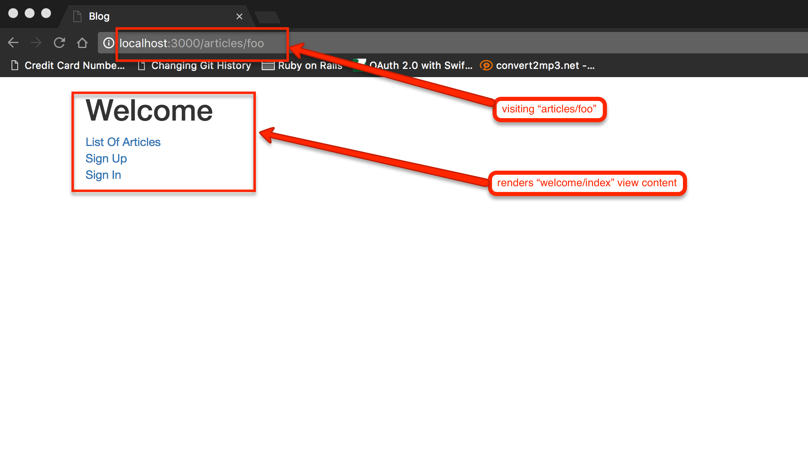

Nice! We just saw how we can render a view that resides on a folder that does not correspond to our controller, but corresponds to action
of another controller.

### Rendering Text

The `render` can be used to send back to the browser a plain text string, without HTML markup. This might be useful when responding
to AJAX requests for example (more about AJAX in following chapters)

Let's see an example. We will introduce the `bar` action inside the Articles Controller. Here is the routes file:

``` ruby
 1. # File: config/routes.rb
 2. #
 3. Rails.application.routes.draw do
 4.   resources :articles do
 5.     collection do
 6.       get :foo
 7.       get :bar
 8.     end
 9.   end
10. 
...
23. end
```

As you can see, we have added the `get :bar` route. If you print the routes, you will get this:

``` bash
blog $ bin/rake routes
                     Prefix Verb   URI Pattern                             Controller#Action
                foo_articles GET    /articles/foo(.:format)                 articles#foo
                bar_articles GET    /articles/bar(.:format)                 articles#bar
...
blog $
```

Let's implement the action inside the controller:

``` ruby
 1. # File: app/controllers/articles_controller.rb
 2. #
 3. class ArticlesController < ApplicationController
 4.   skip_before_action :authenticate_user, only: [:index, :show, :foo, :bar]
 5.   before_action :find_article, only: [:show, :edit, :update, :destroy]
 6.   before_action :authorize_user, except: [:new, :create, :index, :show, :foo, :bar]
...   
47.   def bar
48.     render plain: 'OK'
49.   end
50. 
...
67. end
```

Do you see lines 47 and 49? These are the implementation of the `bar` action. You can see there that we call `render` giving as
argument `plain: 'OK'`. 

Declare the `:bar` symbol in the lists on lines 4 and 6. Then, save and visit this page: 
[http://localhost:3000/articles/bar](http://localhost:3000/articles/bar). You will see this:

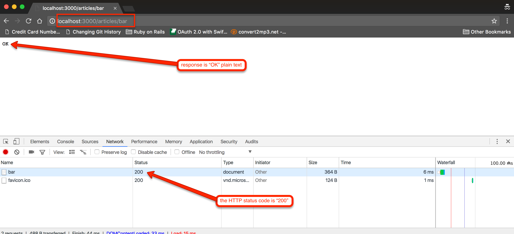

As you can see above, the HTTP Response status code is 200.

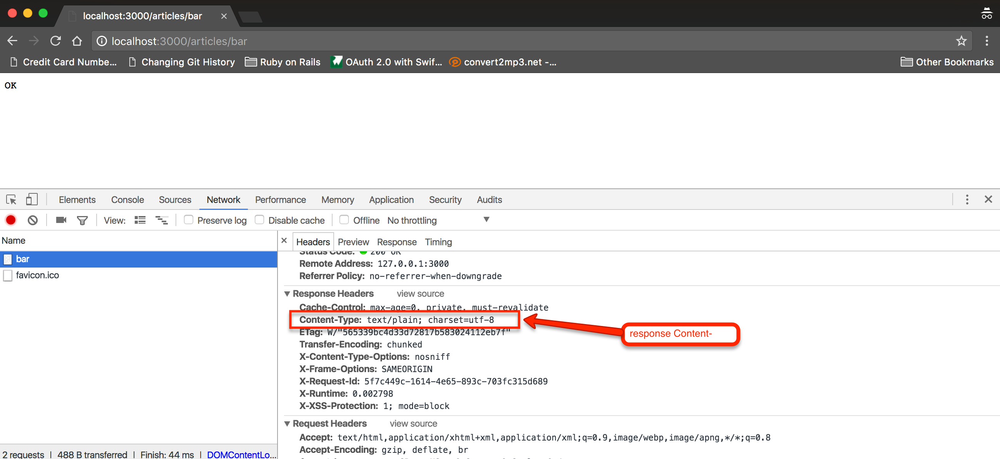

Also, the `Content-Type` response header is `text/plain`.

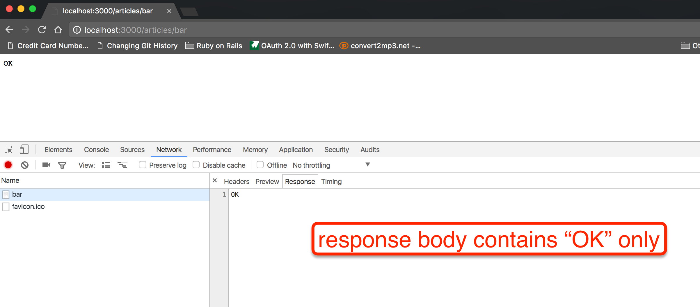

And the response body contains only the text `OK`. It is not HTML markup.

### Rendering JSON

When your Web application offers a REST API, it is very common that instead of returning HTML to be returning JSON or XML formatted information. `render` allows you
to quickly send back a JSON response.

Let's expose an Article with its JSON representation. In other words, we are going to implement the end point `http://localhost:3000/articles/:id.json`. With the `.json`
suffix we ask Rails to return back a JSON representation of the resource. 

Visit a page of a specific Article and then visit the same page with the suffix `.json`. You will get an error like in the following video:

<div id="media-container-video-We get error when visiting an article with JSON format not supported">
  <a href="https://player.vimeo.com/video/226108870"></a>
</div>

It is very easy to support the JSON response in this case. We need to implement the `show` method inside the `ArticlesController` as follows:

``` ruby
 1. # File: app/controllers/articles_controller.rb
 2. #
 3. class ArticlesController < ApplicationController
...
50. 
51.   def show
52.     if request.format.json?
53.       render json: @article
54.     end
55.   end
56. 
...
73. end
```

The above `show` implementation calls `render json: @article` when the requested format is JSON. Save and try to visit the page again. You will see this:

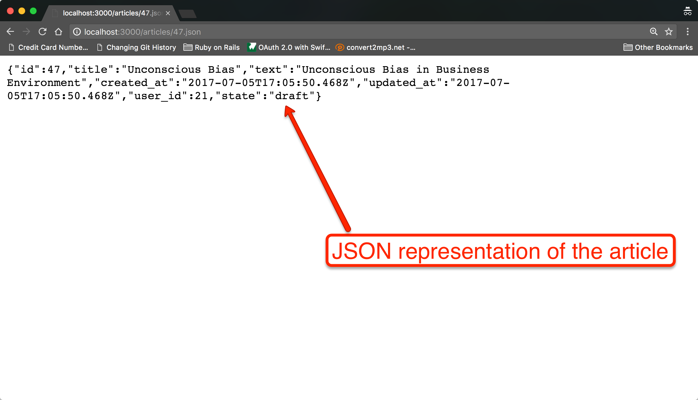

And the "Content-Type" response header has the value `application/json`:

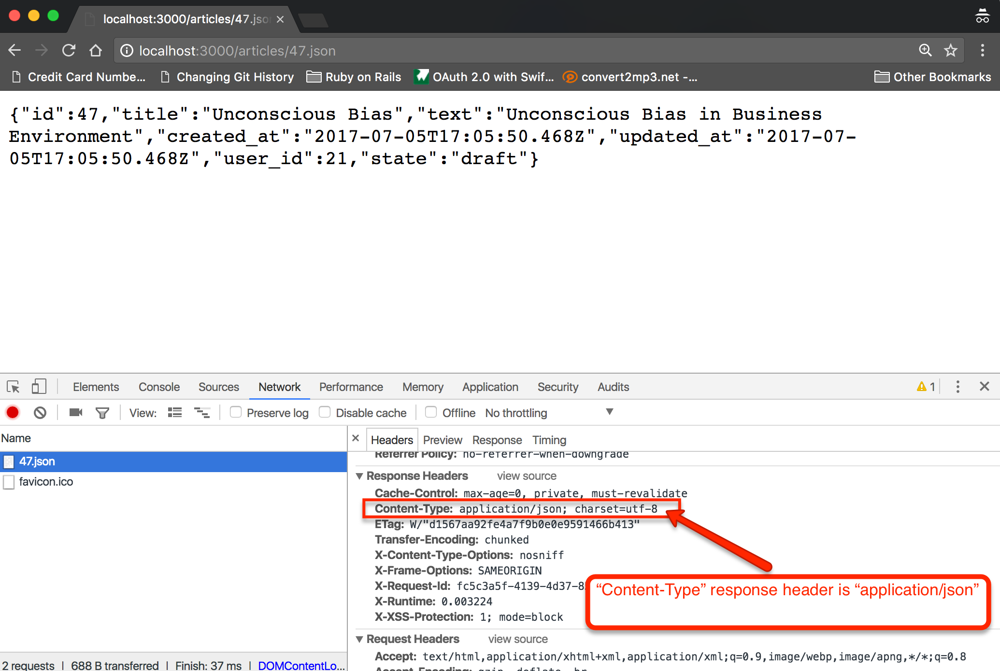

### Rendering XML

Similarly to JSON, the `render xml: @article` would return an XML representation of the resource. However, more provisions should be
taken care of to return a proper XML document back to the browser. This is not in the scope of this chapter.

### Rendering Status Code

One very important option that `render` command takes is the `status` option. Generally, the response status code is `200 Ok`, but with the `status`
option you can send back to the client a different status code.

Let's see what status code it is returned by the `create` action when the `create` fails, i.e. when `Article` is invalid. Here is the `create` action again:

``` ruby
 1. # File: app/controllers/articles_controller.rb
 2. #
 3. class ArticlesController < ApplicationController
...
12.   def create
13.     article = Article.new(article_params.merge({user: current_user}))
14.     if article.save
15.       flash[:success] = 'Article has been created!'
16.       redirect_to edit_article_url(article)
17.     else
18.       @article = article
19.       render :new
20.     end
21.   end
...
73. end
```

Do you see line 19? We just call `render :new` when the article cannot be saved. What status code do we return? Try creating an invalid article
and then see Rails logs or inspect Network with developer tools. You will see something like this:

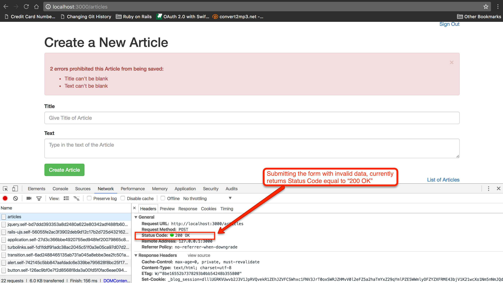

``` bash
Started POST "/articles" for 127.0.0.1 at 2017-07-20 19:37:19 +0300
Processing by ArticlesController#create as HTML
  Parameters: {"utf8"=>"✓", "authenticity_token"=>".........", "article"=>{"title"=>"", "text"=>""}, "commit"=>"Create Article"}
...
Completed 200 OK in 72ms (Views: 64.6ms | ActiveRecord: 2.9ms)
```

Do you see the `Completed 200 OK` in the logs?

This is not considered generally correct. And we should fix it. We should be returning a 4XX status code, preferably 422 in our case. 422 means _unprocessable entity_ and
it is a convention to return this code when the data sent by the client are invalid.

Here is how we should change our `create` action:

``` ruby
 1. # File: app/controllers/articles_controller.rb
 2. #
 3. class ArticlesController < ApplicationController
... 
12.   def create
13.     article = Article.new(article_params.merge({user: current_user}))
14.     if article.save
15.       flash[:success] = 'Article has been created!'
16.       redirect_to edit_article_url(article)
17.     else
18.       @article = article
19.       render :new, status: :unprocessable_entity
20.     end
21.   end
22. 
...
73. end
```

So, we turned the `render :new` to `render :new, status: :unprocessable_entity`. If you try to submit an invalid Article again, you will
see the Network information on your Developer tools telling you with red color that the response status code was 422 Unprocessable Entity:


And the Rails logs:

``` bash
Started POST "/articles" for 127.0.0.1 at 2017-07-20 19:46:32 +0300
Processing by ArticlesController#create as HTML
  Parameters: {"utf8"=>"✓", "authenticity_token"=>".......................", "article"=>{"title"=>"", "text"=>""}, "commit"=>"Create Article"}
...
Completed 422 Unprocessable Entity in 290ms (Views: 179.9ms | ActiveRecord: 31.2ms)
```

And that is the correct behaviour.

Which other points in your `blog` controllers need to be updated accordingly? I.e. to return the correct status code?

1. The `update` action of `ArticlesController`. When the update is invalid, then you should `render` with status code 422. Please, go ahead and do it.
1. The `create` action of `SignInController`. When it fails to sign in the user, then it should `render` with status code 401 (or 403). Please, go ahead and do it. See which
constant symbol corresponds to 401 (or 403) code below.
1. The `create` action of `SignUpController`. When it fails to sign up a user, then it should `render` with status code 422 (or 401, or 403). Please, go ahead and do it.

Note that the `status` option can either take as value the standard HTTP Status Code integer, like `200` or `422`, or the corresponding
symbol. The symbols make your code more readable. The list of status code integers and their corresponding symbols can be found [here](http://guides.rubyonrails.org/layouts_and_rendering.html#the-status-option).

## Layouts

We have already told that the views are usually rendered inside a layout. Which one?

First Rails checks for a controller-specific layout, inside the folder `app/views/layouts`. So, for an action that belongs to `ArticlesController`, 
it tries to find the layout with name `app/views/layouts/articles.html.haml`. 
 
If this file is not found, then Rails will use the layout `app/views/layouts/application.html.haml`. 

Moreover, besides the above, there are other ways you can tell which layout to be used.

### Specify Layout At Controller Definition

You can call the class level method `layout` and specify the layout of a particular controller. For example:

``` ruby
class ArticlesController < ApplicationController
  layout 'fantastic_articles'
...
end
```

If you do that, then all the actions will be rendering their views inside the `app/views/layouts/fantastic_articles.html.haml` layout.

### Specify Layout At Runtime

Or you can choose which layout to pick up based on runtime parameters. 

``` ruby
class ArticlesController < ApplicationController
  layout :choose_articles_layout
...
  private
  
  def choose_articles_layout
    if current_user
      'logged_in_user_articles'
    else
      'logged_out_user_articles'
    end
  end
end
```

As you can see above, we bind a method implementation to the `layout` call. This method will be called every time a request for ArticlesController
is being served. And it will determine the layout to use based on whether the user is logged in or not.

### No Layout

And if you send `false` to `layout`, then no layout will be used:

``` ruby
class ArticlesController < ApplicationController
  layout false
...
end
```

## Asset Tag Helpers

Rails provides you with asset tag helpers that help you link views to various assets, like

- *feeds*
- *JavaScript*
- *Stylesheets*
- *Images*
- *Videos*
- *Audios*

Although you can use the helpers both in layouts and views, the first three, *feeds*, *JavaScript* and *Stylesheets* are
usually used in layouts.

### feeds

For *feeds*, you should use the `auto_discovery_link_tag` helper. More about this [here](http://guides.rubyonrails.org/layouts_and_rendering.html#linking-to-feeds-with-the-auto-discovery-link-tag).

### JavaScript

For JavaScript references, you should be using the `javascript_include_tag`. Look at the `blog` application `app/views/layouts/application.html.haml` file:


``` haml
 1. !!!
 2. %html
 3.   %head
 4.     %meta{:content => "text/html; charset=UTF-8", "http-equiv" => "Content-Type"}/
 5.     %title Blog
 6.     = csrf_meta_tags
 7.     = stylesheet_link_tag    'application', media: 'all', 'data-turbolinks-track': 'reload'
 8.     = javascript_include_tag 'application', 'data-turbolinks-track': 'reload'
 9.   %body
10.     .container
11.       = render partial: 'layouts/flash'
12.       = render partial: 'layouts/signed_in_user'
13.       = yield
```

Do you see line 8? The `javascript_include_tag` call? If you inspect any of the pages using this layout you can also tell which HTML fragment this
call is generating:

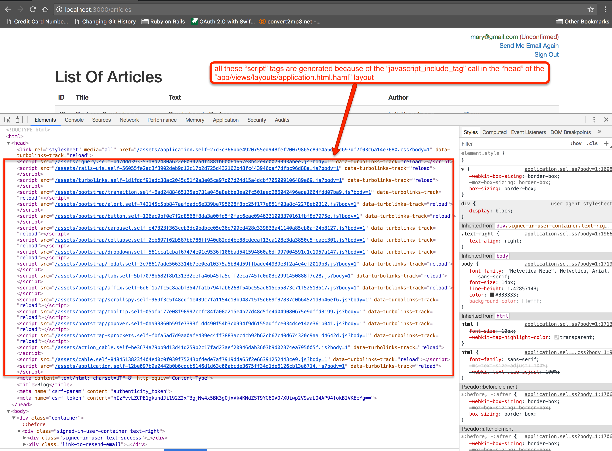

As you can see above, the `= javascript_include_tag 'application', 'data-turbolinks-track': 'reload'` statement, generates a series
of `<script>` tags with content referencing various JavaScript files. According to what is defined inside the `app/assets/javascripts/application.js` file.

> *Information:* In `production` environment, the `javascript_include_tag` makes sure that all the JavaScript files referenced by
the `app/assets/javascripts/application.js` file are being combined into one file and its content is compressed so that it consumes the least
bandwidth possible.

### StyleSheets

The proper way to include references to stylesheets is to use the `stylesheet_link_tag`. Like we do inside the `app/views/layouts/application.html.haml` layout, line 7.
This tag generates a `<link>` tag referencing the appropriate stylesheet resource:

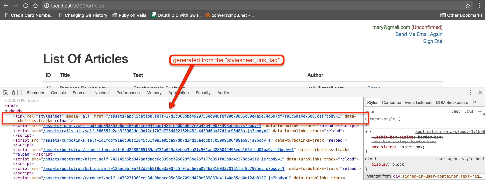

### Images

Image tags in HTML are the `` tags, as we have already learned from the HTML section. In order to generate such tags in Rails views and layouts,
you should be using the `image_tag` helper. Let's add a pencil image:


Put this image inside the folder `app/views/assets/images`. 

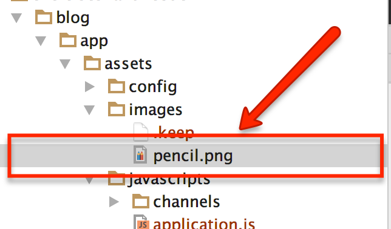

Now reference this image from within view file `app/views/articles/edit.html.haml`. This is how we can do that:

``` haml
 1. - # File: app/views/articles/edit.html.haml
 2. - #
 3. = image_tag 'pencil.png', size: '150x150', alt: './images/Pencil Image Editing an Article'
 4. 
 5. %h1 Update Article with ID: #{@article.id}
 6. 
 7. = render partial: 'articles/form'
 8. 
 9. .text-right
10.   = link_to 'List of Articles', articles_path
```

Do you see line 3? This will generate the correct `` tag inside the page that is used to edit an article. Here is what you will see when you
will load the edit page of an article:

)
If you inspect the page source around the image displayed, you will see this:

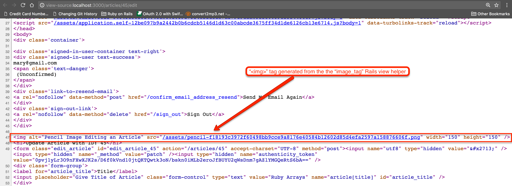

As you can see, the images, even if stored inside `app/assets/images/` folder, they are being served by the route `/assets`. The responsible
piece of code for this is the gem [sprockets](https://github.com/rails/sprockets) and what we call asset pipeline. We will talk about it in a later chapter.

### Videos

In order to generate the `<video>` HTML tag, you should be using the `video_tag` helper.

### Audios

In order to generate the `<audio>` HTML tag, you should be using the `audio_tag` helper.

## Unnamed and Named `yield`

We already know that a view content is being embedded into the layout content. This is done at the point where the layout content calls `= yield`. See the
`app/views/layouts/application.html.haml`:

``` haml
 1. !!!
 2. %html
 3.   %head
 4.     %meta{:content => "text/html; charset=UTF-8", "http-equiv" => "Content-Type"}/
 5.     %title Blog
 6.     = csrf_meta_tags
 7.     = stylesheet_link_tag    'application', media: 'all', 'data-turbolinks-track': 'reload'
 8.     = javascript_include_tag 'application', 'data-turbolinks-track': 'reload'
 9.   %body
10.     .container
11.       = render partial: 'layouts/flash'
12.       = render partial: 'layouts/signed_in_user'
13.       = yield
```

Do you see line 13? This is where the view content will sit on. 

This is the case of the *unnamed yield*. Except from that, you can also have named yields. The named yields are calls like `= yield :menu`. This is
a named yield with name `:menu`. The call to `= yield :menu` will render the content that has been assigned to the `:menu` yield using the
method `content_for`. 

Let's see that. Let's amend the `app/views/layouts/application.html.haml` to rely on a named yield too:

``` ruby
 1. !!!
 2. %html
 3.   %head
 4.     %meta{:content => "text/html; charset=UTF-8", "http-equiv" => "Content-Type"}/
 5.     %title Blog
 6.     = csrf_meta_tags
 7.     = stylesheet_link_tag    'application', media: 'all', 'data-turbolinks-track': 'reload'
 8.     = javascript_include_tag 'application', 'data-turbolinks-track': 'reload'
 9.   %body
10.     .container
11.       = render partial: 'layouts/flash'
12.       = render partial: 'layouts/signed_in_user'
13.       = yield :menu
14.       = yield
```

With this amendment in the layout, you can have a view setting content for the `:menu` yield. For example, we can have the list of articles
view to set content to `:menu` yield as follows:

``` ruby
 1. - # File: app/views/articles/index.html.haml
 2. - #
 3. %h1 List Of Articles
 4. %table.table.table-striped
...
25.             = link_to 'Delete', article_path(article), method: :delete, class: 'btn btn-danger', data: {confirm: 'Are you sure that you want to delete this Article?'}
26. 
27. - content_for :menu do
28.   - if current_user
29.     %div
30.       = link_to 'Create Another Article', new_article_path
31.   %div
32.     = link_to 'Home', root_path
```

Look at line 27 to 32. This is a block of HAML code that defines the content for the `:menu` yield. Hence, the view specifies what content will replace
the `= yield :menu` call inside the `app/views/layouts/application.html.haml`.

Now, if you load the list of articles, you will see this:

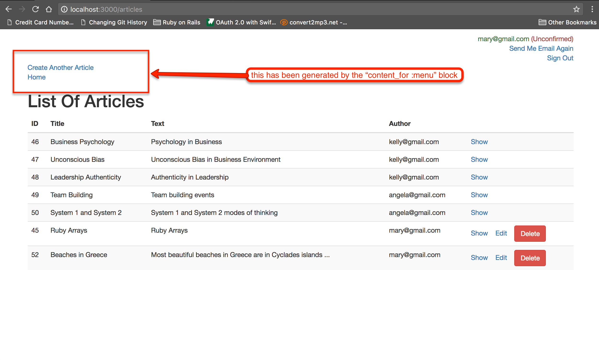

Now, you can understand that each view that relies on the `app/views/layouts/application.html.haml` can now specify its own content for the `:menu` part of the
layout.

## Partials

Partials is a tool that allows you to write reusable view and layout code, or in order to make your views easier to read, by breaking it into smaller
chunks of view code, each residing in its own partial.
 
We have already used this tool in our `blog` application.

For example:

in `app/views/articles/_form.html.haml`. This is where we call 

 ```
 = render partial: 'shared/errors', locals: { model: @article, explanation: 'prohibited this Article from being saved:' }
 ```

Note that a partial can use its own layout file. For example:

 ```
 = render partial: 'shared/errors', locals: { model: @article, explanation: 'prohibited this Article from being saved:' }, layout: 'errors_layout'
 ```

The `app/views/articles/_errors_layout.html.haml` is the file that will be used for the rendering of the partial `app/views/shared/errors`.

Also, `render` for a `partial` has the ability to render the partial for all the members of a collection. Let's see that with the
Articles index page.

First, let's create the partial that would render a single article. This is the new file `app/views/articles/_article.html.haml`. Please,
note that the partial has to have the same name as the resource it renders.

``` haml
 1. - # File: app/views/articles/_article.html.haml
 2. - #
 3. %tr
 4.   %td= article.id
 5.   %td= article.title
 6.   %td= article.text
 7.   %td= article.user.email
 8.   %td
 9.     = link_to 'Show', article_path(article)
10.     - if current_user && current_user.can_write_article?(article)
11.       &nbsp;&nbsp;
12.       = link_to 'Edit', edit_article_path(article)
13.       &nbsp;&nbsp;
14.       = link_to 'Delete', article_path(article), method: :delete, class: 'btn btn-danger', data: {confirm: 'Are you sure that you want to delete this Article?'}
```

Now, change the content of the file `app/views/articles/index.html.haml` in order to render this partial as follows:

``` haml
 1. - # File: app/views/articles/index.html.haml
 2. - #
 3. %h1 List Of Articles
 4. %table.table.table-striped
 5.   %thead
 6.     %tr
 7.       %th ID
 8.       %th Title
 9.       %th Text
10.       %th Author
11.       %th
12.   %tbody
13.     = render partial: 'articles/article', collection: @articles
14. 
15. - content_for :menu do
16.   - if current_user
17.     %div
18.       = link_to 'Create Another Article', new_article_path
19.   %div
20.     = link_to 'Home', root_path
```

Do you see line 13? This is the line that replace this whole block that was previously there:

``` haml
%tr
  %td= article.id
  %td= article.title
  %td= article.text
  %td= article.user.email
  %td
    = link_to 'Show', article_path(article)
    - if current_user && current_user.can_write_article?(article)
      &nbsp;&nbsp;
      = link_to 'Edit', edit_article_path(article)
      &nbsp;&nbsp;
      = link_to 'Delete', article_path(article), method: :delete, class: 'btn btn-danger', data: {confirm: 'Are you sure that you want to delete this Article?'}
```

and which has now been moved inside the `app/view/articles/_article.html.haml`.


The `= render partial: 'articles/article', collection: @articles` tells Rails that the partial `articles/article` needs to be rendered
for each one of the items in the collection `@articles`. Note that the variable `article` will be the local variable inside the partial
that can be used to access the resource being used every time for rendering.

## Action View Form Helpers

We have already used helpers that help us build forms in our views. For example, we have used

1. the `form_for` to build a form for a resource.
1. the `f.label` to build a label.
1. the `f.text_field` to build an input of type `text`.
1. the `f.text_area` to build a `<textarea>` tag.
1. the `f.submit` to build an input of type `submit`.

Let's revisit these tools and also let's talk about some more form view helpers. We will try to use some examples while we
will be learning about these view helpers.

### Search Form

Let's create a search form that will be used to search for the Articles:

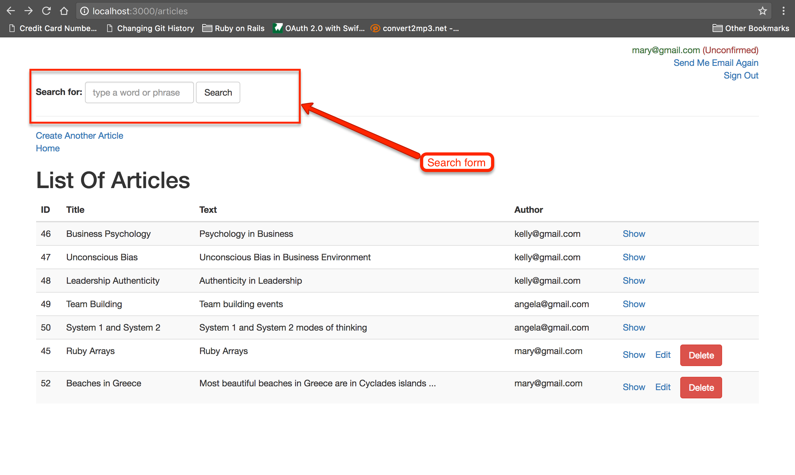

We want this form to be visible on every page, so, we will render it from the application layout:

``` haml
 1. - # File: app/views/layouts/application.html.haml
 2. - #
 3. !!!
...
13.       = render partial: 'layouts/flash'
14.       = render partial: 'layouts/signed_in_user'
15.       = render partial: 'layouts/search'
16.       = yield :menu
17.       = yield
```

Do you see line 15? `= render partial: 'layouts/search'` is the call to render the partial `layouts/search`. Let's create this partial (file: `app/views/layouts/_search.html.haml`):

``` haml
 1. - # File: app/views/layouts/_search.html.haml
 2. - #
 3. = form_tag articles_path, method: :get, class: 'form-inline' do
 4.   .form-group
 5.     = label_tag :q, 'Search for:'
 6.     = text_field_tag :q, params[:q], class: 'form-control', placeholder: 'type a word or phrase'
 7. 
 8.   = submit_tag 'Search', class: 'btn btn-default'
 9. 
10. %hr
```

What you need to pay attention to are the following:

1. The `form_tag` which is to generate a `<form>` element.
1. The `:method` option which is now set to `:get`. Note that the default `:method` value is `:post`. But, usually, the search forms
are submitted with `:get` because we do not change the state of any resource in the server.
1. The `label_tag` that generates a `<label>` element. It makes sure that it sets its `for` HTML attribute pointing to the correct input control.
1. The `text_field_tag` that generates the `<input>` of type `text`. 
1. The `submit_tag` that generates the `<input>` of type `submit`.

You can inspect the source of the page at the form generated. You will see something like this:

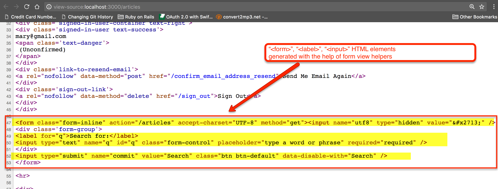

See how the `form_tag`, `label_tag`, `text_field_tag` and `submit_tag` generated the appropriate HTML markup. 

Now, let's submit the form. Give some text and click on `Search` button. Nothing happens actually. If you see the
Rails logs, you will see something like this:

``` bash
Started GET "/articles?utf8=%E2%9C%93&q=ruby&commit=Search" for 127.0.0.1 at 2017-07-21 11:24:19 +0300
Processing by ArticlesController#index as HTML
  Parameters: {"utf8"=>"✓", "q"=>"ruby", "commit"=>"Search"}
  Rendering articles/index.html.haml within layouts/application
  Article Load (0.4ms)  SELECT "articles".* FROM "articles"
...
  Rendered layouts/_signed_in_user.html.haml (4.7ms) [cache miss]
  Rendered layouts/_search.html.haml (2.4ms) [cache miss]
Completed 200 OK in 106ms (Views: 101.8ms | ActiveRecord: 1.4ms)
```

It was the action `index` inside `ArticlesController` that handled the request. One of the parameters was `q` with value equal to the
word that you typed in the search form. I have typed `ruby` and that is why you see `"q"=>"ruby"`. 

Let's enhance our `index` action to take care of the `q` value submitted.

``` ruby
 1. # File: app/controllers/articles_controller.rb
 2. #
 3. class ArticlesController < ApplicationController
...
23.   def index
24.     @articles = Article.all
25. 
26.     q = params[:q]
27.     if q.present?
28.       @articles = @articles.where("title ilike :q or text ilike :q", q: "%#{q}%")
29.     end
30.   end
...
78. end
```

This is a very simple method implementation. Initially, we get an Active Record Relation that specifies a query to bring all the
Articles. But if `params[:q]` is present, then we further limit the articles to those that they have `title` or `text` that includes
the word given in `params[:q]`.

### Other HTML Input Elements

Besides the helpers that we saw earlier, Rails provides us with helpers to generate any standard HTML element.

#### Checkboxes

They are generated with `check_box_tag` helper.

#### Radio Buttons

They are generated with the `radio_button_tag` helper.

#### Text Areas

They are generated with the `text_area_tag` helper.

#### Password Fields

They are generated with the `password_field_tag` helper.

#### Hidden Fields

They are generated with the `hidden_field_tag` helper.
 
#### Search Fields

They are generated with the `search_field_tag` helper.

#### Telephone Fields

They are generated with the `telephone_field_tag` helper.

#### Date Fields

They are generated with the `date_field_tag` helper.

#### Month Fields

They are generated with the `month_field_tag` helper.

#### Week Fields

They are generated with the `week_field_tag` helper.

#### URL Fields

They are generated with the `url_field_tag` helper.

#### Email Fields

They are generated with the `email_field_tag` helper.

#### Color Fields

They are generated with the `color_field_tag` helper.

#### Time Fields

They are generated with the `time_field_tag` helper.

#### Number Fields

They are generated with the `number_field_tag` helper.

#### Range Fields

They are generated with the `range_field_tag` helper.

### Models And Forms

Although we can always use the `*_tag` helpers that we saw above, Rails provides us with the helpers that are bound to
a specific model instance. See for example the `app/views/articles/_form.html.haml` file:

``` ruby
 1. - # File: app/views/articles/_form.html.haml
 2. - #
 3. = form_for @article do |f|
 4.   = render partial: 'shared/errors', locals: {model: @article, explanation: 'prohibited this Article from being saved:'}
 5. 
 6.   .form-group
 7.     = f.label :title
 8.     = f.text_field :title, placeholder: 'Give Title of Article', class: 'form-control'
 9. 
10.   .form-group
11.     = f.label :text
12.     = f.text_area :text, placeholder: 'Type in the text of the Article', class: 'form-control'
13. 
14.   %div
15.     = f.submit class: 'btn btn-success'
```

Look on line 7, for example. We don't call `label_tag`. Instead, we call `f.label`. The `f` is a block level variable
that holds a form builder that is bound to the model given to the `form_for` method call.
 
Another example is the `f.text_field :title`. This is going to create an input of type `text` with name and id bound
to the `@article` instance:

``` ruby
<input type="text" name="article[text]" id="article_text" value="foo bar"/>
```
assuming that `foo bar` is the value of the `text` attribute of the `@article` instance.

### Select Boxes

Select boxes can be really complicated but Rails Action View helpers can make the creation of select boxes quite easy.

Let's see how we can work with select boxes, using an example.

Let's suppose that we want to ask the user to give their country, when signing up. Something like this:

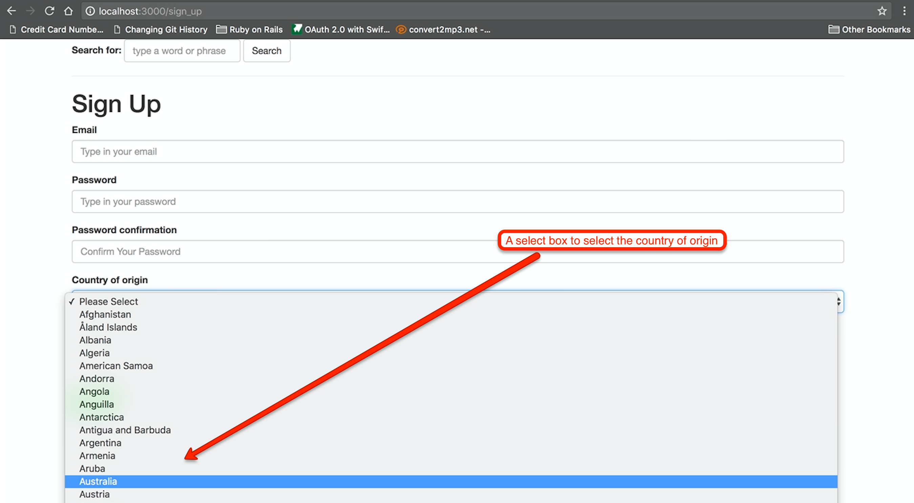

In order to achieve this, we first need to enhance our domain model. 

1. We need to introduce the `Country` model.
1. We need to associate `User` to `Country`.

This is what we have to do:

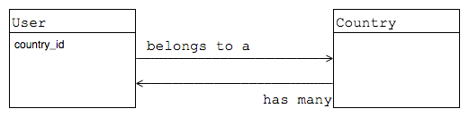

#### countries Table

Let's start with the `countries` table that would support the `Country` model. We generate the migration file first:

``` bash
blog $ bin/rails generate migration create_countries
      invoke  active_record
      create    db/migrate/20170721182425_create_countries.rb
blog $
```

Let's edit the file `db/migrate/20170721182425_create_countries.rb` so that it is like this:

``` ruby
 1. # File: db/migrate/20170721182425_create_countries.rb
 2. #
 3. class CreateCountries < ActiveRecord::Migration[5.1]
 4.   def change
 5.     create_table :countries do |t|
 6.       t.string :alpha_2_code, null: false, limit: 2
 7.       t.string :name, null: false # we will be storing the country name downcase.
 8. 
 9.       t.timestamps
10.     end
11. 
12.     add_index :countries, [:alpha_2_code], unique: true, name: 'countries_alpha_2_code_uidx'
13.     add_index :countries, [:name], unique: true, name: 'countries_name_uidx'
14. 
15.     reversible do |dir|
16.       dir.up do
17.         require 'csv'
18. 
19.         file_path = File.join(File.expand_path('..', __FILE__), '..', 'countries.csv')
20.         CSV.foreach(file_path) do |row|
21.           # _gsub_ below: making any single quote that is part of the value to be two single quotes. E.g. "Côte d'Ivoire" becomes "Côte d''Ivoire"
22.           # so that the _insert into_ command later on, which takes the _values_ enclosed in single quotes will not fail.
23. 
24.           alpha_2_code = row[0].gsub(/'/, "''")
25.           name = row[1].gsub(/'/, "''").downcase # Storing downcase so that we can compare without worrying about case sensitivity.
26.           execute <<-SQL
27.             insert into countries (alpha_2_code, name, created_at, updated_at) values ('#{alpha_2_code}', '#{name}', current_timestamp, current_timestamp)
28.           SQL
29.         end
30.       end
31.     end
32.   end
33. end
```

All the commands above are already known to you. Maybe, the only new thing to you is the way we populate the table `countries` with the countries. We are using
a file `countries.csv` which is stored inside the folder `db`. This is a CSV file and you can download it from the following link:
 
[Countries CSV file](https://s3.amazonaws.com/tech-career-booster-courses/01-full-stack-web-developer/sections/15-ruby-on-rails/chapters/08-more-about-views/assets/images/countries.csv)

Note that the technique that we are using is to use pure SQL with `insert into countries` statements for each one of the entries in the CSV file. We do this,
because we have not defined our `Country` model yet. Of course, this is only one way this import can be accomplished. You may have already thought about other ways
that you could import this file into the database.

> *Hint:* The `File.expand_path('..', __FILE__)` returns the current folder of the file at hand. Hence in our case, in which we have the file `db/migrate/20170721182425_create_countries.rb`
it will return `db/migrate`. The `File.join` on the other hand, it is a standard way to concatenate path fragments in order to build a full path. In Windows it does
a concatenation using the backslash (`\`) character. In Linux/OS X it does that with the forward slash (`/`) character. Hence, the
`File.join(File.expand_path('..', __FILE__), '..', 'countries.csv')` returns `db/../countries.csv` in Linux/OS X, whereas it returns `db\..\countries.csv` in Windows.

Now run the migration:

``` bash
blog $ bin/rake db:migrate
== 20170721182425 CreateCountries: migrating ==================================
-- create_table(:countries)
   -> 0.0067s
-- add_index(:countries, [:alpha_2_code], {:unique=>true, :name=>"countries_alpha_2_code_uidx"})
   -> 0.0030s
-- add_index(:countries, [:name], {:unique=>true, :name=>"countries_name_uidx"})
   -> 0.0021s
-- execute("            insert into countries (alpha_2_code, name, created_at, updated_at) values ('AF', 'afghanistan', current_timestamp, current_timestamp)\n")
   -> 0.0009s
-- execute("            insert into countries (alpha_2_code, name, created_at, updated_at) values ('AX', 'Åland islands', current_timestamp, current_timestamp)\n")
   -> 0.0003s
...
-- execute("            insert into countries (alpha_2_code, name, created_at, updated_at) values ('ZW', 'zimbabwe', current_timestamp, current_timestamp)\n")
   -> 0.0003s
== 20170721182425 CreateCountries: migrated (0.1617s) =========================

blog $
```

The migration runs successfully and you now have all the countries defined inside the `countries` table. The following brings the first 5 rows from this table
just to confirm what it is inside.

``` bash
blog $ psql -d blog_development -c "select * from countries limit 5 offset 0;"
 id | alpha_2_code |      name      |         created_at         |         updated_at         
----+--------------+----------------+----------------------------+----------------------------
  1 | AF           | afghanistan    | 2017-07-21 18:57:06.963825 | 2017-07-21 18:57:06.963825
  2 | AX           | Åland islands  | 2017-07-21 18:57:06.963825 | 2017-07-21 18:57:06.963825
  3 | AL           | albania        | 2017-07-21 18:57:06.963825 | 2017-07-21 18:57:06.963825
  4 | DZ           | algeria        | 2017-07-21 18:57:06.963825 | 2017-07-21 18:57:06.963825
  5 | AS           | american samoa | 2017-07-21 18:57:06.963825 | 2017-07-21 18:57:06.963825
(5 rows)
blog $
```

#### users Table Amendment

We will need to add the column `country_id` into the `users` table. This will be the foreign key to the countries. Let's generate 
the migration file:

``` bash
blog $ bin/rails generate migration add_country_id_to_users
      invoke  active_record
      create    db/migrate/20170721192820_add_country_id_to_users.rb
blog $
```

Let's edit the file `db/migrate/20170721192820_add_country_id_to_users.rb`:

``` ruby
1. # File: db/migrate/20170721192820_add_country_id_to_users.rb
2. #
3. class AddCountryIdToUsers < ActiveRecord::Migration[5.1]
4.   def change
5.     change_table :users do |t|
6.       t.references :country, foreign_key: {name: 'users_country_fk'}, index: {name: 'users_country_idx'}
7.     end
8.   end
9. end
```

This is quite straightforward. It just adds the column `country_id` and the foreign key and the index.

Let's run the migration:

``` bash
blog $ bin/rake db:migrate

== 20170721192820 AddCountryIdToUsers: migrating ==============================
-- change_table(:users)
   -> 0.0084s
== 20170721192820 AddCountryIdToUsers: migrated (0.0084s) =====================

blog $
```

You can also confirm the results by running the following command on your shell:

``` bash
blog $ psql -d blog_development -c "\d+ users"
                                                                Table "public.users"
          Column          |            Type             |                     Modifiers                      | Storage  | Stats target | Description 
--------------------------+-----------------------------+----------------------------------------------------+----------+--------------+-------------
 id                       | bigint                      | not null default nextval('users_id_seq'::regclass) | plain    |              | 
 email                    | character varying           | not null                                           | extended |              | 
 password_digest          | character varying           | not null                                           | extended |              | 
 created_at               | timestamp without time zone | not null                                           | plain    |              | 
 updated_at               | timestamp without time zone | not null                                           | plain    |              | 
 email_confirmation_token | character varying           |                                                    | extended |              | 
 terms_of_service         | boolean                     | not null default false                             | plain    |              | 
 country_id               | bigint                      |                                                    | plain    |              | 
Indexes:
    "users_pkey" PRIMARY KEY, btree (id)
    "users_email_uidx" UNIQUE, btree (email)
    "users_country_idx" btree (country_id)
Foreign-key constraints:
    "users_country_fk" FOREIGN KEY (country_id) REFERENCES countries(id)
Referenced by:
    TABLE "articles" CONSTRAINT "articles_user_id_users_id_fk" FOREIGN KEY (user_id) REFERENCES users(id)

blog $
```

Do you see the `country_id` as the last column of the table? Also, do you see the index `users_country_idx` and the foreign key constraint
`users_country_fk` ? These have been created by our last migration.

#### User and Country Model

Now, lets amend the `User` model and create the `Country` Model.

This is the amended `User` model:

``` ruby
1. # File app/models/user.rb
2. #
3. class User < ApplicationRecord
4.   has_many :articles, dependent: :destroy
5.   belongs_to :country
...
33. end
```

We have added line 5, `belongs_to :country`.

Let's now create the `Country` model:

``` ruby
1. # File: app/models/country.rb
2. #
3. class Country < ApplicationRecord
4.   has_many :users
5.   
6.   validates :alpha_2_code, presence: true, uniqueness: {case_sensitive: false}
7.   validates :name, presence: true, uniqueness: {case_sensitive: false}
8. end
```

Very simple model with nothing new to what we already know.

#### Amend the Sign Up Form

With the models in place, we can now amend the sign up form to include the select box for the country of the user.

``` haml
 1. - # File: app/views/sign_up/new.html.haml
 2. - #
 3. %h1 Sign Up
 4. 
 5. = form_for @user, url: sign_up_path, method: :post do |f|
 6. 
...
20. 
21.   .form-group
22.     = f.label :country_id, 'Country of Origin'
23.     = f.collection_select :country_id, Country.all, :id, :name, {include_blank: 'Please, Select'}, {class: 'form-control'}
24. 
25.   .terms-of-service
...
38.   = link_to 'Home', root_path
```

We have added lines 21 to 23. The things that you need to be aware of are the following:

1. Since a `User` `belongs_to` a `Country` and there is an association `country` on the `User` model, this means that
we have the `country_id` that we want to set on the `User` instance. Hence, we have to define the `f.collection_select`
on the `:country_id` and not on the `:country`. 
1. The next argument to the `f.collection_select` is the collection that the options will be built from.
1. The next two arguments, `:id, :name` tell which methods from the collection instances return the *value* and the *text*
of the `<option>` tag.
1. The `include_blank` is used to include a blank value option at the top with a prompt for the user to select a country.
1. The html options are given in its own Hash. For example `{class: 'form-control'}` sets the class of the `<select>` tag.

If you save the above, restart your server in order to take into account the new tables, and visit the sign up page, you will see this:

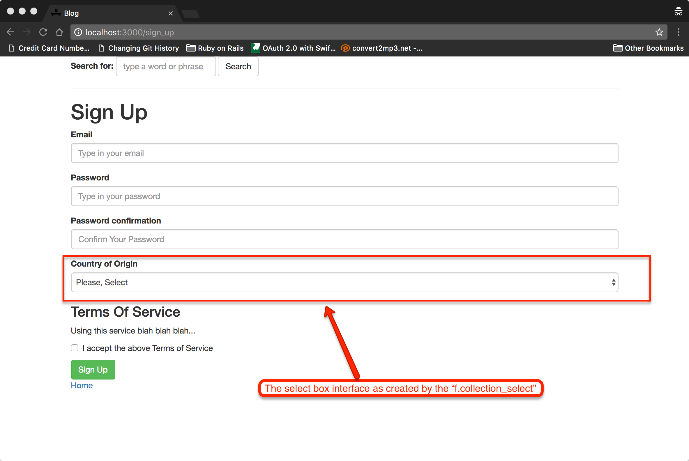

And the HTML markup generated is as follows:

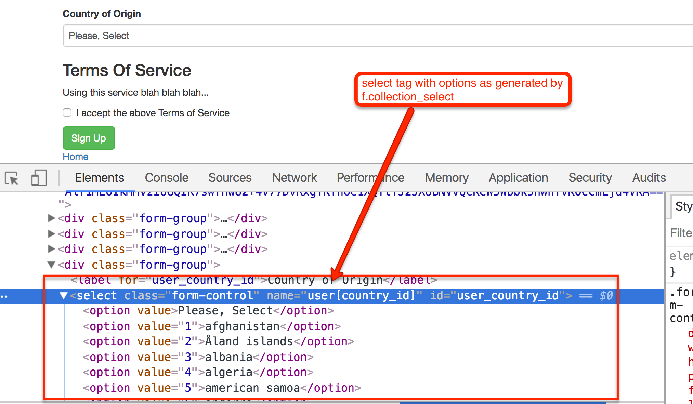

It was easy, wasn't it? The problem however is that the names are displayed lower case, as retrieved from the database. 

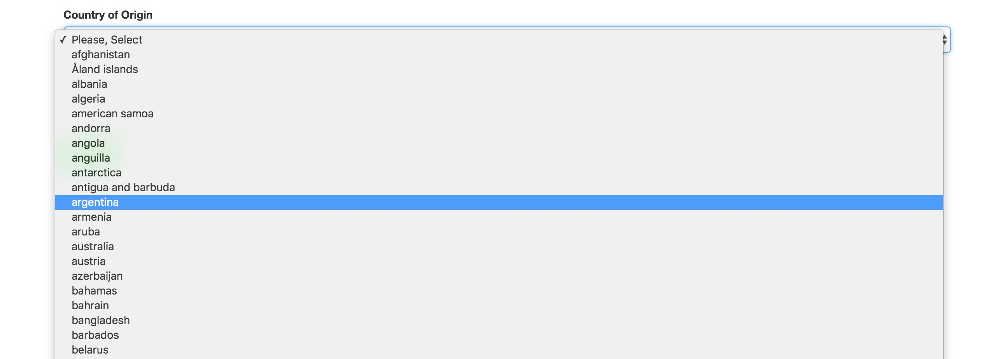

This is because we have said that the `<option>` text content will be generated from the method call `:name` to the `Country` instances of the collection.

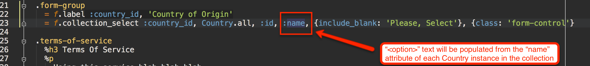

Can we fix this? Yes, we only have to replace the `:name` with a lambda that returns what we really want for each Country instance:

``` ruby
 1. - # File: app/views/sign_up/new.html.haml
... 
21.   .form-group
22.     = f.label :country_id, 'Country of Origin'
23.     = f.collection_select :country_id, Country.all, :id, ->(country) { country.name.titleize }, {include_blank: 'Please, Select'}, {class: 'form-control'}
24. 
25.   .terms-of-service
...
38.   = link_to 'Home', root_path
```

Do you see line 23? We have replaced the `:name` with `->(country) { country.name.titleize }`. This will `titleize` every Country name before setting it as text
for the corresponding `<option>` tag.

Save and reload your sign up form. You will see this:

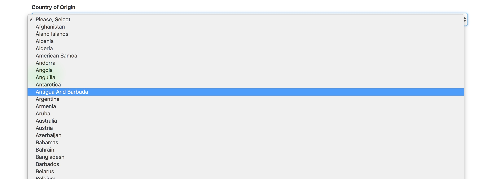

#### Submit Data

We are ok with the Sign Up form. But, let's try to submit the data. What will happen?

##### Without Country

First, let's submit sign up without giving any `Country or origin` information. This is what you will get:

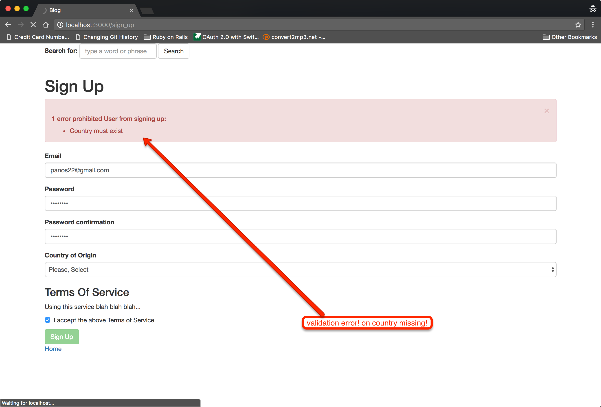

How come we have a validation error on missing Country? We have not added any validation in `User` model like this: `validates :country, presence: true`.
Then, where is this validation coming from?

It is coming from the fact that `belongs_to` association creates a validation for presence of the association behind the scenes. In other words,
the `belongs_to` association considers the association **required** by default.

So, how can we make the association optional? We need to amend the `belongs_to` statement as follows:

``` ruby
 1. # File app/models/user.rb
 2. #
 3. class User < ApplicationRecord
 4.   has_many :articles, dependent: :destroy
 5.   belongs_to :country, optional: true
... 
33. end
```

Do you see line 5? It is now `belongs_to :country, optional: true`. 

Let's now try to sign up without giving any country. You will see that it will succeed.

##### With Country

We have seen that sign up with country missing is now successful. Shall we try with a country of origin in place?

Try signing up with a country selected. You will see that the sign up will succeed. But, will the new user have a country attached to it?
We have done the same and it seems that the user was not bound to any country:

``` bash
blog $ bin/rails runner "puts User.last.inspect"
#<User id: 29, email: "panos23@gmail.com", password_digest: "....1YD2ZtAMGBa8B...", created_at: "2017-07-22 09:28:32", updated_at: "2017-07-22 09:28:32", 
email_confirmation_token: "wwNm8Z0e20Y5kmq1qW2RwA", terms_of_service: true, country_id: nil>
blog $
```

> *Hint* With `bin/rails runner "....."` we are running a Ruby script with all files of our application loaded without having to start a Rails console.

You can see that the last user created, the one that has successfully signed up, does not have a `country_id`. This means that the country selection
didn't work.

###### Scenario For Sign Up With Country Of Origin

Let's also write a Scenario inside our `features/system/sign_up.feature` file that would cover for sign up with a country of origin.

``` ruby
 1. # File: features/system/sign_up.feature
 2. #
 3. Feature: Sign Up
 4. 
 5.   Scenario: Sign Up Happy Path
...
13.   Scenario: Sign Up with Country Of Origin
14.     Given I visit the Web application
15.     And I decide to sign up
16.     When I fill in my email and password
17.     And I fill in my country of origin
18.     And I accept the terms of service
19.     And I submit my details
20.     Then I can see a confirmation message that I have signed up successfully
21.     And Last user created has the correct country of origin
```

We have added a new Scenario between lines 13 and 21.

Let's run this:

``` bash
blog $ cucumber
...
21 scenarios (1 undefined, 20 passed)
90 steps (3 skipped, 2 undefined, 85 passed)
0m2.223s

You can implement step definitions for undefined steps with these snippets:

When(/^I fill in my country of origin$/) do
  pending # Write code here that turns the phrase above into concrete actions
end

Then(/^Last user created has the correct country of origin$/) do
  pending # Write code here that turns the phrase above into concrete actions
end
blog $
```

You will see that we need to define two new steps. Let's do that. This is the amended file `features/step_definitions/sign_up_steps.rb`:

``` ruby
1. # File: features/step_definitions/sign_up_steps.rb
2. #
3. Given(/^I visit the Web application$/) do
...
28. 
29. When(/^I fill in my country of origin$/) do
30.   @country_of_origin = 'Belgium'
31.   select @country_of_origin, from: 'Country of Origin'
32. end
33. 
34. Then(/^Last user created has the correct country of origin$/) do
35.   expect(User.last.country.name).to eq(@country_of_origin.downcase)
36. end
```

We have added two new steps, lines 29 to 36. We use the `select` capybara API to select `'Belgium'` from the `Country of Origin` select
box. Then we make sure that the last user created has the country `'Belgium'` attached to it.

If we run `cucumber` again, we will get this:

``` bash
blog $ cucumber
...
    And I fill in my country of origin                                       # features/step_definitions/sign_up_steps.rb:29
      Unable to find option "Belgium" (Capybara::ElementNotFound)
      ./features/step_definitions/sign_up_steps.rb:31:in `/^I fill in my country of origin$/'
      features/system/sign_up.feature:17:in `And I fill in my country of origin'
    And I accept the terms of service                                        # features/step_definitions/sign_up_steps.rb:17
    And I submit my details                                                  # features/step_definitions/sign_up_steps.rb:21
    Then I can see a confirmation message that I have signed up successfully # features/step_definitions/sign_up_steps.rb:25
    And Last user created has the correct country of origin                  # features/step_definitions/sign_up_steps.rb:34

Failing Scenarios:
cucumber features/system/sign_up.feature:13 # Scenario: Sign Up with Country Of Origin
blog $
```

The `Unable to find option "Belgium"...`, means that there are no countries in our test database. This is true, because
we have only created the countries inside the development database.

One way we can solve this problem is by populating the test database before the actual scenarios run. This is something that
we can do by adding the necessary statements inside the `features/support/env.rb` file:

``` ruby
 1. # IMPORTANT: This file is generated by cucumber-rails - edit at your own peril.

...
59. World(FactoryGirl::Syntax::Methods)
60. 
61. # create countries
62. Country.create_with(name: 'belgium').find_or_create_by(alpha_2_code: 'BE')
```

As you can see, we have added the line 61 and 62. This creates the country that we want to use in our tests. You can definitely
add more countries if you want/need. Also, now I am using the ActiveRecord commands to create the Belgium country, but another alternative
could have been to use a Factory Girl. However, since countries are not going to be created on the fly, inside the Scenarios, I do 
not prefer to use Factory Girl.

Now, let's run `cucumber` again:

``` bash
blog $ cucumber
...
    And Last user created has the correct country of origin                  # features/step_definitions/sign_up_steps.rb:34
      undefined method `name' for nil:NilClass (NoMethodError)
      ./features/step_definitions/sign_up_steps.rb:35:in `/^Last user created has the correct country of origin$/'
      features/system/sign_up.feature:21:in `And Last user created has the correct country of origin'

Failing Scenarios:
cucumber features/system/sign_up.feature:13 # Scenario: Sign Up with Country Of Origin
blog $
```

Now the error that we get is that the method `name` does not exist in `nil:NilClass`. The error is raised on line:

``` 
expect(User.last.country.name).to eq(@country_of_origin.downcase)
```

Cool! That was expected and aligned with the fact that the selection of the country of origin does not actually bind the
signed up user to any country. This is what we have to fix.

###### Fixing Problem of Non-Binding To Country

The problem with non-binding of the User to the Country selected can also be traced by the Rails logs. This is what we
see in the logs when we submit the Sign Up form with a country selected:

``` bash
Started POST "/sign_up" for 127.0.0.1 at 2017-07-22 12:28:32 +0300
Processing by SignUpController#create as HTML
  Parameters: {"utf8"=>"✓", "authenticity_token"=>"ZTGxSEfPdD8OT7SX5SwSgt7pUgCQ42QMODLDCmKM2TUQQ1LHGzu9OWFYMyy4ctVNzy+z7V6H/FdhQLNLceMwnQ==", "user"=>{"email"=>"panos23@gmail.com", "password"=>"[FILTERED]", "password_confirmation"=>"[FILTERED]", "country_id"=>"9", "terms_of_service"=>"1"}, "commit"=>"Sign Up"}
  User Load (0.3ms)  SELECT  "users".* FROM "users" WHERE "users"."id" IS NULL LIMIT $1  [["LIMIT", 1]]
Unpermitted parameter: :country_id
   (0.2ms)  BEGIN
...
  Rendered user_mailer/ask_for_email_confirmation.html.haml within layouts/mailer (8.1ms)
  Rendering user_mailer/ask_for_email_confirmation.text.haml within layouts/mailer
  Rendered user_mailer/ask_for_email_confirmation.text.haml within layouts/mailer (1.3ms)
....
````

Do you see the `Unpermitted parameter: :country_id`? This is the indication that we have to white list the `:country_id` before being
able to use it at the sign up controller level:

``` ruby
 1. # File: app/controllers/sign_up_controller.rb
 2. #
 3. class SignUpController < ApplicationController
... 
43.   private
44. 
45.   def user_params
46.     params.require(:user).permit(:email, :password, :password_confirmation, :terms_of_service, :country_id)
47.   end
48. 
...
52. end
```

On line 46, we add the `:country_id` in the list of permitted attributes.
 
Now, with the fix in place, let's run the feature/scenario again:

``` bash
blog $ cucumber
...
    And Last user created has the correct country of origin                  # features/step_definitions/sign_up_steps.rb:34

21 scenarios (21 passed)
90 steps (90 passed)
0m1.241s
blog $
```

Bingo! The scenario now is green.

Also, try to sign up a new user using a country of origin. And then inspect its country. This is what I've got on my end:

``` bash
blog $ bin/rails runner "puts User.last.inspect"
#<User id: 30, email: "panos24@gmail.com", password_digest: "$2a$10$yOhhu2j5ZGJwxKnQzOCFmOUSSLUKb7pmxWRsepjV9tz...", created_at: "2017-07-22 10:38:20", 
updated_at: "2017-07-22 10:38:20", email_confirmation_token: "43f6X_G_HytNgx-uQBaTvQ", terms_of_service: true, country_id: 22>
blog $
```

Do you see `country_id` being `22`? This proves that the user has been bound to the country selected.

Finally, if you want to read more about select boxes and how Rails ActionView helpers help you create them, you can read the
corresponding [Rails Guides here](http://guides.rubyonrails.org/form_helpers.html#making-select-boxes-with-ease).

## Closing Note

In this chapter we elaborated on Rails layouts and the options that we have for rendering. You can read more about this
in the [Rails Guides here](http://guides.rubyonrails.org/layouts_and_rendering.html). 

Also, we have learned and practiced more on the capabilities of Rails ActionView. You can read more about it in the
[Rails Guides here](http://guides.rubyonrails.org/form_helpers.html).
