Internationalization (i18n for short) is the process of making your application support multiple languages.
It is not only how an English text is translated to another language text, but it is also how dates, for example,
are being displayed too.

The gem that gives us the capability to make our application support multiple languages is the [`i18n` gem](https://github.com/svenfuchs/i18n).

## The Most Important Methods

The most important methods are the `translate` and the `localize` method.

On your `blog` application root folder, start a Rails console and try the following commands:

``` ruby
2.3.3 :001 > I18n.translate 'hello'
 => "Hello world" 
2.3.3 :002 > I18n.localize Date.current
 => "2017-07-23" 
2.3.3 :003 > Date.current
 => Sun, 23 Jul 2017 
```

The `translate` method takes a string and returns its translation in the current locale. The `localize` takes a `Date` or `DateTime` or `Time` object
and returns its value in the current locale.

These methods are so important that they have an alias:

``` ruby
2.3.3 :007 > I18n.t 'hello'
 => "Hello world" 
2.3.3 :008 > I18n.l Date.current
 => "2017-07-23" 
```

## Getting Current Locale

The current locale is retrieved with the call `I18n.locale`:

``` ruby
2.3.3 :011 > I18n.locale
 => :en 
```

## Getting Available Locales

The available locales, i.e. the locales that your application supports are listed with the `I18n.available_locales`:

``` ruby
2.3.3 :014 > I18n.available_locales
 => [:en] 
```

As you can see, our `blog` application supports only one locale at the moment, the `:en` locale.

## Supporting Another Locale

In order to support another locale, you have to create the corresponding YML file inside the folder `config/locales`. Currently, there is
only one, the `en.yml` file:

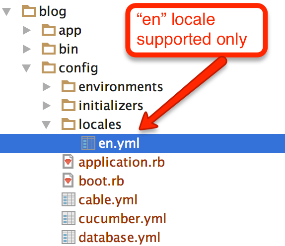

That is why the `I18n.available_locales` returns only `:en`.

Let's add support for Spanish. Create the file `config/locales/es.yml` with the following content:

``` yml
1. # File: config/locales/es.yml
2. #
3. es:
4.   hello: "Hola Mundo"
```

After you save this file, restart your Rails console and try the following commands:

``` ruby
2.3.3 :001 > I18n.available_locales
 => [:en, :es] 
2.3.3 :002 > I18n.translate 'hello'
 => "Hello world" 
2.3.3 :003 > I18n.locale = :es
 => :es 
2.3.3 :004 > I18n.translate 'hello'
 => "Hola Mundo" 
```

On command `:003` we change the current locale to be `:es`. Then, when we call `I18n.translate` we get the corresponding entry
from the `config/locales/es.yml` file.

## The Default Locale

When a Rails application starts, it has a default locale. You can get it with `I18n.default_locale`:

``` ruby
2.3.3 :001 > I18n.default_locale
 => :en 
```

If you want to change the default locale the application starts with, you have to do that inside the `config/application.rb` file:

``` ruby
 1. # File: config/application.rb
 2. #
 3. require_relative 'boot'
...
10. 
11. module Blog
12.   class Application < Rails::Application
13.     # Initialize configuration defaults for originally generated Rails version.
...
20. 
21.     config.i18n.default_locale = :es
22.   end
23. end
```

Do you see line 21? This is how we configure the `Blog` application to have default locale equal to `:es`.

Now if you execute: 

``` bash
blog $ bin/rails runner "puts I18n.locale"
es
blog $
```

You can see that the local is `es` and this is because the default locale has been set to `:es` inside the `config/application.rb` file.

Let's put the default locale back to `:en`:
 
``` ruby
 1. # File: config/application.rb
 2. #
 3. require_relative 'boot'
...
10. 
11. module Blog
12.   class Application < Rails::Application
13.     # Initialize configuration defaults for originally generated Rails version.
...
20. 
21.     config.i18n.default_locale = :en # although setting it to :en is not necessary. This is what Rails considers as default locale anything.
22.   end
23. end
```
## Setting The Locale Per Request
 
Each HTTP Request can be served with its own locale as long as the code sets the `I18n.locale` value at the start of processing the
request. 

Let's see an example:

### Add Translations For `List Of Articles`

Let's suppose that we want the label `List Of Articles` to be displayed according to the locale set for a request. In that case,
we have to make the `List Of Articles` being printed on page using the `I18n.t` method. Here it is how:

``` haml
 1. - # File: app/views/articles/index.html.haml
 2. - #
 3. %h1= I18n.t 'list_of_articles'
 4. %table.table.table-striped
...
20.     = link_to 'Home', root_path
```

Do you see line 3? It is using `I18n.t` to fetch the translation of the `list_of_articles` key from the database of translations, 
i.e. from either `config/locales/en.yml` or `config/locales/es.yml`.

Then, make sure that the `config/locales/en.yml` and `config/locales/es.yml` have the key `list_of_articles` listed with the
corresponding correct translation:

``` yml
# File: config/locales/en.yml
#
en:
  hello: "Hello World"
  list_of_articles: "List of Articles"
```

and 

``` yml
# File: config/locales/es.yml
#
es:
  hello: "Hola Mundo"
  list_of_articles: "Lista de artículos"
```

> *Hint:* Restart your server in order to make sure that it reads your latest changes from the file `config/application.rb` which sets the
default locale to `en`. Restarting your server is necessary if you change the `config/application.rb` file because it is loaded
at the beginning and it is not reloaded on every request.

Now visit the page [http://localhost:3000/articles](http://localhost:3000/articles). You will see the page with the `List of Articles` displayed
in the place of `= I18n.t 'list_of_articles'`:

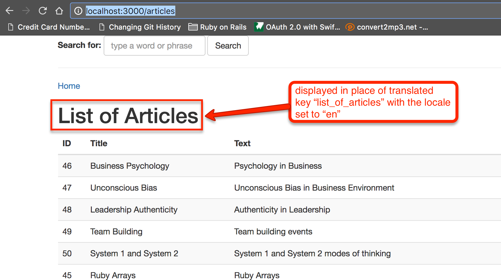

> *Hint:* Note that inside the views, you can use the view helper `t` instead of `I18n.t`:
``` haml
 1. - # File: app/views/articles/index.html.haml
 2. - #
 3. %h1= t 'list_of_articles'
 4. %table.table.table-striped
...
20.     = link_to 'Home', root_path
```

### Set the Locale

Now, let's set the locale to be `:es` at the beginning of the request. In order to do that, you can add a `before_action` that would set the `I18n.locale`.
Let's do that inside the `ApplicationController` which is the controller that every controller derives from, hence, the `before_action` will affect all
the requests.

``` ruby
 1. # File: app/controllers/application_controller.rb
 2. #
 3. class ApplicationController < ActionController::Base
 4.   protect_from_forgery with: :exception
 5.   before_action :authenticate_user
 6.   before_action :set_locale
 7. 
... 
27.   def set_locale
28.     I18n.locale = :es
29.   end
30. end
```

Having done this change, let's visit the page [http://localhost:3000/articles](http://localhost:3000/articles) again. You will see this:

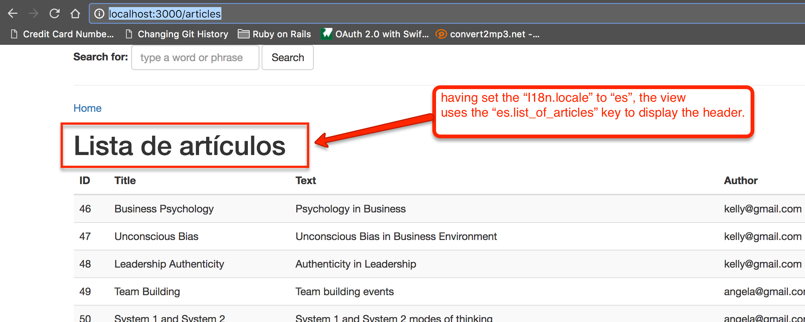

## Setting The Locale Dynamically

Hard coding the locale to `:es`, as you can understand, is not something that works in a production application. There are various ways you can
set the locale dynamically. Here are some approaches:

1. Set the locale based on the user language preferences. The `Accept-Language` header indicates which is the preferred browsing
language for the browser the user is using.
1. Set the locale based on the Top-Level-Domain value (TLD). For example, the locale can be `es` if the host requested is `www.myawesomeapp.com.es`.
1. Set the locale based on the sub-domain. For example, the locale can be `es` if the host requested is `es.myawesomeapp.com`.
1. Set the locale based on a URL path part. For example, the locale can be `es` if the URL requested is `www.myawesomeapp.com/es/`.
1. Set the locale based on a URL query string param. For example, the locale can be `es` if the URL requested is `www.myawesomeapp.com/articles?locale=es`.
1. Set the locale based on user preferences that you have set in your database against the `User` model.

Sometimes we use a combination of the above. For example, one good strategy is the following:

1. If the user is logged in, then set the locale based on their locale.
1. If the user is not logged in, but the params hash contains the locale, then use whatever the value is specified.
1. Otherwise, use whatever is specified in the `Accept-Language` request header.
1. In any other case, use the default locale specified by the `I18n.default_locale`.

### Get the locale from the `params`

Let's adapt our code to be fetching the locale from the `params`. If the `params` does not contain any locale specification, for the time being,
we will be selecting the default locale:

``` ruby
 1. # File: app/controllers/application_controller.rb
 2. #
 3. class ApplicationController < ActionController::Base
 4.   protect_from_forgery with: :exception
 5.   before_action :authenticate_user
 6.   before_action :set_locale
 7. 
... 
27.   def set_locale
28.     locale_requested = params[:locale]
29.     if locale_requested && locale_requested.to_sym.in?(I18n.available_locales)
30.       I18n.locale = locale_requested
31.     else
32.       I18n.locale = I18n.default_locale
33.     end
34.   end
35. end
```

Do you see the new implementation of `set_locale` method? It tries to set the locale according to what `params[:locale]` value is. Note also
that it checks whether the locale specified, if any, is included in the `available_locales`. 

Save the above and try to visit the page [http://localhost:3000/articles?locale=en](http://localhost:3000/articles?locale=en). You will see
the `List of Articles` header. Whereas if you visit the [http://localhost:3000/articles?locale=es](http://localhost:3000/articles?locale=es), you
will see the `Lista de artículos` header.

Also, if you try to visit the page with a locale that is not supported, you will see the `List of Articles` header, using the default `:en` locale:
[http://localhost:3000/articles?locale=de](http://localhost:3000/articles?locale=de).

### Get the locale from the `params` When In URL path

The `params` will give you the `locale` even if it is part of the URL path, and not only if it is part of the query string params.
However, it does not work just like that. You will need to define your `config/routes.rb` accordingly and, also, configure your
`ApplicationController` so that it includes the `locale` in the default URL params, useful when using the route URL helpers, like `articles_path` for
example.

Firstly, we have to define an optional scope inside our `config/routes.rb` file:
 
``` ruby
 1. # File: config/routes.rb
 2. #
 3. Rails.application.routes.draw do
 4.   scope "(:locale)", locale: Regexp.new(I18n.available_locales.map(&:to_s).join('|')) do
 5.     resources :articles do
 6.       collection do
 7.         get :foo
 8.         get :bar
 9.       end
10.     end
11. 
12.     get '/sign_up', to: 'sign_up#new'
13.     post '/sign_up', to: 'sign_up#create'
14.     get '/confirm_email_address', to: 'sign_up#confirm_email_address' # ?email=<email>&email_confirmation_token=<email_confirmation_token>
15.     post '/confirm_email_address_resend', to: 'sign_up#confirm_email_address_resend'
16. 
17.     get '/sign_in', to: 'sign_in#new'
18.     post '/sign_in', to: 'sign_in#create'
19. 
20.     get '/sign_out', to: 'sign_in#destroy'
21.     delete '/sign_out', to: 'sign_in#destroy'
22.     root 'welcome#index'
23.   end
24. end
```

This is the same `config/routes.rb` file, like before. However, we have enclosed all the route definitions inside the

``` ruby
 1. # File: config/routes.rb
 2. #
 3. Rails.application.routes.draw do
 4.   scope "(:locale)", locale: Regexp.new(I18n.available_locales.map(&:to_s).join('|')) do
...
23.   end
24. end
```

The `scope...` makes sure that you can optionally have the locale as first part in your URL paths. So,

- `http://localhost:3000/es/articles` is going to set the `params[:locale]` to `es`.
- `http://localhost:3000/es` is going to set the `params[:locale]` to `es`.
- `http://localhost:3000/articles` is going to set the `params[:locale]` to nothing but thanks to the `set_locale` implementation, the locale selected will the the default locale.

and so on.

Secondly, you will have to set the default URL options at the `ApplicationController` level:

``` ruby
 1. # File: app/controllers/application_controller.rb
 2. #
 3. class ApplicationController < ActionController::Base
 4.   protect_from_forgery with: :exception
 5.   before_action :authenticate_user
 6.   before_action :set_locale
 7. 
...
26. 
27.   def default_url_options
28.     { locale: I18n.locale }
29.   end
30. 
31.   def set_locale
32.     locale_requested = params[:locale]
...
39. end
```

Do you see lines 27 to 29? It is the implementation of the `default_url_options` method, which now tells that `locale` is going to be in by default.

Having done that, try to visit the following pages:

- [http://localhost:3000/articles](http://localhost:3000/articles) will display the header `List of Articles`.
- [http://localhost:3000/es/articles](http://localhost:3000/es/articles) will display the header `Lista de artículos`.

Nice!

### Get the Locale from Accept-Language

Assuming that `params[:locale]` does not specify the locale, let's try to get it from the `Accept-Language` then:

``` ruby
 1. # File: app/controllers/application_controller.rb
 2. #
 3. class ApplicationController < ActionController::Base
... 
27.   def default_url_options
28.     { locale: I18n.locale }
29.   end
30. 
31.   def set_locale
32.     locale_requested = params[:locale]
33.     I18n.locale = locale_requested and return if locale_requested && locale_requested.to_sym.in?(I18n.available_locales)
34. 
35.     locale_requested = accept_language_locale
36.     I18n.locale = locale_requested and return if locale_requested && locale_requested.to_sym.in?(I18n.available_locales)
37. 
38.     I18n.locale = I18n.default_locale
39.   end
40. 
41.   def accept_language_locale
42.     request.env['HTTP_ACCEPT_LANGUAGE'].scan(/^[a-z]{2}/).first
43.   end
44. end
```

Look at lines 31 to 43. We have adapt `set_locale` to check (line 35 and 36) for the `Accept-Language` header. The juice
of the implementation is the method `accept_language_locale` which scans the header value in order to get the first 2 letters.
These letters are then used to set the locale, if the locale is supported.

Now, let's try that. In the following video, we demonstrate how the `Accept-Language` header affects the locale that our
Web application is using. You have to visit the [http://localhost:3000/articles](http://localhost:3000/articles) page and
also be able to change your Google Chrome language settings. When you set your preferred language to Spanish, then you
will see the list of Articles page displaying the Spanish header. 

<div id="media-container-video-Locale Is Set Based on Accept Language Header Value">
  <a href="https://player.vimeo.com/video/227010230"></a>
</div>

### Get the Locale From User Preferences

And now, let's implement the last option for our `blog` application to get the locale from. It will be a preference
of the user.

#### Add `locale` to Users

Let's add the column `locale` to `users` table. We first generate the migration:

``` bash
blog $ bin/rails generate migration add_locale_to_users
      invoke  active_record
      create    db/migrate/20170726050032_add_locale_to_users.rb
blog $
```

Edit the file `db/migrate/20170726050032_add_locale_to_users.rb` and set the following content:

``` ruby
1. # File: db/migrate/20170726050032_add_locale_to_users.rb
2. #
3. class AddLocaleToUsers < ActiveRecord::Migration[5.1]
4.   def change
5.     add_column :users, :locale, :string, limit: 2, default: 'en', null: false
6.   end
7. end
```

Now, run the migration:

``` bash
blog $ bin/rake db:migrate
== 20170726050032 AddLocaleToUsers: migrating =================================
-- add_column(:users, :locale, :string, {:limit=>2, :default=>"en", :null=>false})
   -> 0.0447s
== 20170726050032 AddLocaleToUsers: migrated (0.0448s) ========================

blog $
```

Then you can check the status of the `users` table:

``` bash
blog $ psql -d blog_development -c "\d+ users"
                                                                Table "public.users"
          Column          |            Type             |                     Modifiers                      | Storage  | Stats target | Description 
--------------------------+-----------------------------+----------------------------------------------------+----------+--------------+-------------
 id                       | bigint                      | not null default nextval('users_id_seq'::regclass) | plain    |              | 
 email                    | character varying           | not null                                           | extended |              | 
 password_digest          | character varying           | not null                                           | extended |              | 
 created_at               | timestamp without time zone | not null                                           | plain    |              | 
 updated_at               | timestamp without time zone | not null                                           | plain    |              | 
 email_confirmation_token | character varying           |                                                    | extended |              | 
 terms_of_service         | boolean                     | not null default false                             | plain    |              | 
 country_id               | bigint                      |                                                    | plain    |              | 
 locale                   | character varying(2)        | not null default 'en'::character varying           | extended |              | 
Indexes:
    "users_pkey" PRIMARY KEY, btree (id)
    "users_email_uidx" UNIQUE, btree (email)
    "users_country_idx" btree (country_id)
Foreign-key constraints:
    "users_country_fk" FOREIGN KEY (country_id) REFERENCES countries(id)
Referenced by:
    TABLE "articles" CONSTRAINT "articles_user_id_users_id_fk" FOREIGN KEY (user_id) REFERENCES users(id)

blog $
```

Do you see the last column added? 

Also, you can check that your users now have a default locale set to `en`:

``` bash
blog $ psql -d blog_development -c "select id, email, locale from users"
 id |         email         | locale 
----+-----------------------+--------
 10 | mary@gmail.com        | en
 12 | john@gmail.com        | en
 16 | paul@gmail.com        | en
 17 | kristin@gmail.com     | en
 18 | angela@gmail.com      | en
 19 | peter2@gmail.com      | en
 20 | john2@gmail.com       | en
 21 | kelly@gmail.com       | en
 24 | foo-bar@gmail.com     | en
 26 | paulmc@mailinator.com | en
 27 | panos21@gmail.com     | en
 28 | panos22@gmail.com     | en
 29 | panos23@gmail.com     | en
 30 | panos24@gmail.com     | en
(14 rows)

blog $
```

Cool!

#### Update `User` Model With `locale`

Let's update our `User` model with the `locale` attribute validation.

``` ruby
 1. # File app/models/user.rb
 2. #
 3. class User < ApplicationRecord
...
12.   validates :locale, inclusion: {in: I18n.available_locales.map(&:to_s) }
13. 
...
34. end
```

Do you see line 12? This is the validation that we have added for the `locale` attribute of the `User`. Hence, we make sure that
the locale set for a `User` is among the available ones.

#### Allow User to Set Their Locale

For the logged in users, we will be offering them a drop down menu to allow them to change their language/locale. Something like this:

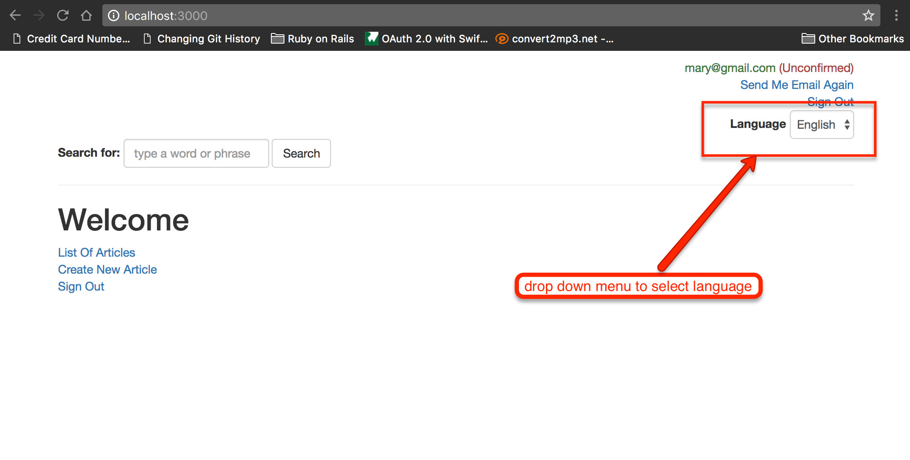

And this is the screenshot when the menu is expanded:

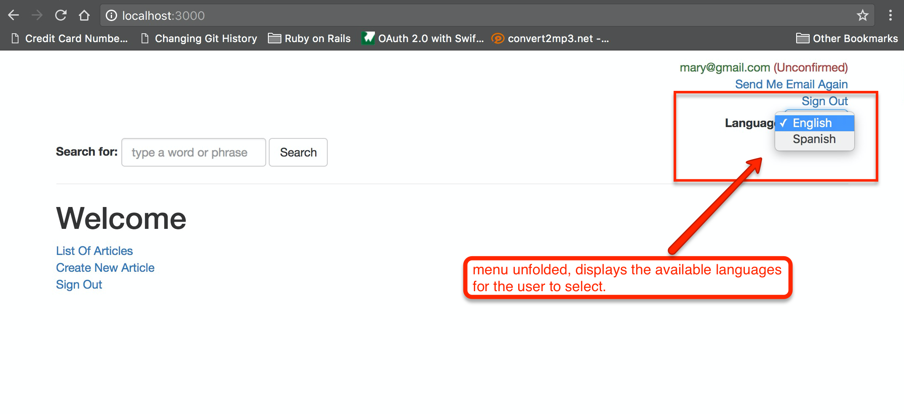

##### The UI To Select Language

We will incorporate the drop down select box inside the application layout. Like this:

``` ruby
 1. - # File: app/views/layouts/application.html.haml
 2. - #
 3. !!!
 4. %html
...
14.       = render partial: 'layouts/signed_in_user'
15.       = render partial: 'layouts/select_language'
16.       = render partial: 'layouts/search'
...
18.       = yield
```
Do you see line 15? This is the new line that we have added. It is rendering the partial `app/views/layouts/_select_language.html.haml`. Let's create
this new partial file:

``` haml
1. - # File: app/views/layouts/_select_language.html.haml
2. - #
3. - if current_user
4.   .text-right
5.     = form_tag '/users/locale', class: 'form-inline' do
6.       = label_tag :locale, 'Language'
7.       = select_tag :locale, options_for_select([['English', 'en'], ['Spanish', 'es']]), class: 'form-control'
```

These are the things that you need to take care of:

1. There is a form that will submit its data to `/users/locale` endpoint. We don't have a route for this. We will have to create it inside the `config/routes.rb`.
1. There is a select box that we build with the `select_tag` helper. Also we use the `options_for_select` to build the `<option>` tags. What we
give there is an Array of Arrays. Each element is an Array that has two elements, the Language text and the Language locale symbol.
1. There is no submit button to submit the form. We do not want to ask the user to click on a button in order to change their language. We want this
to be fired as soon as the user changes the selection in the select box. In order to achieve this, we will hook a JavaScript code at the select
box that would submit the form when select box would change its value.
1. The above HAML for selecting the language is not the final one and you will see that we will have to do some enhancements.

If you save the above and you load a page as logged in user in your `blog` application, you will see the select box with the options.
Of course, when changing, nothing would take place for the time being.

##### POST the Form

In order to POST the form to the server, we will need to hook JavaScript code to the select box. This is how we do that. We create the
file `app/assets/javascripts/select_language.js` with the following code:

``` JavaScript
1. // File: app/assets/javascripts/select_language.js
2. //
3. $(document).ready(function () {
4.     $('select#locale').on('change', function () {
5.         var $selectLanguageForm = $(this).closest('form');
6.         $selectLanguageForm.submit();
7.     });
8. });
```

The code is very easy to understand, since you have already done the jQuery chapter. It attaches a handler to the `change` event of the
select box (which is selected with `$('select#locale')`. The handler locates the form using the jQuery method `closest()`. If you want
to read about `closest()`, you can [read here](http://api.jquery.com/closest/). Then it calls the jQuery method `submit()` on the 
form located, which submits the form.

With this code in place, we don't need a submit button. The form is submitted as soon as the user changes the value in the select box
with the languages.

> *Hint:* If you wanted to find the id of the select box in order to specify the proper selector (`select#locale` because id is `locale`),
and since this information is not very obvious from the HAML code, you can use the Google Chrome developer tools to inspect the
select box and find out the id. Nevertheless, you need to know that the `select_tag` creates select box with id equal to the first argument,
if `id` is not explicitly specified.

<br/>

> **Important** Rails comes with the [turbolinks](https://rubygems.org/gems/turbolinks) gem installed. However, this gem might conflict with
jQuery because it affects how links work. Our suggestion is that you remove the turbolinks from your project. Here is what you have to do:
>
> 1. remove the gem 'turbolinks' from your Gemfile and do `bundle`.
> 1. remove line `require turbolinks` from your `app/assets/javascripts/application.js` file.
> 1. remove `'data-turbolinks-track': 'reload'` from the `app/views/layouts/application.html.haml`, line 9 and 10.
> 1. restart your server

Now, if you save your code, reload your page and try to change the value of the language from English to Spanish, you will get the following
error:

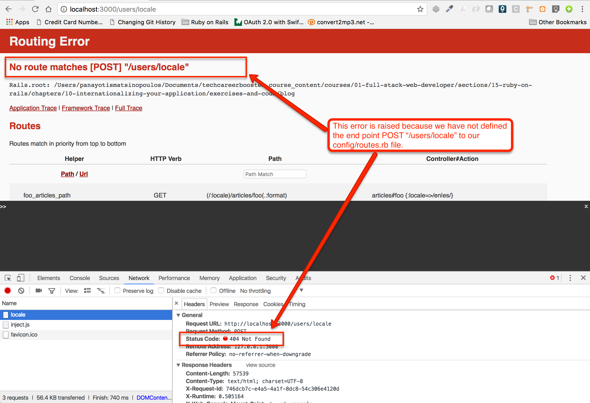

##### Route and Handling Action

Now, we need to specify the endpoint `POST /users/locale`. Let's do that in the `config/routes.rb` file:

``` ruby
 1. # File: config/routes.rb
 2. #
 3. Rails.application.routes.draw do
 4.   post '/users/locale', to: 'users#update_locale'
 5. 
 6.   scope "(:locale)", locale: Regexp.new(I18n.available_locales.map(&:to_s).join('|')) do
 7.     resources :articles do
 8.       collection do
...
24.     root 'welcome#index'
25.   end
26. end
```
The new line is line 4. Note that we didn't put this new route inside the `:locale` scope. This is because we do not
want the path to have `:locale` part as an optional part. 

Run the `bin/rake routes` command to see which route this new entry defines:

``` bash
blog $ bin/rake routes
                      Prefix Verb   URI Pattern                                       Controller#Action
                users_locale POST   /users/locale(.:format)                           users#update_locale
                foo_articles GET    (/:locale)/articles/foo(.:format)                 articles#foo {:locale=>/en|es/}
                bar_articles GET    (/:locale)/articles/bar(.:format)                 articles#bar {:locale=>/en|es/}
...
blog $
```

Do you see first line? This is the line added by the new routes entry. With this entry in place we have the method
`users_locale_path` at our disposal. Let's use it inside our `app/views/layouts/_select_language.html.haml` partial:

So, instead of `form_tag '/users/locale'` go ahead and use `form users_locale_path(locale: nil)` instead. Note that
the `locale: nil` is needed, otherwise, the `default_url_options` will build the URL with the `locale` in place,
which is not what you want for this particular case.


Now that the routes and view are ready, try to change the language to Spanish again. You will get the error that `UsersController` is an uninitialized constant. 
That was expected actually. The route `users#update_locale` means that we need to have an action `update_locale` inside a controller
named `UsersController`. Let's implement this:

``` ruby
 1. # File: app/controllers/users_controller.rb
 2. #
 3. class UsersController < ApplicationController
 4.   skip_before_action :set_locale, only: [:update_locale]
 5. 
 6.   def update_locale
 7.     locale_requested = params[:locale]
 8.     if locale_requested.present? && locale_requested.to_sym.in?(I18n.available_locales)
 9.       current_user.update_attribute(:locale, locale_requested)
10.     end
11. 
12.     referer = request.headers['Referer']
13.     if referer
14.       url_to_redirect_to = Rails.application.routes.recognize_path(referer).merge({locale: params[:locale]})
15.     else
16.       url_to_redirect_to = root_url(locale: params[:locale])
17.     end
18. 
19.     redirect_to url_to_redirect_to
20.   end
21. end
```

Things that you need to make sure you take a notice of:

1. We skip the setting of locale on line 4. This is because when updating the locale of the user
we then want to just redirect. The redirect (line 19) will take care of resubmitting a new request which
is going to set the locale anyway.
1. We redirect to either the `root_url` or to the page the user came from.
1. The page the user came from is inside the `Referer` header of the request. If it is present, then
we build a new URL based on the value of this header. The new URL is the same as the URL in the referer, except
from the fact that we replace the `locale` with the locale specified in the params. Hence, if the user is
coming from `http://localhost:3000/en/articles` and the `update_locale` is called to update the locale to Spanish,
then we redirect back to `http://localhost:3000/es/articles`. In order to achieve this, we decompose the referer value
to its parts using the `Rails.application.routes.recognize_path` method. Look how this method works by trying it out
in a rails console:

 ``` ruby
 2.3.3 :001 > Rails.application.routes.recognize_path('http://localhost:3000/en/articles')
  => {:controller=>"articles", :action=>"index", :locale=>"en"} 
 ```
1. If we don't have a value from the `Referer` header, we use the `root_url`, but we make sure that the locale we
set there is the locale selected in params.

##### Update Logic on Set Locale

Still, we need to update the logic in the `set_locale` method to take into account the current user preferences:

``` ruby
 1. # File: app/controllers/application_controller.rb
 2. #
 3. class ApplicationController < ActionController::Base
 4.   protect_from_forgery with: :exception
... 
31.   def set_locale
32.     I18n.locale = current_user.locale and return if current_user
33. 
34.     locale_requested = params[:locale]
35.     I18n.locale = locale_requested and return if locale_requested && locale_requested.to_sym.in?(I18n.available_locales)
36. 
37.     locale_requested = accept_language_locale
38.     I18n.locale = locale_requested and return if locale_requested && locale_requested.to_sym.in?(I18n.available_locales)
39. 
40.     I18n.locale = I18n.default_locale
41.   end
...
46. end
```

The logic has changed so that we take into account, first the preferences of the current user. Otherwise, we use the
locale defined in params or the locale defined in `Accept-Language` header. The last resort is the `I18n.default_locale`

> *Hint:* Did you notice the `and return` usage? It allows us to do things and exit method in one liners.

##### Language Select Box To Display Users Locale

What we have to do though, is to make sure that the language select box is selecting the current user locale:

``` haml
1. - # File: app/views/layouts/_select_language.html.haml
2. - #
3. - if current_user
4.   .text-right
5.     = form_tag '/users/locale', class: 'form-inline' do
6.       = label_tag :locale, 'Language'
7.       = select_tag :locale, options_for_select([['English', 'en'], ['Spanish', 'es']], current_user.locale), class: 'form-control'
```

Do you see line 7? We have updated the `options_for_select` with an extra, last, argument: `current_user.locale`. 

Now everything is ready. You can see how the user can use the language select box to change their language preference. Here is
the video that demonstrates that:

<div id="media-container-video-Locale Is Set Based on Accept Language Header Value">
  <a href="https://player.vimeo.com/video/227205880"></a>
</div>

## Passing Variables To Translations


The strings stored inside your translation database, i.e. inside your `config/locales/*.yml` files can be set up so that they
use variable parts. For example, let's work out with the string in the success flash message when an Article is destroyed:

``` ruby
 1. # File: app/controllers/articles_controller.rb
 2. #
 3. class ArticlesController < ApplicationController
...
39.   end
40. 
41.   def destroy
42.     @article.destroy
43.     flash[:success] = 'Article has been destroyed!'
44.     redirect_to articles_path
45.   end
46. 
47.   def foo
...
77. end
```

Do you see line 43? `flash[:success] = 'Article has been destroyed!'`. The string `Article has been destroyed!` is hard coded in English. Also,
we may want to tell the user which article (by its title) has been destroyed, because after the destroy user lands on the list of articles page.
Telling user the Article title that has been destroyed would have been for better User experience.

We can do that by changing the code as follows:

``` ruby
1. # File: app/controllers/articles_controller.rb
2. #
3. class ArticlesController < ApplicationController
...
39.   end
40. 
41.   def destroy
42.     @article.destroy
43.     flash[:success] = I18n.t('article_has_been_destroyed', article_title: @article.title)
44.     redirect_to articles_path
45.   end
46. 
47.   def foo
...
77. end
```

We have replaced the line 43 with this: `flash[:success] = I18n.t('article_has_been_destroyed', article_title: @article.title)`.

The `I18n.t` call takes as first argument the key to the translation database and a Hash with the variable parts. In this particular case
we only have 1 variable part with key `article_title` the value of which we set it to the `@article.title`, i.e. to the title of the
article that has just been deleted. 

Then, we need to make sure that we have the correct keys inside our `en.yml` and `es.yml` files:

``` yml
1. # File: config/locales/en.yml
2. #
3. en:
4.   hello: "Hello World"
5.   list_of_articles: "List of Articles"
6.   article_has_been_destroyed: "Article has been destroyed! Article Title: %{article_title}"
```

and 

``` yml
1. # File: config/locales/es.yml
2. #
3. es:
4.  hello: "Hola Mundo"
5.  list_of_articles: "Lista de artículos"
6.  article_has_been_destroyed: "El artículo ha sido destruido! Título del artículo: %{article_title}"
```

Do you see how we define the variable parts of the translation key value? See lines 6 in both files. The variable part is enclosed inside `%{ ..... }` and 
it includes a Hash key name, the key name that needs to be used inside the code in order to provide the actual value of the variable part.

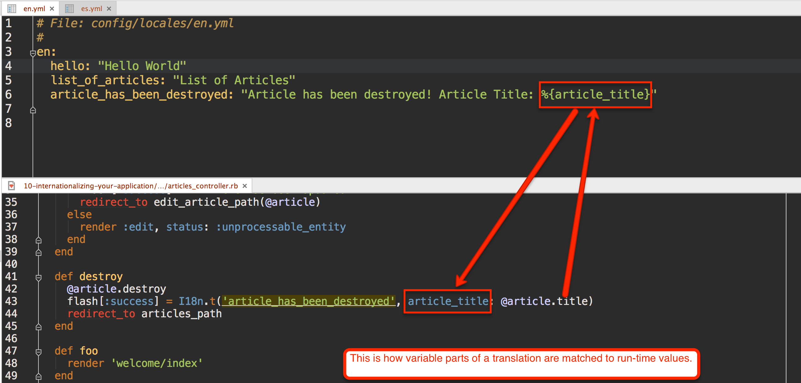

With these things in place, then try to delete an article, both while with English and while with Spanish:

<div id="media-container-video-Locale Is Set Based on Accept Language Header Value">
  <a href="https://player.vimeo.com/video/227220633"></a>
</div>

You can see how the variable part of the translated string is being dealt with.

## Displaying Date/Time

Displaying date/time on the views is affected by the locale selected. For example, other languages prefer the format `DD/MM/YYYY` whereas others, they
prefer the format `MM/DD/YYYY`, or `YYYY/MM/DD`. 

Let's see how we can localize the display of timestamps:

### Add Timestamp To Article Index Page

In order to see how we should be displaying dates and times, let's add a new column to the Articles index page that would display the dates the
Articles were created.

``` haml
 1. - # File: app/views/articles/index.html.haml
 2. - #
 3. %h1= t 'list_of_articles'
...
11.       %th Created At
12.       %th
...
21.     = link_to 'Home', root_path
```

Inside the `app/views/articles/index.html.haml` we have added line 11, as the column header. Then we need to amend the partial `app/views/articles/_article.html.haml`
which is the partial used to render each article in the list:

``` haml
 1. - # File: app/views/articles/_article.html.haml
 2. - #
...
 8.   %td= article.created_at
 9.   %td
...
15.       = link_to 'Delete', article_path(article), method: :delete, class: 'btn btn-danger', data: {confirm: 'Are you sure that you want to delete this Article?'}
```

We have added line 8, that displays the value of `created_at` attribute of the Article. 

If you visit the [http://localhost:3000/articles](http://localhost:3000/articles) page you will see something like this:

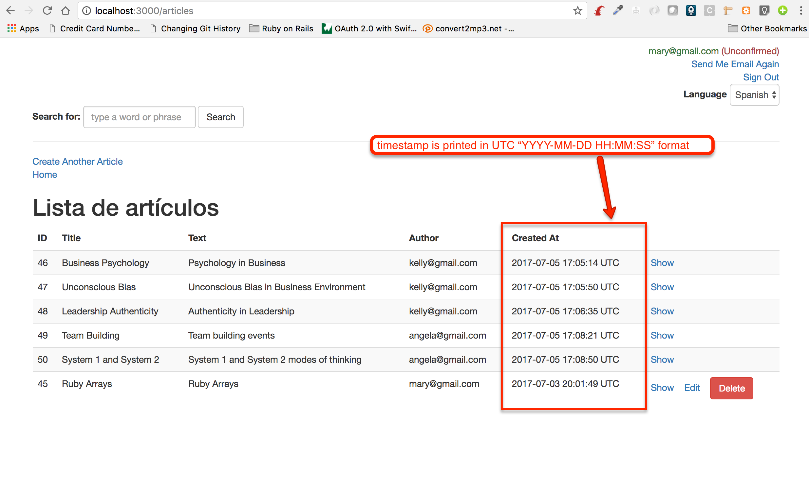

You can see that, by default, the timestamps are not very user-friendly. Firstly, they display the time in UTC and not in the timezone of the user. But this timezone
problem is going to be covered later on. Secondly, the format is quite _ugly_: YYYY-MM-DD HH:MM:SS.

Let's use the `I18n.locale` method (just `l` if used in views) in order to display the date/time:

``` haml
 1. - # File: app/views/articles/_article.html.haml
 2. - #
...
 8.   %td= l article.created_at
 9.   %td
...
15.       = link_to 'Delete', article_path(article), method: :delete, class: 'btn btn-danger', data: {confirm: 'Are you sure that you want to delete this Article?'}
```

And lets reload the page [http://localhost:3000/articles](http://localhost:3000/articles), but try first with the english version:

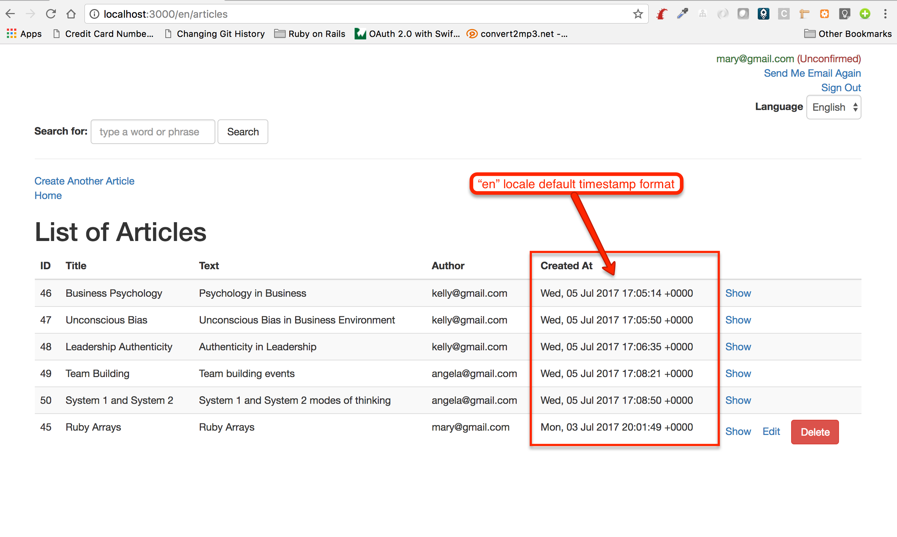

As you can see, the default format of timestamps when `en` is the locale, is much better than the previous one.

But, if you try to get the same page using the Spanish language, you will get an error:

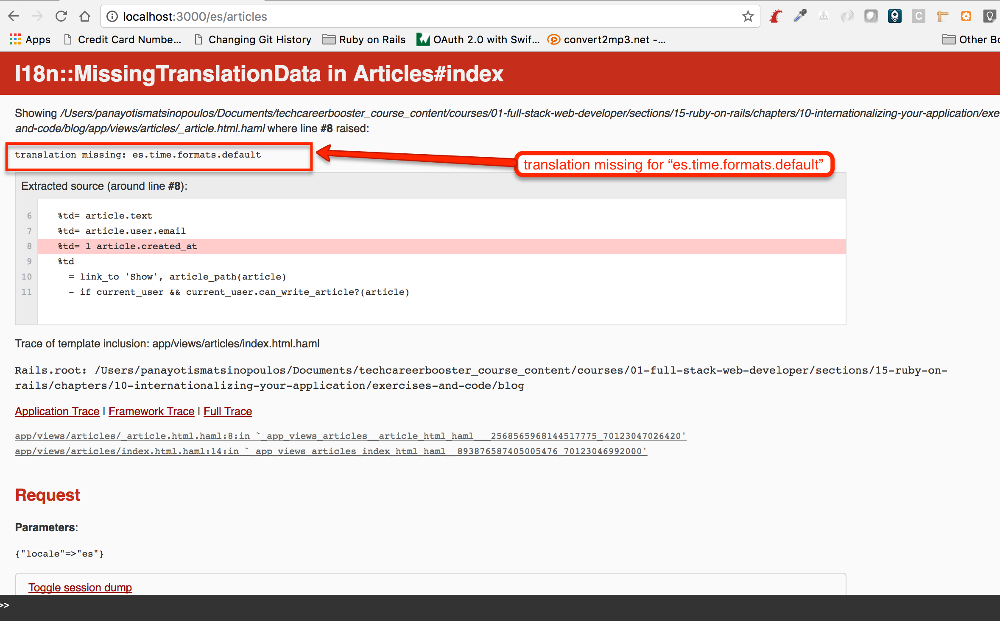

As you can read from the error message, our translation database is missing the Spanish translation for the default time format. And watch for the actual key
reported as missing: `es.time.formats.default`. It is the a hierarchical key. We are missing `default`, which should be in the list of keys of `formats`, which,
in turn, should be in the list of keys in `time`, which, in turn, should be in the list of keys in `es`.

Update your `es.yml` file and make it look as follows:

``` yml
1. # File: config/locales/es.yml
2. #
3. es:
4.   hello: "Hola Mundo"
5.   list_of_articles: "Lista de artículos"
6.   article_has_been_destroyed: "El artículo ha sido destruido! Título del artículo: %{article_title}"
7.   time:
8.     formats:
9.       default: "%A, %-d de %B de %Y %H:%M:%S %z"
```

Do you see how we have added a new entry for `es.time.formats.default` ? It has the value `"%A, %-d de %B de %Y %H:%M:%S %z"` and it is a format specification
for string representation of timestamps. The symbols that exist inside it, can be explained if one reads the documentation [here](http://ruby-doc.org/stdlib-2.4.0/libdoc/date/rdoc/DateTime.html#method-i-strftime).
 
With this update in place, let's try to reload the Spanish version of the list of articles again:
 
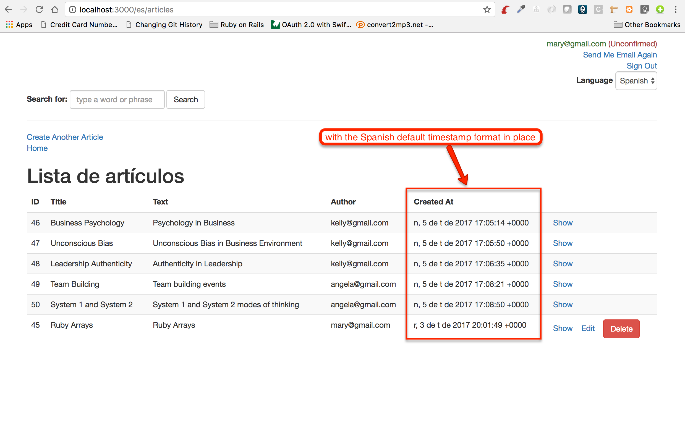

But again, the `default` is not the only format that you can use. You can define and use your own formats of course. Let's create the `short` format and 
tell our page to use this:

``` yml
 1. # File: config/locales/es.yml
 2. #
 3. es:
 4.   hello: "Hola Mundo"
 5.   list_of_articles: "Lista de artículos"
 6.   article_has_been_destroyed: "El artículo ha sido destruido! Título del artículo: %{article_title}"
 7.   time:
 8.     formats:
 9.       default: "%A, %-d de %B de %Y %H:%M:%S %z"
10.       short: "%-d de %b %H:%M"
```

In order to tell our view to print the timestamp in short format, instead of just calling `l article.created_at` we call `l article.created_at, format: :short`.
And this is what we get for the Spanish page:

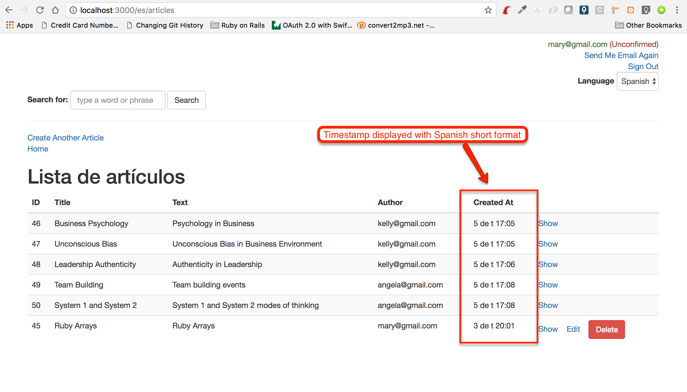

But it works for English too:

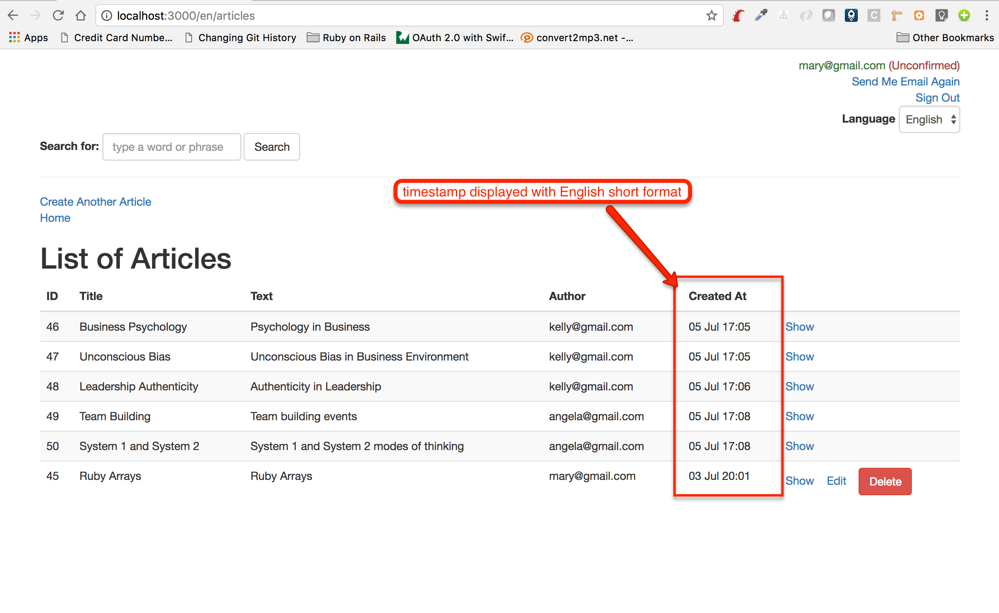

How does it work, by the way? We have not defined the `:short` format for the English locale. Neither the `:default` one. It works because Rails
comes ready with all the translations for English. This is actually part of the [ActiveSupport](https://github.com/rails/rails/blob/master/activesupport/lib/active_support/locale/en.yml).

Now, if you want to have translations for your language for all the Rails internal things, like the formatting of timestamps, you may want to 
pick up the `locales/*.yml` file that you are interested in from this [rails-i18n repo](https://github.com/svenfuchs/rails-i18n/tree/master/rails/locale), since
it seems that somebody else has already done a lot of the translation work for many of the languages and locales out there.

## Validation Error Messages

Now, let's see how we can localize the validation error messages. Look for example what it is displayed when you try to create an article
without filling in the form with correct data:

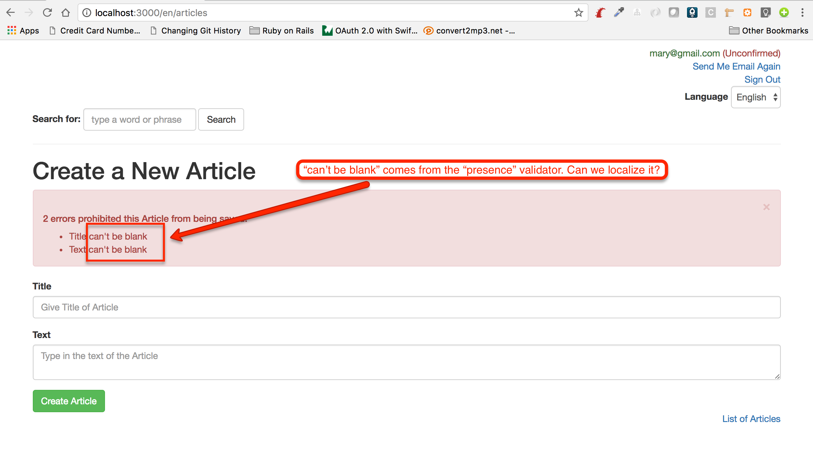

If you try the same function using Spanish locale, you will also see where Rails is trying to locate the translations of the `"can't be blank"` string:

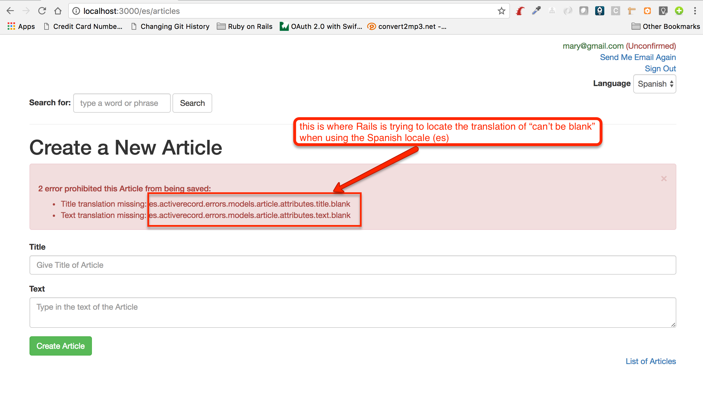

As you can see from the error raised, Rails is trying to locate the translation for `"can't be blank"` to `es.activerecord.errors.models.article.attributes.title.blank`.

In fact, Rails is looking in the following locations for the translations of the key `blank`:

```
es.activerecord.errors.models.[model_name].attributes.[attribute_name].blank
es.activerecord.errors.models.[model_name].blank
es.activerecord.errors.messages.blank
es.errors.attributes.[attribute_name].blank
es.errors.messages.blank
```

So, let's update our `config/locales/es.yml` file accordingly, by going with the last option from the above list:

``` ruby
 1. # File: config/locales/es.yml
 2. #
 3. es:
 4.   hello: "Hola Mundo"
 5.   list_of_articles: "Lista de artículos"
 6.   article_has_been_destroyed: "El artículo ha sido destruido! Título del artículo: %{article_title}"
 7.   time:
 8.     formats:
 9.       default: "%A, %-d de %B de %Y %H:%M:%S %z"
10.       short: "%-d de %b %H:%M"
11.   errors:
12.     messages:
13.       blank: "No puede estar en blanco"
```

Do you see lines 11 to 13? These are there to translate `"can't be blank"` in Spanish. Now try to create an article without
giving any input and using the Spanish locale. You will see this:

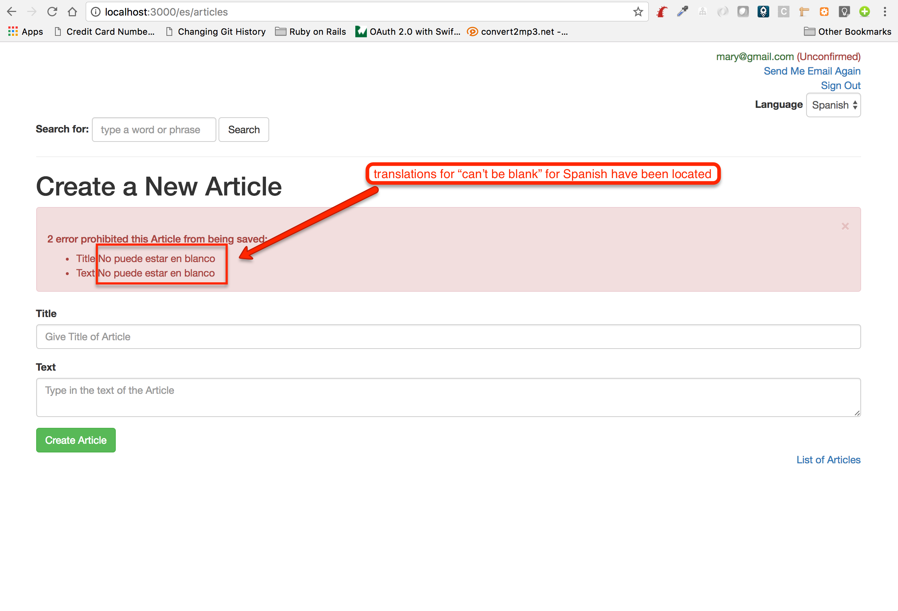

## User Time Zone

Since your Web application might be used by users all over the world, we need to take into account the User time zone when we display timestamps
at the user interface.

### List All Time Zones

You can get the list of time zones that Rails supports by running the rake task `"time:zones"`:

(You may want to use `bin/rake time:zones | more` to be able to view the time zones with pagination on your terminal output)

``` bash
blog $ bin/rake time:zones

* UTC -11:00 *
American Samoa
International Date Line West
Midway Island

* UTC -10:00 *
Hawaii

* UTC -09:00 *
Alaska

* UTC -08:00 *
Pacific Time (US & Canada)
Tijuana

...


* UTC +12:00 *
Auckland
Fiji
Kamchatka
Marshall Is.
Wellington

* UTC +12:45 *
Chatham Is.

* UTC +13:00 *
Nuku'alofa
Samoa
Tokelau Is.
```

The above lists the UTC offsets and the names of the time zones that fall at this particular offset.

You can also get the list of time zones per country too. Use the two digit country code. For example, for Germany:

``` bash
blog $ bin/rake time:zones[DE]


* UTC +01:00 *
Berlin
Europe/Busingen

blog $
```

you get 1 offset and two time zone names: 1) `Berlin` and 2) `Europe/Busingen`

### Set the Application Default Time Zone

You can set the default time zone of the application inside the `config/application.rb`. Let's suppose that we want
the default time zone to be `Eastern Time (US & Canada)`. Let's do that:

``` ruby
 1. # File: config/application.rb
 2. #
 3. require_relative 'boot'
 4. 
 5. require 'rails/all'
 6. 
 7. # Require the gems listed in Gemfile, including any gems
 8. # you've limited to :test, :development, or :production.
 9. Bundler.require(*Rails.groups)
10. 
11. module Blog
12.   class Application < Rails::Application
...
22. 
23.     config.time_zone = "Eastern Time (US & Canada)"
24.   end
25. end
```

Do you see line 23? This is how we set the default time zone to `Eastern Time (US & Canada)`. 

Let's prove that this one works by running the following:

``` bash
blog $ bin/rails runner "puts Time.zone.now"
2017-07-27 13:52:19 -0400
blog $ bin/rails runner "puts Time.zone"
(GMT-05:00) Eastern Time (US & Canada)
```

The `Time.zone.now` prints the current time in the current time zone. Also the `Time.zone` prints the current time zone. 

Also, the `Time.zone.now.utc` will convert the time to UTC:

``` bash
blog $ bin/rails runner "puts Time.zone.now.utc"
2017-07-27 17:57:18 UTC
blog $
```

## Timestamps

Note that the timestamps displayed in Rails are automatically converted to the current time zone:

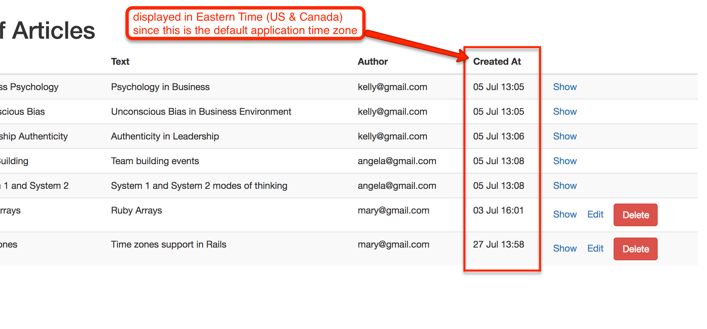

## User Time Zone

But, when a user is logged in, they usually want to see the timestamps in their own time zone, not the default time zone of the application. 

First, we need to allow user to select their time zone. In order to do that, like we did for locales, we need to introduce a new column in `users` 
table. This new column is going to be called `time_zone`.

### `time_zone` column

Let's generate the migration file.

``` bash
blog $ bin/rails generate migration add_time_zone_to_users
      invoke  active_record
      create    db/migrate/20170727192758_add_time_zone_to_users.rb
blog $
```

Let's edit the file `db/migrate/20170727192758_add_time_zone_to_users.rb` so that it has the content:

``` ruby
1. # File: db/migrate/20170727192758_add_time_zone_to_users.rb
2. #
3. class AddTimeZoneToUsers < ActiveRecord::Migration[5.1]
4.   def change
5.     add_column :users, :time_zone, :string, default: Rails.application.config.time_zone, null: false
6.   end
7. end
```

According to the above, we will add the column `time_zone` as a string column with default value equal to the default time zone of the application. This is a mandatory 
attribute for all users.

Let's run the migration:

``` bash
blog $ bin/rake db:migrate
== 20170727192758 AddTimeZoneToUsers: migrating ===============================
-- add_column(:users, :time_zone, :string, {:default=>"London", :null=>false})
   -> 0.0490s
== 20170727192758 AddTimeZoneToUsers: migrated (0.0492s) ======================

blog $
```

And confirm that the users now have time zone:

``` bash
blog $ psql -d blog_development -c "select id, email, time_zone from users limit 5;"
 id |       email       |         time_zone 
----+-------------------+---------------------------
 12 | john@gmail.com    | Eastern Time (US & Canada)
 16 | paul@gmail.com    | Eastern Time (US & Canada)
 17 | kristin@gmail.com | Eastern Time (US & Canada)
 18 | angela@gmail.com  | Eastern Time (US & Canada)
 19 | peter2@gmail.com  | Eastern Time (US & Canada)
(5 rows)
blog $
```

### `User` Model

Let's enhance our `User` model to make sure that we don't create Users without their timezone:

``` ruby
 1. # File app/models/user.rb
 2. #
 3. class User < ApplicationRecord
 4.   DEFAULT_TIME_ZONE = Rails.application.config.time_zone
...
15.   validates :time_zone, inclusion: { in: ActiveSupport::TimeZone.all.map(&:name) }
16. 
17.   before_validation :set_time_zone
... 
39.   def set_time_zone
40.     self.time_zone = DEFAULT_TIME_ZONE unless time_zone.present?
41.   end
42. end
```

1. We declare the default time zone to be the default time zone of the application
1. We also use a `before_validation` to make sure that we set the default value to whoever User instance does not have one time zone set.
 
Now, whenever a new user signs up, their time zone will be set to the default time zone of the application.

### Allow User To Change Time Zone

Like we allow user to change locale, we will allow user to change time zone too. Here is what we want to do:


#### The UI

Let's add the HTML markup first. This is the partial that we are going to create `app/views/layouts/_select_time_zone.html.haml`:

``` haml
1. - # File: app/views/layouts/_select_time_zone.html.haml
2. - #
3. - if current_user
4.   .text-right
5.     = form_tag '/users/time_zone', class: 'form-inline' do
6.       = label_tag :time_zone, 'Time Zone'
7.       = select_tag :time_zone, options_for_select(ActiveSupport::TimeZone.all.map(&:name).sort, current_user.time_zone), class: 'form-control'
```

I guess that this is now pretty much straightforward for you. Note how we build the options for the select. We use the names of the collection `ActiveSupport::TimeZone.all`.
Also, we make sure that there is an option selected and this is the time zone of the current user.

This partial needs to be embedded inside the `app/views/layouts/application.html.haml`:

``` haml
 1. - # File: app/views/layouts/application.html.haml
 2. - #
 3. !!!
 4. %html
 5.   %head
 6.     %meta{:content => "text/html; charset=UTF-8", "http-equiv" => "Content-Type"}/
 7.     %title Blog
 8.     = csrf_meta_tags
 9.     = stylesheet_link_tag    'application', media: 'all'
10.     = javascript_include_tag 'application'
11.   %body
12.     .container
13.       = render partial: 'layouts/flash'
14.       = render partial: 'layouts/signed_in_user'
15.       = render partial: 'layouts/select_language'
16.       = render partial: 'layouts/select_time_zone'
17.       = render partial: 'layouts/search'
18.       = yield :menu
19.       = yield
```

Do you see line 16? This is where we invoke the partial `app/views/layouts/_select_time_zone.html.haml`.

#### Submit POST On Change

Like we did for the language, we will be submitting the form on change of the select box:

``` JavaScript
1. // File: app/assets/javascripts/select_timezone.js
2. //
3. $(document).ready(function () {
4.     $('select#time_zone').on('change', function () {
5.         var $selectTimeZoneForm = $(this).closest('form');
6.         $selectTimeZoneForm.submit();
7.     });
8. });
```

#### Define The Route

We define the routes inside the `config/routes.rb`:

``` ruby
1. # File: config/routes.rb
2. #
3. Rails.application.routes.draw do
4.   post '/users/locale', to: 'users#update_locale'
5.   post '/users/time_zone', to: 'users#update_time_zone'
6. 
...
27. end
```

We have added the line 5. If you print the routes, you will get this:

``` bash
blog $ bin/rake routes
                      Prefix Verb   URI Pattern                                       Controller#Action
                users_locale POST   /users/locale(.:format)                           users#update_locale
             users_time_zone POST   /users/time_zone(.:format)                        users#update_time_zone
...
blog $
```

This means that we can use the path `users_time_zone_path` inside the `app/views/layouts/_select_time_zone.html.haml` file. Let's do the 
following:

Instead of `form_tag '/users/time_zone'` let's write `form_tag users_time_zone_path`.

#### Action and Controller Update

Now, we need to update the `UsersController` accordingly:

``` ruby
 1. # File: app/controllers/users_controller.rb
 2. #
 3. class UsersController < ApplicationController
 4.   skip_before_action :set_locale, only: [:update_locale, :update_time_zone]
...
21. 
22.   def update_time_zone
23.     time_zone = params[:time_zone]
24.     if time_zone.present? && time_zone.in?(ActiveSupport::TimeZone.all.map(&:name))
25.       current_user.update_attribute(:time_zone, time_zone)
26.     end
27. 
28.     redirect_back(fallback_location: root_url)
29.   end
30. end
```

We have added the action `update_time_zone`. The code is again pretty straightforward. If a `time_zone` is specified and it is
among the valid time zones then we update the time zone of the currently logged in user.

Done! The following video shows how the time zone of the currently logged in user is updated with the drop down changes:

<div id="media-container-video-Locale Is Set Based on Accept Language Header Value">
  <a href="https://player.vimeo.com/video/227319230"></a>
</div>

However, as you will see from the video and, also, as you will experience too, the timestamps displayed in the List of Articles
do not change according to the changes in the User time zone.

This is because the Web application does not take into account the user time zone yet, when displaying timestamps.

#### Taking User Time Zone Into Account

Taking user time zone into account needs a similar approach to the one for taking user language into account. We need to update
`ApplicationController` accordingly:

``` ruby
 1. # File: app/controllers/application_controller.rb
 2. #
 3. class ApplicationController < ActionController::Base
 4.   protect_from_forgery with: :exception
 5.   before_action :authenticate_user
 6.   before_action :set_locale
 7.   around_action :set_user_time_zone
 8. 
 9.   helper_method :current_user
...
46.   end
47. 
48.   def set_user_time_zone(&block)
49.     if current_user.nil?
50.       yield
51.     else
52.       Time.use_zone(current_user.time_zone, &block)
53.     end
54.   end
55. end
```

In order to take into account User time zone, we create an `around_action` filter. The `around_action` filters allow us
to execute code before and after the request is being processed.

Here, we call the `set_user_time_zone` method that takes as block the request execution. We use the `Time.use_zone` method
to execute the block within the time zone of the user.

Now, every time you change the time zone, the timestamps are updated accordingly on the UI:

<div id="media-container-video-Locale Is Set Based on Accept Language Header Value">
  <a href="https://player.vimeo.com/video/227322526"></a>
</div>

## Closing Note

Ruby on Rails allows you, via the `i18n` gem to use different backends for your translations. But this is out of the scope of this course.
Nevertheless, if you want to read more about localizing your Web application, you can read the corresponding [Rails Guides here](http://guides.rubyonrails.org/i18n.html).

