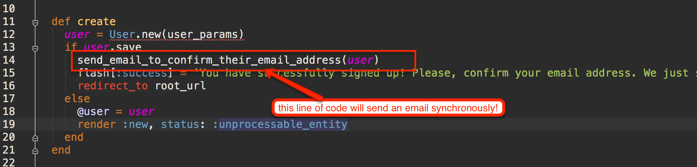
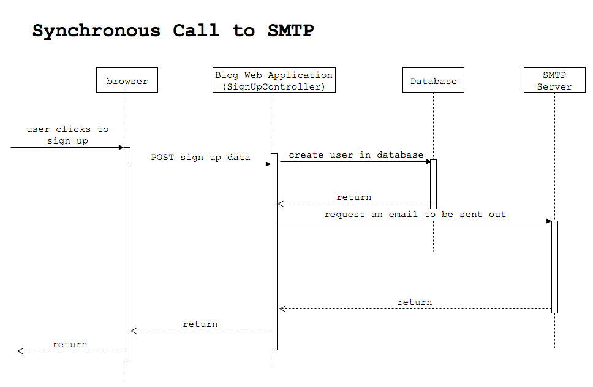
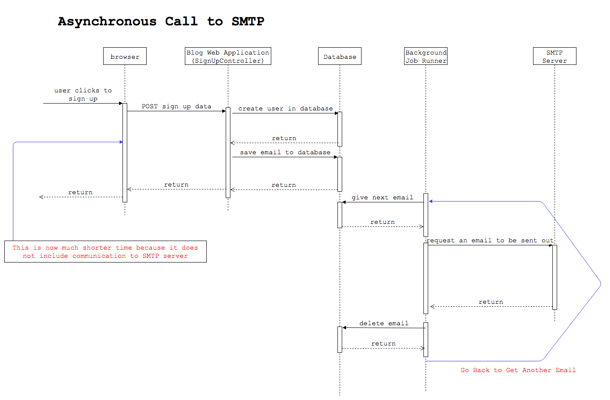
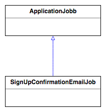
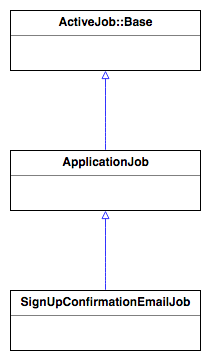

Background jobs are very useful because they will allow us to run long-running tasks without consuming resources from our
Web application that serves HTTP requests. 

For example, when we want to send out an email, we will be creating a background job that would send the email out **asynchronously**.
Hence, the HTTP request that generates the email is not blocked. 

Think about the sign up process in our `blog` application. Do you remember the code that we have on successful sign up?



The method `send_email_to_confirm_their_email_address` is calling method `UserMailer.ask_for_email_confirmation(...).deliver`, which
makes a call to the SMTP/outgoing email server in order to send the email and return back the control of flow to the `SignUpController`.



You can see that the SMTP call to send out the email is within the loop of the HTTP request handling. The fact that the SMTP server is an external service 
and it takes too long both to contact and to actually do the work, means that the actual HTTP request will take long as well.

Also, if the SMTP server is down for any reason, the sign up will fail. However, we don't believe that failing to sign up due to inability
to send the sign up confirmation email does worth it. We should find a way to send the email when the SMTP server will be up and running again
and let the sign up process finish without error.

## Introducing Background Runner

In order to solve the above problem, we are going to introduce another process that will be executing the delivery of the email outside of the
main HTTP request processing loop.



Do you see the difference to the previous diagram. Now, the `SignUpController` saves the email (actually, it saves the task details to send an email out, which also includes
the email itself) in the database, rather than talking to the SMTP server. And then returns immediately. This makes the HTTP request processing loop
much shorter in terms of time. Also, there is no way the HTTP request fails due to SMTP server being down.

Then, it is the background runner that needs to pick up the details of the task from the database and execute what the task is supposed to be
about. The email task will make the background runner send the email out by connecting to SMTP server. Then the email sent out will be deleted
from the database and the background runner will loop back to pick up the next email in the queue.

## Some Properties Of Background Runner

Background runners are Ruby processes that they have all the application code loaded, so they have access to the model and whatever
else your Web application has access to. They run independently of your Web server, hence they may be down, while your server may be still running,
and vice versa.

Usually, background runner is designed in such a way that it deletes only the successful tasks from the queue and keeps the failed ones
inside the queue. Also, for the failed ones it is designed to pick them up again and retry their execution.

## ActiveJob

`ActiveJob` is the Rails framework that offers an API to

1. create background jobs
1. enqueue background jobs in the backend database
1. execute background jobs

Also, it allows you to hook various background jobs technologies and use whatever matches your preferences.

Examples of background job technologies are
 
1. [Delayed Job](https://github.com/collectiveidea/delayed_job).
1. [Resque](https://github.com/resque/resque).
1. [Sidekiq](https://github.com/mperham/sidekiq).

These technologies are compatible with the `ActiveJob` interface and hence they can be plugged in interchangeably, without you
having to change your application code.

> *Note* that Rails itself has an internal in-process asynchronous background job runner. It runs in its own thread, but keeps
its queue with the background tasks in memory. This means that if the Rails server is restarted, any pending background task
is lost.

## Define a Job

Let's define our first job. This is going to be a class that derives from `ApplicationJob`. Our first job is about
sending the sign up confirmation email. We are going to call the class `SignUpConfirmationEmailJob` and we will
define it inside the file `app/jobs/sign_up_confirmation_email_job.rb`:

``` ruby
# File: app/jobs/sign_up_confirmation_email_job.rb
#
class SignUpConfirmationEmailJob < ApplicationJob
end
```

As you can see, we have the following class inheritance here:



The class `ApplicationJob` is actually a class inside our `app/jobs` folder that is generated there when we first set up our
application. If you look at its code, it is an empty class. It just derives from `ActiveJob::Base`. The idea is that if you have
things that are common to all your jobs, then we can put them in `ApplicationJob` class.

So, the actually hierarchy is this:



So, you can always visit the [ActiveJob::Base API](http://api.rubyonrails.org/v5.1/classes/ActiveJob/Base.html) in order to study what this class offers to our Jobs.

### `perform`

The jobs need to define a method with name `perform`. This method can take as many arguments as it needs. There is no restriction here.
Here is the implementation of our `SignUpConfirmationEmailJob`:

``` ruby
1. # File: app/jobs/sign_up_confirmation_email_job.rb
2. #
3. class SignUpConfirmationEmailJob < ApplicationJob
4.   def perform(user_id)
5.     user = User.find(user_id)
6.     UserMailer.ask_for_email_confirmation(user.id).deliver
7.   end
8. end
```

Our job has a `perform` method that takes as input the id of the `User` that has just signed up. Hence, it will search for the user in the 
database and then ask the `UserMailer` to deliver the email.

All the method execution is going to take place in the background. We will explain how next.

## Enqueue The Job

Now that we have the job definition, we can instantiate such jobs and put them in the background runner queue. This is called _enqueuing_. 

We will change our `SignUpController#create` method to enqueue a job of type `SignUpConfirmationEmailJob`. The change is very simple:

``` ruby
 1. # File: app/controllers/sign_up_controller.rb
 2. #
 3. class SignUpController < ApplicationController
... 
49.   def send_email_to_confirm_their_email_address(user)
50.     SignUpConfirmationEmailJob.perform_later(user.id)
51.   end
52. end
```

We changed the implementation of the method `send_email_to_confirm_their_email_address`. Instead of calling the `UserMailer.ask_for_email_confirmation(user.id).deliver`,
we are now enqueuing a job of type `SignUpConfirmationEmailJob`.

That was it!

Now, we have implemented the asynchronous delivery of sign up confirmation emails. You only have to try that out. 

## Other Backends

Rails comes with an in-process and in-memory queue for asynchronous job execution. However, this is not for production. For production
you will want to use a production-purpose backend. Also, you may want to install this backend at your development environment too and
have a more detailed experience about how this backend works.

Rails has built-in adapters for many production-ready background job runners. See the [full list here](http://api.rubyonrails.org/v5.1/classes/ActiveJob/QueueAdapters.html).

## Delayed Job Backend

We will use [delayed job](https://github.com/collectiveidea/delayed_job) for our backend. Let's switch it on:

### Configure Application To Use Delayed Job

We need to configure our `blog` application to use Delayed Job. Here is how we do that:

``` ruby
 1. # File: config/application.rb
 2. #
...
24. 
25.     config.active_job.queue_adapter = :delayed_job
26.   end
27. end
```

Do you see line 25? This is how we say Rails that it should use the Delayed Job adapter.

### Install Delayed Job

But still, enabling the Delayed Job adapter is not enough. You have to install Delayed Job. Since Delayed Job can use 
different backends for storing the job instances, but we want to use our database via the `ActiveRecord`, we have
to install the gem [delayed_job_active_record](https://github.com/collectiveidea/delayed_job_active_record). Let's add this to our Gemfile
and then run `bundle`. After you do that, you will see Delayed Job related gems to have been installed:

``` bash
blog $ bundle show | grep 'delayed'
  * delayed_job (4.1.3)
  * delayed_job_active_record (4.1.2)
blog $
```

### Generate The Schema Migration

Delayed Job with ActiveRecord backend is using our database to store the background jobs. It is using a specific table called `delayed_jobs`.
This means that we have to create the corresponding schema migration and execute it.

The following command creates the schema migration file for Delayed Job:

``` bash
blog $ rails generate delayed_job:active_record
      create  bin/delayed_job
       chmod  bin/delayed_job
      create  db/migrate/20170728185100_create_delayed_jobs.rb
blog $
```

Here is the schema migration file that is generated:

``` ruby
 1. # File: db/migrate/20170728185100_create_delayed_jobs.rb
 2. #
 3. class CreateDelayedJobs < ActiveRecord::Migration[5.1]
 4.   def self.up
 5.     create_table :delayed_jobs, force: true do |table|
 6.       table.integer :priority, default: 0, null: false # Allows some jobs to jump to the front of the queue
 7.       table.integer :attempts, default: 0, null: false # Provides for retries, but still fail eventually.
 8.       table.text :handler,                 null: false # YAML-encoded string of the object that will do work
 9.       table.text :last_error                           # reason for last failure (See Note below)
10.       table.datetime :run_at                           # When to run. Could be Time.zone.now for immediately, or sometime in the future.
11.       table.datetime :locked_at                        # Set when a client is working on this object
12.       table.datetime :failed_at                        # Set when all retries have failed (actually, by default, the record is deleted instead)
13.       table.string :locked_by                          # Who is working on this object (if locked)
14.       table.string :queue                              # The name of the queue this job is in
15.       table.timestamps null: true
16.     end
17. 
18.     add_index :delayed_jobs, [:priority, :run_at], name: "delayed_jobs_priority"
19.   end
20. 
21.   def self.down
22.     drop_table :delayed_jobs
23.   end
24. end
```

And now let's run it:

``` bash
blog $ bin/rake db:migrate 
== 20170728185100 CreateDelayedJobs: migrating ================================
-- create_table(:delayed_jobs, {:force=>true})
   -> 0.0208s
-- add_index(:delayed_jobs, [:priority, :run_at], {:name=>"delayed_jobs_priority"})
   -> 0.0041s
== 20170728185100 CreateDelayedJobs: migrated (0.0251s) =======================

blog $
```

And let's confirm the creation of the table in the database:

``` bash
blog $ psql -d blog_development -c "\d+ delayed_jobs"
                                                         Table "public.delayed_jobs"
   Column   |            Type             |                         Modifiers                         | Storage  | Stats target | Description 
------------+-----------------------------+-----------------------------------------------------------+----------+--------------+-------------
 id         | bigint                      | not null default nextval('delayed_jobs_id_seq'::regclass) | plain    |              | 
 priority   | integer                     | not null default 0                                        | plain    |              | 
 attempts   | integer                     | not null default 0                                        | plain    |              | 
 handler    | text                        | not null                                                  | extended |              | 
 last_error | text                        |                                                           | extended |              | 
 run_at     | timestamp without time zone |                                                           | plain    |              | 
 locked_at  | timestamp without time zone |                                                           | plain    |              | 
 failed_at  | timestamp without time zone |                                                           | plain    |              | 
 locked_by  | character varying           |                                                           | extended |              | 
 queue      | character varying           |                                                           | extended |              | 
 created_at | timestamp without time zone |                                                           | plain    |              | 
 updated_at | timestamp without time zone |                                                           | plain    |              | 
Indexes:
    "delayed_jobs_pkey" PRIMARY KEY, btree (id)
    "delayed_jobs_priority" btree (priority, run_at)
```

### Try Delayed Job

With everything in place, let's try to sign up a user. Make sure that you restart your server.

When you carry out a sign up, this is what you will see in the Rails logs:

``` bash
 1. Started POST "/en/sign_up" for 127.0.0.1 at 2017-07-28 22:07:30 +0300
 2. Processing by SignUpController#create as HTML
 3.   Parameters: {"utf8"=>"✓", "authenticity_token"=>"...", "user"=>{"email"=>"paul1007@gmail.com", "password"=>"[FILTERED]", "password_confirmation"=>"[FILTERED]", "country_id"=>"6", "terms_of_service"=>"1"}, "commit"=>"Sign Up", "locale"=>"en"}
 4.   User Load (0.4ms)  SELECT  "users".* FROM "users" WHERE "users"."id" IS NULL LIMIT $1  [["LIMIT", 1]]
 5.   CACHE User Load (0.0ms)  SELECT  "users".* FROM "users" WHERE "users"."id" IS NULL LIMIT $1  [["LIMIT", 1]]
 6.   CACHE User Load (0.0ms)  SELECT  "users".* FROM "users" WHERE "users"."id" IS NULL LIMIT $1  [["LIMIT", 1]]
 7.    (0.2ms)  BEGIN
 8.   User Exists (0.5ms)  SELECT  1 AS one FROM "users" WHERE LOWER("users"."email") = LOWER($1) LIMIT $2  [["email", "paul1007@gmail.com"], ["LIMIT", 1]]
 9.   SQL (0.8ms)  INSERT INTO "users" ("email", "password_digest", "created_at", "updated_at", "email_confirmation_token", "terms_of_service", "country_id") VALUES ($1, $2, $3, $4, $5, $6, $7) RETURNING "id"  [["email", "paul1007@gmail.com"], ["password_digest", "$2a$10$Om9KkIY0SVwRiuEqy.KAMeCBtmWNb.4N3it71sjGcQOKK81RaCIn2"], ["created_at", "2017-07-28 19:07:30.072978"], ["updated_at", "2017-07-28 19:07:30.072978"], ["email_confirmation_token", "SHSBPxIIjqOW7mJSQsVO4g"], ["terms_of_service", "t"], ["country_id", 6]]
10.    (1.0ms)  COMMIT
11. [ActiveJob]    (0.2ms)  BEGIN
12. [ActiveJob]   SQL (1.8ms)  INSERT INTO "delayed_jobs" ("handler", "run_at", "queue", "created_at", "updated_at") VALUES ($1, $2, $3, $4, $5) RETURNING "id"  [["handler", "--- !ruby/object:ActiveJob::QueueAdapters::DelayedJobAdapter::JobWrapper\njob_data:\n  job_class: SignUpConfirmationEmailJob\n  job_id: a14bf4fd-8169-4069-9f86-cb8b3a7d2700\n  queue_name: default\n  priority: \n  arguments:\n  - 33\n  executions: 0\n  locale: en\n"], ["run_at", "2017-07-28 19:07:30.122225"], ["queue", "default"], ["created_at", "2017-07-28 19:07:30.122299"], ["updated_at", "2017-07-28 19:07:30.122299"]]
13. [ActiveJob]    (0.3ms)  COMMIT
14. [ActiveJob] Enqueued SignUpConfirmationEmailJob (Job ID: a14bf4fd-8169-4069-9f86-cb8b3a7d2700) to DelayedJob(default) with arguments: 33
15. Redirected to http://localhost:3000/en
16. Completed 302 Found in 124ms (ActiveRecord: 10.4ms) 
```

Do you see line 12? It is an `insert into "delayed_jobs"`. This is when Rails stores the background job into the queue of Delayed Job. Also,
see log line 14. It is mentioning that the job of type `SignUpConfirmationEmailJob` has been enqueued inside `DelayedJob(default)`, i.e.
inside the `DelayedJob` backend.

The `default` here meaning the `default` queue.

But, you don't see any log related to email delivery. Also, you should not see any email inside your SMTP Mailtrap email box. This is because
the background job runner has not picked up the job from the queue. And it has not picked it up because the background runner is not running.

You can also confirm that there is one item in the queue as follows:
 
``` bash
blog $ psql -d blog_development -c "select * from delayed_jobs"
 id | priority | attempts |                                 handler                                  | last_error |           run_at           | locked_at | failed_at | locked_by |  queue  |         created_at         |         updated_at         
----+----------+----------+--------------------------------------------------------------------------+------------+----------------------------+-----------+-----------+-----------+---------+----------------------------+----------------------------
  1 |        0 |        0 | --- !ruby/object:ActiveJob::QueueAdapters::DelayedJobAdapter::JobWrapper+|            | 2017-07-28 19:07:30.122225 |           |           |           | default | 2017-07-28 19:07:30.122299 | 2017-07-28 19:07:30.122299
    |          |          | job_data:                                                               +|            |                            |           |           |           |         |                            | 
    |          |          |   job_class: SignUpConfirmationEmailJob                                 +|            |                            |           |           |           |         |                            | 
    |          |          |   job_id: a14bf4fd-8169-4069-9f86-cb8b3a7d2700                          +|            |                            |           |           |           |         |                            | 
    |          |          |   queue_name: default                                                   +|            |                            |           |           |           |         |                            | 
    |          |          |   priority:                                                             +|            |                            |           |           |           |         |                            | 
    |          |          |   arguments:                                                            +|            |                            |           |           |           |         |                            | 
    |          |          |   - 33                                                                  +|            |                            |           |           |           |         |                            | 
    |          |          |   executions: 0                                                         +|            |                            |           |           |           |         |                            | 
    |          |          |   locale: en                                                            +|            |                            |           |           |           |         |                            | 
    |          |          |                                                                          |            |                            |           |           |           |         |                            | 
(1 row)

blog $
```

So, we need a background runner to start and consume this queue item. 

#### How to Start the Background Runner

The Delayed Job has installed an executable inside `bin`, that allows you to start and stop the background runner. Let's start it:

``` bash
blog $ bin/delayed_job start
...rvm/gems/ruby-2.3.3@blog/gems/delayed_job-4.1.3/lib/delayed/command.rb:5:in `rescue in <top (required)>': You need to add gem 'daemons' to your Gemfile if you wish to use it. (RuntimeError)
        from ...rvm/gems/ruby-2.3.3@blog/gems/delayed_job-4.1.3/lib/delayed/command.rb:2:in `<top (required)>'
        from ...rvm/gems/ruby-2.3.3@blog/gems/activesupport-5.1.1/lib/active_support/dependencies.rb:292:in `require'
        from ...rvm/gems/ruby-2.3.3@blog/gems/activesupport-5.1.1/lib/active_support/dependencies.rb:292:in `block in require'
        from ...rvm/gems/ruby-2.3.3@blog/gems/activesupport-5.1.1/lib/active_support/dependencies.rb:258:in `load_dependency'
        from ...rvm/gems/ruby-2.3.3@blog/gems/activesupport-5.1.1/lib/active_support/dependencies.rb:292:in `require'
        from bin/delayed_job:4:in `<main>'
blog $
```

As you can see, in order to be able to use the Delayed Job background runner, we need the `daemons` gem installed. Let's add it to the Gemfile,
and execute a `bundle`.

Then try `bin/delayed_job start` again:

``` bash
blog $ bin/delayed_job start
delayed_job: process with pid 36553 started.
blog $
```

You can see that a new process with id 36553 has started. This is the background runner. As soon as the background runner starts, it starts consuming
queue items, i.e. jobs from the database. Hence, if you now check the background jobs in the database, you will see that there is none:

``` bash
blog $ psql -d blog_development -c "select * from delayed_jobs"
 id | priority | attempts | handler | last_error | run_at | locked_at | failed_at | locked_by | queue | created_at | updated_at 
----+----------+----------+---------+------------+--------+-----------+-----------+-----------+-------+------------+------------
(0 rows)

blog $
```

The job has been executed and the sign up email has been sent out.

If you want to stop the background runner from running, you can issue the command `bin/delayed_job stop`.

#### Configure Delayed Job

It is a good practice to configure Delayed Job using an initializer file like this:

``` ruby
 1. # File: config/initializers/delayed_job_initializer.rb
 2. #
 3. Delayed::Worker.destroy_failed_jobs = false
 4. Delayed::Worker.sleep_delay = 5
 5. Delayed::Worker.max_attempts = 3
 6. Delayed::Worker.max_run_time = 5.minutes
 7. Delayed::Worker.read_ahead = 10
 8. Delayed::Worker.default_queue_name = 'default'
 9. Delayed::Worker.delay_jobs = !Rails.env.test?
10. Delayed::Worker.raise_signal_exceptions = :term
11. Delayed::Worker.logger = Logger.new(File.join(Rails.root, 'log', "delayed_job_#{Rails.env}.log"))
```

Save the above file and restart your Rails server and your background runners. Please, note that you may want to have different settings
among different environments. For example, the `max_run_time` might different in production from development environment.

## Queues

All the background jobs are being enqueued inside the job runner queue. For Delayed Job, this is the `delayed_jobs` table. However,
This queue may further be subdivided to other logical queues. This is the reasons you see the column `queue` as part of the
columns of the `delayed_jobs` table.

You can define the queue at the job definition class level:

``` ruby
 1. # File: app/jobs/sign_up_confirmation_email_job.rb
 2. #
 3. class SignUpConfirmationEmailJob < ApplicationJob
 4.   queue_as :low_priority
 5.   
 6.   def perform(user_id)
 7.     user = User.find(user_id)
 8.     UserMailer.ask_for_email_confirmation(user.id).deliver
 9.   end
10. end
```

Do you see the line 4? This is how we tell Rails that each instance of this job will be queued inside the queue with name
`low_priority`. Let's try to create a new sign up job by signing up a new user. Please, make sure that the delayed job background
runner is stopped (`bin/delayed_job stop`).

As soon as you sign up a new user, you can check what it is inside the queue. For example:

``` bash
blog $ psql -d blog_development -c "select * from delayed_jobs"
 id | priority | attempts |                                 handler                                  | last_error |          run_at           | locked_at | failed_at | locked_by |    queue     |         created_at         |         updated_at         
----+----------+----------+--------------------------------------------------------------------------+------------+---------------------------+-----------+-----------+-----------+--------------+----------------------------+----------------------------
  4 |        0 |        0 | --- !ruby/object:ActiveJob::QueueAdapters::DelayedJobAdapter::JobWrapper+|            | 2017-07-29 04:49:14.72993 |           |           |           | low_priority | 2017-07-29 04:49:14.729983 | 2017-07-29 04:49:14.729983
    |          |          | job_data:                                                               +|            |                           |           |           |           |              |                            | 
    |          |          |   job_class: SignUpConfirmationEmailJob                                 +|            |                           |           |           |           |              |                            | 
    |          |          |   job_id: f136d1e1-214b-4a2f-936c-e27b00360d9a                          +|            |                           |           |           |           |              |                            | 
    |          |          |   queue_name: low_priority                                              +|            |                           |           |           |           |              |                            | 
    |          |          |   priority:                                                             +|            |                           |           |           |           |              |                            | 
    |          |          |   arguments:                                                            +|            |                           |           |           |           |              |                            | 
    |          |          |   - 36                                                                  +|            |                           |           |           |           |              |                            | 
    |          |          |   executions: 0                                                         +|            |                           |           |           |           |              |                            | 
    |          |          |   locale: en                                                            +|            |                           |           |           |           |              |                            | 
    |          |          |                                                                          |            |                           |           |           |           |              |                            | 
(1 row)

blog $
```

Do you see the column with name `queue`? It has the value `low_priority`. Now, let's start the background runner, but now, with specifying
which queue the background runner should be dealing with. Let's give the name `default`.

``` bash
blog $ bin/delayed_job --queue default start
delayed_job: process with pid 39314 started.
blog $
```

Even if you wait quite long, the queue will not be processed by this particular background runner. Just try, after a while, to check
the contents of the `delayed_jobs` table. They will still be there. This is because the background runner that we have started does not
deal with the queue of the item that exists in the `delayed_jobs` table.

We can now start a background runner for the `low_priority` queue:

``` bash
blog $ bin/delayed_job --queue low_priority start
ERROR: there is already one or more instance(s) of the program running
blog $
```

The above command failed because Delayed Job is already running for the `default` queue. But, you can still start another worker running
in parallel to the previous one. You just need to give a different identifier to the new worker:

``` bash
blog $ bin/delayed_job --queue low_priority --identifier=low_priority_1 start
delayed_job.low_priority_1: process with pid 39704 started.
blog $
```

With the `--identifier` option we uniquely identify the new process to spawn. And the spawn was successful. Now, if you check the number
of entries in the `delayed_jobs` table, you will see them being zero.

``` bash
blog $ psql -d blog_development -c "select * from delayed_jobs"
id | priority | attempts | handler | last_error | run_at | locked_at | failed_at | locked_by | queue | created_at | updated_at 
----+----------+----------+---------+------------+--------+-----------+-----------+-----------+-------+------------+------------
(0 rows)

blog $
```

Also, if you now do list the processes that are related to Delayed Job, you will find two of them running:

``` bash
blog $ ps -ef | grep 'delayed_job'
  501 39452     1   0  7:49AM ??         0:01.58 delayed_job    
  501 39704     1   0  7:56AM ??         0:01.25 delayed_job.low_priority_1     
...
blog $
```

If you want to stop these workers from running...

``` bash
blog $ bin/delayed_job stop
delayed_job: trying to stop process with pid 39452...
delayed_job: process with pid 39452 successfully stopped.
blog $ bin/delayed_job --identifier=low_priority_1 stop
delayed_job.low_priority_1: trying to stop process with pid 39704...
delayed_job.low_priority_1: process with pid 39704 successfully stopped.
blog $
```

> *Information:* You can always find more about how to start Delayed Job workers in the Delayed Job gem documentation pages. Or you can issue `bin/delayed_job --help`
and get the list of options that the executable can take.

## Callbacks

ActiveJob allows you to hook code at specific points in the lifecycle of a job. These are called ActiveJob Callbacks and 
they are the following:

1. Enqueue Callbacks
    1. before_enqueue
    1. around_enqueue
    1. after_enqueue
1. Perform Callbacks    
    1. before_perform
    1. around_perform
    1. after_perform

Let's implement all of them for our `SignUpConfirmationEmailJob`:

``` ruby
 1. # File: app/jobs/sign_up_confirmation_email_job.rb
 2. #
 3. class SignUpConfirmationEmailJob < ApplicationJob
 4.   queue_as :low_priority
 5. 
 6.   before_enqueue do |job|
 7.     puts "Before enqueuing job: #{job.inspect}"
 8.   end
 9. 
10.   around_enqueue do |job, enqueue_block|
11.     puts "Before executing enqueue in an around callback, #{job.inspect}"
12. 
13.     enqueue_block.call
14. 
15.     puts "After executing enqueue in an around callback, #{job.inspect}"
16.   end
17. 
18.   after_enqueue do |job|
19.     puts "After enqueuing job: #{job.inspect}"
20.   end
21. 
22.   before_perform do |job|
23.     puts "Before performing job: #{job.inspect}"
24.   end
25. 
26.   around_perform do |job, perform_block|
27.     puts "Before executing perform in an around callback, #{job.inspect}"
28. 
29.     perform_block.call
30. 
31.     puts "After executing perform in an around callback, #{job.inspect}"
32.   end
33. 
34.   after_perform do |job|
35.     puts "After performing job: #{job.inspect}"
36.   end
37. 
38.   def perform(user_id)
39.     user = User.find(user_id)
40.     UserMailer.ask_for_email_confirmation(user.id).deliver
41.   end
42. end
```

Do you see how the callbacks are registered in an ActiveJob definition? Note that the non-around callbacks, the yield the
job instance in the block. Whereas the around callbacks they yield both the job instance and the block to call (enqueue or perform).
The around callbacks need to call the block, otherwise, the enqueue or the perform will not be executed.

With the above code in place, try to sign up a new user and watch your Rails console output:

```
 1. Started POST "/en/sign_up" for 127.0.0.1 at 2017-07-29 08:30:00 +0300
 2. Processing by SignUpController#create as HTML
 3.   Parameters: {"utf8"=>"✓", "authenticity_token"=>"...", "user"=>{"email"=>"ian0829@gmail.com", "password"=>"[FILTERED]", "password_confirmation"=>"[FILTERED]", "country_id"=>"3", "terms_of_service"=>"1"}, "commit"=>"Sign Up", "locale"=>"en"}
 4.   User Load (0.5ms)  SELECT  "users".* FROM "users" WHERE "users"."id" IS NULL LIMIT $1  [["LIMIT", 1]]
 5.   CACHE User Load (0.0ms)  SELECT  "users".* FROM "users" WHERE "users"."id" IS NULL LIMIT $1  [["LIMIT", 1]]
 6.   CACHE User Load (0.0ms)  SELECT  "users".* FROM "users" WHERE "users"."id" IS NULL LIMIT $1  [["LIMIT", 1]]
 7.    (0.2ms)  BEGIN
 8.   User Exists (0.6ms)  SELECT  1 AS one FROM "users" WHERE LOWER("users"."email") = LOWER($1) LIMIT $2  [["email", "ian0829@gmail.com"], ["LIMIT", 1]]
 9.   SQL (1.0ms)  INSERT INTO "users" ("email", "password_digest", "created_at", "updated_at", "email_confirmation_token", "terms_of_service", "country_id") VALUES ($1, $2, $3, $4, $5, $6, $7) RETURNING "id"  [["email", "ian0829@gmail.com"], ["password_digest", "$2a$10$AO8zaiXu3usptQRbxu0KJe3wkdOIm1xWTY4HmaHCQ4xJjhcG3n48i"], ["created_at", "2017-07-29 05:30:00.595836"], ["updated_at", "2017-07-29 05:30:00.595836"], ["email_confirmation_token", "d-Xo4zcXojPzYRGGne58_A"], ["terms_of_service", "t"], ["country_id", 3]]
10.    (0.3ms)  COMMIT
11. Before enqueuing job: #<SignUpConfirmationEmailJob:0x007fc9ccb2a348 @arguments=[37], @job_id="cbf8801b-270c-4e05-964c-67e005fcfc41", @queue_name="low_priority", @priority=nil, @executions=0>
12. Before executing enqueue in an around callback, #<SignUpConfirmationEmailJob:0x007fc9ccb2a348 @arguments=[37], @job_id="cbf8801b-270c-4e05-964c-67e005fcfc41", @queue_name="low_priority", @priority=nil, @executions=0>
13. [ActiveJob]    (0.2ms)  BEGIN
14. [ActiveJob]   SQL (0.6ms)  INSERT INTO "delayed_jobs" ("handler", "run_at", "queue", "created_at", "updated_at") VALUES ($1, $2, $3, $4, $5) RETURNING "id"  [["handler", "--- !ruby/object:ActiveJob::QueueAdapters::DelayedJobAdapter::JobWrapper\njob_data:\n  job_class: SignUpConfirmationEmailJob\n  job_id: cbf8801b-270c-4e05-964c-67e005fcfc41\n  queue_name: low_priority\n  priority: \n  arguments:\n  - 37\n  executions: 0\n  locale: en\n"], ["run_at", "2017-07-29 05:30:00.658290"], ["queue", "low_priority"], ["created_at", "2017-07-29 05:30:00.658374"], ["updated_at", "2017-07-29 05:30:00.658374"]]
15. [ActiveJob]    (0.3ms)  COMMIT
16. After enqueuing job: #<SignUpConfirmationEmailJob:0x007fc9ccb2a348 @arguments=[37], @job_id="cbf8801b-270c-4e05-964c-67e005fcfc41", @queue_name="low_priority", @priority=nil, @executions=0, @provider_job_id=5>
17. After executing enqueue in an around callback, #<SignUpConfirmationEmailJob:0x007fc9ccb2a348 @arguments=[37], @job_id="cbf8801b-270c-4e05-964c-67e005fcfc41", @queue_name="low_priority", @priority=nil, @executions=0, @provider_job_id=5>
18. [ActiveJob] Enqueued SignUpConfirmationEmailJob (Job ID: cbf8801b-270c-4e05-964c-67e005fcfc41) to DelayedJob(low_priority) with arguments: 37
19. Redirected to http://localhost:3000/en
20. Completed 302 Found in 148ms (ActiveRecord: 8.8ms)
```
Do you see lines 11, 12, 16 and 17? These are the `puts` commands for the enqueue callbacks. You don't see any output related to the
perform callbacks because the perform has not been carried out. Nevertheless, you will not see them in the Rails logs, but you may see them
in the background runner logs when the background runner picks up the job to perform it.

Start the background runner:

``` bash
blog $ bin/delayed_job start
delayed_job: process with pid 41304 started.
blog $
```

This will definitely run your job, but you will not see the `puts` commands of the perform hooks, because the background runner runs without terminal output.

What you can use instead of `puts` commands is the `Rails.logger` command. This is a normal logger that you can use to log message inside the file that Rails
is using for logging too:

``` ruby
 1. # File: app/jobs/sign_up_confirmation_email_job.rb
 2. #
 3. class SignUpConfirmationEmailJob < ApplicationJob
 4.   queue_as :low_priority
 5. 
 6.   before_enqueue do |job|
 7.     puts "Before enqueuing job: #{job.inspect}"
 8.   end
 9. 
10.   around_enqueue do |job, enqueue_block|
11.     puts "Before executing enqueue in an around callback, #{job.inspect}"
12. 
13.     enqueue_block.call
14. 
15.     puts "After executing enqueue in an around callback, #{job.inspect}"
16.   end
17. 
18.   after_enqueue do |job|
19.     puts "After enqueuing job: #{job.inspect}"
20.   end
21. 
22.   before_perform do |job|
23.     Rails.logger.debug "Before performing job: #{job.inspect}"
24.   end
25. 
26.   around_perform do |job, perform_block|
27.     Rails.logger.debug "Before executing perform in an around callback, #{job.inspect}"
28. 
29.     perform_block.call
30. 
31.     Rails.logger.debug "After executing perform in an around callback, #{job.inspect}"
32.   end
33. 
34.   after_perform do |job|
35.     Rails.logger.debug "After performing job: #{job.inspect}"
36.   end
37. 
38.   def perform(user_id)
39.     user = User.find(user_id)
40.     UserMailer.ask_for_email_confirmation(user.id).deliver
41.   end
42. end
```

Do you see the perform callbacks? I am using `Rails.logger.debug` instead of `puts`. Restart your background runner and 
try to sign up a user again. Inside the `log/development.log` file, you will see lines like this:

``` bash
[ActiveJob] [SignUpConfirmationEmailJob] [1c2e564a-0eeb-4f19-8869-6fecbbcbecdb] Before performing job: #<SignUpConfirmationEmailJob:0x007ff71c594b40 @arguments=[38], @job_id="1c2e564a-0eeb-4f19-8869-6fecbbcbecdb", @queue_name="low_priority", @priority=nil, @executions=0, @provider_job_id=nil, @serialized_arguments=nil, @locale="en">
```

### Callbacks Have Access To Job Arguments

Before closing the subject of callbacks, see how the hooks have access to the job instance. The `job` variable also has the `@arguments` instance variable that 
is an array of the arguments passed to the perform method. That can be useful in many ways inside your hooks. 

## Mailers

Although we used the email example to demonstrate the definition of custom jobs, especially for mailers, you don't necessarily have to define an `ActiveJob` class. 
Rails provides the method `deliver_later` that allow you to enqueue a mailer job without any more effort. 

Hence, the call:

```
UserMailer.ask_for_email_confirmation(user.id).deliver_later
```

can enqueue a `UserMailer` job in the background jobs without you having to have defined a custom job class for it.

## Job Testing

Testing jobs is done with ruby code that we write inside `test/jobs` folder. Let's write a test for our `SignUpConfirmationEmailJob`:

``` ruby
 1. # File test/jobs/sign_up_confirmation_email_job_test.rb
 2. #
 3. class SignUpConfirmationEmailJobTest < ActiveJob::TestCase
 4.   test 'an email is put in the queue' do
 5.     user = create(:user)
 6. 
 7.     ActionMailer::Base.deliveries.clear
 8.     assert_difference "ActionMailer::Base.deliveries.size", 1 do
 9.       SignUpConfirmationEmailJob.perform_now(user.id)
10.     end
11.   end
12. end
```

Here we are testing the perform of the job, by actually calling `.perform_now`. The `.perform_now` method can be called whenever
you want the job to be executed immediately/synchronously and not in the background. A test is a good place for calling this method.

If you want to read more about Job Testing you can read the [Rails Guides here](http://guides.rubyonrails.org/testing.html#testing-jobs).

## Scheduling Jobs To Run At Specific Points in The Future

We have seen how you can put a job in the queue. Then, if a background runner is available to execute it, it picks it up immediately.
However, there are cases in which you want your job to run at specific point of time in the future. For example:

``` ruby
MyBillingJob.set(wait_until: Time.zone.now + 2.days).perform_later(customer)
```

The above will put the job in the queue, but, even if there is a background runner running, it will not be executed until 2 days
from now.

## Background Runners in Heroku

Running background runners in Heroku means that you need to define a worker in your `Procfile`. The `Procfile` (you can read more about it
[here](https://devcenter.heroku.com/articles/procfile)) is a file
that needs to exist in the root folder of your project. This is what you have to define for your `blog`:

```
web: bundle exec rails server
worker: bundle exec rake jobs:work
```

With the above `Procfile` in place, when you deploy to Heroku, you will also enable a background runner that would be executing
your jobs asynchronously.

> **Important:** Having a background runner in Heroku might increase the cost of your application. Make sure that you understand
how Heroku charges you for the resources that you consume. You may want to disable Delayed Job for your production environment
too, until you have your application finished and ready to serve real production traffic. Disabling Delayed Job in production
environment is as simple as changing this `Delayed::Worker.delay_jobs = !Rails.env.test?` to `Delayed::Worker.delay_jobs = !Rails.env.test? && !Rails.env.production?`.

## Closing Note

Background jobs and technologies to deploy this feature are very common in all Web applications. If you want to read more
about ActiveJob you can read the [Rails Guides here](http://guides.rubyonrails.org/active_job_basics.html). You should definitely
study Delayed Job as well as other tools like Sidekiq or Resque. And don't forget to read the 
[Best Practices about Delayed Job here](https://www.sitepoint.com/delayed-jobs-best-practices/).


