We have learned to program in JavaScript and we have also learned how to use jQuery library. This gave
us the ability to change how the front-end, the browser-end, of our application behaves. 

But JavaScript is used to communicate with the server too, Ruby on Rails in our case. The technique used
is called  _Ajax_ (also _AJAX_) which stands for Asynchronous JavaScript and XML. 
 
## Introduction to Ajax

The basic need for Ajax is when we want to send a request from the browser to the server in order to get some pieces
of information back as a response, but not the whole page content. The request is usually done asynchronously, i.e. without
blocking the user interaction to the page. The pieces of information returned are used to update parts of the page.
This makes it a very efficient way of exchanging information with the server, because very few information is
travelling from server back to the browser.

> *Information:* Rails JavaScript integration is supporting [CoffeeScript](http://coffeescript.org/) too. Your
coffee script is a script that finally compiles to JavaScript. We will not be using CoffeeScript in this course
since Rails allows us to write JavaScript too. It does not oblige us to write CoffeeScript. We encourage you
to start learning CoffeeScript though, because it is becoming very popular.

## jQuery and Ajax

Hence, Ajax is used to send HTTP requests to server. jQuery comes with Ajax support and makes it really easy for
you to build Ajax requests.

### Button To Trigger Request

Let's see an example. Let's add a `Hello` button at the bottom of our application layout in our `blog` application:

``` haml
1. - # File: app/views/layouts/application.html.haml
2. - #
3. !!!
4. %html
...
18.       = yield :menu
19.       = yield
20. 
21.       = button_tag 'Hello', id: 'hello-button', class: 'btn btn-default'
```

If you save and load a page, e.g. [http://localhost:3000/articles](http://localhost:3000/articles), it will have the button
at the bottom of your page:

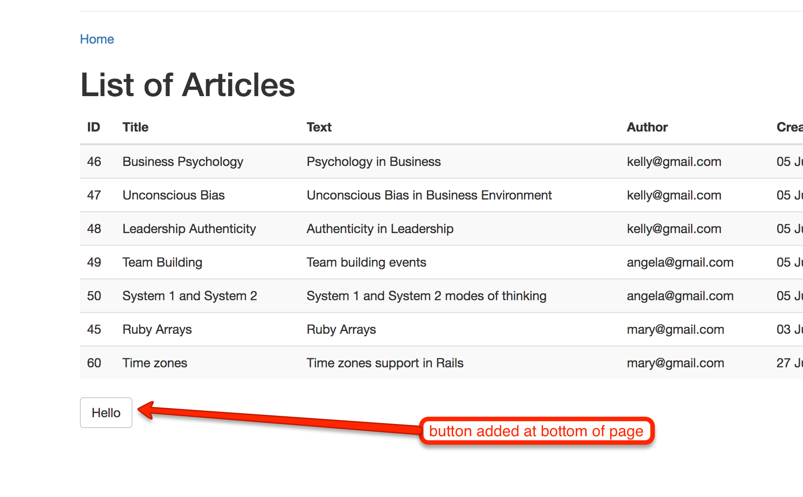

If you try to click this button, nothing will happen. This is because this is not a submit button as part of a form.

But still, we can use jQuery and Ajax to submit a GET request to the server. We will send an HTTP request to the endpoint `GET /hello`.

### Trigger Request

Open our `app/assets/javascripts/application.js` file and amend it so that it includes the following JavaScript code:

``` JavaScript
 1. // File: app/assets/javascripts/application.js
 2. //
 3. // This is a manifest file that'll be compiled into application.js, which will include all the files
...
18. //= require_tree .
19. 
20. $(document).ready(function() {
21.     $('#hello-button').on('click', function() {
22.         $.get({
23.             url: '/hello',
24.             success: function(data, textStatus, jqXHR) {
25.                 console.log('textStatus: ' + textStatus);
26.                 alert('Hello ' + data);
27.             }
28.         });
29.     });
30. });
```

The new lines that we have added are lines 20 to 30. We are installing a `click` handler at the button with id `hello-button`. The handler
is calling `$.get()` method which is the [jQuery Ajax get](https://api.jquery.com/jquery.get/) method. This method takes as argument
a JavaScript object. One property of the object is `url` and has the value of the path we want the GET request to be sent to. The other
property is `success`. Its value is a function that will be called when the response from server comes back to the browser. So, it is
called on HTTP success response. When `success` is called, then the first argument, `data` contains whatever the HTTP response body
contains. The `textStatus` is going to contain the HTTP Response status.

If you save the above, reload the page on your browser and click on the `Hello` button, you will not see anything. Actually, if
you have the `Network` tab open at your Google Chrome Developer Tools, you will see the GET request to `/hello` failing with error code 404.

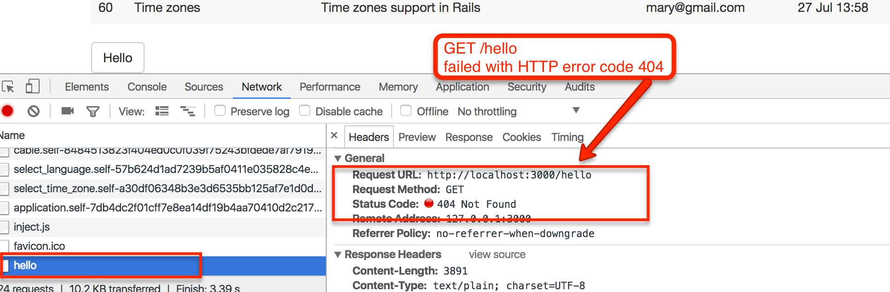

Before we fix this, let's also attach a handler for error cases. This is the new `app/assets/javascripts/application.js` file:

``` JavaScript
 1. // File: app/assets/javascripts/application.js
...
18. //= require_tree .
19. 
20. $(document).ready(function() {
21.     $('#hello-button').on('click', function() {
22.         $.get({
23.             url: '/hello',
24.             success: function(data, textStatus, jqXHR) {
25.                 console.log(textStatus);
26.                 alert('Hello ' + data);
27.             },
28.             error: function(jqXHR, textStatus, errorThrown) {
29.                 alert('textStatus: ' + textStatus + ', errorThrown: ' + errorThrown);
30.             }
31.         });
32.     });
33. });
```

After the `success` handler, we have defined the `error` handler too. Save the above, reload your page on the browser
and try to click the button `Hello`. You will see this:

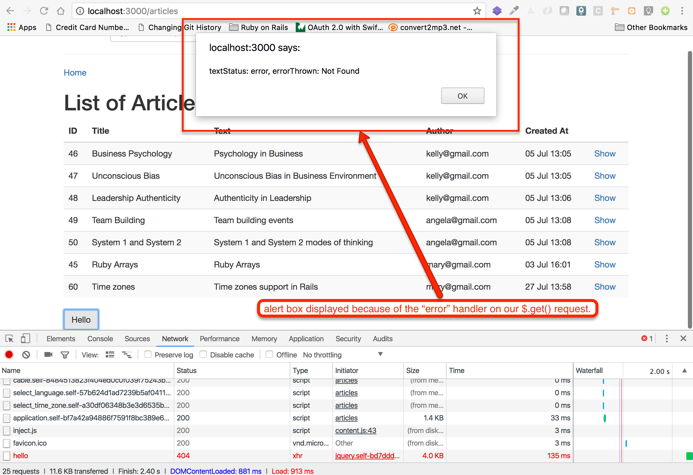

Obviously, that was expected. We have not implemented the end point `GET /hello` and that is why the request fails. You can confirm 
the missing endpoint at the server side too, by inspecting the Rails logs:

```
Started GET "/hello" for 127.0.0.1 at 2017-07-31 08:25:25 +0300
  
ActionController::RoutingError (No route matches [GET] "/hello"):
  
```

### Implementing The End Point

Let's implement the end point. Add the following entry in your `config/routes.rb` file:

``` ruby
 1. # File: config/routes.rb
 2. #
 3. Rails.application.routes.draw do
 4.   post '/users/locale', to: 'users#update_locale'
 5.   post '/users/time_zone', to: 'users#update_time_zone'
 6. 
 7.   scope "(:locale)", locale: Regexp.new(I18n.available_locales.map(&:to_s).join('|')) do
 8.     get '/hello', to: 'hello#respond'
...
28.   end
29. end
```

Do you see line 8? This is the new line that we have added. It defines that the `GET /hello` is going to be served
by `HelloController#respond` action. Let's implement this too:

``` ruby
1. # File: app/controllers/hello_controller.rb
2. #
3. class HelloController < ApplicationController
4.   skip_before_action :authenticate_user
5. 
6.   def respond
7.     render plain: 'World!'
8.   end
9. end
```

The `respond` action is using the `render plain` to send back to the response a simple `World!` string. With this in
place, let's click the button again:

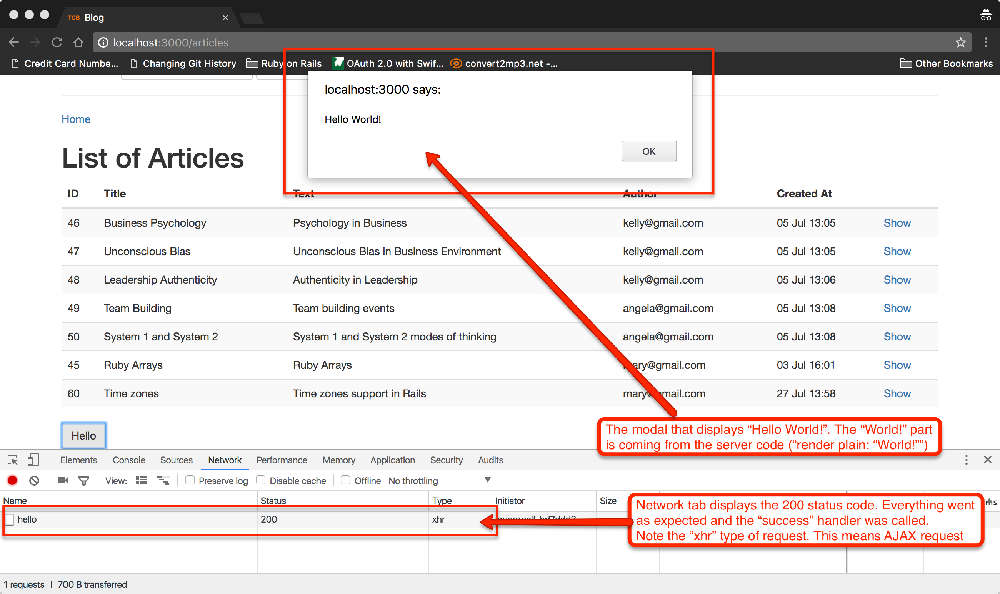

### `$.ajax` API

The `$.get` API is very useful if you want to issue a GET request. However, it relies on calling [`$.ajax`](https://api.jquery.com/jquery.ajax/) internally. The `$.ajax`
is the method that can be used to call any type of Ajax requests.

Let's convert the `$.get` to its `$.ajax` equivalent:

``` JavaScript
 1. // File: app/assets/javascripts/application.js
...
18. //= require_tree .
19. 
20. $(document).ready(function() {
21.     $('#hello-button').on('click', function() {
22.         $.ajax({
23.             url: '/hello',
24.             method: 'GET',
25.             success: function(data, textStatus, jqXHR) {
26.                 console.log(textStatus);
27.                 alert('Hello ' + data);
28.             },
29.             error: function(jqXHR, textStatus, errorThrown) {
30.                 alert('textStatus: ' + textStatus + ', errorThrown: ' + errorThrown);
31.             }
32.         });
33.     });
34. });
```

With `$.ajax` in place, the difference now is that we have to specify the HTTP verb, using the `method` attribute.

### Update the DOM

Usually, the successful completion of an Ajax request is being used to update the page, i.e. to update the DOM. 

Let's use this to delete a row from the DOM on the page that lists all the articles. The row will be removed every time
we delete an article. Hence, we will not have to update the whole page.

This is what we will actually implement:

<div id="media-container-video-Locale Is Set Based on Accept Language Header Value">
  <a href="https://player.vimeo.com/video/227795675"></a>
</div>

Let's do it. 

> Please, remove the `Hello` button from the application layout and remove the corresponding JavaScript code from the
`app/assets/javascripts/application.js`. Also, remove the corresponding entry from the `config/routes.rb` file.

#### Change the Delete Action HTML Markup

First we need to change the way we generate the Delete action on the UI:

``` haml
 1. - # File: app/views/articles/_article.html.haml
 2. - #
 3. %tr.article-row-in-list-of-articles
 4.   %td= article.id
 5.   %td= article.title
 6.   %td= article.text
 7.   %td= article.user.email
 8.   %td= l article.created_at, format: :short
 9.   %td
10.     = link_to 'Show', article_path(article)
11.     - if current_user && current_user.can_write_article?(article)
12.       &nbsp;&nbsp;
13.       = link_to 'Edit', edit_article_path(article)
14.       &nbsp;&nbsp;
15.       = link_to 'Delete', article_path(article), class: 'btn btn-danger js-delete-article'
```

The changes are on lines 3 and 15. On line 3, we have added the class `article-row-in-list-of-articles`. This will be useful later
on in our JavaScript code in order to locate the row that we need to delete. On line 15, we added the class `js-delete-article` 
and we removed the `method` attribute and the `data: {confirm: ...` data attribute. We don't need them because we will attach
our own JavaScript that will handle both.

> *Hint:* Note that when we add classes and then we bind JavaScript events on them, we prefer to prefix their name with `js-`
in order to show that these classes are being used for dynamic programming with JavaScript rather than for styling.

#### Bind JavaScript Handler

Create the file `app/assets/javascript/delete_article.js` with the following content:

``` JavaScript
 1. // File: app/assets/javascripts/delete_article
 2. //
 3. $(document).ready(function(){
 4.     $('.js-delete-article').on('click', function(event) {
 5.         var $button = $(this);
 6.         event.preventDefault();
 7.         var answer = confirm('Are you sure that you want to delete this article?');
 8.         if (answer) {
 9.             $.ajax({
10.                 url: $button.attr('href'),
11.                 method: 'DELETE',
12.                 headers: {'X-CSRF-Token': $('meta[name="csrf-token"]').attr('content')},
13.                 success: function(data, textStatus, jqXHR) {
14.                     console.log('article ' + article_id + ' deleted!');
15.                     $button.
16.                       closest('.article-row-in-list-of-articles').
17.                       fadeOut(function() {
18.                         $(this).remove();
19.                       });
20.                 },
21.                 error: function(jqXHR, textStatus, errorThrown) {
22.                     alert('textStatus: ' + textStatus + ', errorThrown: ' + errorThrown);
23.                 }
24.             });
25.         }
26.     });
27. });
```

This JavaScript code:

1. Binds a handler for the `click` event on the `.js-delete-article` elements.
1. The handler
    1. asks the user whether they really want to delete the article.
    1. If the answer is _yes_,
        1. it sends an Ajax request to the URL that is the value of the `href` attribute of the link that the user clicked on.
        1. The method is set to be `DELETE`, hence the HTTP verb is going to be `DELETE`.
        1. We also send the header `X-CSRF-TOKEN` having the value of the meta tag with name `csrf-token`. This is located
        at the `head` part of the page (see the screenshot below). If we don't do that, Rails will not accept the request. 
        Remember that every time we make an HTTP request that might change the state at the server side (verbs: `POST`, `PUT`, `PATCH`, `DELETE`), then we need
        to include the CSRF token. This is done automatically with the `= form_tag` helper, but we need to do it manually
        with the `$.ajax()` requests.
        1. On success, we locate the row the button clicked belongs to, with the [`$button.closest(...)`](https://api.jquery.com/closest/) call. And then
        we fade out this row. At the end of the fade out, we remove it.
        
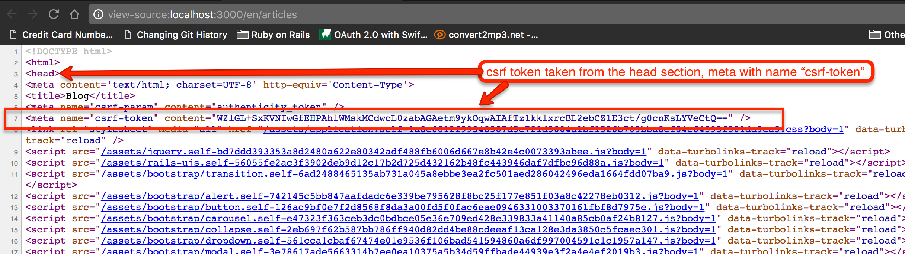

#### Update Controller
        
But the above is not enough. We need to adapt our `ArticlesController#destroy` action. This is the new version:

``` ruby
 1. # File: app/controllers/articles_controller.rb
 2. #
 3. class ArticlesController < ApplicationController
...
39.   end
40. 
41.   def destroy
42.     @article.destroy
43.     head :ok
44.   end
45. 
46.   def foo
...
76. end
```

The new `destroy` implementation is very simple. It does not return any body in the HTTP response. It only returns 200 OK header.

Now, everything is in place. Go ahead and test that your delete action works as expected.

## Rails and Ajax

We have done the job to issue the delete request using Ajax. Now that we know how to do it, maybe it's about time to see what Rails can do 
for us in this context.

In short terms, Rails can provide us with helpers that allow us to write as less JavaScript code as possible. Sometimes without any JavaScript code.
We will demonstrate that with a second delete button, `Delete 2`, so that you can have both implementations in parallel for comparison.

### Ajax View Helper

Let's change the view file `app/views/articles/_article.html.haml` so that it has another button next to the first one:

``` haml
 1. - # File: app/views/articles/_article.html.haml
 2. - #
 3. %tr.article-row-in-list-of-articles
 4.   %td= article.id
 5.   %td= article.title
 6.   %td= article.text
 7.   %td= article.user.email
 8.   %td= l article.created_at, format: :short
 9.   %td
10.     = link_to 'Show', article_path(article)
11.     - if current_user && current_user.can_write_article?(article)
12.       &nbsp;&nbsp;
13.       = link_to 'Edit', edit_article_path(article)
14.       &nbsp;&nbsp;
15.       = link_to 'Delete', article_path(article), class: 'btn btn-danger js-delete-article'
16.       &nbsp;&nbsp;
17.       = link_to 'Delete 2', article_path(article), class: 'btn btn-danger', remote: true, method: :delete, data: {confirm: "Are you sure that you want to delete this article?"}
```

Do you see line 17? Compare it to line 15. It does not have the custom class (`js-delete-article`) but it has a `remote: true` attribute
set. Also, it needs the method specification, i.e. the HTTP verb we want to use for the link, since this is not a GET verb.
Finally, note that we have added the confirmation question like we had it before, from the previous chapters.

Let's see the code that is generated with this `link_to` in place:

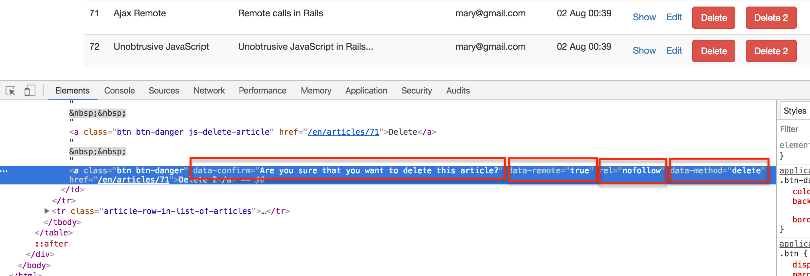

Please, note the following:

1. The anchor has the `data-remote` attribute. This tells Rails that we want the click to be handled using Ajax call to server.
1. Also it has the `data-method` equal to `delete`. This is the HTTP verb, hence it's going to set the `method` attribute of the Ajax call.
1. The `data-confirm` has the question to ask for the user to confirm whether they want to proceed with the action on the anchor.
1. The `rel="nofollow"` tells crawling robots that this link should not be crawled. 

Now, you can bind JavaScript function handlers to specific events, that have been designed for this particular reason. Here is what
we write inside the `app/assets/javascripts/delete_article.js`:

``` ruby
 1. // File: app/assets/javascripts/delete_article
 2. //
 3. $(document).ready(function(){
 4.     $('.js-delete-article').on('click', function(event) {
...
26.     });
27. 
28.     $('.article-row-in-list-of-articles a[data-remote][data-method="delete"]').on('ajax:success', function() {
29.         var $button = $(this);
30.         $button.
31.           closest('.article-row-in-list-of-articles').
32.           fadeOut(function() {
33.             $(this).remove();
34.           });
35.     });
36. });
```

After the handler for the `click` event on the `.js-delete-article` selector, we have added a handler for the anchors that
have been declared with `data-remote` and `data-method="delete"`. The handler handles the event `ajax:success` on these
anchors. This event is attached by Rails JavaScript tools when we add the `remote: true`. If you see the implementation
of the handler is the same like the `success` handler attached to the `$.ajax` call inside the `click` handler for the
`.js-delete-article`. 

Pretty cool, isn't it? We write much less code now. And we don't write code to send the Ajax request ourselves. It is
executed behind the scenes by Rails JavaScript tools, only because we have added the `remote: true` attribute.

The events that you can bind JavaScript handlers are:

1. `ajax:before`, which is called before any Ajax code starts execution. If your handler returns `false`, then Ajax is aborted.
1. `ajax:beforeSend`, which is called before the Ajax request takes place. If your handler returns `false`, then Ajax is aborted.
1. `ajax:send`, which is called when the request is sent.
1. `ajax:success`, which is called whenever the response from the server is in the 200-399 range.
1. `ajax:error`, which is called whenever the response from the server is not in the success range.
1. `ajax:complete`, which is called at the end, in both success and error cases.

### Other UI Elements with Ajax Support

Besides the `link_to` helper that supports Ajax calls, you can also use the `button_to`, to create buttons that they support Ajax.
Also, you can use the helper `form_with` to create forms that will be submitted with an Ajax request.

If you want to read more about Rails and Ajax, you can read the [Rails Guides here](http://guides.rubyonrails.org/working_with_javascript_in_rails.html).

## Action Cable

Having learned about the JavaScript support in Rails, we move on to Action Cable. Action Cable is the feature that Rails offers 
in order to provide real-time communication from the server back to the browser. The underlying technology is [Web Sockets](https://en.wikipedia.org/wiki/WebSocket),
but Action Cable makes it much easier to integrate it into your Rails application.

We have already studied how a browser uses HTTP to request data from the server. With WebSockets, we can have a TCP connection between
browser and server that is full-duplex, which means that the server can send data to the browser without browser issuing a request. 
This technology can be used to push real-time information to users, when the information becomes available, without having browser polling the server
periodically, asking whether new information is available or not.

Let's see how Action Cable helps us take advantage of WebSockets then.

### Channels And Subscribers

Rails allows you to define different *channels* and then have *subscribers* subscribing to any or all of these channels. The subscribers are the browsers
and the channels are created at the server side:

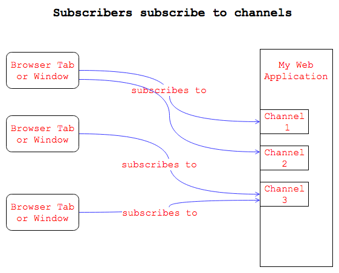

### Publication Of Information

Then, your Web application, the server-side, publishes information to the channels, which is forwarded to all the subscribers that subscribe to these channels.

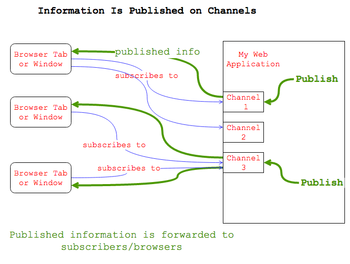

Note that *subscribers* are initially called *consumers*, until they subscribe to a channel. Also, the fact that a consumer creates a WebSocket connection to
the Rails server is represented by a *connection*, more precisely, by an `ApplicationCable::Connection`.

### `ApplicationCable::Connection`

The `ApplicationCable::Connection` is a class already defined for us, inside our project folder:

``` ruby
1. # File: app/channels/application_cable/connection.rb
2. #
3. module ApplicationCable
4.   class Connection < ActionCable::Connection::Base
5.   end
6. end
```

It is empty, at the moment, and derives its behaviour from the `ActionCable::Connection::Base` class that is coming from the Rails framework.
Every time a new connection is created, an instance of this class is being created too.

Also, if the instance responds to `#connect`, then this `#connect` method is called. Let's take advantage of it:

``` ruby
1. # File: app/channels/application_cable/connection.rb
2. #
3. module ApplicationCable
4.   class Connection < ActionCable::Connection::Base
5.     def connect
6.       logger.info "A new connection has been requested: #{self.connection_identifier}"
7.     end
8.   end
9. end
```

We have implemented the method `#connect`. Hence, every time a connection is created, i.e. every time a consumer attaches
to the WebSockets of our application via a subscription, we will see this message being printed in the Rails logs.

### Channel Class

Your channels should be modeled as classes deriving from `ApplicationCable::Channel`. This class derives from `ActionCable::Channel::Base`. The
`ApplicationCable::Channel` already exists. Look at the file `app/channels/application_cable/channel.rb`:

``` ruby
1. # File: app/channels/application_cable/channel.rb
2. #
3. module ApplicationCable
4.   class Channel < ActionCable::Channel::Base
5.   end
6. end
```

Hence, your specific channels are going to be sub-classes of this class. Something like this:

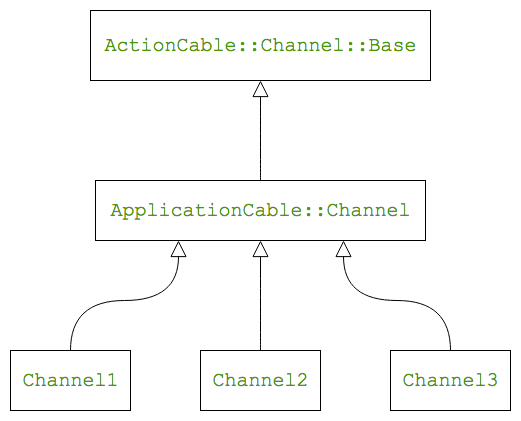

The purpose of the existing `ApplicationCable::Channel` class is to put in whatever is going to be common to all your concrete
channel classes. For example, let's just put a simple callback method, named `subscribed`. This is going to be called every time
a subscriber connects/subscribes to a channel:

``` ruby
1. # File: app/channels/channel.rb
2. #
3. module ApplicationCable
4.   class Channel < ActionCable::Channel::Base
5.     def subscribed
6.       logger.info "A new subscription has been accepted: #{self.connection.connection_identifier}"
7.     end
8.   end
9. end
```

### A Demo Channel

Create the class `ChatChannel` inside the file `app/channels/chat_channel.rb` as follows:

``` ruby
1. # File: app/channels/chat_channel.rb
2. #
3. class ChatChannel < ApplicationCable::Channel
4. end
```

### JavaScript Consumer

We may have the channel definition in the server-side, but we need some code at the browser, i.e. the consumer
side too. Rails comes with the creation of a consumer instance saved inside `App.cable` property. This is done
when your application starts, thanks to JavaScript code executed inside the `app/assets/javascripts/cable.js` 
file:

``` JavaScript
 1. // File: app/assets/javascripts/cable.js
 2. //
 3. // Action Cable provides the framework to deal with WebSockets in Rails.
 4. // You can generate new channels where WebSocket features live using the `rails generate channel` command.
 5. //
 6. //= require action_cable
 7. //= require_self
 8. //= require_tree ./channels
 9. 
10. (function() {
11.   this.App || (this.App = {});
12. 
13.   App.cable = ActionCable.createConsumer();
14. 
15. }).call(this);
```

The line `ActionCable.createConsumer()` creates a consumer at the browser side and this is saved inside `App.cable` property.
You can confirm that by just visiting a page of your application and using the console to print the value of `App.cable`:

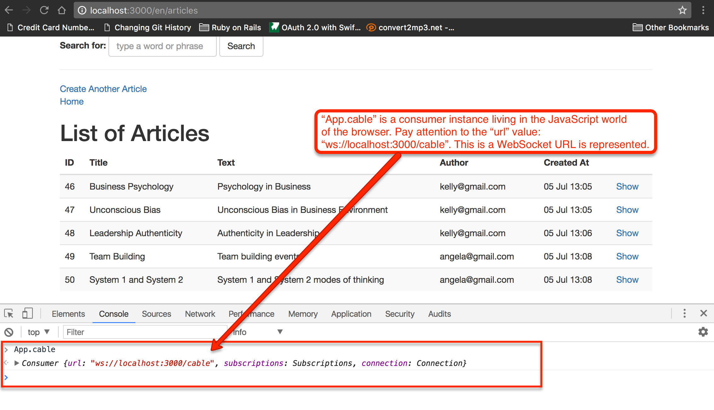

Do you see the `ws` URL? `ws://localhost:3000/cable`. This means that the consumer, if it decides to become a subscriber, it
will connect at the `/cable` endpoint at your server side.

### JavaScript Subscription

Having said that, creating a consumer is not enough. We need to make the consumer being a subscriber to a specific channel. This needs to
be done with the corresponding JavaScript code.

Create the file `app/javascripts/cable/subscriptions/chat.js`. Note that the folder `cable/subscriptions` might not be present
and, if not, you will have to create it.
 
``` JavaScript
1. // File: app/assets/javascripts/cable/subscriptions/chat.js
2. //
3. App.cable.subscriptions.create({
4.     channel: "ChatChannel"
5. }, {
6.     connected: function() {
7.         console.log('connected subscription for chat channel');
8.     }
9. });
```

The above code creates a subscriber that subscribes to channel represented by the class `ChatChannel`. Look how we define a callback function
that is called when the consumer succeeds in making the connection to the `ChatChannel`. This callback is a JavaScript handler attached
to the property `connected`.

However, the subscriber needs a little bit more code in order to handle the data published on this particular channel. We have not written this
code yet. We will do it a little bit later.

#### Network and Rails Logs After Subscription

Everything is in place. Refresh your page and you will now start seeing Rails logs like these:
 
``` bash
 1. => Booting Puma
 2. => Rails 5.1.1 application starting in development on http://localhost:3000
 3. => Run `rails server -h` for more startup options
 4. Puma starting in single mode...
 5. * Version 3.8.2 (ruby 2.3.3-p222), codename: Sassy Salamander
 6. * Min threads: 5, max threads: 5
 7. * Environment: development
 8. * Listening on tcp://0.0.0.0:3000
 9. Use Ctrl-C to stop
10. Started GET "/cable" for 127.0.0.1 at 2017-08-05 13:47:32 +0300
11.    (0.7ms)  SELECT "schema_migrations"."version" FROM "schema_migrations" ORDER BY "schema_migrations"."version" ASC
12. Started GET "/cable/" [WebSocket] for 127.0.0.1 at 2017-08-05 13:47:32 +0300
13. Successfully upgraded to WebSocket (REQUEST_METHOD: GET, HTTP_CONNECTION: Upgrade, HTTP_UPGRADE: websocket)
14. A new connection has been requested: 
15. A new subscription has been accepted: 
16. ChatChannel is transmitting the subscription confirmation
```

Do you see what happens when the `GET "/cable"` request is received? Look at lines 10 to 16. You can see the log lines
that correspond to the connection and subscription logs that we have inserted earlier on.

Also, you will be able to see the WebSocket requests to the `/cable` endpoint if you open the Network tab in the Google Chrome
developer tools:

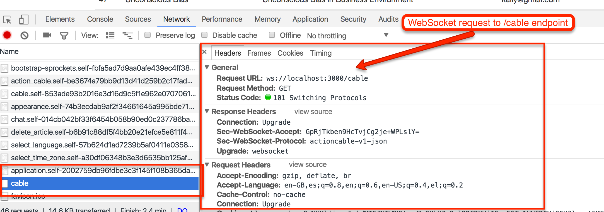

And if you open the Console tab, you will be able to see the log `connected subscription for chat channel` which is printed 
by the line 7 of `app/assets/javascripts/cable/subscriptions/chat.js`.

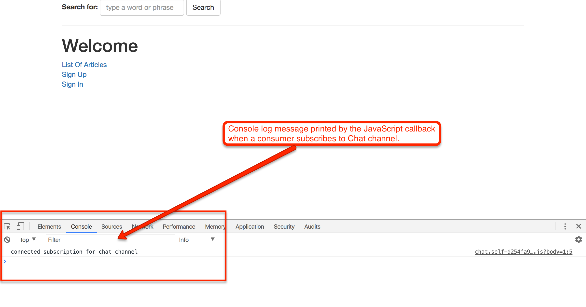

Before we leave the subject of logs, you might have spotted a problem. These logs that they are supposed to be printing 
the `connection_identifier` they don't print it. For example, the subscription log `A new subscription has been accepted: ` does not
end with the connection identifier. This is because we have not told Rails what makes a connection unique or identifiable. 
We will talk about it a little bit later.

### Publishing Information 

The connection and the subscription happen only once after the page has been loaded. Now the subscriber waits for data to be
published on the `ChatChannel`, so that it can consume them.

#### Broadcasting Streams

In order for the server to be able to send data to the client, i.e. to the subscriber, it needs to set up a broadcasting stream.
This can be done with the method `stream_from` that can be called at the channel level. Look at the following:

``` ruby
1. # File: app/channels/chat_channel.rb
2. #
3. class ChatChannel < ApplicationCable::Channel
4.   def subscribed
5.     super
6.     stream_from 'chat'
7.   end
8. end
```

The `ChatChannel` class, for each new subscriber, it defines what is the broadcasting stream this subscriber is going to
get data from. This is done on line 6. `stream_from 'chat'` means that the subscriber that has just subscribed is going
to get data from the `chat` broadcasting stream.

Now, if you refresh your browser page, you will see one more line in the Rails logs:

```
ChatChannel is streaming from chat
```
#### Publishing

Now, we need to write some code that would publish data to the `chat` broadcasting stream (which is streamed out to subscribers
by the `ChatChannel`). 

One way that you can publish data to a broadcasting stream is with the following method:

``` ruby
ActionCable.server.broadcast('chat', message: 'Hello World!')
```

The above code is broadcasting to `chat` stream the `Hash` `{ message: 'Hello World!' }`. This is converted to `JSON` object and
it is received in the JavaScript world by the subscribers that consume the Chat channel.

However, although you could try that on the rails console, it will not work. This is where we have to talk a little bit more about the
*subscription adapters*.

##### Subscription Adapters

The subscription adapter is a piece of Rails code that allows the published messages to be forwarded to the registered subscribers. Behind
the adapter is a tool that saves the message into a pool/database and then pushes the messages, asynchronously, to all the subscribers. Rails comes with the
`async` subscription adapter when we are in `development` or `test` environment. However, it uses the `redis` subscription adapter
when we deploy our application to `production` environment.
 
> *Information:* `Redis` is a NoSQL database and you can read more about it in the official [Redis documentation page](https://redis.io/documentation).

Which subscription adapter is used per environment is defined inside the file `config/cable.yml`. This is the content of the file in a
brand new application:

``` ruby
 1. # File: config/cable.yml
 2. #
 3. development:
 4.   adapter: async
 5. 
 6. test:
 7.   adapter: async
 8. 
 9. production:
10.   adapter: redis
11.   url: redis://localhost:6379/1
12.   channel_prefix: blog_production
```

> Reading the above content confirms what we have told you about which subscription adapter is used per environment. Please, note that
your `production` setting assumes that your production server has Redis locally installed, which might not be the case. On Heroku, 
you will have to install an add-on like [Heroku Redis](https://elements.heroku.com/addons/heroku-redis) in order to use this subscription
adapter. Note that the `async` adapter is not production ready and should not be used in production.

##### `async` adapter

Back to the note that our publishing from the rails console wouldn't work, we need to tell you that `async` adapter does not
work when the operating system process that publishes is not the same as the operating system that pushes the data to the subscribers. It only
works within the same operating system process. This is the reason that publishing from the rails console, or from a background worker, will
not work with the `async` adapter.

##### `Redis` adapter

Because of the problem that we have identified above for the `async` adapter and in order to make things simpler, we are now suggesting you
to install Redis server in your development machine. 

You can install Redis in your Mac OS X environment using `brew`. Try `brew install redis-server` or `brew install redis`. When you have it
installed, you will confirm that Redis server is running:

``` bash
blog $ ps -ef | grep 'redis'
  501   752     1   0 26Jul17 ??         1:32.19 /usr/local/opt/redis/bin/redis-server 127.0.0.1:6379  
blog $
```

As you can see, the Redis server runs on interface `127.0.0.1`, i.e. on your local machine, listening for connection on the port `6379`.

With Redis server running in your local machine, change the content of the `config/cable.yml` file so that it does not use the `async`
adapter in your `development` environment.

``` ruby
 1. # File: config/cable.yml
 2. #
 3. development:
 4.   url: redis://localhost:6379/1
 5.   channel_prefix: blog_development
 6. 
 7. test:
 8.   adapter: async
 9. 
10. production:
11.   adapter: redis
12.   url: redis://localhost:6379/1
13.   channel_prefix: blog_production
```

And then, **make sure that you restart your Rails server** so that it takes into account the new settings.

##### Try Rails Console Publishing

With Redis subscription adapter, the Redis server installed and running and the Rails server restarted, refresh your
web page.

Then, start your Rails console and give the following command:

``` bash
blog $ bin/rails c
Loading development environment (Rails 5.1.1)
2.3.3 :001 > ActionCable.server.broadcast('chat', message: 'Hello World!')
[ActionCable] Broadcasting to chat: {:message=>"Hello World!"}
 => 1 
```

Bingo! The return value `1` indicates that the JSON message `{"message": "Hello World"}` has been pushed successfully. 

### Subscriber Handling Broadcast Message

But how does the subscriber handles the broadcast message, i.e. the message that is published on the channel it subscribes to?

This is every easy. We need to implement the `received` callback at the JavaScript level for the particular subscriber. This is
the new version of the file `app/assets/javascripts/cable/subscriptions/chat.js`:

``` JavaScript
 1. // File: app/assets/javascripts/cable/subscriptions/chat.js
 2. //
 3. App.cable.subscriptions.create({
 4.     channel: "ChatChannel"
 5. }, {
 6.     connected: function() {
 7.         console.log('connected subscription for chat channel');
 8.     },
 9.     received: function(data) {
10.         console.log(data['message']);
11.     }
12. });
```

Do you see lines 9 to 11. It is a JavaScript function handler that will be called when the subscriber receives data from the
channel. Also, the actual data, will be a JSON object stored in the variable `data`. The JSON object will have the structure
matching the structure for the data published in the Chat channel.

With the above in place, refresh your Web page and then send the publish message again from your Rails console. This is what
you will see on the Console tab on your Web page:

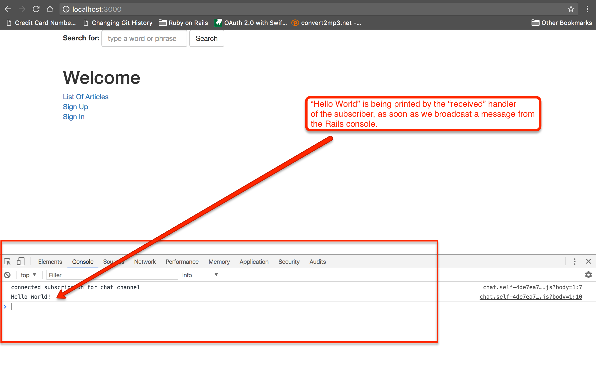

That is awesome! Our server pushes information to the subscribers of a channel!

### Multiple Subscribers

The whole setup is much more exciting when we take advantage of the fact that the broadcast message is being received by all subscribers.

Try to open a new tab or a new window and visit your Web page. Then publish a new message from your Rails console. You will see that all the
open tabs and windows that they have your page loaded will receive the message.

<div id="media-container-video-Publish To Multiple Subscribers">
  <a href="https://player.vimeo.com/video/228490008"></a>
</div>

Also, you will see the corresponding log entries in the Rails logs. This is what I've got for the publications of messages that you saw
on the above video:

```
ChatChannel transmitting {"message"=>"Hello World!"} (via streamed from chat)
ChatChannel transmitting {"message"=>"Hello World!"} (via streamed from chat)
ChatChannel transmitting {"message"=>"Hello World!"} (via streamed from chat)
ChatChannel transmitting {"message"=>"Hello World!"} (via streamed from chat)
ChatChannel transmitting {"message"=>"Hello Guys!"} (via streamed from chat)
ChatChannel transmitting {"message"=>"Hello Guys!"} (via streamed from chat)
ChatChannel transmitting {"message"=>"Hello Guys!"} (via streamed from chat)
ChatChannel transmitting {"message"=>"Hello Guys!"} (via streamed from chat)
```

### Subscriber Publishes Message

But it is not only the server that can publish messages to a channel. It is the subscriber that can do that too.

#### First Save Reference To Channel

In order to achieve that, you first need to save a reference to the channel subscription created at the subscriber level, i.e.
in the JavaScript create subscription code:

``` JavaScript
 1. // File: app/assets/javascripts/cable/subscriptions/chat.js
 2. //
 3. App.chatChannel = App.cable.subscriptions.create({
...
12. });
```

The only difference is that we save the result of `App.cable.subscriptions.create()` to the `App.chatChannel` property of the `App` object. 

#### Implement `receive` Method on Channel

We need to implement the method `receive` in the `ChatChannel` level:

``` ruby
 1. # File: app/channels/chat_channel.rb
 2. #
 3. class ChatChannel < ApplicationCable::Channel
 4.   def subscribed
 5.     super
 6.     stream_from 'chat'
 7.   end
 8. 
 9.   def receive(data)
10.     ActionCable.server.broadcast('chat', data)
11.   end
12. end
```

Do you see lines 9 to 11. The `receive` method will be responsible to handle the incoming messages from subscribers.

#### Try JavaScript Subscriber Publishing

With all the above in place, let's use some JavaScript code to publish a message from one of the subscribers. Open a series
of a subscribers (new tabs or windows). Then on one of the subscribers Console tab, issue the following command:

``` JavaScript
App.chatChannel.send({message: "Hello From One Subscriber"});
```

You will see this message appearing on all subscribers.

<div id="media-container-video-Publish To Multiple Subscribers">
  <a href="https://player.vimeo.com/video/228492390"></a>
</div>

#### Implement a UI To Send Messages

Having done all this preparation work, now it is easy for us to implement the following UX in which a subscriber sends messages
to all other subscribers.

<div id="media-container-video-Sending And Displaying Received Messages">
  <a href="https://player.vimeo.com/video/228537020"></a>
</div>

Let's do this implementation:

##### The HTML Markup

The HTML markup will be generated from a partial named `app/views/layouts/_send_message.html.haml`:

``` haml
1. - # File: app/views/layouts/_send_message.html.haml
2. - #
3. .form-group
4.   = form_tag do
5.     = label_tag :message_to_send, 'Message To Send Out:'
6.     = text_field_tag :message_to_send, nil, placeholder: 'Type in your message', class: 'form-control'
7.     = submit_tag 'Send Message', id: 'btn-send-message', class: 'btn btn-success'
8.   = label_tag :messages_received, 'Messages Received:'
9.   = text_area_tag :messages_received, nil, class: 'form-control'
```

This is a dummy form which does not actually submit its data to any endpoint. We will bind a click handler on its submit 
button and we will call the `App.chatChannel.send(...);` method to send a message to all the subscribers.

##### Sending Message

We now create the file `app/assets/javascripts/send_message.js` with the following content:

``` JavaScript
 1. // File: app/assets/javascript/send_message.js
 2. //
 3. $(document).ready(function() {
 4.     $('#btn-send-message').on('click', function(event) {
 5.         event.preventDefault();
 6. 
 7.         var $textWithMessage = $('#message_to_send');
 8.         var messageToSend = $textWithMessage.val().trim();
 9.         if (messageToSend !== '') {
10.             App.chatChannel.send({message: messageToSend});
11.             $textWithMessage.val('');
12.         }
13.     });
14. });
```

This is very simple implementation. The gist of it being line 10, on which we call the `App.chatChannel.send(...);`.

##### Receive Message

Chat channel receive message at the JavaScript level did only a `console.log` until now. Let's enhance it to append
the message received into the text area:

``` ruby
 1. // File: app/assets/javascripts/cable/subscriptions/chat.js
 2. //
 3. App.chatChannel = App.cable.subscriptions.create({
 4.     channel: "ChatChannel"
 5. }, {
 6.     connected: function() {
 7.         console.log('connected subscription for chat channel');
 8.     },
 9.     received: function(data) {
10.         var $messagesReceived = $('#messages_received');
11.         var previousValue = $messagesReceived.val();
12.         if (previousValue !== '')
13.             previousValue = previousValue + '\n';
14.         $messagesReceived.val(previousValue + data['message']);
15.         $messagesReceived.scrollTop(
16.             $messagesReceived.prop('scrollHeight') - $messagesReceived.height()
17.         );
18.     }
19. });
```

Have a look at lines 10 to 18. It is only a JavaScript code that appends the `data['message']` string into the text area
that has the messages received. Appending the message at the end of the text area content was quite easy. Maybe, the
most difficult part was to scroll the text area at the bottom. This is done with the help of [.scrollTop()](https://api.jquery.com/scrollTop/)
jQuery method. 

So, now, everything is ready. Refresh the tabs with your Web application page and then start sending messages like in the video
above. You will see all the messages being received by all subscribers.

### Identification of Connections

The problem that we encounter with the above implementation is that the message sent is also received by the subscriber that has sent the message.
This is something that we can remedy. We can change the code in order to make sure that the message is not pushed to the subscriber that
has sent the message.

In order to achieve this, we have to identify, somehow, each connection. Here is the new connection code:

``` ruby
 1. # File: app/channels/application_cable/connection.rb
 2. #
 3. module ApplicationCable
 4.   class Connection < ActionCable::Connection::Base
 5.     identified_by :connection_token
 6. 
 7.     def connect
 8.       self.connection_token = SecureRandom.urlsafe_base64(36)
 9.       logger.add_tags connection_token
10.       logger.info "A new connection has been requested: #{self.connection_identifier}"
11.     end
12.   end
13. end
```

1. Firstly, we tell which attribute will uniquely identify each connection. This is done on line 5. We declare the attribute `connection_token`
as being the one that would uniquely identify each connection.
1. Secondly, we have to give a unique value to the `connection_token` every time a new connection is created. This is done on line 8. We
randomly create a string using `SecureRandom` library.
1. Note also how we add the `connection_token` value to the tags that will be used to tag the log lines.

Having done this, restart your rails server and watch the logs when you open tabs with your Web application pages:

```
Started GET "/cable" for 127.0.0.1 at 2017-08-06 12:57:45 +0300
Started GET "/cable/" [WebSocket] for 127.0.0.1 at 2017-08-06 12:57:45 +0300
Successfully upgraded to WebSocket (REQUEST_METHOD: GET, HTTP_CONNECTION: Upgrade, HTTP_UPGRADE: websocket)
[tpfrjxP5yltXXq6BLM3Ow80DqLUvcgwZ-9AzUwG0GtgKfZ9M] A new connection has been requested: tpfrjxP5yltXXq6BLM3Ow80DqLUvcgwZ-9AzUwG0GtgKfZ9M
[tpfrjxP5yltXXq6BLM3Ow80DqLUvcgwZ-9AzUwG0GtgKfZ9M] Registered connection (tpfrjxP5yltXXq6BLM3Ow80DqLUvcgwZ-9AzUwG0GtgKfZ9M)
[tpfrjxP5yltXXq6BLM3Ow80DqLUvcgwZ-9AzUwG0GtgKfZ9M] A new subscription has been accepted: tpfrjxP5yltXXq6BLM3Ow80DqLUvcgwZ-9AzUwG0GtgKfZ9M
[tpfrjxP5yltXXq6BLM3Ow80DqLUvcgwZ-9AzUwG0GtgKfZ9M] ChatChannel is transmitting the subscription confirmation
[tpfrjxP5yltXXq6BLM3Ow80DqLUvcgwZ-9AzUwG0GtgKfZ9M] ChatChannel is streaming from chat
```

Nice! Watch out also how the `self.connection_identifier` now prints the connection token value.

### Fine Tune Broadcasting

Now, we need to tell the channel connection to transmit its message to a subscriber (note that we have one channel
instance per subscriber) only if the connection identifier is not equal to the connection token of the channel connection:

``` ruby
 1. # File: app/channels/chat_channel.rb
 2. #
 3. class ChatChannel < ApplicationCable::Channel
 4.   def subscribed
 5.     super
 6.     stream_from 'chat', coder: ActiveSupport::JSON do |message|
 7.       unless message.with_indifferent_access[:connection_identifier] == connection.connection_identifier
 8.         transmit message
 9.       end
10.     end
11.   end
12. 
13.   def receive(data)
14.     ActionCable.server.broadcast('chat', data.merge({connection_identifier: connection.connection_identifier}))
15.   end
16. end
```

The first change is on the line 14, where we merge a `Hash` with the `connection_identifier` key having the value that
uniquely identifies the connection for this particular `ChatChannel` instance.

Then, on the `stream_from` call, we do the other change. From a simple `stream_from 'chat'` call we now proceed to a more fine tuned
implementation in which the `do ... end` block supplied has the logic to transmit the message or not. If you read the
code, you will see that it calls `transmit message` only if the `connection_identifier` value of the `message` itself is
different from the `connection_identifier` of the connection the channel belongs to.

Having done these changes, then sent messages are pushed to all subscribers except from the subscriber that actually sent the message.

<div id="media-container-video-Sending And Displaying Received Messages">
  <a href="https://player.vimeo.com/video/228544817"></a>
</div>

### Altering Message

Or you may want to send the message even to the sender itself, but with a prefix that would tell the recipient more about who was the sender:

``` ruby
 1. # File: app/channels/chat_channel.rb
 2. #
 3. class ChatChannel < ApplicationCable::Channel
 4.   def subscribed
 5.     super
 6.     stream_from 'chat', coder: ActiveSupport::JSON do |message|
 7.       if message['connection_identifier'] == connection.connection_identifier
 8.         message['message'] = "You: #{message['message']}"
 9.       else
10.         message['message'] = "Other: #{message['message']}"
11.       end
12.       transmit message
13.     end
14.   end
15. 
16.   def receive(data)
17.     ActionCable.server.broadcast('chat', data.merge({connection_identifier: connection.connection_identifier}))
18.   end
19. end
```

The `stream_from` `do...end` block is now changed so that when we identify the sender to set the `You: ` as the prefix in the
message, whereas when we identify another subscriber we set the `Other: `.

Here is the video that demonstrate how it works:

<div id="media-container-video-Sending And Displaying Received Messages">
  <a href="https://player.vimeo.com/video/228546699"></a>
</div>

### Authentication and Authorization of connections

Before we close the subject of `ActionCable` just wanted to let you know that you may want to authenticate and authorize the 
incoming cable connections. Or even more, to identify the connection based on the current user logged in. Here is a sample
connection code that would provide for it:

``` ruby
# File: app/channels/application_cable/connection.rb
#
module ApplicationCable
  class Connection < ActionCable::Connection::Base
    identified_by :current_user

    def connect
      self.current_user = find_verified_user
      logger.add_tags current_user.name
    end

    def disconnect
      # Any cleanup work needed when the cable connection is cut.
    end

    private
    
    def find_verified_user
      User.find_by_identity(request.session[:user_id]) ||
          reject_unauthorized_connection
    end
  end
end
```

We will not elaborate more on this.
 
### Closing on ActionCable

ActionCable is a fantastic tool but it needs your study and practice in order to master it. Read more about it [in the Rails Guides](http://guides.rubyonrails.org/action_cable_overview.html) or 
by googling it. There are a lot of articles out there on ActionCable.

## Closing the Rails Section

That was our last chapter on Ruby on Rails. We believe that we have given you the necessary knowledge to work on Ruby on Rails as a junior
Web developer. You will learn more if you practice and study more. The [Rails Guides](http://guides.rubyonrails.org/) is something that you need to be 
going back frequently. 
