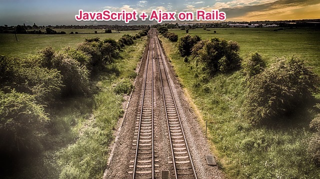

You already know JavaScript and jQuery. This chapter is going to teach you, firstly, about, Ajax, which is one of the most important
technologies in the JavaScript world. Ajax is used in every JavaScript framework and it is not dependent on Ruby on Rails. However, RoR
has JavaScript and Ajax integration that can make your life much easier and more productive. You will learn about all these features.
On top of that, you will also learn about WebSockets and how they have revolutionized the way browsers communicate with servers, including
Ruby on Rails. RoR has also developed a Ruby layer around WebSockets that abstracts the underlying technology and makes very easy
for you to implement full-duplex browser to server communication.
