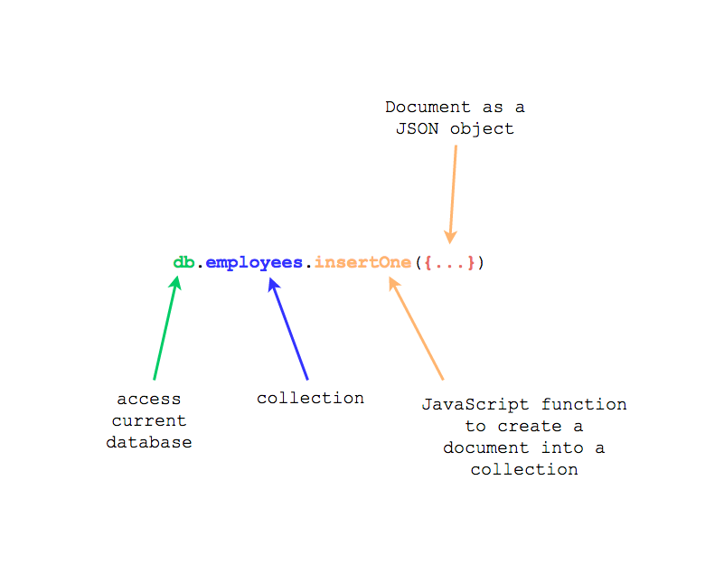

MongoDB is a *document* database. In other words, in MongoDB a record is a document that resembles JSON objects. For example:

``` json
{
  first_name: "John",
  last_name: "Papas",
  identity_number: "12345678"
  salary: 3600
}
```

Documents then are characterized by field - value pairs. For example, in the previous document, you can see the field `first_name` 
with value `"John"`. 

Note that the documents can contain other documents. In that case, the document that is contained inside the other is called an
embedded document.

## Installing MongoDB

You can find installation instructions for MongoDB [here](https://docs.mongodb.com/manual/administration/install-community/). If you 
have Mac OS X, the instructions are [here](https://docs.mongodb.com/manual/tutorial/install-mongodb-on-os-x/).

### Update your Homebrew

``` bash
brew update
```

### Install MongoDB

``` bash
brew install mongodb
```

### Add MongoDB Bin Folder To PATH

MongoDB installs shortcuts to its executables inside `/usr/local/bin`. So, if this path is inside your PATH environment variable,
then you are good to go. Otherwise, you will have to add it.

## Configuration

When MongoDB server is running it is given a path to a configuration file. Usually this is `/usr/local/etc/mongod.conf`. In this file,
you specify also the path to the data folder, i.e. the folder in which the documents are going to be saved. 

These are the contents of my file:

``` bash
systemLog:
  destination: file
  path: /usr/local/var/log/mongodb/mongo.log
  logAppend: true
storage:
  dbPath: /usr/local/var/mongodb
net:
  bindIp: 127.0.0.1
```

As you can read from above, my data folder is `/usr/local/var/mongodb`.

## MongoDB Running Process

You can always check whether MongoDB is running using the following command:

``` bash
ps -ef | grep 'mongo'
  501   834     1   0 12:23PM ??         0:32.64 /usr/local/opt/mongodb/bin/mongod --config /usr/local/etc/mongod.conf
```

The `/usr/local/opt/mongodb/bin/mongod` is the executable that is used to start MongoDB server.

MongoDB is always running and it is a process that listens for client connections. Like MySQL database server. The default
port MongoDB server is listening to, is port number `27017`.

## Mongo Client and Mongo Shell

You can connect to MongoDB server by executing `mongo`. The `mongo` command starts what we call the Mongo shell. It is a
JavaScript shell that allows you to execute queries and commands in your MongoDB database. The commands are being
sent over to MongoDB server which executes them and returns the results back to the client.

``` bash
$ mongo
MongoDB shell version v3.4.2
connecting to: mongodb://127.0.0.1:27017
MongoDB server version: 3.4.2
Server has startup warnings: 
2017-08-08T12:23:05.168+0300 I CONTROL  [initandlisten] 
2017-08-08T12:23:05.168+0300 I CONTROL  [initandlisten] ** WARNING: Access control is not enabled for the database.
2017-08-08T12:23:05.168+0300 I CONTROL  [initandlisten] **          Read and write access to data and configuration is unrestricted.
2017-08-08T12:23:05.168+0300 I CONTROL  [initandlisten]
>  
```

The `> ` is the mongo shell prompt. Now you can use JavaScript commands, including MongoDB-specific JavaScript commands.

> *Hint:* If you want to exit the mongo shell, then give the command `quit()`. Or hit <kbd>Ctrl + C</kbd>.
 
## Display Current Database
 
Being in a mongo shell session, let's type some commands. The following displays the current database:

``` JavaScript
> db
test
>
```

As you can see the default database is the one with name `test`.

## Display All Non-Empty Databases

``` JavaScript
> show dbs
blog_development  0.000GB
local             0.000GB
>
```

Note that the output of this command, `show dbs`, includes all the non-empty databases. That is why it does not list the `test`
database. `test` database is empty. 

Note also that the above output will be different to yours.

## Switching Current Database

In order to switch to a database, you have to use the helper `use <name_of_database>`. See the following interaction:

``` JavaScript
> use local
switched to db local
> db
local
> 
```

## Create a New Database

In order to create a new database, you have first to `use` it. Then you need to create the first document. Note that documents
need to be created inside a collection. Here is an example:

``` JavaScript
 1. > use accounting
 2. switched to db accounting
 3. > db.employees.insertOne({first_name: "John", last_name: "Papas", identity_number: "12345678", salary: 3600})
 4. {
 5.         "acknowledged" : true,
 6.         "insertedId" : ObjectId("598a10b21631fe0993ee7974")
 7. }
 8. > show dbs
 9. accounting        0.000GB
10. blog_development  0.000GB
11. local             0.000GB
12. > 
```

1. Line 1 switches to a new database.
1. Line 3 creates a **new document** within a **new collection** within a **new database**
1. Line 8 proves now that `accounting` database is one of the non-empty databases.



In other words, in order to create a new database, you need to create a new collection and a new document inside that new collection.
MongoDB will receive the command `db.<collection>.insertOne(<document>)` and will create the collection and the database if they don't exist, before
actually creating the document itself.

## List All Documents

You can list the documents of a collection as follows:

``` JavaScript
> db.employees.find();
{ "_id" : ObjectId("598a9d09c0317e30b80c33a5"), "first_name" : "John", "last_name" : "Papas", "identity_number" : "12345678", "salary" : 3600 }
> 
```

The above will return all the documents of the collection in groups of 20. Do you see the `"_id"` property? This is automatically assigned
by MongoDB in order to make the documents unique. It works like the primary key of the document.

Another way to list all documents is using the `.pretty()` function:

``` JavaScript
> db.employees.find().pretty();
{
        "_id" : ObjectId("598a9d09c0317e30b80c33a5"),
        "first_name" : "John",
        "last_name" : "Papas",
        "identity_number" : "12345678",
        "salary" : 3600
}
> 
```

## CRUD Operations

Let's see some basics with regards to CRUD (Create, Retrieve, Update, Delete) using mongo shell.

### Create

In order to create a new document you need to use either `insertOne()` or `insertMany()` methods on the collection reference.

Let's create some documents inside the `employees` collection (in our `accounting` db).

``` JavaScript
> db.employees.insertOne({first_name: "Mary", last_name: "Foo", identity_number: "87654321", "salary": 2800});
{
      "acknowledged" : true,
      "insertedId" : ObjectId("598ab700c0317e30b80c33a6")
}
>
```

The above creates a new document. Let's create more than one:

``` JavaScript
> db.employees.insertMany([
... {first_name: "Paul", last_name: "Bar", identity_number: "37281493", salary: 3500},
... {first_name: "Peter", last_name: "Pan", identity_number: "38589242123", salary: 1500}
... ]);
{
        "acknowledged" : true,
        "insertedIds" : [
                ObjectId("598ab79ec0317e30b80c33a7"),
                ObjectId("598ab79ec0317e30b80c33a8")
        ]
}
> 
```

The `insertMany()` above creates two documents to the employees collection. Let's now get the list of all the documents in the
collection:

``` JavaScript
> db.employees.find()
{ "_id" : ObjectId("598a9d09c0317e30b80c33a5"), "first_name" : "John", "last_name" : "Papas", "identity_number" : "12345678", "salary" : 3600 }
{ "_id" : ObjectId("598ab700c0317e30b80c33a6"), "first_name" : "Mary", "last_name" : "Foo", "identity_number" : "87654321", "salary" : 2800 }
{ "_id" : ObjectId("598ab79ec0317e30b80c33a7"), "first_name" : "Paul", "last_name" : "Bar", "identity_number" : "37281493", "salary" : 3500 }
{ "_id" : ObjectId("598ab79ec0317e30b80c33a8"), "first_name" : "Peter", "last_name" : "Pan", "identity_number" : "38589242123", "salary" : 1500 }
> 
```

### Retrieve Documents

The `find()` is the main method that is used to retrieve documents from the database.

If you don't give any arguments it will return all the documents. Otherwise, the first argument is the filtering/where clause.

``` JavaScript
> db.employees.find({first_name: "Paul"})
{ "_id" : ObjectId("598ab79ec0317e30b80c33a7"), "first_name" : "Paul", "last_name" : "Bar", "identity_number" : "37281493", "salary" : 3500 }
> 
```

The above query brings all the employees that have `first_name` equal to `"Paul"`.

You can also give a second argument to the `find()` method. The second argument works like a projection/fields selection argument.

``` JavaScript
> db.employees.find({first_name: "Paul"}, {first_name: 1, identity_number: 1})
{ "_id" : ObjectId("598ab79ec0317e30b80c33a7"), "first_name" : "Paul", "identity_number" : "37281493" }
> 
```

The above projection selects the properties `first_name` and `identity_number`. Please, note that the `_id` property is always returned.

``` JavaScript
> db.employees.find({first_name: "Paul"}, {first_name: 0})
{ "_id" : ObjectId("598ab79ec0317e30b80c33a7"), "last_name" : "Bar", "identity_number" : "37281493", "salary" : 3500 }
> 
```

The `{first_name: 0}`, on the other hand, specifies which property should **not** be returned.

Note that the result of the `find()` is a *cursor*. It is the mongo shell that uses the cursor to iterate and scan through
the results. 

You can also modify the cursor, by specifying things like the `limit`, for example:

``` JavaScript
> db.employees.find().limit(2)
{ "_id" : ObjectId("598a9d09c0317e30b80c33a5"), "first_name" : "John", "last_name" : "Papas", "identity_number" : "12345678", "salary" : 3600 }
{ "_id" : ObjectId("598ab700c0317e30b80c33a6"), "first_name" : "Mary", "last_name" : "Foo", "identity_number" : "87654321", "salary" : 2800 }
> 
```

The above limits the cursor results to the first 2 records located.

Your filter may contain query operators. For example:

``` JavaScript
> db.employees.find({salary: {$gt: 2500}})
{ "_id" : ObjectId("598a9d09c0317e30b80c33a5"), "first_name" : "Nick", "last_name" : "Papas", "identity_number" : "12345678", "salary" : 3600 }
{ "_id" : ObjectId("598ab700c0317e30b80c33a6"), "first_name" : "Mary", "last_name" : "Foo", "identity_number" : "87654321", "salary" : 2800 }
> 
```

The `{salary: {$gt: 2500}}` filter is using the query operator `$gt`, i.e. greater than. There are other query operators that you can use. You can
read more about them [here](https://docs.mongodb.com/manual/reference/operator/query/).

Another more complicated example is this one:

``` JavaScript
> db.employees.find({$or: [{salary: {$gt: 2900}}, {first_name: "Peter"}]});
{ "_id" : ObjectId("598a9d09c0317e30b80c33a5"), "first_name" : "Nick", "last_name" : "Papas", "identity_number" : "12345678", "salary" : 3600 }
{ "_id" : ObjectId("598ab79ec0317e30b80c33a8"), "first_name" : "Peter", "last_name" : "Pan", "identity_number" : "38589242123", "salary" : 1500 }
> 
```

The `{$or: [{salary: {$gt: 2900}}, {first_name: "Peter"}]}` is using the `$or` operator. The value of `$or` is an array of conditions that
will be ORed. If any of the conditions matches, then document will be included in the result returned.

The [MongoDB documentation page on querying documents](https://docs.mongodb.com/manual/tutorial/query-documents/) is a very good reference
to visit every time you want to create a query and you have doubts about.

Querying using JavaScript becomes more complicated when the document has a more complicated structure. 

We will see more advanced queries later on.

### Update Documents

The methods to use to update existing documents are `updateOne()`, `updateMany()` and `replaceOne()`.

Let's suppose that we want to change the name of the employee with `first_name` `"John"` to be `"Nick"`:

``` JavaScript
> db.employees.find()
{ "_id" : ObjectId("598a9d09c0317e30b80c33a5"), "first_name" : "John", "last_name" : "Papas", "identity_number" : "12345678", "salary" : 3600 }
{ "_id" : ObjectId("598ab700c0317e30b80c33a6"), "first_name" : "Mary", "last_name" : "Foo", "identity_number" : "87654321", "salary" : 2800 }
{ "_id" : ObjectId("598ab79ec0317e30b80c33a7"), "first_name" : "Paul", "last_name" : "Bar", "identity_number" : "37281493", "salary" : 3500 }
{ "_id" : ObjectId("598ab79ec0317e30b80c33a8"), "first_name" : "Peter", "last_name" : "Pan", "identity_number" : "38589242123", "salary" : 1500 }
> db.employees.updateOne({first_name: "John"}, {$set: {first_name: "Nick"}});
{ "acknowledged" : true, "matchedCount" : 1, "modifiedCount" : 1 }
> db.employees.find()
{ "_id" : ObjectId("598a9d09c0317e30b80c33a5"), "first_name" : "Nick", "last_name" : "Papas", "identity_number" : "12345678", "salary" : 3600 }
{ "_id" : ObjectId("598ab700c0317e30b80c33a6"), "first_name" : "Mary", "last_name" : "Foo", "identity_number" : "87654321", "salary" : 2800 }
{ "_id" : ObjectId("598ab79ec0317e30b80c33a7"), "first_name" : "Paul", "last_name" : "Bar", "identity_number" : "37281493", "salary" : 3500 }
{ "_id" : ObjectId("598ab79ec0317e30b80c33a8"), "first_name" : "Peter", "last_name" : "Pan", "identity_number" : "38589242123", "salary" : 1500 }
> 
```

What happens above? We first display all the employees. Then we use `updateOne()` to specify which document to update and how.

The `updateOne()` takes as first argument the *filter/where* object. It tells which document is going to be updated. In the above
example we specify that the document to be updated is the one with `first_name` equal to `"John"`. The second argument to `updateOne()`
is the update action. We use `$set` to tell that we want to set specific fields. In the example above we update the `first_name`.

The `updateMany()` is similar to `updateOne()` with regards to its syntax. But the `updateMany()` is updating all the matching documents,
whereas the `updateOne()` updates only one document even if more that one might match the filter.

The `replaceOne()` method is used to replace a document with another one:

``` JavaScript
> db.employees.replaceOne({first_name: "Paul"}, {first_name: "Keith", last_name: "Reilly", identity_number: "3728817", salary: 2900})
{ "acknowledged" : true, "matchedCount" : 1, "modifiedCount" : 1 }
> db.employees.find()
{ "_id" : ObjectId("598a9d09c0317e30b80c33a5"), "first_name" : "Nick", "last_name" : "Papas", "identity_number" : "12345678", "salary" : 3600 }
{ "_id" : ObjectId("598ab700c0317e30b80c33a6"), "first_name" : "Mary", "last_name" : "Foo", "identity_number" : "87654321", "salary" : 2800 }
{ "_id" : ObjectId("598ab79ec0317e30b80c33a7"), "first_name" : "Keith", "last_name" : "Reilly", "identity_number" : "3728817", "salary" : 2900 }
{ "_id" : ObjectId("598ab79ec0317e30b80c33a8"), "first_name" : "Peter", "last_name" : "Pan", "identity_number" : "38589242123", "salary" : 1500 }
> 
```

The above command replaces the document that has `first_name` equal to `"Paul"`, with a completely new document. Note, however, that
the command does not replace the id of the document. Hence, the new document has the same id as the previous one.

### Delete Documents

The methods to delete documents from a collection are `deleteOne()` and `deleteMany()`.

The first one, matches a single document using its first argument as a filter/where clause. The second one will match many documents.

``` JavaScript
> db.employees.deleteOne({first_name: "Keith"})
{ "acknowledged" : true, "deletedCount" : 1 }
> db.employees.find()
{ "_id" : ObjectId("598a9d09c0317e30b80c33a5"), "first_name" : "Nick", "last_name" : "Papas", "identity_number" : "12345678", "salary" : 3600 }
{ "_id" : ObjectId("598ab700c0317e30b80c33a6"), "first_name" : "Mary", "last_name" : "Foo", "identity_number" : "87654321", "salary" : 2800 }
{ "_id" : ObjectId("598ab79ec0317e30b80c33a8"), "first_name" : "Peter", "last_name" : "Pan", "identity_number" : "38589242123", "salary" : 1500 }
>
```

### Embedded/Nested Documents

Let's create some more complicated documents. Assume that we want to add `contact_details` on each one of our employees:

``` JavaScript
 1. > db.employees.find()
 2. { "_id" : ObjectId("598a9d09c0317e30b80c33a5"), "first_name" : "Nick", "last_name" : "Papas", "identity_number" : "12345678", "salary" : 3600 }
 3. { "_id" : ObjectId("598ab700c0317e30b80c33a6"), "first_name" : "Mary", "last_name" : "Foo", "identity_number" : "87654321", "salary" : 2800 }
 4. { "_id" : ObjectId("598ab79ec0317e30b80c33a8"), "first_name" : "Peter", "last_name" : "Pan", "identity_number" : "38589242123", "salary" : 1500 }
 5. > db.employees.updateOne({first_name: "Nick"}, {$set: {contact_details: {address: "1A Meyrick Park Cres", city: "Bournemouth", zip_code: "BH3 7AG", country: "UK"}}})
 6. { "acknowledged" : true, "matchedCount" : 1, "modifiedCount" : 1 }
 7. > db.employees.updateOne({first_name: "Mary"}, {$set: {contact_details: {address: "6 Coronach Way", city: "New Rossington", zip_code: "DN11 0RN", country: "UK"}}})
 8. { "acknowledged" : true, "matchedCount" : 1, "modifiedCount" : 1 }
 9. > db.employees.updateOne({first_name: "Peter"}, {$set: {contact_details: {address: "38 Coleraine Rd", city: "London", zip_code: "N8 0QL", country: "UK"}}})
10. { "acknowledged" : true, "matchedCount" : 1, "modifiedCount" : 1 }
11. > db.employees.find()
12. { "_id" : ObjectId("598a9d09c0317e30b80c33a5"), "first_name" : "Nick", "last_name" : "Papas", "identity_number" : "12345678", "salary" : 3600, "contact_details" : { "address" : "1A Meyrick Park Cres", "city" : "Bournemouth", "zip_code" : "BH3 7AG", "country" : "UK" } }
13. { "_id" : ObjectId("598ab700c0317e30b80c33a6"), "first_name" : "Mary", "last_name" : "Foo", "identity_number" : "87654321", "salary" : 2800, "contact_details" : { "address" : "6 Coronach Way", "city" : "New Rossington", "zip_code" : "DN11 0RN", "country" : "UK" } }
14. { "_id" : ObjectId("598ab79ec0317e30b80c33a8"), "first_name" : "Peter", "last_name" : "Pan", "identity_number" : "38589242123", "salary" : 1500, "contact_details" : { "address" : "38 Coleraine Rd", "city" : "London", "zip_code" : "N8 0QL", "country" : "UK" } }
15. > 
```

We have used the `updateOne()` method to add an embedded/nested document inside each one of the existing documents. Now all the employees have
a nested document as value of their `contact_details` property.

You can use the `dot notation` to refer to fields in the embedded documents. For example:

``` JavaScript
> db.employees.find({"contact_details.city": "London"})
{ "_id" : ObjectId("598ab79ec0317e30b80c33a8"), "first_name" : "Peter", "last_name" : "Pan", "identity_number" : "38589242123", "salary" : 1500, "contact_details" : { "address" : "38 Coleraine Rd", "city" : "London", "zip_code" : "N8 0QL", "country" : "UK" } }
> 
```

The above query returns all the employees that have contact details city equal to `"London"`.

### Array Values

Another case that it is interesting, is the case in which some of the document properties have as value an Array.

Let's do an example. We are going to use another database, named `book_store`. The following commands create the
collection `books`.

``` JavaScript
> use book_store;
switched to db book_store
> db.books.insertOne({title: "Of Mice And Men", author: "John Steinbeck", tags: ["novel", "classic"]});
{
        "acknowledged" : true,
        "insertedId" : ObjectId("598b5ee4c0317e30b80c33a9")
}
> db.books.insertOne({title: "The Idiot", author: "Fyodor Dostoyevsky", tags: ["novel", "classic"]});
{
        "acknowledged" : true,
        "insertedId" : ObjectId("598b5f20c0317e30b80c33aa")
}
> db.books.insertOne({title: "Life of Pi", author: "Yann Martel", tags: ["novel", "modern"]});
{
        "acknowledged" : true,
        "insertedId" : ObjectId("598b5f5bc0317e30b80c33ab")
}
> db.books.insertOne({title: "Protable Cosmos", author: "Jones Alexander", tags: ["history", "modern"]});
{
        "acknowledged" : true,
        "insertedId" : ObjectId("598b5fa5c0317e30b80c33ac")
}
> db.books.find()
{ "_id" : ObjectId("598b5ee4c0317e30b80c33a9"), "title" : "Of Mice And Men", "author" : "John Steinbeck", "tags" : [ "novel", "classic" ] }
{ "_id" : ObjectId("598b5f20c0317e30b80c33aa"), "title" : "The Idiot", "author" : "Fyodor Dostoyevsky", "tags" : [ "novel", "classic" ] }
{ "_id" : ObjectId("598b5f5bc0317e30b80c33ab"), "title" : "Life of Pi", "author" : "Yann Martel", "tags" : [ "novel", "modern" ] }
{ "_id" : ObjectId("598b5fa5c0317e30b80c33ac"), "title" : "Protable Cosmos", "author" : "Jones Alexander", "tags" : [ "history", "modern" ] }
> 
```

Each document has a property named `tags` which has an Array value. Let's do some queries:

``` JavaScript
> db.books.find({tags: ["history", "modern"]});
{ "_id" : ObjectId("598b5fa5c0317e30b80c33ac"), "title" : "Protable Cosmos", "author" : "Jones Alexander", "tags" : [ "history", "modern" ] }
> 
```

The filter `{tags: ["history", "modern"]}` tells MongoDB to return books that they have `tags` property equal to `["history", "modern"]`. 

``` JavaScript
> db.books.find({tags: ["modern", "history"]});
> 
```

Note the above. If you try the same tag but with different order of the Array values, the document will not match. It is a different query.
The match of the Array values needs to be exact and with the same order.

If you don't care about the order of the values, then you need to use the `$all` query operator:

``` JavaScript
> db.books.find({tags: {$all: ["modern", "history"]}});
{ "_id" : ObjectId("598b5fa5c0317e30b80c33ac"), "title" : "Protable Cosmos", "author" : "Jones Alexander", "tags" : [ "history", "modern" ] }
> 
```

If you want to find documents that have a specific value into their `tags` Array, the query becomes much simpler:

``` JavaScript
> db.books.find({tags: "novel"})
{ "_id" : ObjectId("598b5ee4c0317e30b80c33a9"), "title" : "Of Mice And Men", "author" : "John Steinbeck", "tags" : [ "novel", "classic" ] }
{ "_id" : ObjectId("598b5f20c0317e30b80c33aa"), "title" : "The Idiot", "author" : "Fyodor Dostoyevsky", "tags" : [ "novel", "classic" ] }
{ "_id" : ObjectId("598b5f5bc0317e30b80c33ab"), "title" : "Life of Pi", "author" : "Yann Martel", "tags" : [ "novel", "modern" ] }
> 
```

The following query brings the books that have one of the tags `"classic"` or `"history"`:

``` JavaScript
> db.books.find({$or: [{tags: "classic"}, {tags: "history"}]})
{ "_id" : ObjectId("598b5ee4c0317e30b80c33a9"), "title" : "Of Mice And Men", "author" : "John Steinbeck", "tags" : [ "novel", "classic" ] }
{ "_id" : ObjectId("598b5f20c0317e30b80c33aa"), "title" : "The Idiot", "author" : "Fyodor Dostoyevsky", "tags" : [ "novel", "classic" ] }
{ "_id" : ObjectId("598b5fa5c0317e30b80c33ac"), "title" : "Protable Cosmos", "author" : "Jones Alexander", "tags" : [ "history", "modern" ] }
> 
```

### Iterating Using a Cursor

You can save the query cursor into a variable and then iterate over the results one by one:

``` JavaScript
> var books = db.books.find()
> while (books.hasNext()) {
... print(tojson(books.next()));
... }
{
        "_id" : ObjectId("598b5ee4c0317e30b80c33a9"),
        "title" : "Of Mice And Men",
        "author" : "John Steinbeck",
        "tags" : [
                "novel",
                "classic"
        ]
}
{
        "_id" : ObjectId("598b5f20c0317e30b80c33aa"),
        "title" : "The Idiot",
        "author" : "Fyodor Dostoyevsky",
        "tags" : [
                "novel",
                "classic"
        ]
}
{
        "_id" : ObjectId("598b5f5bc0317e30b80c33ab"),
        "title" : "Life of Pi",
        "author" : "Yann Martel",
        "tags" : [
                "novel",
                "modern"
        ]
}
{
        "_id" : ObjectId("598b5fa5c0317e30b80c33ac"),
        "title" : "Protable Cosmos",
        "author" : "Jones Alexander",
        "tags" : [
                "history",
                "modern"
        ]
}
>
```

The method `hasNext()` returns `true` if there are more data to fetch. And the `next()` returns the actual document.
Note that we use the `print()` and `tojson()` helpers to print out to the console.

## Indexes

Indexes help you find documents quickly, like the indexes we use in RDBMS databases.

### Unique Index on `_id` field

As we said earlier, the `_id` field is present in all documents. And it is the primary key. Uniquely identifies a document
and two documents cannot have the same id within the same collection.

``` JavaScript
> db.books.find()
{ "_id" : ObjectId("598b5ee4c0317e30b80c33a9"), "title" : "Of Mice And Men", "author" : "John Steinbeck", "tags" : [ "novel", "classic" ] }
{ "_id" : ObjectId("598b5f20c0317e30b80c33aa"), "title" : "The Idiot", "author" : "Fyodor Dostoyevsky", "tags" : [ "novel", "classic" ] }
{ "_id" : ObjectId("598b5f5bc0317e30b80c33ab"), "title" : "Life of Pi", "author" : "Yann Martel", "tags" : [ "novel", "modern" ] }
{ "_id" : ObjectId("598b5fa5c0317e30b80c33ac"), "title" : "Protable Cosmos", "author" : "Jones Alexander", "tags" : [ "history", "modern" ] }
>
> db.books.insertOne({"_id" : ObjectId("598b5fa5c0317e30b80c33ac"), "title": "dummy", "author" : "dummy", "tags" : []})
2017-08-10T08:02:03.603+0300 E QUERY    [thread1] WriteError: E11000 duplicate key error collection: book_store.books index: _id_ dup key: { : ObjectId('598b5fa5c0317e30b80c33ac') } :
WriteError({
        "index" : 0,
        "code" : 11000,
        "errmsg" : "E11000 duplicate key error collection: book_store.books index: _id_ dup key: { : ObjectId('598b5fa5c0317e30b80c33ac') }",
        "op" : {
                "_id" : ObjectId("598b5fa5c0317e30b80c33ac"),
                "title" : "dummy",
                "author" : "dummy",
                "tags" : [ ]
        }
})
WriteError@src/mongo/shell/bulk_api.js:469:48
Bulk/mergeBatchResults@src/mongo/shell/bulk_api.js:836:49
Bulk/executeBatch@src/mongo/shell/bulk_api.js:906:13
Bulk/this.execute@src/mongo/shell/bulk_api.js:1150:21
DBCollection.prototype.insertOne@src/mongo/shell/crud_api.js:242:9
@(shell):1:1
> 
```

The `db.books.insertOne()` command above, failed because we tried to create a new document in the `book` collection using an `_id` value that
already exists for another document. Do you see the error thrown? `E11000 duplicate key error`

### Create Index

We can create an index on a single document field. These are called single field indexes. Look at the following example:

``` JavaScript
> db.books.createIndex({title: 1})
{
        "createdCollectionAutomatically" : false,
        "numIndexesBefore" : 1,
        "numIndexesAfter" : 2,
        "ok" : 1
}
> 
```

We have created an index on the field `title` of the `books` collection. The `1` given as a value to the `title` field index specification
means that we want the index to be sorting elements in ascending order. If we gave `-1` instead, then we would have specified
the index to have the elements ordered in descending order. However, for single field indexes, this is irrelevant, because MongoDB can
traverse the index in both directions with the same performance.

Here is a query that uses the `title` as a filter:

``` JavaScript
> db.books.find({title: "Life of Pi"})
{ "_id" : ObjectId("598b5f5bc0317e30b80c33ab"), "title" : "Life of Pi", "author" : "Yann Martel", "tags" : [ "novel", "modern" ] }
> 
```

### Execution Plan

The above query, with the `title` index in place, uses the index to quickly fetch the document requested and does not do full collection scan.
You can confirm that by asking the execution plan of the query:

``` JavaScript
> db.books.find({title: "Life of Pi"}).explain("executionStats")
{
        "queryPlanner" : {
                "plannerVersion" : 1,
                "namespace" : "book_store.books",
                "indexFilterSet" : false,
                "parsedQuery" : {
                        "title" : {
                                "$eq" : "Life of Pi"
                        }
                },
                "winningPlan" : {
                        "stage" : "FETCH",
                        "inputStage" : {
                                "stage" : "IXSCAN",
                                "keyPattern" : {
                                        "title" : 1
                                },
                                "indexName" : "title_1",
                                "isMultiKey" : false,
                                "multiKeyPaths" : {
                                        "title" : [ ]
                                },
                                "isUnique" : false,
                                "isSparse" : false,
                                "isPartial" : false,
                                "indexVersion" : 1,
                                "direction" : "forward",
                                "indexBounds" : {
                                        "title" : [
                                                "[\"Life of Pi\", \"Life of Pi\"]"
                                        ]
                                }
                        }
                },
                "rejectedPlans" : [ ]
        },
        "executionStats" : {
                "executionSuccess" : true,
                "nReturned" : 1,
                "executionTimeMillis" : 24,
                "totalKeysExamined" : 1,
                "totalDocsExamined" : 1,
                "executionStages" : {
                        "stage" : "FETCH",
                        "nReturned" : 1,
                        "executionTimeMillisEstimate" : 0,
                        "works" : 2,
                        "advanced" : 1,
                        "needTime" : 0,
                        "needYield" : 0,
                        "saveState" : 1,
                        "restoreState" : 1,
                        "isEOF" : 1,
                        "invalidates" : 0,
                        "docsExamined" : 1,
                        "alreadyHasObj" : 0,
                        "inputStage" : {
                                "stage" : "IXSCAN",
                                "nReturned" : 1,
                                "executionTimeMillisEstimate" : 0,
                                "works" : 2,
                                "advanced" : 1,
                                "needTime" : 0,
                                "needYield" : 0,
                                "saveState" : 1,
                                "restoreState" : 1,
                                "isEOF" : 1,
                                "invalidates" : 0,
                                "keyPattern" : {
                                        "title" : 1
                                },
                                "indexName" : "title_1",
                                "isMultiKey" : false,
                                "multiKeyPaths" : {
                                        "title" : [ ]
                                },
                                "isUnique" : false,
                                "isSparse" : false,
                                "isPartial" : false,
                                "indexVersion" : 1,
                                "direction" : "forward",
                                "indexBounds" : {
                                        "title" : [
                                                "[\"Life of Pi\", \"Life of Pi\"]"
                                        ]
                                },
                                "keysExamined" : 1,
                                "seeks" : 1,
                                "dupsTested" : 0,
                                "dupsDropped" : 0,
                                "seenInvalidated" : 0
                        }
                }
        },
        "serverInfo" : {
                "host" : "Panayotiss-MacBook-Pro.local",
                "port" : 27017,
                "version" : "3.4.6",
                "gitVersion" : "c55eb86ef46ee7aede3b1e2a5d184a7df4bfb5b5"
        },
        "ok" : 1
}
> 
```

The `.explain("executionStats")` method returns back information about the method used to fetch the document, execute the query.
In the example above, you can see that it returned `IXSCAN` for the `inputStage.stage` value, which means it used the index.
You can also see that the `totalDocsExamined` value is `1`, even if the documents / books are 4. 

On the other hand, if you try searching by `author` that does not have an index, you will see a full collection scan query explanation:

``` JavaScript
> db.books.find({author: "Yann Martel"}).explain("executionStats")
{
        "queryPlanner" : {
                "plannerVersion" : 1,
                "namespace" : "book_store.books",
                "indexFilterSet" : false,
                "parsedQuery" : {
                        "author" : {
                                "$eq" : "Yann Martel"
                        }
                },
                "winningPlan" : {
                        "stage" : "COLLSCAN",
                        "filter" : {
                                "author" : {
                                        "$eq" : "Yann Martel"
                                }
                        },
                        "direction" : "forward"
                },
                "rejectedPlans" : [ ]
        },
        "executionStats" : {
                "executionSuccess" : true,
                "nReturned" : 1,
                "executionTimeMillis" : 0,
                "totalKeysExamined" : 0,
                "totalDocsExamined" : 4,
                "executionStages" : {
                        "stage" : "COLLSCAN",
                        "filter" : {
                                "author" : {
                                        "$eq" : "Yann Martel"
                                }
                        },
                        "nReturned" : 1,
                        "executionTimeMillisEstimate" : 0,
                        "works" : 6,
                        "advanced" : 1,
                        "needTime" : 4,
                        "needYield" : 0,
                        "saveState" : 0,
                        "restoreState" : 0,
                        "isEOF" : 1,
                        "invalidates" : 0,
                        "direction" : "forward",
                        "docsExamined" : 4
                }
        },
        "serverInfo" : {
                "host" : "Panayotiss-MacBook-Pro.local",
                "port" : 27017,
                "version" : "3.4.6",
                "gitVersion" : "c55eb86ef46ee7aede3b1e2a5d184a7df4bfb5b5"
        },
        "ok" : 1
}
> 
```

Do you see the `inputStage.stage` that has the value `COLSCAN`? Also do you see the `totalDocsExamined`? It has the value `4`. These are
indicators that we had a full scan collection and no index has been used.

### List All Indexes

You can list all indexes of a collection with the method call `.getIndexes()`:

``` JavaScript
> db.books.getIndexes()
[
        {
                "v" : 1,
                "key" : {
                        "_id" : 1
                },
                "name" : "_id_",
                "ns" : "book_store.books"
        },
        {
                "v" : 1,
                "key" : {
                        "title" : 1
                },
                "name" : "title_1",
                "ns" : "book_store.books"
        }
]
> 
```

As you can see above, we have 2 indexes in the `books` collection. One on `_id` field and another one on `title` field:

### Drop Index

In order to remove an index, you have to use the `dropIndex()` method. Let's remove the `title` index:

``` JavaScript
> db.books.dropIndex({title: 1})
{ "nIndexesWas" : 2, "ok" : 1 }
> db.books.getIndexes()
[
        {
                "v" : 1,
                "key" : {
                        "_id" : 1
                },
                "name" : "_id_",
                "ns" : "book_store.books"
        }
]
> 
```

The above removed the `{title: 1}` index. As you can see, then call to `getIndexes()` now returns one index only.

### Unique Index

Like in RDBM systems, you can create a *unique index* that will protect you from adding documents having the same value on a
particular field.

Let's create a unique index on the `title` field:

``` JavaScript
> db.books.createIndex({title: 1}, {unique: true})
{
        "createdCollectionAutomatically" : false,
        "numIndexesBefore" : 1,
        "numIndexesAfter" : 2,
        "ok" : 1
}
> 
```

Now if you try to create a document that has a `title` equal to the `title` of an existing document, then your operation will fail.

``` JavaScript
> db.books.find()
{ "_id" : ObjectId("598b5ee4c0317e30b80c33a9"), "title" : "Of Mice And Men", "author" : "John Steinbeck", "tags" : [ "novel", "classic" ] }
{ "_id" : ObjectId("598b5f20c0317e30b80c33aa"), "title" : "The Idiot", "author" : "Fyodor Dostoyevsky", "tags" : [ "novel", "classic" ] }
{ "_id" : ObjectId("598b5f5bc0317e30b80c33ab"), "title" : "Life of Pi", "author" : "Yann Martel", "tags" : [ "novel", "modern" ] }
{ "_id" : ObjectId("598b5fa5c0317e30b80c33ac"), "title" : "Protable Cosmos", "author" : "Jones Alexander", "tags" : [ "history", "modern" ] }
> 
> db.books.insertOne({title: "Life of Pi", "author": "Unknown", "tags": []})
2017-08-10T16:29:06.021+0300 E QUERY    [thread1] WriteError: E11000 duplicate key error collection: book_store.books index: title_1 dup key: { : "Life of Pi" } :
WriteError({
        "index" : 0,
        "code" : 11000,
        "errmsg" : "E11000 duplicate key error collection: book_store.books index: title_1 dup key: { : \"Life of Pi\" }",
        "op" : {
                "_id" : ObjectId("598c5fa2c0317e30b80c33ad"),
                "title" : "Life of Pi",
                "author" : "Unknown",
                "tags" : [ ]
        }
})
WriteError@src/mongo/shell/bulk_api.js:469:48
Bulk/mergeBatchResults@src/mongo/shell/bulk_api.js:836:49
Bulk/executeBatch@src/mongo/shell/bulk_api.js:906:13
Bulk/this.execute@src/mongo/shell/bulk_api.js:1150:21
DBCollection.prototype.insertOne@src/mongo/shell/crud_api.js:242:9
@(shell):1:1
> 
```

Do you see the error `E11000 duplicate key error collection` when we try to create another book instance with the title `Life Of Pi`? This error is
raised thanks to the unique index on the `title` field.

### Compound Index

Besides the single field indexes, one can create compound indexes, i.e. indexes that index the combined values of two or more fields of the collection.

Let's switch to our `accounting` database and create a unique compound index on the `employees` collection as follows:
 
``` JavaScript
> use accounting
switched to db accounting
>
> db.employees.find()
{ "_id" : ObjectId("598a9d09c0317e30b80c33a5"), "first_name" : "Nick", "last_name" : "Papas", "identity_number" : "12345678", "salary" : 3600, "contact_details" : { "address" : "1A Meyrick Park Cres", "city" : "Bournemouth", "zip_code" : "BH3 7AG", "country" : "UK" } }
{ "_id" : ObjectId("598ab700c0317e30b80c33a6"), "first_name" : "Mary", "last_name" : "Foo", "identity_number" : "87654321", "salary" : 2800, "contact_details" : { "address" : "6 Coronach Way", "city" : "New Rossington", "zip_code" : "DN11 0RN", "country" : "UK" } }
{ "_id" : ObjectId("598ab79ec0317e30b80c33a8"), "first_name" : "Peter", "last_name" : "Pan", "identity_number" : "38589242123", "salary" : 1500, "contact_details" : { "address" : "38 Coleraine Rd", "city" : "London", "zip_code" : "N8 0QL", "country" : "UK" } }
>
> db.employees.createIndex({first_name: 1, last_name: 1}, {unique: true})
{
        "createdCollectionAutomatically" : false,
        "numIndexesBefore" : 1,
        "numIndexesAfter" : 2,
        "ok" : 1
}
>
> db.employees.getIndexes()
[
        {
                "v" : 1,
                "key" : {
                        "_id" : 1
                },
                "name" : "_id_",
                "ns" : "accounting.employees"
        },
        {
                "v" : 1,
                "unique" : true,
                "key" : {
                        "first_name" : 1,
                        "last_name" : 1
                },
                "name" : "first_name_1_last_name_1",
                "ns" : "accounting.employees"
        }
]
> 
```

The call `db.employees.createIndex({first_name: 1, last_name: 1}, {unique: true})` creates a unique index on the combination of `first_name` and `last_name`.

This allows us to create a document with `first_name` equal to `Peter` like the following:

``` JavaScript
> db.employees.insertOne({first_name: "Peter", last_name: "Gorilla", identity_number: "37281923", salary: 3500, contact_details: {}})
{
        "acknowledged" : true,
        "insertedId" : ObjectId("598c6151c0317e30b80c33ae")
}
> 
```
because there is no `"Peter Gorilla"` combination in the database. However, it does not allow the following creation:

``` JavaScript
> db.employees.insertOne({first_name: "Peter", last_name: "Pan", identity_number: "37281923", salary: 3500, contact_details: {}})
2017-08-10T16:37:00.601+0300 E QUERY    [thread1] WriteError: E11000 duplicate key error collection: accounting.employees index: first_name_1_last_name_1 dup key: { : "Peter", : "Pan" } :
WriteError({
        "index" : 0,
        "code" : 11000,
        "errmsg" : "E11000 duplicate key error collection: accounting.employees index: first_name_1_last_name_1 dup key: { : \"Peter\", : \"Pan\" }",
        "op" : {
                "_id" : ObjectId("598c617cc0317e30b80c33af"),
                "first_name" : "Peter",
                "last_name" : "Pan",
                "identity_number" : "37281923",
                "salary" : 3500,
                "contact_details" : {
                        
                }
        }
})
WriteError@src/mongo/shell/bulk_api.js:469:48
Bulk/mergeBatchResults@src/mongo/shell/bulk_api.js:836:49
Bulk/executeBatch@src/mongo/shell/bulk_api.js:906:13
Bulk/this.execute@src/mongo/shell/bulk_api.js:1150:21
DBCollection.prototype.insertOne@src/mongo/shell/crud_api.js:242:9
@(shell):1:1
> 
```

Because there is already a `"Peter Pan"` in the database.

### Closing Note On Indexes

Building and managing the correct indexes is very important aspect of your MongoDB database design. You might want to read all the
details that are given in the official [MongoDB documentation about the indexes](https://docs.mongodb.com/manual/indexes/)

## Ruby Integration

So far so good. We have worked with mongo shell, but how can we integrate our Ruby application with MongoDB? Can we build Ruby applications that
save data in MongoDB?

We can definitely do. And the answer is [Mongo Ruby Driver](https://github.com/mongodb/mongo-ruby-driver).

### A Ruby MongoDB Application

Let's implement, very quickly, a Ruby MongoDB Application. A simple bookstore. The application is going to be a command line application.

Here is a short demo of this application running:

<div id="media-container-video-Mongo Ruby Integration - Command Line App Demo">
  <a href="https://player.vimeo.com/video/229236353"></a>
</div>

The text that follows explains all the necessary steps to implement this small application

#### Project Root Folder

Create the folder that is going to host the source code of your application. Let's name it `bookstore-mongo-ruby-driver`.

``` bash
$ mkdir bookstore-mongo-ruby-driver
$ cd bookstore-mongo-ruby-driver
bookstore-mongo-ruby-driver $
```

#### Rvm Integration

Make sure you create the necessary `.ruby-version` and `.ruby-gemset` files so that you integrate your project with Rvm. The `rvm current`
command should be returning back that you work with a Ruby 2.X version in a gemset dedicated to your new project.

Something like this:

``` bash
bookstore-mongo-ruby-driver $ rvm current
ruby-2.2.3@bookstore-mongo-ruby-driver
bookstore-mongo-ruby-driver $
```

#### Gemfile

Let's go ahead and create our `Gemfile` that will reference the gem necessary to integrate Ruby with MongoDB:

``` ruby
1. # File: Gemfile
2. #
3. source 'https://rubygems.org'
4. 
5. gem 'mongo'
```

Then run the `bundle` command to bring all the necessary gems for your Ruby / Mongo app to work.

#### The Main Commands

Before we go into the implementation of the application, let's list very quickly the main Ruby methods that we will use:

1. `require 'mongo'`: This is necessary to bring the Ruby MongoDB integration API.
1. `Mongo::Client.new()`: It will be used to get an instance to a MongoDB client object.
1. `<client_reference>[<collection_name>]`: It will give us access to a specific collection.
1. `<collection_reference>.insert_one()`: It will be used to insert one new document.
1. `<collection_reference>.find()`: It will be used to query a collection.
1. `<collection_reference>.delete_one()`: It will be used to delete a document from a collection.
1. `<collection_reference>.update_one()`: It will be used to update a document.

#### The `main.rb` Program

Having said the above, this is the code that we have written in order to implement the application:

``` ruby
 1. require 'mongo'
 2. 
 3. $mongo_client = Mongo::Client.new(['127.0.0.1:27017'], database: 'book_store')
 4. 
 5. def print_commands
 6.   print '(l)ist books, (i)nsert one, (d)delete, (u)pdate, (q)uit: '
 7. end
 8. 
 9. def print_book_list
10.   $mongo_client[:books].find.each do |book|
11.     puts book.inspect
12.   end
13. end
14. 
15. def insert_one
16.   print 'Give the title: '
17.   title = gets.chomp
18.   if title.empty?
19.     puts 'Title cannot be empty'
20.     return
21.   end
22. 
23.   print 'Give the author: '
24.   author = gets.chomp
25.   if author.empty?
26.     puts 'Author cannot be empty'
27.     return
28.   end
29. 
30.   print 'Give the tags in comma separated list: '
31.   tags = gets.chomp.split(',').map(&:strip)
32. 
33.   book = {title: title, author: author, tags: tags}
34.   result = $mongo_client[:books].insert_one(book)
35.   puts "Insertion result: #{result.inspect}"
36. end
37. 
38. def delete_one
39.   print 'Give me the title of book to delete: '
40.   title = gets.chomp
41.   book = $mongo_client[:books].find({title: title}).first
42.   unless book
43.     puts 'Book not found'
44.     return
45.   end
46.   result = $mongo_client[:books].delete_one({title: title})
47.   puts "Deletion result: #{result.inspect}"
48. end
49. 
50. def update_one
51.   print 'Give me the title of the book you want to update: '
52.   old_title = gets.chomp
53.   book = $mongo_client[:books].find(title: old_title).first
54.   unless book
55.     puts 'Book not found'
56.     return
57.   end
58. 
59.   book = {}
60. 
61.   print "Give the new title. Leave empty if you don't want to update: "
62.   title = gets.chomp
63.   book.merge!({title: title}) unless title.empty?
64. 
65.   print "Give the new author. Leave empty if you don't want to update: "
66.   author = gets.chomp
67.   book.merge!({author: author}) unless author.empty?
68. 
69.   print "Give the tags in comma separated list. Leave empty if you don't want to udpate: "
70.   tags = gets.chomp.split(',').map(&:strip)
71.   book.merge!({tags: tags}) unless tags.empty?
72. 
73.   result = $mongo_client[:books].update_one({title: old_title}, {"$set" => book})
74.   puts "Update result: #{result.inspect}"
75. end
76. 
77. print_commands
78. 
79. while (answer = gets.chomp) != 'q'
80.   case
81.     when answer == 'l'
82.       print_book_list
83.     when answer == 'i'
84.       insert_one
85.     when answer == 'd'
86.       delete_one
87.     when answer == 'u'
88.       update_one
89.     when answer == 'q'
90.       puts 'Bye!'
91.       exit
92.     else
93.       puts "Wrong Choice! Try again."
94.   end
95. 
96.   print_commands
97. end
```

Let's see the important lines of this program one-by-one:

1. On line 1, we require the `mongo` library file.
1. On line 3, we create a MongoDB client object, using the `Mongo::Client.new()` initiliazer. This method takes as first
argument an array with the MongoDB server IPS & Ports. You may have a cluster of MongoDB server that is why you are 
requested to give the IP & Port of your server inside an Array. If you have only one server, the Array should only have
one entry. Since we are connecting to the local MongoDB server, we give as IP `127.0.0.1` and as Port `27017`. Then
we give a hash of options, the minimum of which should be the database we want to connect to. It is our `book_store`
database.
1. The method `print_book_list` shows how we can access the `books` collection of our database. We give the name of 
the collection as a symbol to the client reference using the square brackets operator. `$mongo_client[:books]`.
1. Whenever we have access to the collection we are interested in, then we can execute MongoDB calls, like on line 10,
where we call `.find` and we get back an iterator that we can use to go from one result to the next.
1. On line 34, we use `$mongo_client[:books].insert_one({...})` method to create a new book inside the `books` collection.
Here, we just give the Hash object like we did with the `insertOne()` when we used the mongo shell JavaScript API.
1. On line 41, we locate a specific document with the help of `.find()` call on the collection reference. Also, we call `.first`
in order to get the first element in the collection.
1. Whereas on line 46, we call `$mongo_client[:books].delete_one({title: title})` that will delete the book that has the
provided `title`. The `delete_one()` method call takes same arguments as the corresponding `deleteOne()` JavaScript call
that we learned in the mongo shell API.
1. On line 73, we call `$mongo_client[:books].update_one({title: old_title}, {"$set" => book})`. This is a call to `update_one()`
method which takes the same arguments as the `updateOne()` of the JavaScript API.

That's it. That was a short demo of the MongoDB Ruby driver API. Mostly, it resembles the JavaScript API that we use in the mongo shell.

## Ruby on Rails Integration

Before we finish our MongoDB encounter, we will have a look on the MongoDB Ruby on Rails integration. 

Obviously, one can use the `mongo` gem, i.e. the MongoDB Ruby driver to integrate with Ruby on Rails, but, there is another gem that has been built on
top of that and it provides an `ActiveRecord`-like interface that proves to be very useful to map the Ruby object world to the
document world. This gem is called [mongoid](https://github.com/mongodb/mongoid).

### Create a New Rvm Gemset

Let's start by creating and using new rvm gemset. For example:

``` bash
$ rvm use 2.4.0@bookstore-mongoid --create
```

### Install `bundler` and `rails`

On this gemset, install `bundler` and then `rails`:

``` bash
$ gem install bundler --no-ri --no-rdoc
...
$ gem install rails --no-ri --no-rdoc
...
$
```

### Initialize The Application

Let's initialize a new bookstore application using `rails`:

``` bash
$ rails new bookstore --skip-active-record
...
$
```

The above will make sure that your Ruby on Rails application is initialized without ActiveRecord support. We don't want ActiveRecord because
we will be using `mongoid` instead.

Change directory to the newly created folder `bookstore`.

### Rvm setup

Make sure that you create the `.ruby-version` and `.ruby-gemset` files in order to freeze the Ruby version and gemset for Rvm.

### Reference `haml-rails` Gem

Let's integrate with `HAML` by adding the `haml-rails` gem into our Gemfile. Then, run `bundle` to bring all the dependencies in.

#### Convert Existing ERB files to HAML

Now, let's convert existing ERB files to HAML:

``` bash
bookstore $ bin/rake haml:erb2haml
--------------------------------------------------------------------------------
Generating HAML for app/views/layouts/application.html.erb...
Generating HAML for app/views/layouts/mailer.html.erb...
Generating HAML for app/views/layouts/mailer.text.erb...
--------------------------------------------------------------------------------
HAML generated for the following files:
        app/views/layouts/application.html.erb
        app/views/layouts/mailer.html.erb
        app/views/layouts/mailer.text.erb
--------------------------------------------------------------------------------
Would you like to delete the original .erb files? (This is not recommended unless you are under version control.) (y/n)
y
Deleting original .erb files.
--------------------------------------------------------------------------------
Task complete!
No .erb files found. Task will now exit.
bookstore $
```

### Reference `mongoid` Gem

You need to edit your `Gemfile` to reference the `mongoid` gem:

Then run `bundle` to bring `mongoid` in. This will also bring in `mongo` gem, since `mongoid` relies on it.

### Mongoid Configuration File

Let's now generate the Mongoid configuration file:

``` bash
bookstore $ rails generate mongoid:config
      create  config/mongoid.yml
bookstore $
```

This is what has been generated by default:

``` YAML
  1. # File: config/mongoid.yml
  2. #
  3. development:
  4.   # Configure available database clients. (required)
  5.   clients:
  6.     # Defines the default client. (required)
  7.     default:
  8.       # Defines the name of the default database that Mongoid can connect to.
  9.       # (required).
 10.       database: book_store
 11.       # Provides the hosts the default client can connect to. Must be an array
 12.       # of host:port pairs. (required)
 13.       hosts:
 14.         - localhost:27017
 15.       options:
 16.         # Change the default write concern. (default = { w: 1 })
 17.         # write:
 18.         #   w: 1
 19. 
 20.         # Change the default read preference. Valid options for mode are: :secondary,
 21.         # :secondary_preferred, :primary, :primary_preferred, :nearest
 22.         # (default: primary)
 23.         # read:
 24.         #   mode: :secondary_preferred
 25.         #   tag_sets:
 26.         #     - use: web
 27. 
 28.         # The name of the user for authentication.
 29.         # user: 'user'
 30. 
 31.         # The password of the user for authentication.
 32.         # password: 'password'
 33. 
 34.         # The user's database roles.
 35.         # roles:
 36.         #   - 'dbOwner'
 37. 
 38.         # Change the default authentication mechanism. Valid options are: :scram,
 39.         # :mongodb_cr, :mongodb_x509, and :plain. Note that all authentication
 40.         # mechanisms require username and password, with the exception of :mongodb_x509.
 41.         # Default on mongoDB 3.0 is :scram, default on 2.4 and 2.6 is :plain.
 42.         # auth_mech: :scram
 43. 
 44.         # The database or source to authenticate the user against.
 45.         # (default: the database specified above or admin)
 46.         # auth_source: admin
 47. 
 48.         # Force a the driver cluster to behave in a certain manner instead of auto-
 49.         # discovering. Can be one of: :direct, :replica_set, :sharded. Set to :direct
 50.         # when connecting to hidden members of a replica set.
 51.         # connect: :direct
 52. 
 53.         # Changes the default time in seconds the server monitors refresh their status
 54.         # via ismaster commands. (default: 10)
 55.         # heartbeat_frequency: 10
 56. 
 57.         # The time in seconds for selecting servers for a near read preference. (default: 0.015)
 58.         # local_threshold: 0.015
 59. 
 60.         # The timeout in seconds for selecting a server for an operation. (default: 30)
 61.         # server_selection_timeout: 30
 62. 
 63.         # The maximum number of connections in the connection pool. (default: 5)
 64.         # max_pool_size: 5
 65. 
 66.         # The minimum number of connections in the connection pool. (default: 1)
 67.         # min_pool_size: 1
 68. 
 69.         # The time to wait, in seconds, in the connection pool for a connection
 70.         # to be checked in before timing out. (default: 5)
 71.         # wait_queue_timeout: 5
 72. 
 73.         # The time to wait to establish a connection before timing out, in seconds.
 74.         # (default: 5)
 75.         # connect_timeout: 5
 76. 
 77.         # The timeout to wait to execute operations on a socket before raising an error.
 78.         # (default: 5)
 79.         # socket_timeout: 5
 80. 
 81.         # The name of the replica set to connect to. Servers provided as seeds that do
 82.         # not belong to this replica set will be ignored.
 83.         # replica_set: name
 84. 
 85.         # Whether to connect to the servers via ssl. (default: false)
 86.         # ssl: true
 87. 
 88.         # The certificate file used to identify the connection against MongoDB.
 89.         # ssl_cert: /path/to/my.cert
 90. 
 91.         # The private keyfile used to identify the connection against MongoDB.
 92.         # Note that even if the key is stored in the same file as the certificate,
 93.         # both need to be explicitly specified.
 94.         # ssl_key: /path/to/my.key
 95. 
 96.         # A passphrase for the private key.
 97.         # ssl_key_pass_phrase: password
 98. 
 99.         # Whether or not to do peer certification validation. (default: true)
100.         # ssl_verify: true
101. 
102.         # The file containing a set of concatenated certification authority certifications
103.         # used to validate certs passed from the other end of the connection.
104.         # ssl_ca_cert: /path/to/ca.cert
105. 
106. 
107.   # Configure Mongoid specific options. (optional)
108.   options:
109.     # Includes the root model name in json serialization. (default: false)
110.     # include_root_in_json: false
111. 
112.     # Include the _type field in serialization. (default: false)
113.     # include_type_for_serialization: false
114. 
115.     # Preload all models in development, needed when models use
116.     # inheritance. (default: false)
117.     # preload_models: false
118. 
119.     # Raise an error when performing a #find and the document is not found.
120.     # (default: true)
121.     # raise_not_found_error: true
122. 
123.     # Raise an error when defining a scope with the same name as an
124.     # existing method. (default: false)
125.     # scope_overwrite_exception: false
126. 
127.     # Raise an error when defining a field with the same name as an
128.     # existing method. (default: false)
129.     # duplicate_fields_exception: false
130. 
131.     # Use Active Support's time zone in conversions. (default: true)
132.     # use_activesupport_time_zone: true
133. 
134.     # Ensure all times are UTC in the app side. (default: false)
135.     # use_utc: false
136. 
137.     # Set the Mongoid and Ruby driver log levels when not in a Rails
138.     # environment. The Mongoid logger will be set to the Rails logger
139.     # otherwise.(default: :info)
140.     # log_level: :info
141. 
142.     # Control whether `belongs_to` association is required. By default
143.     # `belongs_to` will trigger a validation error if the association
144.     # is not present. (default: true)
145.     # belongs_to_required_by_default: true
146. 
147.     # Application name that is printed to the mongodb logs upon establishing a
148.     # connection in server versions >= 3.4. Note that the name cannot exceed 128 bytes.
149.     # app_name: MyApplicationName
150. test:
151.   clients:
152.     default:
153.       database: bookstore_test
154.       hosts:
155.         - localhost:27017
156.       options:
157.         read:
158.           mode: :primary
159.         max_pool_size: 1
```

This is a long configuration file, but most of its lines are commented out. But, it is ready to be used as is. Only make sure that
you set the correct name for your development database, on line 10. I have now set it to `book_store` in order to match the database
we worked with earlier in this chapter.

Otherwise, the development and test environment have the correct default values for you to start doing development. When you go to production, you will
have to create the corresponding section or rely on your hosting platform settings.

> *Information:* On Heroku, you can integrate with MongoDB via Mongoid if you add the correct add-on. For example, look [here](https://elements.heroku.com/addons/mongolab)
and [here]https://devcenter.heroku.com/articles/mongolab).

### Book Model

Let's now implement our `Book` model and integrate it with MongoDB:

``` ruby
 1. # File: app/models/book.rb
 2. #
 3. class Book
 4.   include Mongoid::Document
 5. 
 6.   field :title
 7.   field :author
 8.   field :tags, type: Array
 9. 
10.   def tags_joined
11.     tags.join(',') rescue ''
12.   end
13. 
14.   def tags=(value)
15.     write_attribute(:tags, value.split(',').map(&:strip))
16.   end
17. end
```

These are the things that you need to be aware of from the above code:

1. All the models that persist in our MongoDB database as documents in collection, need to include the module `Mongoid::Document`. Line 4. 
1. Then we define the fields that constitute the document so that we can have an API to read and write the particular document. Lines 6 - 8.
1. I have defined the method `tags_joined` in order to get the tags into a comma separated list. Lines 10 - 12.
1. I have overridden tags assignment so that it can get a comma separated list and write the attribute to the database after splitting it. LInes 14 - 16.

### Rails Console Interaction

Let' confirm the integration of our application with the MongoDB server, by starting a Rails console and fetching some books:

``` bash
bookstore $ bin/rails c
2.4.0 :001 > Book.count
 => 6  
```

The `Book.count` will count all the book documents in our database.

On the other hand, the `Book.all` will open an iterator for us to browse all the books:

``` bash
2.4.0 :004 > Book.all.each { |b| puts b.inspect }
#<Book _id: 598b5ee4c0317e30b80c33a9, title: "Of Mice And Men", author: "John Steinbeck", tags: ["novel", "classic"]>
#<Book _id: 598b5f20c0317e30b80c33aa, title: "The Idiot", author: "Fyodor Dostoyevsky", tags: ["novel", "classic"]>
#<Book _id: 598b5f5bc0317e30b80c33ab, title: "Life of Pi", author: "Yann Martel", tags: ["novel", "modern"]>
#<Book _id: 598b5fa5c0317e30b80c33ac, title: "Portable Cosmos", author: "Jones Alexander", tags: ["history", "modern"]>
#<Book _id: 598d44ae0ad9864bb54453e9, title: "1984", author: "George Orwell", tags: ["novel"]>
#<Book _id: 598d44c50ad9864bb54453ea, title: "MongoDB Server", author: "Panayotis Matsinopoulos", tags: ["it", "databases"]>
 => #<Mongoid::Contextual::Mongo:0x007f9a849e59c8 @cache=nil, @klass=Book, @criteria=#<Mongoid::Criteria
  selector: {}
  options:  {}
  class:    Book
  embedded: false>
, @collection=#<Mongo::Collection:0x70150813329340 namespace=book_store.books>, @view=#<Mongo::Collection::View:0x70150813329280 namespace='book_store.books' @filter={} @options={}>, @cache_loaded=true> 
```

### Rails CRUD for Books

Let's now implement the book management part of our bookstore application.

#### The Routes

We first add the routes for the book resource:

``` Ruby
1. # File: config/routes.rb
2. #
3. Rails.application.routes.draw do
4.   # For details on the DSL available within this file, see http://guides.rubyonrails.org/routing.html
5.   resources :books
6. end
```

You can then print the routes as follows:

``` bash
bookstore $ bin/rake routes
   Prefix Verb   URI Pattern               Controller#Action
    books GET    /books(.:format)          books#index
          POST   /books(.:format)          books#create
 new_book GET    /books/new(.:format)      books#new
edit_book GET    /books/:id/edit(.:format) books#edit
     book GET    /books/:id(.:format)      books#show
          PATCH  /books/:id(.:format)      books#update
          PUT    /books/:id(.:format)      books#update
          DELETE /books/:id(.:format)      books#destroy
bookstore
```

#### The Controller Actions

This is the `books_controller.rb`:

``` ruby
 1. # File: app/controllers/books_controller.rb
 2. #
 3. class BooksController < ApplicationController
 4.   before_action :find_book, only: [:edit, :update, :show, :destroy]
 5. 
 6.   def new
 7.     @book = Book.new
 8.   end
 9. 
10.   def create
11.     @book = Book.new(book_params)
12.     if @book.save
13.       redirect_to edit_book_url(@book)
14.     else
15.       render :new
16.     end
17.   end
18. 
19.   def update
20.     if @book.update(book_params)
21.       redirect_to edit_book_url(@book)
22.     else
23.       render :edit
24.     end
25.   end
26. 
27.   def index
28.     @books = Book.all.sort({title: 1})
29.   end
30. 
31.   def show
32.     redirect_to edit_book_url(@book)
33.   end
34. 
35.   def destroy
36.     @book.destroy
37.     redirect_to books_url
38.   end
39. 
40.   private
41. 
42.   def find_book
43.     @book = Book.find(params[:id])
44.   end
45. 
46.   def book_params
47.     result = params.require(:book).permit(:title, :author, :tags_joined)
48.     tags_joined = result.delete(:tags_joined)
49.     result.merge({ tags: tags_joined })
50.   end
51. end
```

I don't believe there is something that you don't already know here. Look how we use the class `Book` in order to build and
save instances. 

1. On line 11, the `Book.new(book_params)` instantiates a new `Book` instance.
1. On line 20, the `@book.update(book_params)` is used to update a specific book.
1. On line 27, the `Book.all.sort({title: 1})` is used to fetch books in ascending sorted order.
1. On line 36, the `@book.destroy` deletes a book from the collection.
1. On line 43, the `Book.find(params[:id])` finds the book given its id.

Again, you will find a lot of similarity between `Mongoid` and `ActiveRecord`. 

However, you need to take into account that `Mongoid` maps Objects to Documents, whereas `ActiveRecord` maps Objects to Relations/Tables. Also,
`ActiveRecord` assumes an RDBMS which offers referential integrity and transactions. MongoDB does not offer that.

#### The Views

The views to support the CRUD actions for books are pretty much standard:

##### `new` View

``` haml
1. -# File: app/views/books/new.html.haml
2. -#
3. %h1 Create a New Book
4. 
5. = render partial: 'books/form'
```

##### `edit` View

``` haml
1. -# File: app/views/books/edit.html.haml
2. -#
3. %h1 Edit Book Details
4. 
5. = render partial: 'books/form'
```

##### `_form` Partial

Both `new` and `edit` view use the `_form` partial:

``` haml
 1. -# File: app/views/books/_form.html.haml
 2. -#
 3. = form_for @book do |f|
 4.   = f.label :title
 5.   = f.text_field :title, placeholder: 'book title'
 6.   %br
 7.   = f.label :author
 8.   = f.text_field :author, placeholder: 'author of book'
 9.   %br
10.   = f.label :tags
11.   = f.text_field :tags_joined, placeholder: 'comma separated list of tags'
12.   %br
13.   = f.submit
```

##### `index` View

And finally, the `index` view:

``` haml
 1. -# File: app/views/books/index.html.haml
 2. -#
 3. %h1 List Of Books
 4. - unless @books.empty?
 5.   %table
 6.     %thead
 7.       %tr
 8.         %th Title
 9.         %th Author
10.         %th Tags
11.         %th
12.     %tbody
13.       - @books.each do |book|
14.         %tr
15.           %td= book.title
16.           %td= book.author
17.           %td= book.tags_joined
18.           %td
19.             = link_to 'Edit', edit_book_url(book)
20.             &nbsp;
21.             = link_to 'Delete', book_url(book), method: :delete, data: {confirm: 'Are you sure?'}
```

### Associations

Like `ActiveRecord` does, `Mongoid` offers the ability to define associations between documents, and, definitely, this is
a big addition to what the simple `mongo` gem can do. 

The associations that `Mongoid` lets you define are:

1. `embeds_one`
1. `embeds_many`
1. `has_one`
1. `has_many`
1. `has_and_belongs_to_many`
1. `belongs_to`

The first two are used to define nested documents. Either a single nested document (`embeds_one`) or an array of documents.

#### Example of `embeds_many`

Let's suppose that we want to support `comments` for each book. We are going to support it as an embedded document.

##### `Comment` Model

First, let's create the `Comment` model:

``` ruby
 1. # File: app/models/comment.rb
 2. #
 3. class Comment
 4.   include Mongoid::Document
 5.   include Mongoid::Timestamps::Created
 6. 
 7.   field :text
 8. 
 9.   embedded_in :book
10. end
```

Things that you need to be aware of:

1. The model needs to include the module `Mongoid::Document`, even if it is an embedded document.
1. The model of an embedded document is a class that has a reference back to its hosting document. See line 9. We have
used the `embedded_in :book` to tell that the document is to be embedded inside a `Book` document.
1. The `Comment` model has the field `text` and a `created_at` timestamp which is created with the inclusion of the
`Mongoid::Timestamps::Created` module. If you want both `created_at` and `updated_at` you can use the module `Mongoid::Timestamps` instead.
The `created_at` timestamp will be set automatically upon creation.

##### `Book` Model

The `Book` Model needs to be enhanced in order to indicate that it embeds many comments:

``` ruby
 1. # File: app/models/book.rb
 2. #
 3. class Book
 4.   include Mongoid::Document
...
 8.   field :tags, type: Array
 9.   embeds_many :comments
10. 
11.   def tags_joined
...
18. end
```

The only difference is line 9, `embeds_many :comments`.
 
##### Rails Console Demo
 
With the above in place, let's try to use this association from the rails console first: 

``` bash
bookstore $ bin/rails c
2.4.0 :001 > b = Book.last
 => #<Book _id: 598f0e090ad986e2b60082b9, title: "C from theory to practice", author: "George S. Tselikis; Nikolaos D. Tselikas", tags: ["c", "programming"]> 
2.4.0 :002 > b.comments << Comment.new({text: 'very useful book, even a little bit advanced for me'})
 => [#<Comment _id: 598fd9ef0ad986fa92abf393, created_at: 2017-08-13 04:47:43 UTC, text: "very useful book, even a little bit advanced for me">] 
2.4.0 :003 > 
```

The `002` command above added an embedded document for a new `Comment` for the `Book` at hand. 

And this is how this book looks like if we fetch it from the database using `mongo` shell:

``` JavaScript
> use book_store
switched to db book_store
> db.books.find({title: "C from theory to practice"})
{ "_id" : ObjectId("598f0e090ad986e2b60082b9"), "title" : "C from theory to practice", "author" : "George S. Tselikis; Nikolaos D. Tselikas", "tags" : [ "c", "programming" ], "comments" : [ { "_id" : ObjectId("598fd9ef0ad986fa92abf393"), "text" : "very useful book, even a little bit advanced for me", "created_at" : ISODate("2017-08-13T04:47:43.643Z") } ] }
> 
```

Do you see the array of embedded `comments`? It has one element inside. Do you also see the timestamp `created_at`. This has
been automatically set.

##### Comments in our Rails Application

Can we integrate this new feature at the UI level in our bookstore application?

###### Display Comments

We now introduce the `show` view as follows:

``` haml
 1. -# File: app/views/show.html.haml
 2. -#
 3. %h1 Book: #{@book.title}
 4. %p
 5.   Author: #{@book.author}
 6. %p
 7.   Tags: #{@book.tags_joined}
 8. %h2 Comments
 9. %ul#comments-list
10.   - @book.comments.sort { |a, b| b.created_at <=> a.created_at }.each do |comment|
11.     = render partial: 'books/comment', locals: {comment: comment}
```

This displays the details of a book and its comments at the bottom. But it relies on the `books/_comment.html.haml` partial which is this:

``` haml
1. -# File: app/views/books/_comment.html.haml
2. -#
3. %li
4.   = comment.text
5.   = "(#{comment.created_at})"
```

In order to make this page accessible, you will have to do

1. a change in your `books_controller.rb` so that the `show` action renders the `show` view.
1. a change in your `app/views/books/index.html.haml` so that the title of a book is displayed as a link to corresponding show page.

The above two changes are left to you as an exercise.

###### Create a Comment

On the show page, we are going to add something more so that the user is able to add a new comment.

<u>New Route</u>

First, we will need to set the correct endpoint. This is the change that we have to do inside our `config/routes.rb` file:

``` ruby
 1. # File: config/routes.rb
 2. #
 3. Rails.application.routes.draw do
 4.   # For details on the DSL available within this file, see http://guides.rubyonrails.org/routing.html
 5.   resources :books do
 6.     member do
 7.       post '/comments', to: 'comments#create'
 8.     end
 9.   end
10. end
```

Above, we have added a nested resource. The comments inside the books. In fact, we have limited the nested comments routes only
for specific books. This is what the `member do` block does. Let's see the routes generated:

``` bash
bookstore $ bin/rake routes
       Prefix Verb   URI Pattern                   Controller#Action
comments_book POST   /books/:id/comments(.:format) comments#create
        books GET    /books(.:format)              books#index
              POST   /books(.:format)              books#create
     new_book GET    /books/new(.:format)          books#new
    edit_book GET    /books/:id/edit(.:format)     books#edit
         book GET    /books/:id(.:format)          books#show
              PATCH  /books/:id(.:format)          books#update
              PUT    /books/:id(.:format)          books#update
              DELETE /books/:id(.:format)          books#destroy
bookstore $
```

Do you see the `comments_book` entry? This is the new entry that has been added. The URI Pattern is `/books/:id/comments` and 
the controller that will handle this is `CommentsController`, on its action `#create`.

<u>Form To Submit New Comment</u>

Let's enhance the `app/views/books/show.html.haml` to have a form for new comment submission:

``` haml
 1. -# File: app/views/show.html.haml
 2. -#
 3. %h1 Book: #{@book.title}
 4. %p
 5.   Author: #{@book.author}
 6. %p
 7.   Tags: #{@book.tags_joined}
 8. %h2 Comments
 9. %ul#comments-list
10.   - @book.comments.sort { |a, b| b.created_at <=> a.created_at }.each do |comment|
11.     = render partial: 'books/comment', locals: {comment: comment}
12. 
13. %h3 New Comment
14. = form_tag comments_book_path(@book), id: 'new_comment_form' do
15.   = text_field_tag :new_comment
16.   = submit_tag 'Submit'
```

The new lines that we have added are lines 13 to 16. Although this form can submit to `comments#create` action synchronously,
we will do an AJAX call instead. For that reason:

<u>Integrate jQuery</u>

You need to add `jquery-rails` in your Gemfile and then `bundle`. This will bring in `jQuery` libraries.

Also, amend your `app/assets/javascript/application.js` so that it requires `jQuery`:

``` JavaScript
// This is a manifest file that'll be compiled into application.js, which will include all the files
// listed below.
//
// Any JavaScript/Coffee file within this directory, lib/assets/javascripts, or any plugin's
// vendor/assets/javascripts directory can be referenced here using a relative path.
//
// It's not advisable to add code directly here, but if you do, it'll appear at the bottom of the
// compiled file. JavaScript code in this file should be added after the last require_* statement.
//
// Read Sprockets README (https://github.com/rails/sprockets#sprockets-directives) for details
// about supported directives.
//
//= require 'jquery'
//= require rails-ujs
//= require_tree .
```

<u>Submit Form With AJAX Request</u>

Now, let's create the file `app/assets/javascript/new_comment.js` that will submit the form with AJAX request.

``` JavaScript
// File: app/assets/javascripts/new_comment.js
//
$(document).ready(function () {
    var $newCommentForm = $('#new_comment_form');

    $newCommentForm.find('input[type=submit]').on('click', function (e) {
        e.preventDefault();

        var $newComment = $newCommentForm.find('#new_comment');
        var $list = $('#comments-list');

        $.ajax({
            url: $newCommentForm.attr('action'),

            method: 'POST',

            headers: {'X-CSRF-Token': $('meta[name="csrf-token"]').attr('content')},

            data: {new_comment: $newComment.val().trim() },

            success: function(data, textStatus, jqXHR) {
                $list.prepend(data);
            }
        })
    });
});
```

We have already used the above technique in the `JavaScript with Rails Applications` chapter. You may want to pay attention to the `success`
handler. The `data` variable is going to contain whatever the server will return back to the browser. We take it and we put it as first
child in the list of comments.

Doing so, we assume that the controller is going to return back some HTML fragment (a `li` to be more specific) that will be added to the
existing list of comments.

<u>Controller and Action</u>

Let's create the controller and the action:

``` ruby
 1. # File: app/controllers/comments_controller.rb
 2. #
 3. class CommentsController < ApplicationController
 4.   def create
 5.     @book = Book.find(params[:id])
 6.     new_comment_text = params[:new_comment]
 7.     if new_comment_text.blank?
 8.       head :unprocessable_entity
 9.     else
10.       @comment = Comment.new(text: new_comment_text)
11.       @book.comments << @comment
12.       render layout: false
13.     end
14.   end
15. end
```

The implementation of the `create` action is pretty simple. Please note:
 
1. `params[:id]` returns the book the comment is going to be attached to.
1. `params[:new_comment]` returns the comment text to be set for the new comment.
1. If the new comment given is blank, then we don't do anything but we return status code `422`, i.e. `Unprocessable Entity`.
1. Otherwise, we add the comment and we render the `app/views/comments/create.html.haml` view without layout. We do that because
this is an AJAX request and we only return back the necessary HTML part that will be appended to the existing DOM/page.

This is the `app/views/comments/create.html.haml`:

``` haml
1. -# File: app/views/comments/create.html.haml
2. -#
3. = render partial: 'books/comment', locals: {comment: @comment}
```

So, the response is going to be the content of the file `app/views/books/_comment.html.haml` dynamically built for the `@comment` 
that we have just added.

<u>Ready for Demo</u>

Everything is in place. Restart your server, if you have not done that. This will make sure that you have jQuery in place.

This is a video that demonstrates the usage of AJAX.

<div id="media-container-video-Adding Comment to A Book">
  <a href="https://player.vimeo.com/video/229463246"></a>
</div>

#### Example of `has_one`/`has_many`/`belongs_to`

On the other hand, the `has_one`/`has_many`/`belongs_to` association is used to reference another external document. We are going to create the model `Publisher` and
then associate book to a Publisher via the `has_many` association.

##### `Publisher` Model

Let's suppose that we have the `Publisher` model as follows:

``` ruby
1. # File: app/models/publisher.rb
2. #
3. class Publisher
4.   include Mongoid::Document
5. 
6.   field :name
7. 
8.   has_many :books
9. end
```

The document `Publisher` is now associated to a collection of books. 

##### `Book` Model

Let's now amend the `Book` model accordingly?

``` ruby
 1. # File: app/models/book.rb
 2. #
 3. class Book
 4.   include Mongoid::Document
 5. 
 6.   field :title
 7.   field :author
 8.   field :tags, type: Array
 9.   embeds_many :comments
10.   belongs_to :publisher
11. 
12.   def tags_joined
13.     tags.join(',') rescue ''
14.   end
15. 
16.   def tags=(value)
17.     write_attribute(:tags, value.split(',').map(&:strip))
18.   end
19. end
```

The new line here is the `belongs_to :publisher`.

##### Rails Console Demo

The following is a rails console session that demonstrates the use of the newly created association:

``` ruby
2.4.0 :008 > b = Book.where({title: "1984"}).first
 => #<Book _id: 598d44ae0ad9864bb54453e9, title: "1984", author: "George Orwell", tags: ["novel", "classic"], publisher_id: nil> 
2.4.0 :009 > b.publisher
 => nil 
2.4.0 :010 > p = Publisher.create({name: 'Harvill Secker'})
 => #<Publisher _id: 599056fe0ad986042ad001a5, name: "Harvill Secker"> 
2.4.0 :011 > b.publisher = p
 => #<Publisher _id: 599056fe0ad986042ad001a5, name: "Harvill Secker"> 
2.4.0 :012 > b.save!
 => true 
2.4.0 :013 > b.reload
 => #<Book _id: 598d44ae0ad9864bb54453e9, title: "1984", author: "George Orwell", tags: ["novel", "classic"], publisher_id: BSON::ObjectId('599056fe0ad986042ad001a5')> 
2.4.0 :014 > b.publisher
 => #<Publisher _id: 599056fe0ad986042ad001a5, name: "Harvill Secker"> 
2.4.0 :015 > p.reload
 => #<Publisher _id: 599056fe0ad986042ad001a5, name: "Harvill Secker"> 
2.4.0 :016 > p.books
 => [#<Book _id: 598d44ae0ad9864bb54453e9, title: "1984", author: "George Orwell", tags: ["novel", "classic"], publisher_id: BSON::ObjectId('599056fe0ad986042ad001a5')>] 
2.4.0 :017 > 
```

1. On command `008` we locate a book. We use the `where()` method and then we take the `first` that matches.
1. On command `009`, we see that this book does not have a Publisher.
1. On command `010`, we create a new `Publisher`. 
1. On command `011`, we associate the new `Publisher` to the book and then on command `012` we commit the update to the database.
1. On commands `013` and `014`, we make sure that the book has the `Publisher` as expected.
1. On commands `015` and `016`, we see the list of books that this `Publisher` owns.

##### `mongo` Shell Output

Let's see also how the book with title `1984`, which belongs to a `Publisher`, is now displayed when fetched as JSON object from database using JavaScript API:

``` JavaScript
> db.books.find({title: "1984"})
{ "_id" : ObjectId("598d44ae0ad9864bb54453e9"), "title" : "1984", "author" : "George Orwell", "tags" : [ "novel", "classic" ], "publisher_id" : ObjectId("599056fe0ad986042ad001a5") }
> 
```

Do you see the `publisher_id` property? This is there because of the `belongs_to :publisher` association that we have inserted in the `Book` model.

And this is the `Publisher` associated:

``` JavaScript
> db.publishers.find("599056fe0ad986042ad001a5")
{ "_id" : ObjectId("599056fe0ad986042ad001a5"), "name" : "Harvill Secker" }
> 
```

##### Rails App UI

And let's see how we can enhance our `bookstore` app to support the setting of a Publisher, while creating or editing a `Book`.

First change: We have to enhance the `show` view to display the Publisher of a book:

``` haml
 1. -# File: app/views/show.html.haml
 2. -#
 3. %h1 Book: #{@book.title}
...
 6. %p
 7.   Publisher: #{@book.publisher.try(:name)}
 8. %p
...
18.   = submit_tag 'Submit'
```

We have added lines 6 and 7. We display the `Publisher` name.

Then we have to enhance the form that allows creation and update of a `Book`:

``` haml
 1. -# File: app/views/books/_form.html.haml
 2. -#
...
 9.   %br
10.   = f.label :publisher
11.   = f.collection_select :publisher_id, Publisher.all, :id, :name, prompt: 'Publisher?'
...
16.   = f.submit
```

We have added the label and the select box to select the Publisher.

Finally, we have to update the `books_controller.rb` so that it allows the `publisher_id` attribute.

``` ruby
 1. # File: app/controllers/books_controller.rb
 2. #
 3. class BooksController < ApplicationController
... 
42.   def book_params
43.     result = params.require(:book).permit(:title, :author, :tags_joined, :publisher_id)
...
47. end
```
We have added the `:publisher_id` in the list of permitted attributes.

Now, everything is ready. You can set the `Publisher` of a book:

> *Note:* You need to create the `Publisher` CRUD (Create, Retrieve, Update, Delete) part of the app as an exercise.

<div id="media-container-video-Mongoid - Setting Book Publisher">
  <a href="https://player.vimeo.com/video/229464005"></a>
</div>

### Validations

Mongoid allows us to add validations to our models. This is because it includes the `ActiveModel::Validations` module.

We leave this to you as an exercise:

1. `Book` validations:
    1. Make `title` mandatory and unique
    1. Make `author` mandatory
    1. Make `publisher` mandatory
1. `Publisher` validations:
    1. Make `name` mandatory and unique

## Closing The MongoDB Chapter

MongoDB is used in many production applications. It is definitely a knowledge that will be proven useful in the 
job. In order to master it, you need to study very well the [MongoDB documentation](https://docs.mongodb.com/manual/) itself
and then the [Ruby driver](https://docs.mongodb.com/ruby-driver/master/) and [Mongoid](https://docs.mongodb.com/mongoid/master/#ruby-mongoid-tutorial) gems documentations.

